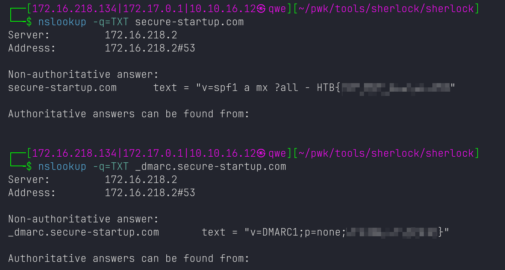

# Easy Phish

## Desc
Customers of secure-startup.com have been recieving some very convincing phishing emails, can you figure out why?

Key Words:

- domain: secure-startup.com
- phishing emails
- how company prevents phishing emails (anti-phishing mechanism)

## Enum

Online nslookup: find txt records with part of flag

Online tool ([MXToolBox](https://mxtoolbox.com/)) for checking record about anti-phishing

Command line method: `nslookup`

## Beyond Flag

SPF, DMARC, and DKIM, which are all email authentication methods used to combat phishing and ensure that emails are sent from authorized mail servers.

### SPF (Sender Policy Framework)

SPF is an email validation system designed to prevent email spoofing by verifying a sender's email domain. SPF allows the domain owner to specify which mail servers are authorized to send mail on behalf of their domain by creating an SPF record in the Domain Name System (DNS). This record lists the authorized sending IP addresses.

When an inbound mail server receives an email, it can check the SPF record by looking up the DNS. If the source IP address of the email is not on the list, the email can be considered unauthorized or potentially spoofed, and the receiving server can then mark it as spam or reject it altogether.

### DKIM (DomainKeys Identified Mail)

DKIM provides a way to validate a domain name identity that is associated with a message through cryptographic authentication. Domain owners generate a public/private key pair. The public key is published in the DNS as a DKIM record, and the private key is used to sign outgoing emails.

When an email is sent, the sending server uses the private key to create a digital signature of the message, which is included in the email headers. The receiving server then retrieves the public key from the DNS and uses it to verify the signature. If it matches, it indicates that the message has not been tampered with in transit and that it truly comes from the domain it claims to be from.

### DMARC (Domain-based Message Authentication, Reporting, and Conformance)

DMARC is a protocol that uses SPF and DKIM to determine the authenticity of an email message. DMARC allows domain owners to publish a policy in their DNS record that defines their email authentication practices and how receiving mail servers should handle mail that doesn’t pass SPF and DKIM checks.

A DMARC policy can tell receiving servers to do nothing, quarantine the message (treat it as suspicious), or reject the message outright if it fails DMARC checks. DMARC also includes reporting features that send reports back to the domain owner about messages that pass and/or fail DMARC evaluation, which helps organizations identify and stop email spoofing and phishing attacks.

By implementing SPF, DKIM, and DMARC, organizations can protect themselves and their customers from phishing attacks by making it harder for attackers to impersonate their email domain. These mechanisms also increase the likelihood that legitimate emails will be delivered successfully while illegitimate emails are rejected or marked as spam.
