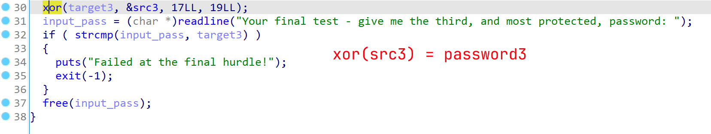

# Hunting License

## Desc

STOP! Adventurer, have you got an up to date relic hunting license? If you don't, you'll need to take the exam again before you'll be allowed passage into the spacelanes!

## Work

```console
$ file license
license: ELF 64-bit LSB executable, x86-64, version 1 (SYSV), dynamically linked, interpreter /lib64/ld-linux-x86-64.so.2, BuildID[sha1]=5be88c3ed329c1570ab807b55c1875d429a581a7, for GNU/Linux 3.2.0, not stripped

$ ldd license
        linux-vdso.so.1 (0x00007fff61305000)
        libreadline.so.8 => /lib/x86_64-linux-gnu/libreadline.so.8 (0x00007f7399a9f000)
        libc.so.6 => /lib/x86_64-linux-gnu/libc.so.6 (0x00007f73998bd000)
        libtinfo.so.6 => /lib/x86_64-linux-gnu/libtinfo.so.6 (0x00007f7399888000)
        /lib64/ld-linux-x86-64.so.2 (0x00007f7399b19000)
```


Password2:


Password3:





```python
opd = 0x13
src = [0x47, 0x7B, 0x7A, 0x61, 0x77, 0x52, 0x7D, 0x77, 0x55, 0x7A, 0x7D, 0x72, 0x7F, 0x32, 0x32, 0x32, 0x13]
password = ''.join([chr(c ^ opd) for c in src])
print(password)
```

Whole process:

```console
What is the file format of the executable?
> elf
[+] Correct!

What is the CPU architecture of the executable?
> x86-64
[+] Correct!

What library is used to read lines for user answers? (`ldd` may help)
> readline
[+] Correct!

What is the address of the `main` function?
> 0x401172
[+] Correct!

How many calls to `puts` are there in `main`? (using a decompiler may help)
> 5
[+] Correct!

What is the first password?
> PasswordNumeroUno
[+] Correct!

What is the reversed form of the second password?
> 0wTdr0wss4P
[+] Correct!

What is the real second password?
> P4ssw0rdTw0
[+] Correct!

What is the XOR key used to encode the third password?
> 0x13
[+] Correct!

> ThirdAndFinal!!!
[+] Correct!

[+] Here is the flag: `HTB{l1c3ns3_4cquir3d-hunt1ng_t1m3!}`
```

