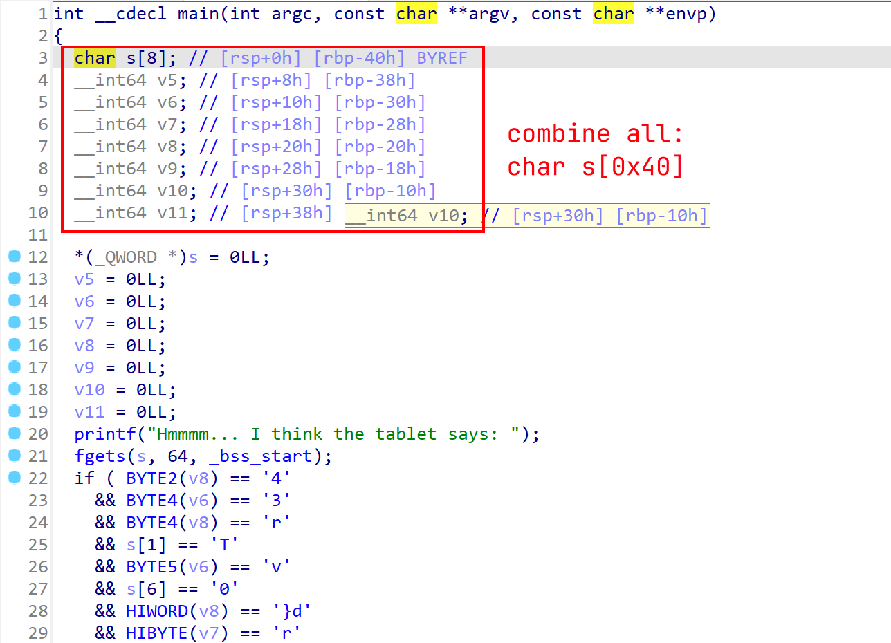
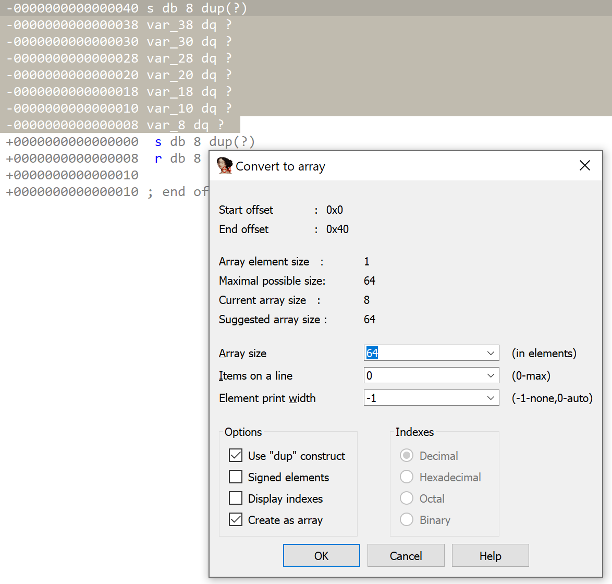

# Shattered Tablet

## Desc

Deep in an ancient tomb, you've discovered a stone tablet with secret information on the locations of other relics. However, while dodging a poison dart, it slipped from your hands and shattered into hundreds of pieces. Can you reassemble it and read the clues?

## Work

### Static Analysis





```c
int __cdecl main(int argc, const char **argv, const char **envp)
{
  char flag[64]; // [rsp+0h] [rbp-40h] BYREF

  memset(flag, 0, sizeof(flag));
  printf("Hmmmm... I think the tablet says: ");
  fgets(flag, 64, _bss_start);
  if ( flag[34] == '4'
    && flag[20] == '3'
    && flag[36] == 'r'
    && flag[1] == 'T'
    && flag[21] == 'v'
    && flag[6] == '0'
    && flag[39] == '}'
    && flag[38] == 'd'
    && flag[31] == 'r'
    && flag[29] == '3'
    && flag[8] == '3'
    && flag[22] == 'e'
    && flag[35] == '1'
    && flag[5] == 'r'
    && flag[0] == 'H'
    && flag[32] == '3'
    && flag[18] == '.'
    && flag[13] == '4'
    && flag[3] == '{'
    && flag[10] == '_'
    && flag[16] == '.'
    && flag[4] == 'b'
    && flag[7] == 'k'
    && flag[15] == 't'
    && flag[14] == 'r'
    && flag[19] == 'n'
    && flag[25] == 't'
    && flag[17] == '.'
    && flag[9] == 'n'
    && flag[30] == '_'
    && flag[26] == '0'
    && flag[24] == '_'
    && flag[12] == 'p'
    && flag[23] == 'r'
    && flag[28] == 'b'
    && flag[33] == 'p'
    && flag[2] == 'B'
    && flag[27] == '_'
    && flag[11] == '4'
    && flag[37] == '3' )
  {
    puts("Yes! That's right!");
  }
  else
  {
    puts("No... not that");
  }
  return 0;
}
```

Flag:

```console
$ cat flag
  if ( flag[34] == '4'
    && flag[20] == '3'
    && flag[36] == 'r'
    && flag[1] == 'T'
    && flag[21] == 'v'
    && flag[6] == '0'
    && flag[39] == '}'
    && flag[38] == 'd'
    && flag[31] == 'r'
    && flag[29] == '3'
    && flag[8] == '3'
    && flag[22] == 'e'
    && flag[35] == '1'
    && flag[5] == 'r'
    && flag[0] == 'H'
    && flag[32] == '3'
    && flag[18] == '.'
    && flag[13] == '4'
    && flag[3] == '{'
    && flag[10] == '_'
    && flag[16] == '.'
    && flag[4] == 'b'
    && flag[7] == 'k'
    && flag[15] == 't'
    && flag[14] == 'r'
    && flag[19] == 'n'
    && flag[25] == 't'
    && flag[17] == '.'
    && flag[9] == 'n'
    && flag[30] == '_'
    && flag[26] == '0'
    && flag[24] == '_'
    && flag[12] == 'p'
    && flag[23] == 'r'
    && flag[28] == 'b'
    && flag[33] == 'p'
    && flag[2] == 'B'
    && flag[27] == '_'
    && flag[11] == '4'
    && flag[37] == '3'
$ cat flag | grep -E 'flag\[[0-9]+\]' | sort -t'[' -k2n | awk -F'\'' '{print $2}' | tr -d '\n'
HTB{br0k3n_4p4rt...n3ver_t0_b3_r3p41r3d}
```

