# Bashed

## Machine Info

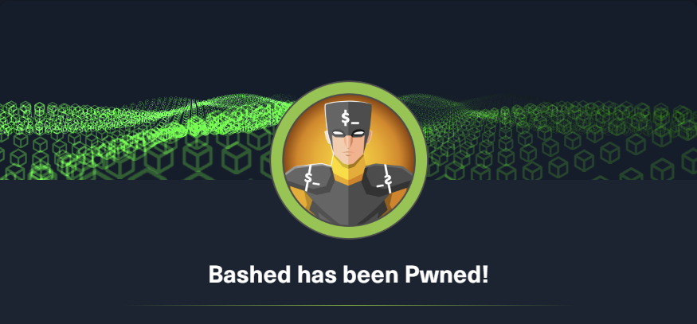

## Recon

```
PORT   STATE SERVICE VERSION
80/tcp open  http    Apache httpd 2.4.18 ((Ubuntu))
|_http-server-header: Apache/2.4.18 (Ubuntu)
|_http-title: Arrexel's Development Site
Warning: OSScan results may be unreliable because we could not find at least 1 open and 1 closed port
Aggressive OS guesses: Linux 3.12 (96%), Linux 3.13 (96%), Linux 3.2 - 4.9 (96%), Linux 3.8 - 3.11 (96%), Linux 4.8 (96%), Linux 4.4 (95%), Linux 4.9 (95%), Linux 3.16 (95%), Linux 3.18 (95%), Linux 4.2 (95%)
No exact OS matches for host (test conditions non-ideal).
Network Distance: 2 hops
```

- path enum -> attack vector dir: dev, php, uploads

```
|_http-dombased-xss: Couldn't find any DOM based XSS.
| http-enum:
|   /css/: Potentially interesting directory w/ listing on 'apache/2.4.18 (ubuntu)'
|   /dev/: Potentially interesting directory w/ listing on 'apache/2.4.18 (ubuntu)'
|   /images/: Potentially interesting directory w/ listing on 'apache/2.4.18 (ubuntu)'
|   /js/: Potentially interesting directory w/ listing on 'apache/2.4.18 (ubuntu)'
|   /php/: Potentially interesting directory w/ listing on 'apache/2.4.18 (ubuntu)'
|_  /uploads/: Potentially interesting folder
```

## Foothold

- hint: phpbash

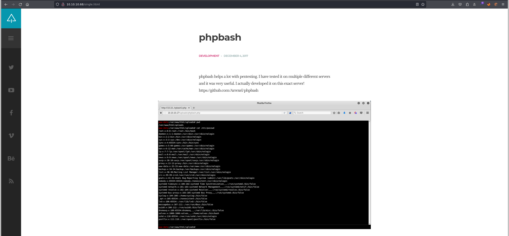

- check dirs -> dev/phpbash.php

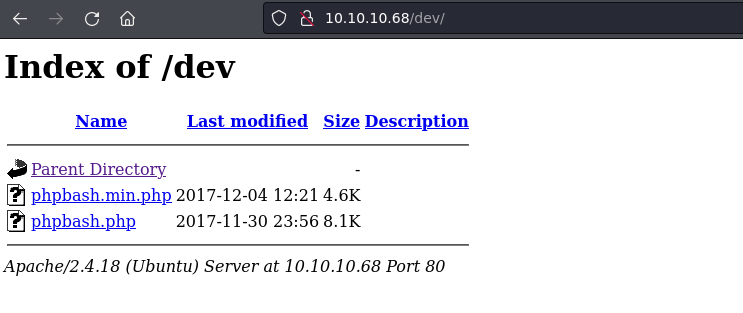

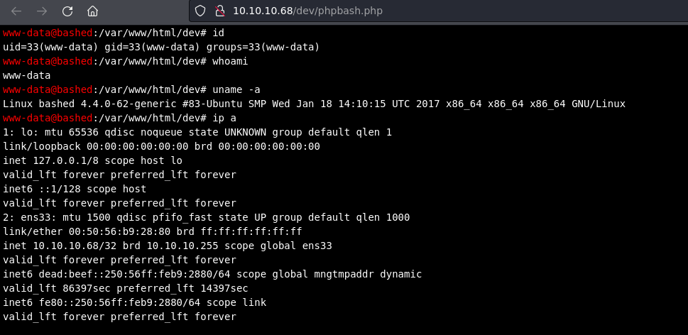

- find writable directory -> **uploads**

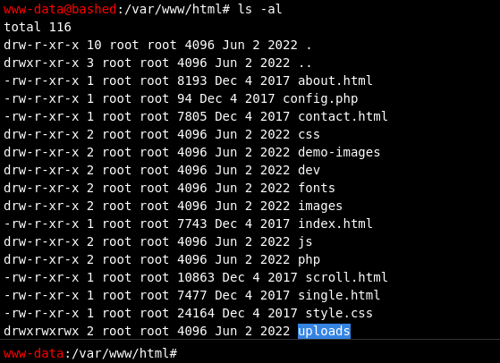

- upload shell.php -> get www-data user shell

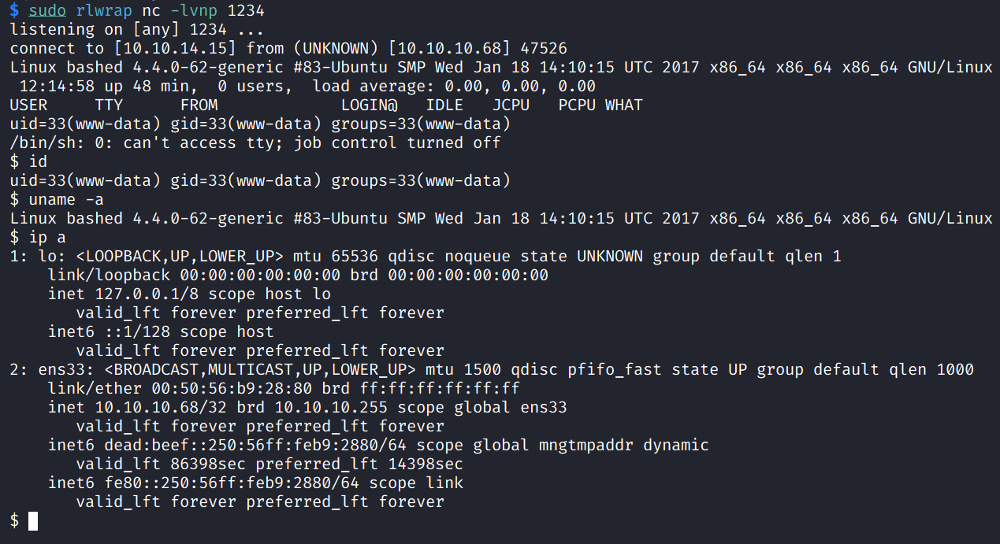

## Privilege Escalation

- /scripts unseen as www-data

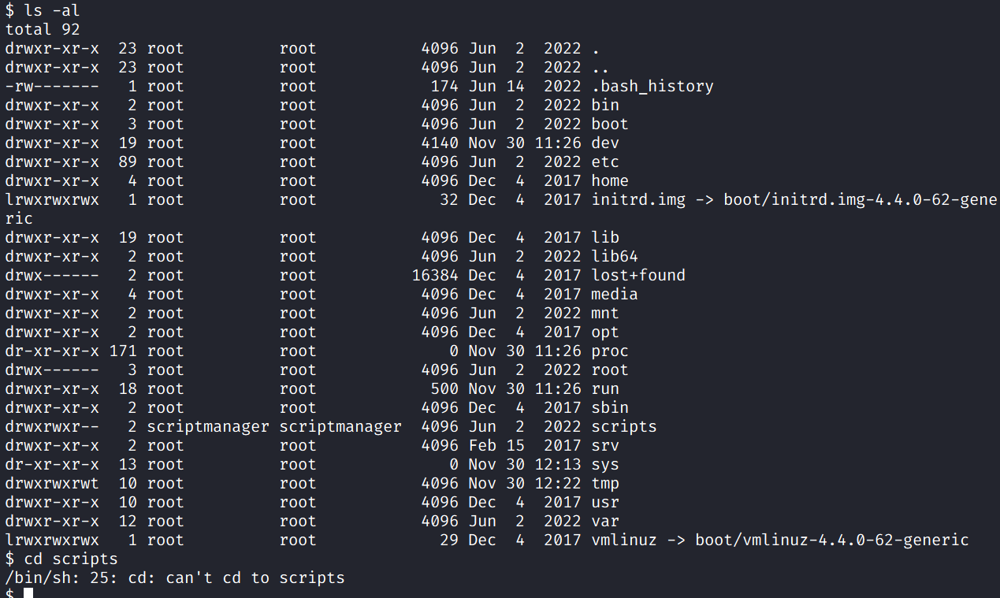

### www-data -> scriptmanager

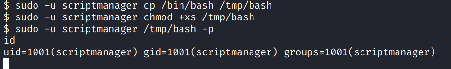

### scriptmanager -> root

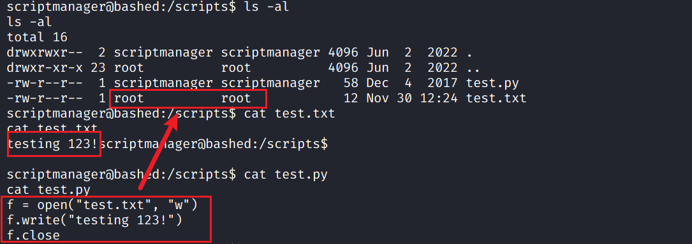

So, must be root who run `python test.py`. Change test.py and **watch test.txt**.

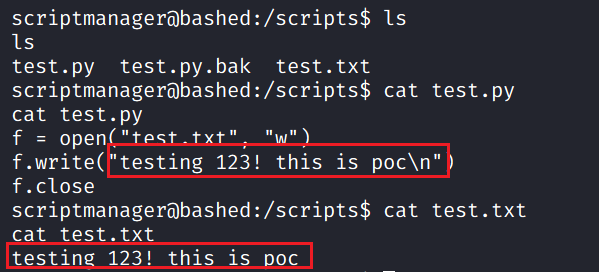

Therefore, root run this py as a **scheduled task**.

Write reverse shell into test.py -> get root shell

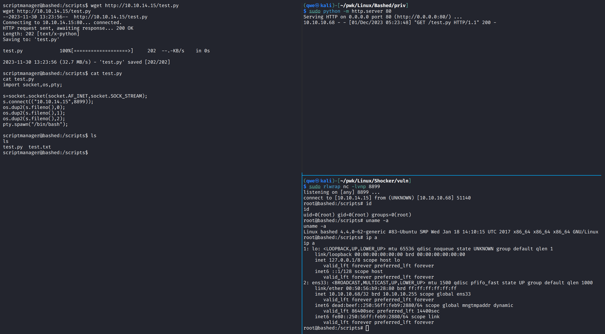

## Exploit Chain

semi web shell -> upload rshell.php -> get user priv -> enum a scheduled python file -> change it to py rshell file -> listen on local to get root priv
