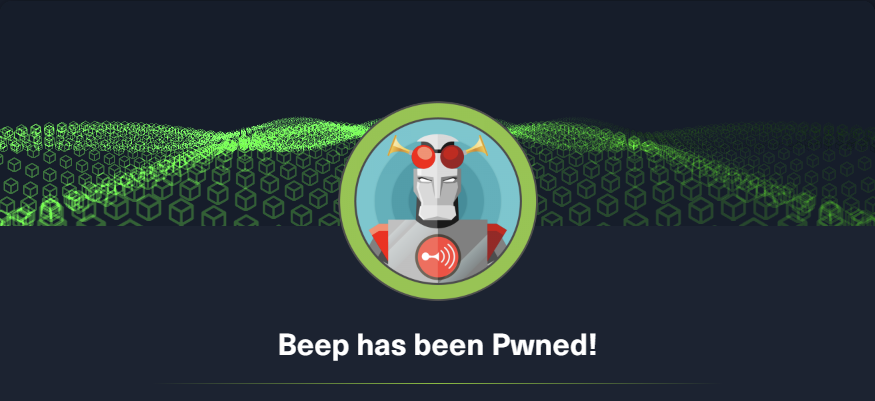
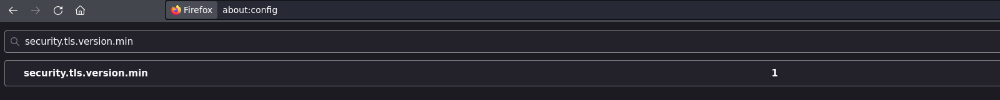
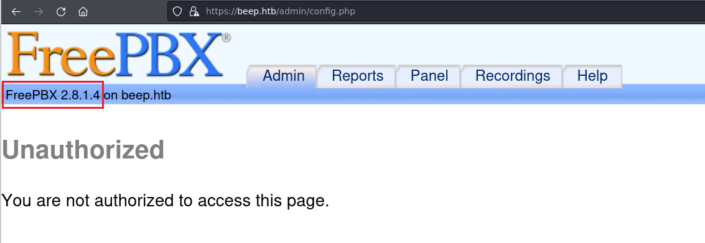
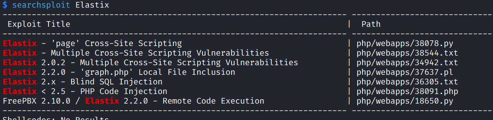
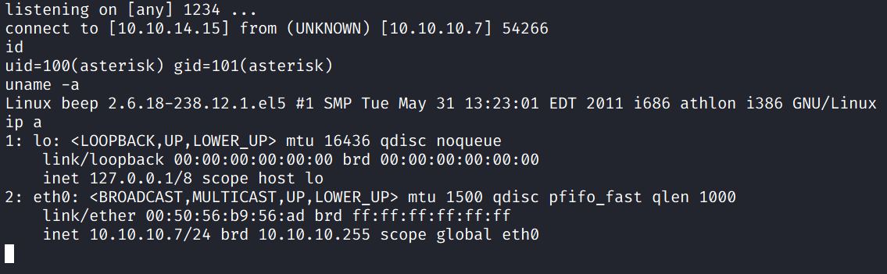
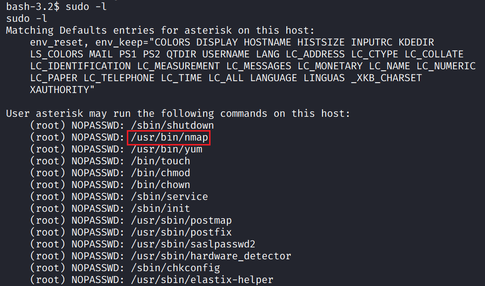
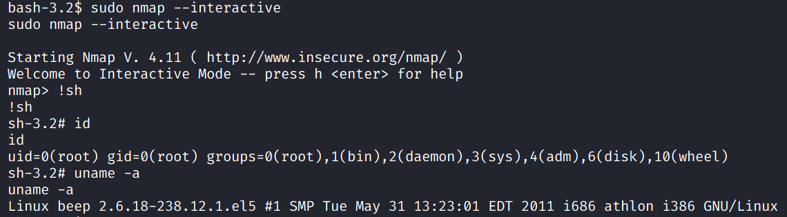

# Beep

## Machine Info



## Recon

```
PORT      STATE SERVICE    VERSION
22/tcp    open  ssh        OpenSSH 4.3 (protocol 2.0)
| ssh-hostkey:
|   1024 ad:ee:5a:bb:69:37:fb:27:af:b8:30:72:a0:f9:6f:53 (DSA)
|_  2048 bc:c6:73:59:13:a1:8a:4b:55:07:50:f6:65:1d:6d:0d (RSA)
25/tcp    open  smtp       Postfix smtpd
|_smtp-commands: beep.localdomain, PIPELINING, SIZE 10240000, VRFY, ETRN, ENHANCEDSTATUSCODES, 8BITMIME, DSN
80/tcp    open  http       Apache httpd 2.2.3
|_http-server-header: Apache/2.2.3 (CentOS)
|_http-title: Did not follow redirect to https://beep.htb/
110/tcp   open  pop3       Cyrus pop3d 2.3.7-Invoca-RPM-2.3.7-7.el5_6.4
|_pop3-capabilities: LOGIN-DELAY(0) APOP TOP RESP-CODES IMPLEMENTATION(Cyrus POP3 server v2) USER UIDL AUTH-RESP-CODE EXPIRE(NEVER) PIPELINING STLS
111/tcp   open  rpcbind    2 (RPC #100000)
| rpcinfo:
|   program version    port/proto  service
|   100000  2            111/tcp   rpcbind
|   100000  2            111/udp   rpcbind
|   100024  1            790/udp   status
|_  100024  1            793/tcp   status
143/tcp   open  imap       Cyrus imapd 2.3.7-Invoca-RPM-2.3.7-7.el5_6.4
|_imap-capabilities: Completed LISTEXT LITERAL+ QUOTA BINARY URLAUTHA0001 X-NETSCAPE LIST-SUBSCRIBED IDLE RIGHTS=kxte SORT=MODSEQ UIDPLUS CATENATE UNSELECT ACL MAILBOX-REFERRALS CONDSTORE RENAME THREAD=REFERENCES STARTTLS CHILDREN THREAD=ORDEREDSUBJECT NAMESPACE ANNOTATEMORE SORT NO ID IMAP4rev1 ATOMIC MULTIAPPEND IMAP4 OK
443/tcp   open  ssl/http   Apache httpd 2.2.3 ((CentOS))
|_http-server-header: Apache/2.2.3 (CentOS)
|_http-title: Elastix - Login page
| http-robots.txt: 1 disallowed entry
|_/
|_ssl-date: 2023-12-04T08:53:39+00:00; +28s from scanner time.
| ssl-cert: Subject: commonName=localhost.localdomain/organizationName=SomeOrganization/stateOrProvinceName=SomeState/countryName=--
| Not valid before: 2017-04-07T08:22:08
|_Not valid after:  2018-04-07T08:22:08
793/tcp   open  status     1 (RPC #100024)
993/tcp   open  ssl/imap   Cyrus imapd
|_imap-capabilities: CAPABILITY
995/tcp   open  pop3       Cyrus pop3d
3306/tcp  open  mysql?
4190/tcp  open  sieve      Cyrus timsieved 2.3.7-Invoca-RPM-2.3.7-7.el5_6.4 (included w/cyrus imap)
4445/tcp  open  upnotifyp?
4559/tcp  open  hylafax    HylaFAX 4.3.10
5038/tcp  open  asterisk   Asterisk Call Manager 1.1
10000/tcp open  http       MiniServ 1.570 (Webmin httpd)
|_http-title: Site doesn't have a title (text/html; Charset=iso-8859-1).
Warning: OSScan results may be unreliable because we could not find at least 1 open and 1 closed port
Aggressive OS guesses: Linux 2.6.9 - 2.6.24 (96%), Linux 2.6.9 - 2.6.30 (96%), Linux 2.6.27 (likely embedded) (96%), Linux 2.6.20-1 (Fedora Core 5) (95%), Linux 2.6.27 (95%), Linux 2.6.5 - 2.6.12 (95%), Linux 2.6.18 (95%), Linux 2.6.22 - 2.6.23 (95%), Linux 2.6.30 (95%), Linux 2.6.5 (Fedora Core 2) (95%)
No exact OS matches for host (test conditions non-ideal).
Network Distance: 2 hops
Service Info: Hosts:  beep.localdomain, 127.0.0.1, example.com, localhost; OS: Unix
```

- configure firefox's setting to allow TSLv1



## Foothold

### enum: FreePBX + Elastix

- https://beep.htb/admin/config.php -> login failed



- FreePBX version **2.8.1.4**
- http://beep.htb/ -> Elastix login page



### exploit-db 18650

- [FreePBX 2.10.0 / Elastix 2.2.0 - Remote Code Execution - PHP webapps Exploit (exploit-db.com)](https://www.exploit-db.com/exploits/18650)
- [infosecjunky/FreePBX-2.10.0---Elastix-2.2.0---Remote-Code-Execution: Modified version of the original one for HackTheBox Beep (github.com)](https://github.com/infosecjunky/FreePBX-2.10.0---Elastix-2.2.0---Remote-Code-Execution)
- `svwar -m INVITE -e100-999 10.10.10.7` -> find extension code **233**



## Privilege Escalation

- sudo -l, 2 methods: nmap -> less like init a shell or chmod -> suid





## Exploit Chain

FreePBX + Elastix: 18650 -> user shell -> nmap priv esca -> root shell
