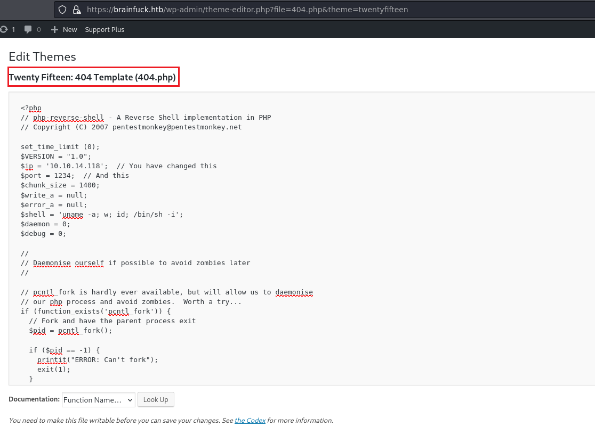
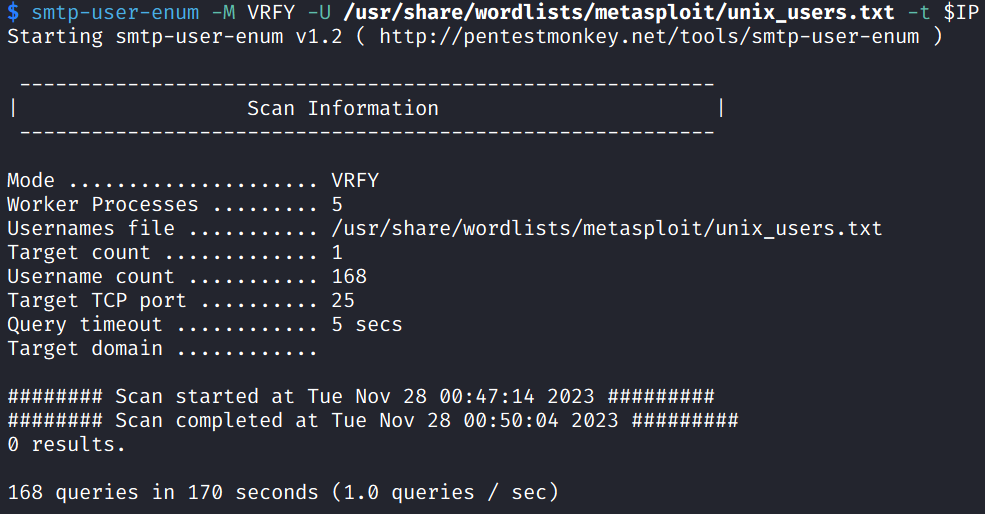
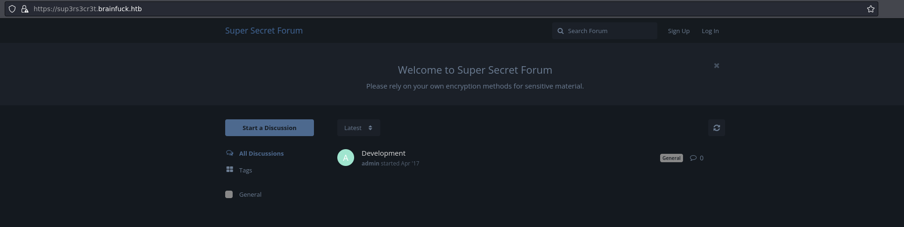

# Brainfuck

## Machine Info


## Recon

```
PORT    STATE SERVICE  VERSION
22/tcp  open  ssh      OpenSSH 7.2p2 Ubuntu 4ubuntu2.1 (Ubuntu Linux; protocol 2.0)
| ssh-hostkey:
|   2048 94:d0:b3:34:e9:a5:37:c5:ac:b9:80:df:2a:54:a5:f0 (RSA)
|   256 6b:d5:dc:15:3a:66:7a:f4:19:91:5d:73:85:b2:4c:b2 (ECDSA)
|_  256 23:f5:a3:33:33:9d:76:d5:f2:ea:69:71:e3:4e:8e:02 (ED25519)
25/tcp  open  smtp     Postfix smtpd
|_smtp-commands: brainfuck, PIPELINING, SIZE 10240000, VRFY, ETRN, STARTTLS, ENHANCEDSTATUSCODES, 8BITMIME, DSN
110/tcp open  pop3     Dovecot pop3d
|_pop3-capabilities: RESP-CODES PIPELINING UIDL USER SASL(PLAIN) CAPA TOP AUTH-RESP-CODE
143/tcp open  imap     Dovecot imapd
|_imap-capabilities: SASL-IR capabilities more IMAP4rev1 have post-login AUTH=PLAINA0001 ENABLE listed ID OK LOGIN-REFERRALS LITERAL+ Pre-login IDLE
443/tcp open  ssl/http nginx 1.10.0 (Ubuntu)
|_ssl-date: TLS randomness does not represent time
| tls-nextprotoneg:
|_  http/1.1
|_http-title: Welcome to nginx!
| tls-alpn:
|_  http/1.1
| ssl-cert: Subject: commonName=brainfuck.htb/organizationName=Brainfuck Ltd./stateOrProvinceName=Attica/countryName=GR
| Subject Alternative Name: DNS:www.brainfuck.htb, DNS:sup3rs3cr3t.brainfuck.htb
| Not valid before: 2017-04-13T11:19:29
|_Not valid after:  2027-04-11T11:19:29
|_http-server-header: nginx/1.10.0 (Ubuntu)
Warning: OSScan results may be unreliable because we could not find at least 1 open and 1 closed port
Device type: general purpose|specialized|phone|storage-misc
Running (JUST GUESSING): Linux 3.X|4.X|5.X (90%), Crestron 2-Series (86%), Google Android 4.X (86%), HP embedded (85%)
OS CPE: cpe:/o:linux:linux_kernel:3 cpe:/o:linux:linux_kernel:4 cpe:/o:crestron:2_series cpe:/o:google:android:4.0 cpe:/o:linux:linux_kernel:5.0 cpe:/h:hp:p2000_g3
Aggressive OS guesses: Linux 3.10 - 4.11 (90%), Linux 3.12 (90%), Linux 3.13 (90%), Linux 3.13 or 4.2 (90%), Linux 3.16 (90%), Linux 3.16 - 4.6 (90%), Linux 3.2 - 4.9 (90%), Linux 3.8 - 3.11 (90%), Linux 4.2 (90%), Linux 4.4 (90%)
No exact OS matches for host (test conditions non-ideal).
Service Info: Host:  brainfuck; OS: Linux; CPE: cpe:/o:linux:linux_kernel
```

- attack vector: 25 smtp - 110 pop3 - 143 imap (email), 443 ssl, domains:
      - www.brainfuck.htb
          - brainfuck.htb
          - sup3rs3cr3t.brainfuck.htb
          - subdomain scan, `gobuster vhost -k --domain $base_domain --append-domain -u $target -w $wordlist`

- visit using https protocal


- user: orestis@brainfuck.htb
- machine info: WordPress 4.7.3

## Foothold

### 443 - wp - login as admin

#### enum

URLs:

- https://brainfuck.htb/
- https://brainfuck.htb/wp-login.php
- https://brainfuck.htb/wp-admin

Enum:

- `$ wpscan --url https://brainfuck.htb --enumerate u --disable-tls-checks`


- attack vector: theme proficient and plugin **wp-support-plus-responsive-ticket-system** out of date
- user: **admin**, administrator

wp plugin exploit:

- searchsploit


#### 40939 wp support plugin - Responsive Ticket System 7.1.3 - SQL Injection

- [WordPress Plugin WP Support Plus Responsive Ticket System 7.1.3 - SQL Injection - PHP webapps Exploit (exploit-db.com)](https://www.exploit-db.com/exploits/40939)
- create a page on local and visit it

```html
<form method="post" action="https://brainfuck.htb/wp-admin/admin-ajax.php">
        Username: <input type="text" name="username" value="admin">
        <input type="hidden" name="email" value="orestis@brainfuck.htb">
        <input type="hidden" name="action" value="loginGuestFacebook">
        <input type="submit" value="Login">
</form>
```


- click login and capture packet to see admin-cookie setted


- visit admin page as admin priv


- try to get a shell (**no writing permission**)
  - editor theme tamplete php file (rce) [x]
  - upload a zip file to add new plugin [x]




- what's left in attack vector [?] -> email service
- check wp email plugin

#### easy wp smtp

user enum

- telnet


- nmap scan


- smtp-user-enum (no user found, strange)



setting in wp admin page


**2 methods** to get SMTP password:

1. check html source


2. set SMTP host to local ip and send test email to local while capturing the packet to get the password

- start a SMTP service, listening to 25 port


- capture packages from 25 port using tshark, `sudo tshark -ni tun0 tcp port 25`


- get password


### 143 - imap - internal mails

use `mutt` to connect to remote imap service

- edit config file `~/.muttrc`


- `mutt` to conn and enum mails


- cred: **orestis:kIEnnfEKJ#9UmdO**

### 443 - subdomain sup3rs3cr3t

- forum site



- use password from wp smtp plugin [x], password from imap mails [y]
  	- orestis:kIEnnfEKJ#9UmdO


- information gathering:
      - ssh login, password is not allowed; orestis open a encrypted talk with admin
          - encrypted talk should be decrypted


- encrypted words -> Caesar cipher [x] -> [The Vigenère Cipher Encryption and Decryption (mtu.edu)](https://pages.mtu.edu/~shene/NSF-4/Tutorial/VIG/Vig-Base.html)

- find an interesting sentence with clear original text

```
Ybgbq wpl gw lto udgnju fcpp, C jybc zfu zrryolqp zfuz xjs rkeqxfrl ojwceec J uovg
mnvze://zsrivszwm.rfz/8cr5ai10r915218697i1w658enqc0cs8/ozrxnkc/ub_sja
=>
https://brainfuck.htb/
```

- **crack procedure:**


```
h -> m -> f
t -> n -> u
t -> v -> c
p -> z -> k
s -> e -> m
b -> z -> y
r -> s -> b
a -> r -> r
i -> i -> a
n -> v -> i
f -> s -> n
u -> z -> f
c -> w -> u
k -> m -> c
.
h -> r -> k
t -> f -> m
b -> z -> y
```

- the **key** of Vigenère Cipher Encryption: **fuckmybrain**
- decrypted all sentences:


- collect **id_rsa** file for user orestis (https://brainfuck.htb/8ba5aa10e915218697d1c658cdee0bb8/orestis/id_rsa) and **brute force** to get passphrases by `ssh2john`, `john`


- cred: **orestis:3poulakia!**


## Privilege Escalation

orestis privilege enum:

- no sudo
- no suid, guid
- no scheduled tasks
- find interesting files: debug.txt, output.txt, encrypt.sage


- rsa encryption with p, q, e given -> have encrtped c -> calculate orginal m
- use sage script to decrypt, [RSA - Decryption - Given p, q and e - Calculate m(message) from c(cipher text) - Algorithm: Extended Euclidean - sage @ zhsh 2023 (github.com)](https://gist.github.com/zhsh9/ecc4a7cf47f88c4e44e1a82335cafffa) -> get root flag


## Exploit Chain

wp support plugin exp to login as admin -> easy wp smtp plugin to get smtp username and password -> conn imap remote service to seek secret forum password from internal emails -> Vigenère cipher decryption to download id_rsa file and hint of brute forcing passphrase -> john to crack passphrase -> foothold orestis using ssh -> find encryption of root flag program and debug+output file -> decrypt m(root flag) using p, q, e, c
