# Delivery

## Machine Info

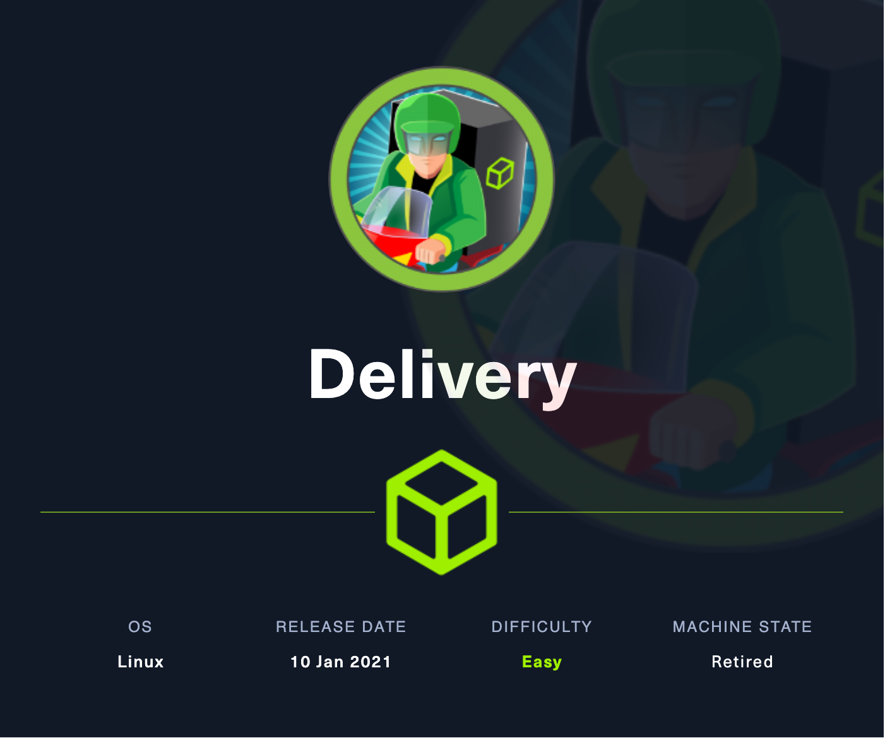

## Recon

- nmap
  - 80 http
  - 8065 http, both have a user access control with email validation

```console
PORT     STATE SERVICE VERSION
22/tcp   open  ssh     OpenSSH 7.9p1 Debian 10+deb10u2 (protocol 2.0)
| ssh-hostkey:
|   2048 9c:40:fa:85:9b:01:ac:ac:0e:bc:0c:19:51:8a:ee:27 (RSA)
|   256 5a:0c:c0:3b:9b:76:55:2e:6e:c4:f4:b9:5d:76:17:09 (ECDSA)
|_  256 b7:9d:f7:48:9d:a2:f2:76:30:fd:42:d3:35:3a:80:8c (ED25519)
80/tcp   open  http    nginx 1.14.2
|_http-server-header: nginx/1.14.2
|_http-title: Welcome
8065/tcp open  unknown
| fingerprint-strings:
|   GenericLines, Help, RTSPRequest, SSLSessionReq, TerminalServerCookie:
|     HTTP/1.1 400 Bad Request
|     Content-Type: text/plain; charset=utf-8
|     Connection: close
|     Request
|   GetRequest:
|     HTTP/1.0 200 OK
|     Accept-Ranges: bytes
|     Cache-Control: no-cache, max-age=31556926, public
|     Content-Length: 3108
|     Content-Security-Policy: frame-ancestors 'self'; script-src 'self' cdn.rudderlabs.com
|     Content-Type: text/html; charset=utf-8
|     Last-Modified: Tue, 30 Jan 2024 00:30:27 GMT
|     X-Frame-Options: SAMEORIGIN
|     X-Request-Id: jagdg7781pfwxxb646iy663kzy
|     X-Version-Id: 5.30.0.5.30.1.57fb31b889bf81d99d8af8176d4bbaaa.false
|     Date: Tue, 30 Jan 2024 00:33:27 GMT
|     <!doctype html><html lang="en"><head><meta charset="utf-8"><meta name="viewport" content="width=device-width,initial-scale=1,maximum-scale=1,user-scalable=0"><meta name="robots" content="noindex, nofollow"><meta name="referrer" content="no-referrer"><title>Mattermost</title><meta name="mobile-web-app-capable" content="yes"><meta name="application-name" content="Mattermost"><meta name="format-detection" content="telephone=no"><link re
|   HTTPOptions:
|     HTTP/1.0 405 Method Not Allowed
|     Date: Tue, 30 Jan 2024 00:33:27 GMT
|_    Content-Length: 0
Warning: OSScan results may be unreliable because we could not find at least 1 open and 1 closed port
Aggressive OS guesses: Linux 5.0 (97%), Linux 4.15 - 5.8 (96%), Linux 5.3 - 5.4 (95%), Linux 2.6.32 (95%), Linux 5.0 - 5.5 (95%), Linux 3.1 (95%), Linux 3.2 (95%), AXIS 210A or 211 Network Camera (Linux 2.6.17) (95%), ASUS RT-N56U WAP (Linux 3.4) (93%), Linux 3.16 (93%)
No exact OS matches for host (test conditions non-ideal).
Network Distance: 2 hops
Service Info: OS: Linux; CPE: cpe:/o:linux:linux_kernel
```

- `http://10.10.10.222/#contact-us`
  - `helpdesk.delivery.htb`
  - **MatterMost** 8065 needs @delivery.htb mail account [because this user creation also needs verification email to confirm]

```console
For unregistered users, please use our HelpDesk to get in touch with our team. Once you have an @delivery.htb email address, you'll be able to have access to our MatterMost server.
```

- **HelpDesk** page
  - `Sign in`: need to click verification email's link to confirm account [x]
  - `Open a new Ticket`: create a ticket with normal email
  - `Check ticket status`: give back a @delivery.htb email [good!], able to check ticket content & send email to this account would add more info to ticket [gooood!]

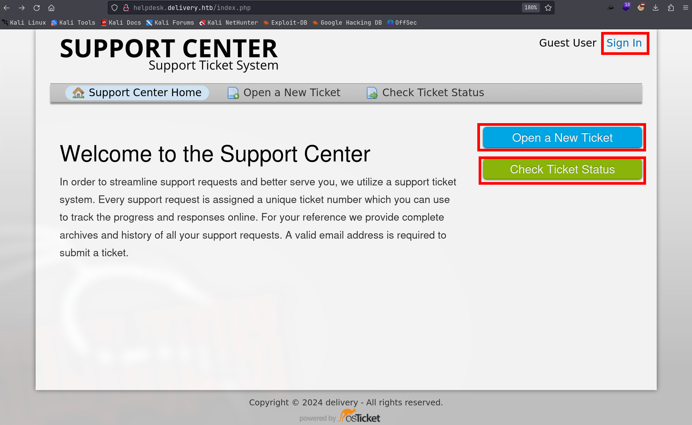

- open a new ticket and check its status => get an email account: `4529204@delivery.htb`

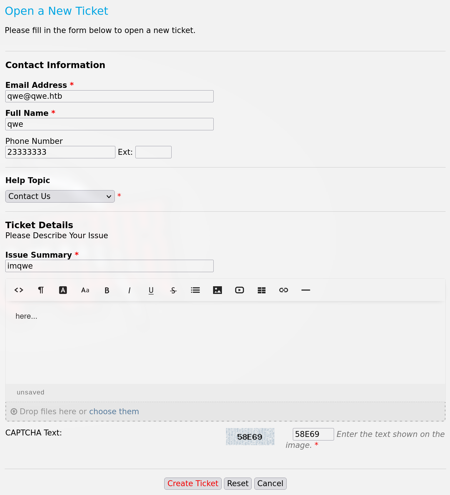

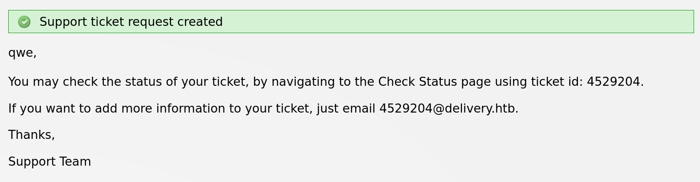

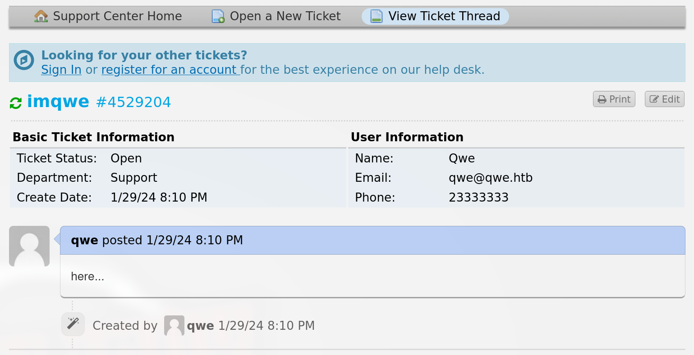

## Foothold

### Confirm email by ticket system

- register an account in MatterMost

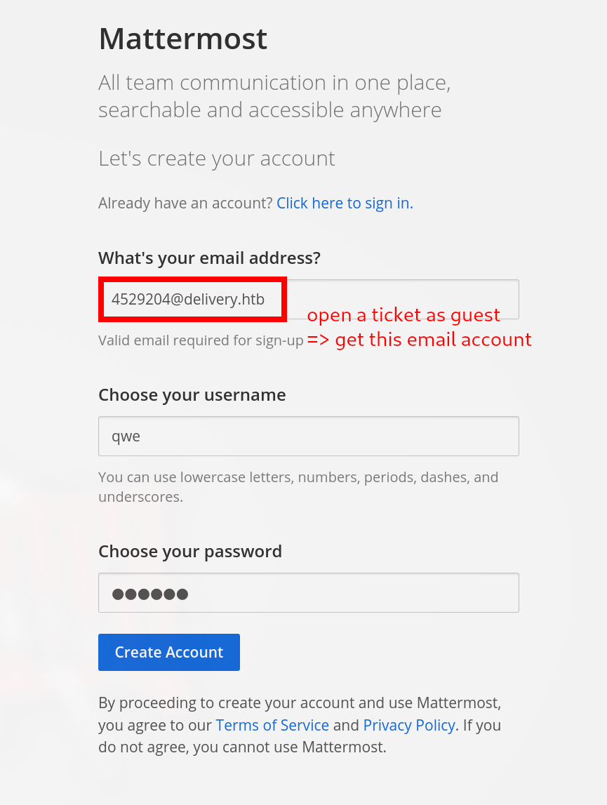

- after the service sends verification email => get content by VIEW TICKET THREAD
  [ticket system: add info into ticket info by sending emails to this account @delivery]

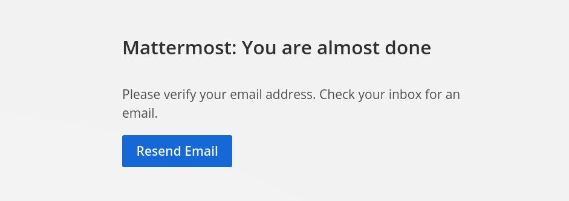

- confirm email address

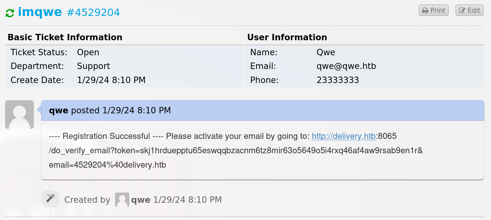

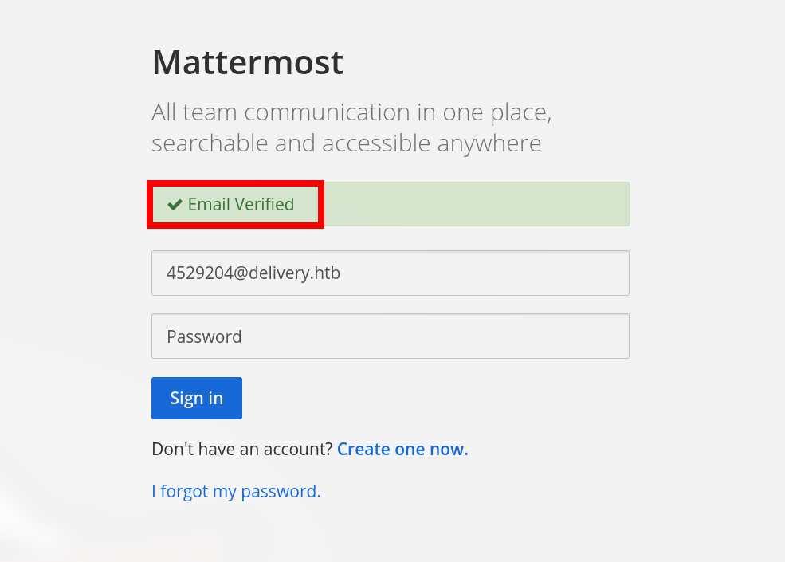

### Credential Leakage

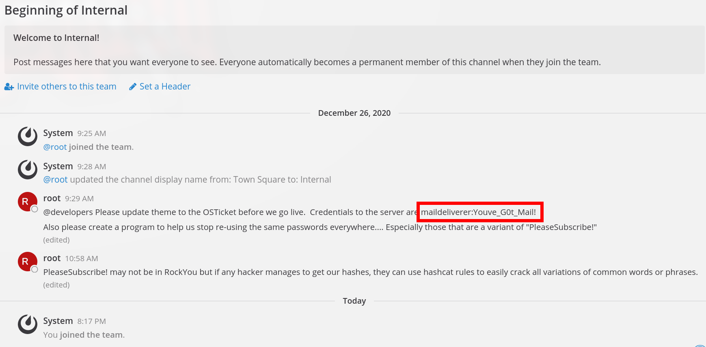

- **credential**: `maildeliverer:Youve_G0t_Mail!`

- **password crack**: `PleaseSubscribe!` -> **hashcat rules** to crack all **variations** of common phrases

use this cred can login to a site: `http://helpdesk.delivery.htb/scp/login.php` => found nothing, but also shows this cred is used by the site's admin

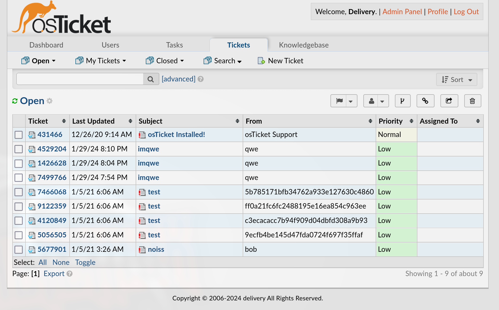

ssh to login

```console
└─╼$ ssh maildeliverer@$IP
The authenticity of host '10.10.10.222 (10.10.10.222)' can't be established.
ED25519 key fingerprint is SHA256:AGdhHnQ749stJakbrtXVi48e6KTkaMj/+QNYMW+tyj8.
This key is not known by any other names.
Are you sure you want to continue connecting (yes/no/[fingerprint])? yes
Warning: Permanently added '10.10.10.222' (ED25519) to the list of known hosts.
maildeliverer@10.10.10.222's password:
Linux Delivery 4.19.0-13-amd64 #1 SMP Debian 4.19.160-2 (2020-11-28) x86_64

The programs included with the Debian GNU/Linux system are free software;
the exact distribution terms for each program are described in the
individual files in /usr/share/doc/*/copyright.

Debian GNU/Linux comes with ABSOLUTELY NO WARRANTY, to the extent
permitted by applicable law.
Last login: Tue Jan  5 06:09:50 2021 from 10.10.14.5
maildeliverer@Delivery:~$ id
uid=1000(maildeliverer) gid=1000(maildeliverer) groups=1000(maildeliverer)
maildeliverer@Delivery:~$ uname -a
Linux Delivery 4.19.0-13-amd64 #1 SMP Debian 4.19.160-2 (2020-11-28) x86_64 GNU/Linux
```

## Privilege Escalation

- enum MatterMost service configuraion => mysql credential

```console
maildeliverer@Delivery:/opt/mattermost/config$ cat config.json 
...
"SqlSettings": {
    "DriverName": "mysql",
    "DataSource": "mmuser:Crack_The_MM_Admin_PW@tcp(127.0.0.1:3306)/mattermost?charset=utf8mb4,utf8\u0026readTimeout=30s\u0026writeTimeout=30s",
    "DataSourceReplicas": [],
    "DataSourceSearchReplicas": [],
    "MaxIdleConns": 20,
    "ConnMaxLifetimeMilliseconds": 3600000,
    "MaxOpenConns": 300,
    "Trace": false,
    "AtRestEncryptKey": "n5uax3d4f919obtsp1pw1k5xetq1enez",
    "QueryTimeout": 30,
    "DisableDatabaseSearch": false
},
...
```

- enum mysql => hash value of root password

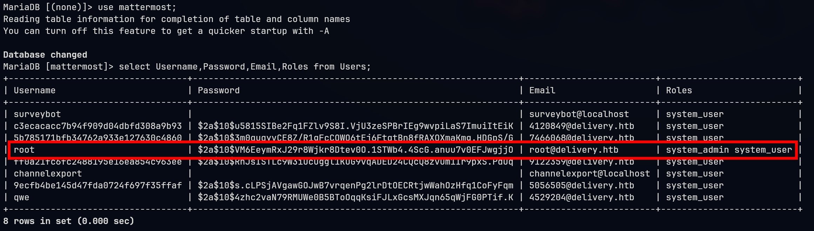

Password cracking:

1. brute force [x]

```console
└─╼$ hashcat -m 3200 -a 0 hash /usr/share/wordlists/rockyou.txt
hashcat (v6.2.6) starting

OpenCL API (OpenCL 3.0 PoCL 5.0+debian  Linux, None+Asserts, RELOC, SPIR, LLVM 15.0.7, SLEEF, DISTRO, POCL_DEBUG) - Platform #1 [The pocl project]
...
```

2. **rule-driven crack** [yes]

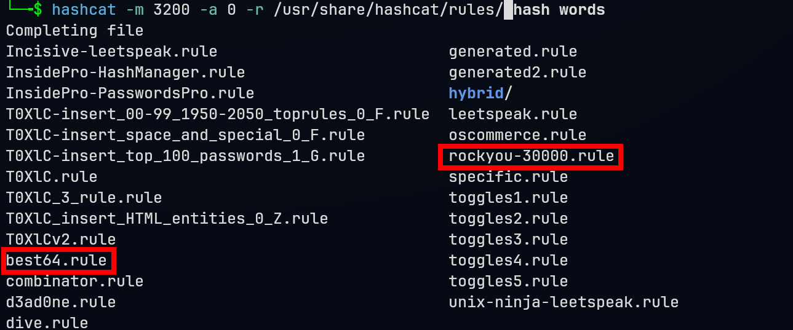

```console
└─╼$ hashcat -m 3200 -a 0 -r /usr/share/hashcat/rules/best64.rule hash words --show
$2a$10$VM6EeymRxJ29r8Wjkr8Dtev0O.1STWb4.4ScG.anuu7v0EFJwgjjO:PleaseSubscribe!21
```

Then, su root with this password to get root shell.

## Exploit Chain

port scan -> 2 sites with user creation and email confirmation -> make use of ticket system -> open a ticket and get a @delivery.htb email address & able to read the mails sent to this address -> register a MatterMost account -> cred leakage & thinking of password cracking -> ssh to get a maildeliverer -> mysql config with root hash -> hashcat with rules to crack -> root shell

## Beyond Root

### Rule-driven Crack

he method of cracking passwords based on specific vocabulary and rules is known as a "rule-based attack" or "rule-driven attack". In this mode of attack, attackers use a predefined set of rules to modify known words or phrases (usually coming from a wordlist or dictionary) to generate potential passwords.

Rule-based attacks rely on two main components:

1. **Wordlist/Dictionary**: A list containing possible passwords. These can be common passwords, standard English words, user-related information (such as birthdays, pet names, etc.), or any words that can serve as a base for passwords.
2. **Rule Set**: A series of rules that instruct the password cracking tool on how to modify the vocabulary in the wordlist to create new password variants. Rules can include adding, deleting, replacing characters, toggling case, reversing, and more complex patterns.

This method is highly effective because many users create passwords based on common words or phrases and enhance them by adding numbers, special characters, or case changes. By using rule-based attacks, attackers can simulate these common password creation habits, thereby increasing the success rate of cracking passwords.

### Hashcat Rules

- [hashcat_user_manual.pdf](https://hashcat.net/files/hashcat_user_manual.pdf)
- [rule_based_attack (hashcat wiki)](https://hashcat.net/wiki/doku.php?id=rule_based_attack)
