# Irked

## Machine Info

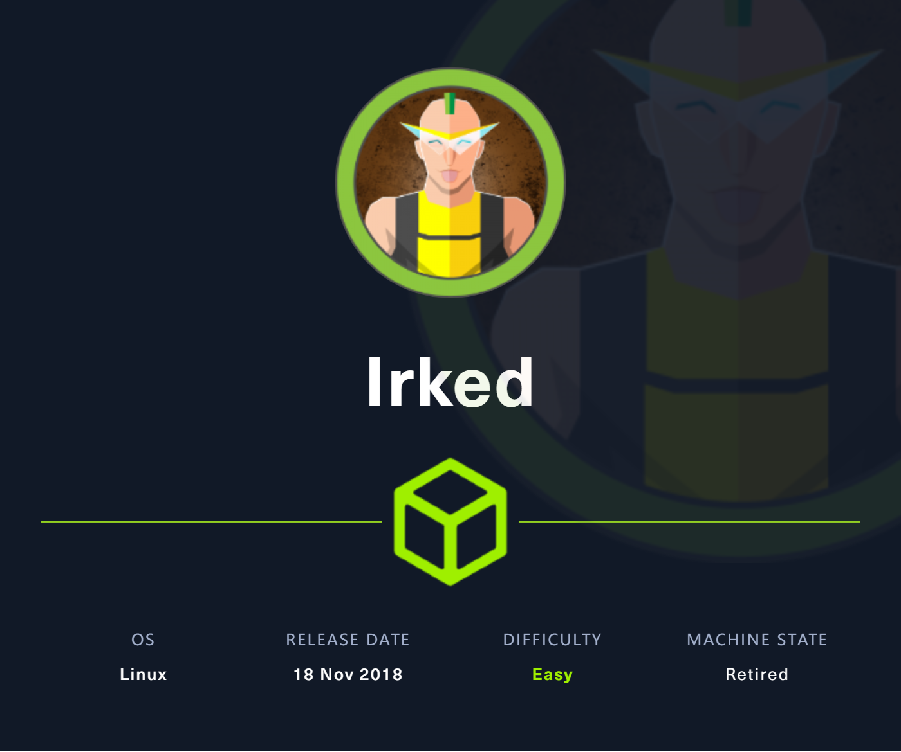

## Recon

- nmap

```
PORT      STATE SERVICE     VERSION
22/tcp    open  ssh         OpenSSH 6.7p1 Debian 5+deb8u4 (protocol 2.0)
| ssh-hostkey:
|   1024 6a:5d:f5:bd:cf:83:78:b6:75:31:9b:dc:79:c5:fd:ad (DSA)
|   2048 75:2e:66:bf:b9:3c:cc:f7:7e:84:8a:8b:f0:81:02:33 (RSA)
|   256 c8:a3:a2:5e:34:9a:c4:9b:90:53:f7:50:bf:ea:25:3b (ECDSA)
|_  256 8d:1b:43:c7:d0:1a:4c:05:cf:82:ed:c1:01:63:a2:0c (ED25519)
80/tcp    open  http        Apache httpd 2.4.10 ((Debian))
|_http-title: Site doesn't have a title (text/html).
|_http-server-header: Apache/2.4.10 (Debian)
111/tcp   open  rpcbind     2-4 (RPC #100000)
| rpcinfo:
|   program version    port/proto  service
|   100000  2,3,4        111/tcp   rpcbind
|   100000  2,3,4        111/udp   rpcbind
|   100000  3,4          111/tcp6  rpcbind
|   100000  3,4          111/udp6  rpcbind
|   100024  1          35016/udp6  status
|   100024  1          39860/tcp6  status
|   100024  1          40247/tcp   status
|_  100024  1          51446/udp   status
6697/tcp  open  ircs-u?
|_irc-info: Unable to open connection
8067/tcp  open  infi-async?
|_irc-info: Unable to open connection
40247/tcp open  status      1 (RPC #100024)
65534/tcp open  unknown
Warning: OSScan results may be unreliable because we could not find at least 1 open and 1 closed port
Aggressive OS guesses: Linux 3.12 (96%), Linux 3.13 (96%), Linux 3.16 (96%), Linux 3.18 (96%), Linux 3.2 - 4.9 (96%), Linux 3.8 - 3.11 (96%), Linux 4.4 (95%), Linux 4.2 (95%), Linux 4.8 (95%), ASUS RT-N56U WAP (Linux 3.4) (95%)
No exact OS matches for host (test conditions non-ideal).
Network Distance: 2 hops
Service Info: OS: Linux; CPE: cpe:/o:linux:linux_kernel
```

- 80 http, 111 rpc, 6697+8067 IRC server
- 80 http has a picture

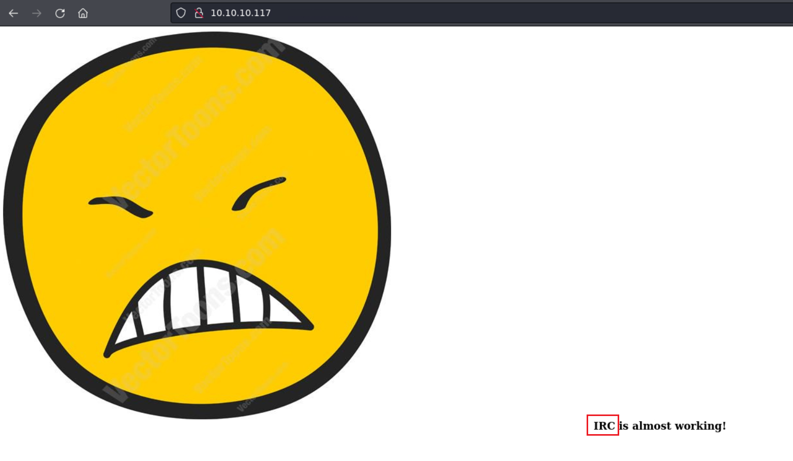

## Foothold

### IRC RCE

- config and connect to irc server

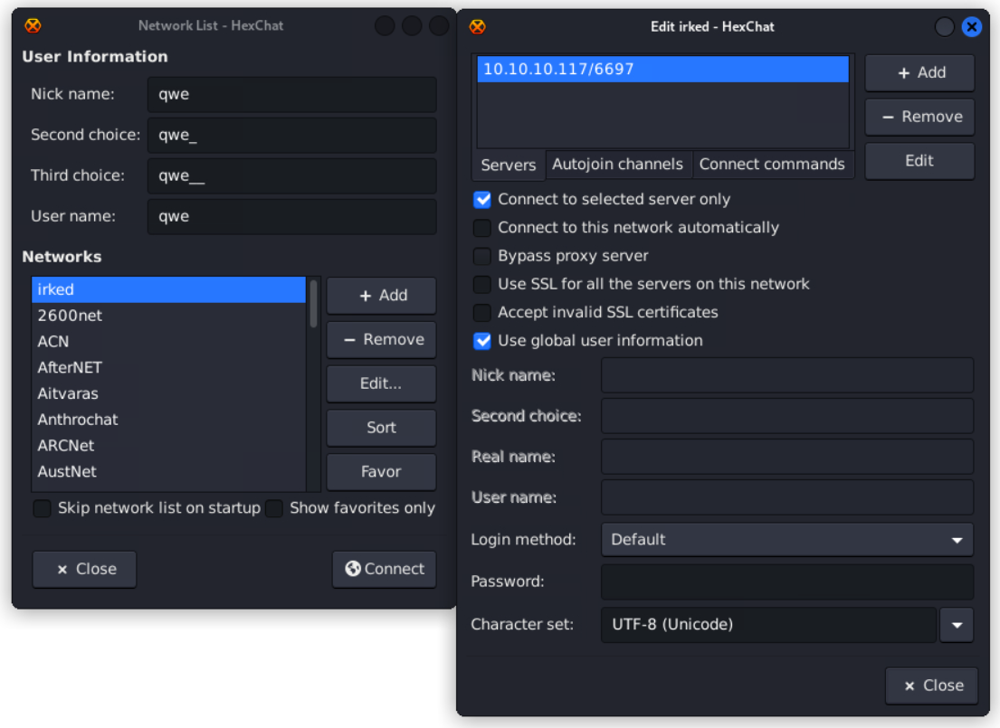

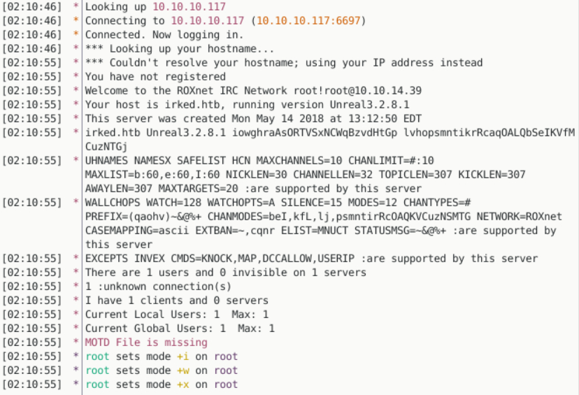

- Version: **Unreal 3.2.8.1**
- search exploit usage -> RCE 16922, 13853 -> look into details

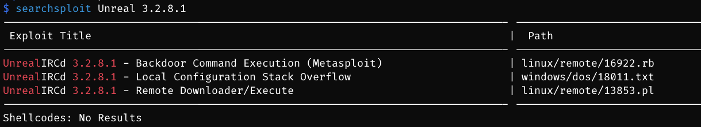

- **RCE POC**

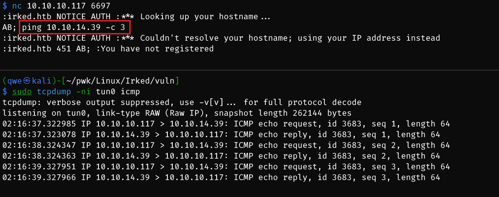

- **RCE EXP**

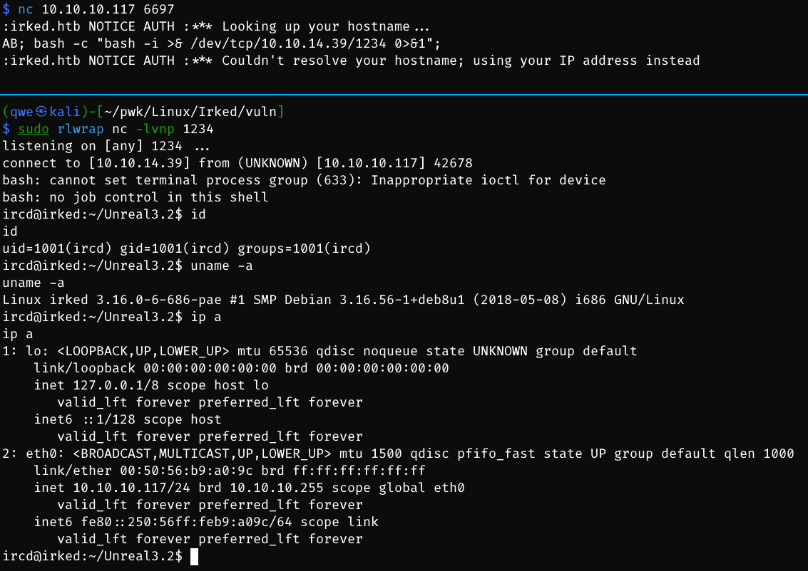

## Privilege Escalation

### ircd -> djmardov

- look around djmardov home

```bash
./Documents:
total 12
drwxr-xr-x  2 djmardov djmardov 4096 Sep  5  2022 .
drwxr-xr-x 18 djmardov djmardov 4096 Sep  5  2022 ..
-rw-r--r--  1 djmardov djmardov   52 May 16  2018 .backup
lrwxrwxrwx  1 root     root       23 Sep  5  2022 user.txt -> /home/djmardov/user.txt
```

- find a backup file -> hint: **steg** password -> **web picture**

```bash
ircd@irked:/home/djmardov/Documents$ cat .backup
cat .backup
Super elite steg backup pw
UPupDOWNdownLRlrBAbaSSss
```

- `steghide` to extract hidden content

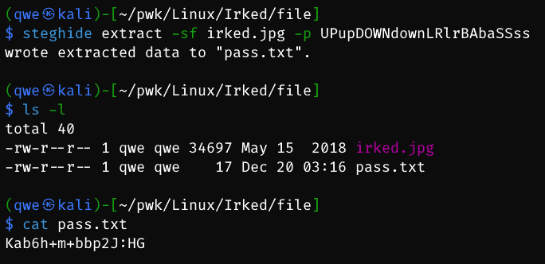

- ssh conn

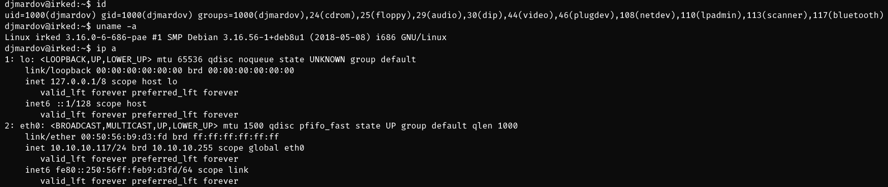

### djmardov -> root

- check SUID files -> `/usr/bin/viewuser`

```bash
djmardov@irked:~$ find / -perm -u=s -type f 2>/dev/null
/usr/lib/dbus-1.0/dbus-daemon-launch-helper
/usr/lib/eject/dmcrypt-get-device
/usr/lib/policykit-1/polkit-agent-helper-1
/usr/lib/openssh/ssh-keysign
/usr/lib/spice-gtk/spice-client-glib-usb-acl-helper
/usr/sbin/exim4
/usr/sbin/pppd
/usr/bin/chsh
/usr/bin/procmail
/usr/bin/gpasswd
/usr/bin/newgrp
/usr/bin/at
/usr/bin/pkexec
/usr/bin/X
/usr/bin/passwd
/usr/bin/chfn
/usr/bin/viewuser
/sbin/mount.nfs
/bin/su
/bin/mount
/bin/fusermount
/bin/ntfs-3g
/bin/umount
```

- viewuser -> attempt to execute a script inside a writable directory

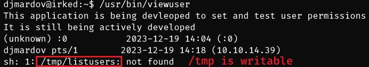

- priv esca

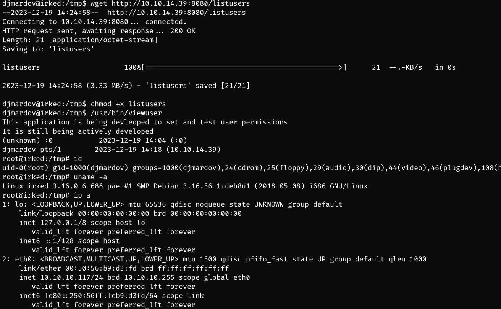

## Exploit Chain

web recon -> image -> irc server -> conn to find version -> rce -> ircd shell -> backup file found -> steghide to extract -> ssh cred -> djmardov shell -> suid file misconfig -> writable file to be executed as root -> change listusers script -> root shell
