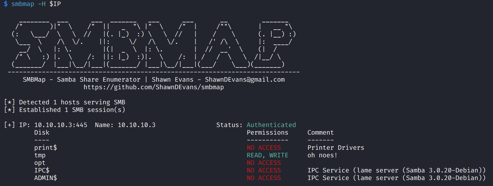
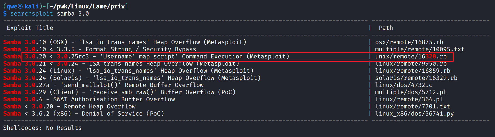
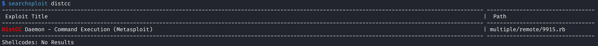
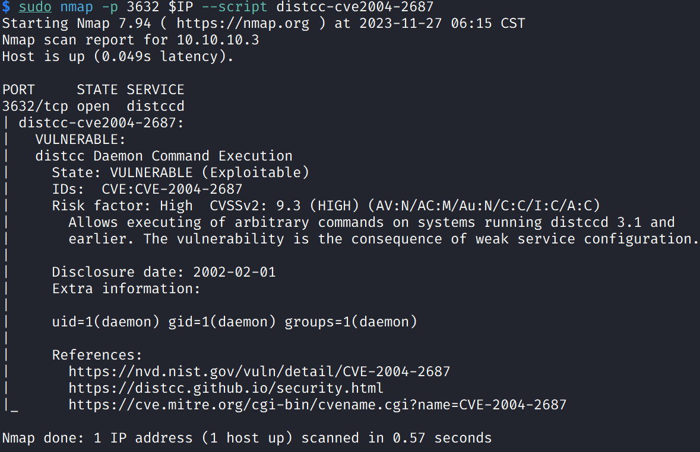
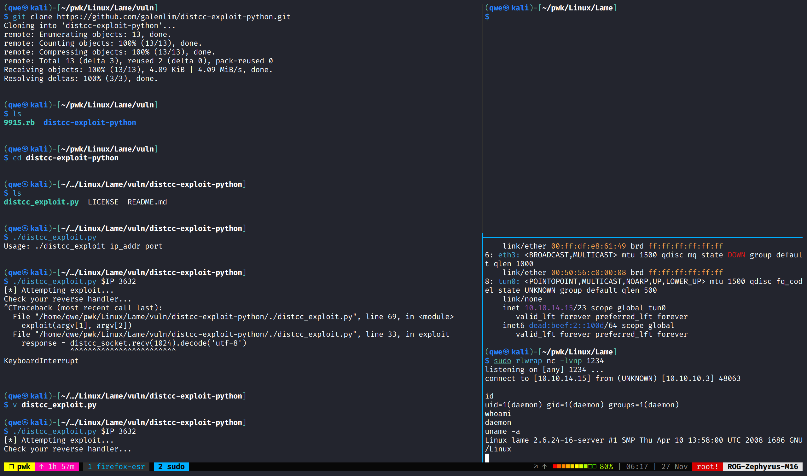
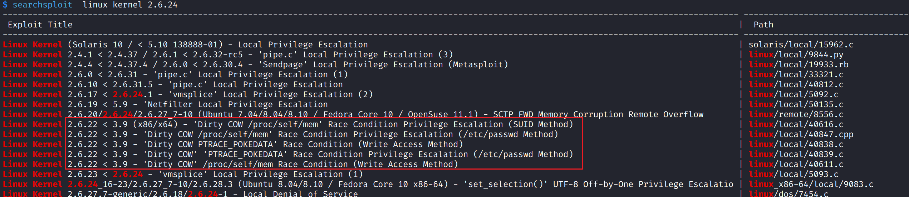
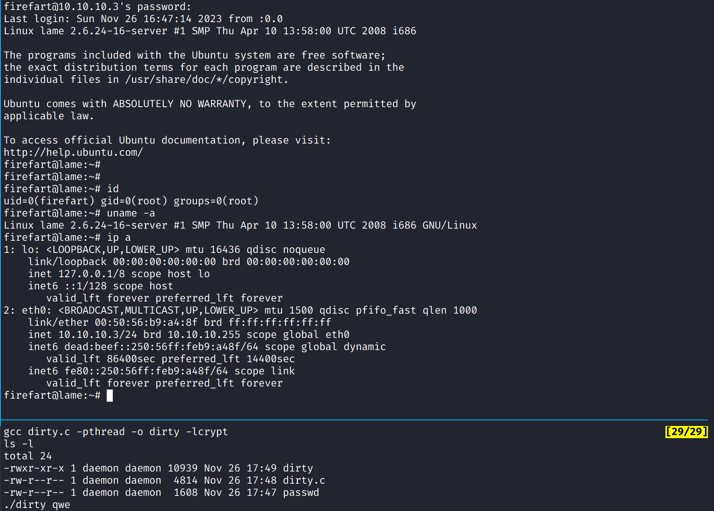

# Lame

## Machine Info


## Recon

```
PORT     STATE SERVICE     VERSION
21/tcp   open  ftp         vsftpd 2.3.4
| ftp-syst:
|   STAT:
| FTP server status:
|      Connected to 10.10.14.15
|      Logged in as ftp
|      TYPE: ASCII
|      No session bandwidth limit
|      Session timeout in seconds is 300
|      Control connection is plain text
|      Data connections will be plain text
|      vsFTPd 2.3.4 - secure, fast, stable
|_End of status
|_ftp-anon: Anonymous FTP login allowed (FTP code 230)
22/tcp   open  ssh         OpenSSH 4.7p1 Debian 8ubuntu1 (protocol 2.0)
| ssh-hostkey:
|   1024 60:0f:cf:e1:c0:5f:6a:74:d6:90:24:fa:c4:d5:6c:cd (DSA)
|_  2048 56:56:24:0f:21:1d:de:a7:2b:ae:61:b1:24:3d:e8:f3 (RSA)
139/tcp  open  netbios-ssn Samba smbd 3.X - 4.X (workgroup: WORKGROUP)
445/tcp  open              Samba smbd 3.0.20-Debian (workgroup: WORKGROUP)
3632/tcp open  distccd     distccd v1 ((GNU) 4.2.4 (Ubuntu 4.2.4-1ubuntu4))
Warning: OSScan results may be unreliable because we could not find at least 1 open and 1 closed port
Aggressive OS guesses: Linux 2.6.23 (92%), DD-WRT v24-sp1 (Linux 2.4.36) (90%), Arris TG862G/CT cable modem (90%), Belkin N300 WAP (Linux 2.6.30) (90%), Control4 HC-300 home controller (90%), D-Link DAP-1522 WAP, or Xerox WorkCentre Pro 245 or 6556 printer (90%), Dell Integrated Remote Access Controller (iDRAC6) (90%), Linksys WET54GS5 WAP, Tranzeo TR-CPQ-19f WAP, or Xerox WorkCentre Pro 265 printer (90%), Linux 2.4.21 - 2.4.31 (likely embedded) (90%), Linux 2.4.27 (90%)
No exact OS matches for host (test conditions non-ideal).
Service Info: OSs: Unix, Linux; CPE: cpe:/o:linux:linux_kernel

Host script results:
| smb-security-mode:
|   account_used: guest
|   authentication_level: user
|   challenge_response: supported
|_  message_signing: disabled (dangerous, but default)
| smb-os-discovery:
|   OS: Unix (Samba 3.0.20-Debian)
|   Computer name: lame
|   NetBIOS computer name:
|   Domain name: hackthebox.gr
|   FQDN: lame.hackthebox.gr
|_  System time: 2023-11-26T16:50:30-05:00
|_smb2-time: Protocol negotiation failed (SMB2)
|_clock-skew: mean: 2h30m26s, deviation: 3h32m11s, median: 23s
```

- attack vector: 21 vsftpd -> backdoor, 139 smb -> file leakage, smb cve, 3632 distccd

## Foothold

### 21 ftp

nothing as anonymous

### 139 smb

#### enum

- Samba smbd 3.X - 4.X
- disks, nothing found [x]



#### cve ? -> yes



**CVE-2007-2447**, useful script: -> root

- [Alien0ne/CVE-2007-2447: CVE-2007-2447 - Samba usermap script (github.com)](https://github.com/Alien0ne/CVE-2007-2447)
- [Ziemni/CVE-2007-2447-in-Python: Python implementation of 'Username' map script' RCE Exploit for Samba 3.0.20 < 3.0.25rc3 (CVE-2007-2447). (github.com)](https://github.com/Ziemni/CVE-2007-2447-in-Python)


### 3632 distccd

`distcc` is a program designed to speed up the compilation of code by distributing the task across several machines on a network. The `distcc` system consists of a client and a number of server machines. The client sends parts of the compilation job to the servers, which compile the parts and send them back to the client.

`distccd` is the server daemon for the `distcc` distributed compiler system. It listens for connections from `distcc` clients and performs compilations on behalf of them.

- searchsploit



- nmap script scan



- **CVE-2004-2687**, get a daemon priv shell -> user.txt ok



## Privilege Escalation

### smb cve

CVE-2007-2447

### daemon -> root

- old version linux -> kernel exp
- searchsploit -> **40839** -> [Linux Kernel 2.6.22 < 3.9 - 'Dirty COW' 'PTRACE_POKEDATA' Race Condition Privilege Escalation (/etc/passwd Method) - Linux local Exploit (exploit-db.com)](https://www.exploit-db.com/exploits/40839) -> **CVE-2016-5195**



- exp:

```bash
gcc dirty.c -pthread -o dirty -lcrypt, ./dirty qwe
ssh -oHostKeyAlgorithms=+ssh-rsa firefart@10.10.10.3
```



## Exploit Chain

- method1: recon -> smb -> CVE-2007-2447 -> root shell
- method2: recon -> distcc -> daemon-priv shell -> CVE-2016-5195 -> root shell
